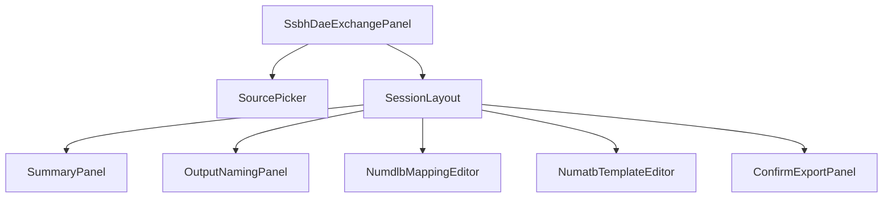
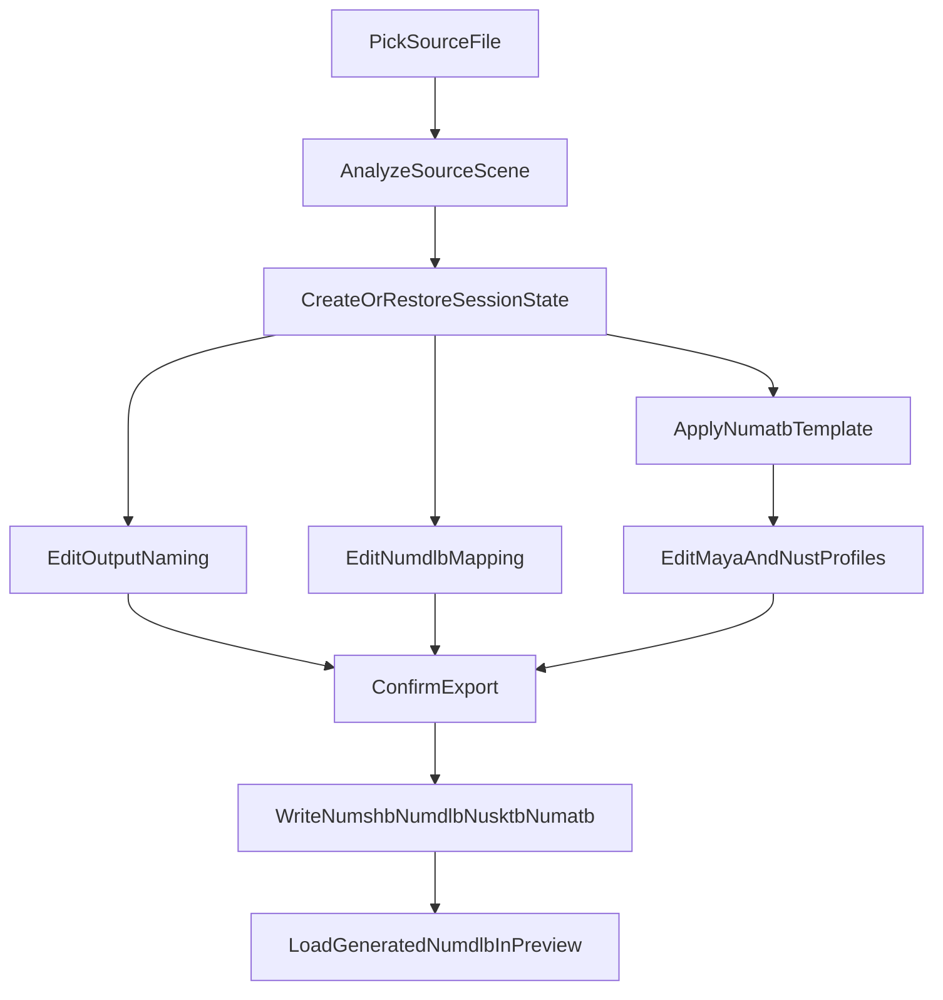

# DAE -> SSBH Workflow Upgrade

## Why This Plan Exists

本计划不是“加一个页面”这么简单，而是要把当前只会写出 `numdlb/numshb/nusktb` 的基础转换流程，升级成一个真正可编辑、可保存、可复用、适配 EXVS 习惯的完整工作流。最终目标有两条主线：

1. `dae/fbx -> ssbh` 时，用户先分析源文件，再进入详细设定页，完成 `file name`、`numdlb` 材质映射、`numatb` 模板与属性编辑，最后一次性确认输出。
2. 独立打开现有 `.numdlb` 文件时，也能在右侧 `InfoPanel` 里进入同一套映射编辑器，对 mesh/material mapping 进行查看、编辑、保存。

这个计划需要同时解决 UI、持久化状态、命令协议、Rust 写盘逻辑、以及 EXVS `maya/nust` 双 profile 材质建模。

## Current State Audit

### Frontend Current State

- [E:/TAURI_PROJECT/src/page/TestEditor/components/ssbh-model-preview/SsbhDaeExchangePanel.tsx](E:/TAURI_PROJECT/src/page/TestEditor/components/ssbh-model-preview/SsbhDaeExchangePanel.tsx)
  - 现状是单组件，使用大量 `useState` 管理导入分析、勾选项、输出选项。
  - 组件只负责：
    - 选源文件
    - 调用 analyze
    - 设置 base filename / scale / up axis / 输出文件勾选
    - 调用 convert
  - 不具备：
    - 独立“详细设定页”
    - `numdlb` 映射编辑
    - `numatb` 编辑或模板应用
    - 页面刷新后的会话恢复
- [E:/TAURI_PROJECT/src/page/TestEditor/components/InfoPanel.tsx](E:/TAURI_PROJECT/src/page/TestEditor/components/InfoPanel.tsx)
  - 右侧 tab 目前只有 `info / modelPreview / daeExchange`。
  - 可以新增 tab，不需要重做整体布局。
  - 适合承载两类新内容：
    - `DAE -> SSBH Setup`
    - `NUMDLB Mapping`
- [E:/TAURI_PROJECT/src/page/TestEditor/components/FileTreePane.tsx](E:/TAURI_PROJECT/src/page/TestEditor/components/FileTreePane.tsx)
  - 已能选中任意文件节点并把 `TestTreeNode` 传给右侧。
  - 对 `.numdlb` 独立编辑的入口已经足够，不需要改左侧树的数据结构。
- [E:/TAURI_PROJECT/src/page/TestEditor/components/ssbh-model-preview/SsbhModelPreviewContext.tsx](E:/TAURI_PROJECT/src/page/TestEditor/components/ssbh-model-preview/SsbhModelPreviewContext.tsx)
  - 已支持通过 `loadModelAt(path)` 打开文件夹或 `.numdlb`。
  - `dae -> ssbh` 成功后可以继续沿用这里的自动加载预览逻辑。
  - 这部分不应承担新的复杂编辑状态，只负责预览。

### Backend Current State

- [E:/TAURI_PROJECT/src-tauri/src/ssbh_dae_cmd.rs](E:/TAURI_PROJECT/src-tauri/src/ssbh_dae_cmd.rs)
  - 当前 `ssbh_convert_dae_to_ssbh` / `ssbh_convert_fbx_to_ssbh` 只接收基础标量参数：
    - `base_filename`
    - `scale_factor`
    - `flip_uv`
    - `up_axis`
    - `include_geometry_names`
    - `write_log`
    - `write_numdlb`
    - `write_numshb`
    - `write_nusktb`
  - 返回值也只包含：
    - 输出文件路径
    - 基础统计
    - log 路径
- [E:/TAURI_PROJECT/src-tauri/src/ssbh_dae/dae_to_ssbh.rs](E:/TAURI_PROJECT/src-tauri/src/ssbh_dae/dae_to_ssbh.rs)
  - `convert_model_to_ssbh()` 直接把每个 `ModlEntryData.material_label` 写成 `"DefaultMaterial"`。
  - `material_file_names` 只引用 `base.numatb`，但不会真的写出 `numatb`。
  - 当前逻辑没有任何前端传入的映射或材质配置概念。

### Existing Reusable Pieces

- [E:/TAURI_PROJECT/src/store/numatbStore.ts](E:/TAURI_PROJECT/src/store/numatbStore.ts)
  - 优点：
    - 已经用 Zustand 管理 `numatb` 基础编辑状态
    - 已经有参数类型映射、默认值、JSON 读写流程
  - 问题：
    - 类型仍较弱，存在 `any`
    - 默认值和材质模板写死在 store 中，耦合过重
    - 结构是“打开单个 `.numatb` 文件编辑”，不适合直接作为 `dae -> ssbh` 会话模型
- [E:/TAURI_PROJECT/src/page/MiscTools/components/numatb-editor/NumatbEditor.tsx](E:/TAURI_PROJECT/src/page/MiscTools/components/numatb-editor/NumatbEditor.tsx)
  - 可复用：
    - 左侧材质列表 + 右侧属性详情的 UI 思路
    - 按属性类型渲染编辑器
    - 属性增删
  - 不建议直接照搬：
    - 它是 dialog 模式
    - 它假设编辑对象是完整现有 `.numatb`
    - 缺少 `maya/nust` 双 profile 概念

## Domain Findings That Must Drive The Implementation

### File Naming

- 本项目与 `ssbh_editor` 参考实现都表明骨架文件应继续使用 `.nusktb`，不要新引入与现有生态不一致的 `numskb` 命名。
- 最低输出集应为：
  - `base.numshb`
  - `base.numdlb`
  - `base.nusktb`
- 材质相关需要补齐：
  - `base.numatb`
  - 以及 EXVS 风格变体输出能力：
    - `...__maya__.numatb`
    - `...__nust__.numatb`

### `maya` vs `nust`

- 两者都是 MATL 1.6，不是两种文件格式。
- `maya` 更像 DCC/export profile：
  - `shader_label` 可为空
  - 带旧式或通用槽位
  - 更显式地写 sampler / state
- `nust` 更像 VSNG runtime profile：
  - `shader_label = vsngCharaBasic`
  - 明显使用 `DiffuseCubeMap`、`BaseColorMap*`、`CustomFloat*`、`CustomVector*`
  - 更偏运行时 shader 参数表

### IDA Findings

- 在 `vsac27_Release.exe` 中能直接搜到 `vsngCharaBasic`、`DiffuseCubeMap`、`BaseColorMapLayer1`。
- 能看到 `DiffuseCubeMap` 被绑定到运行时资源槽 `DiffuseCubeMapSRV` / `SpecularCubeMapSRV`。
- 未发现 `__maya`__ / `__nust`__ 作为显式分支文件名字符串参与逻辑判断。
- 实现结论：
  - 不要把逻辑建模成“if suffix is maya / nust then do X”
  - 应建模成“同一逻辑材质 -> 导出不同 profile 参数集合”

## Concrete Deliverables

### Deliverable 1: Persisted DAE Conversion Session

新增一个面向 `dae/fbx -> ssbh` 的 Zustand store，替代 `SsbhDaeExchangePanel` 现有的散乱 `useState`。

建议新增文件：

- [E:/TAURI_PROJECT/src/page/TestEditor/components/ssbh-model-preview/store/daeSsbhSessionStore.ts](E:/TAURI_PROJECT/src/page/TestEditor/components/ssbh-model-preview/store/daeSsbhSessionStore.ts)

职责：

- 保存一次转换会话的全部可恢复状态
- 使用 `persist` + `createJSONStorage(() => localStorage)` 持久化
- 带 `version` / `migrate`
- 支持 `resetSession()` / `startNewSession()` / `loadAnalysis()` / `applyTemplate()`

### Deliverable 2: Detailed Settings Page

把当前 `COLLADA (.dae)` tab 改造成“选择源文件后进入详细设定页”的工作流。

建议拆分组件：

- [E:/TAURI_PROJECT/src/page/TestEditor/components/ssbh-model-preview/components/DaeSsbhSourcePicker.tsx](E:/TAURI_PROJECT/src/page/TestEditor/components/ssbh-model-preview/components/DaeSsbhSourcePicker.tsx)
- [E:/TAURI_PROJECT/src/page/TestEditor/components/ssbh-model-preview/components/DaeSsbhSessionLayout.tsx](E:/TAURI_PROJECT/src/page/TestEditor/components/ssbh-model-preview/components/DaeSsbhSessionLayout.tsx)
- [E:/TAURI_PROJECT/src/page/TestEditor/components/ssbh-model-preview/components/DaeSsbhSummaryPanel.tsx](E:/TAURI_PROJECT/src/page/TestEditor/components/ssbh-model-preview/components/DaeSsbhSummaryPanel.tsx)
- [E:/TAURI_PROJECT/src/page/TestEditor/components/ssbh-model-preview/components/DaeSsbhOutputPanel.tsx](E:/TAURI_PROJECT/src/page/TestEditor/components/ssbh-model-preview/components/DaeSsbhOutputPanel.tsx)

详细设定页包含 4 个主要区块：

1. Source Summary
2. Output Naming
3. `numdlb` Mapping
4. `numatb` Template / Profiles
5. Confirm Export

### Deliverable 3: Reusable `numdlb` Mapping Editor

新增一个可复用组件，同时用于：

- `dae -> ssbh` 中的材质映射步骤
- 右侧 `InfoPanel` 独立 `.numdlb` 编辑 tab

建议新增文件：

- [E:/TAURI_PROJECT/src/page/TestEditor/components/ssbh-model-preview/components/NumdlbMaterialMappingEditor.tsx](E:/TAURI_PROJECT/src/page/TestEditor/components/ssbh-model-preview/components/NumdlbMaterialMappingEditor.tsx)

必须具备的功能：

- 展示每个 mesh object
- 为每个 mesh object 设置 `material_label`
- `replace all`
- 单行编辑
- 从现有 material 列表中选择
- 创建新 material label
- 按 mesh name 过滤
- 导出前校验空标签与重复规则

### Deliverable 4: `numatb` Template + Profile Editor

新增模板驱动的材质编辑模块，负责把“逻辑材质”编辑成：

- `base.numatb`
- `__maya__.numatb`
- `__nust__.numatb`

建议新增文件：

- [E:/TAURI_PROJECT/src/page/TestEditor/components/ssbh-model-preview/components/NumatbTemplateEditor.tsx](E:/TAURI_PROJECT/src/page/TestEditor/components/ssbh-model-preview/components/NumatbTemplateEditor.tsx)
- [E:/TAURI_PROJECT/src/page/TestEditor/components/ssbh-model-preview/components/NumatbMaterialEntryEditor.tsx](E:/TAURI_PROJECT/src/page/TestEditor/components/ssbh-model-preview/components/NumatbMaterialEntryEditor.tsx)
- [E:/TAURI_PROJECT/src/page/TestEditor/components/ssbh-model-preview/store/numatbTemplateStoreHelpers.ts](E:/TAURI_PROJECT/src/page/TestEditor/components/ssbh-model-preview/store/numatbTemplateStoreHelpers.ts)

### Deliverable 5: Standalone `.numdlb` Edit Tab

在 `InfoPanel` 中新增 tab，例如：

- `NUMDLB Mapping`

行为：

- 当左侧选中 `.numdlb` 时激活
- 读取并显示当前文件的 mapping
- 可编辑并保存
- 组件复用 `NumdlbMaterialMappingEditor`

## Data Model Design

### Persisted Session Store Shape

建议核心类型如下：

```ts
type DaeImportKind = "dae" | "fbx";

type DaeSsbhSessionState = {
  sessionVersion: number;
  importKind: DaeImportKind;
  sourcePath: string | null;
  analysis: SsbhDaeAnalysisReport | null;
  includeGeometryNames: string[];
  outputDir: string | null;
  outputBaseName: string;
  scaleFactorText: string;
  upAxis: SsbhDaeUpAxis;
  flipUv: boolean;
  writeLog: boolean;
  writeNumdlb: boolean;
  writeNumshb: boolean;
  writeNusktb: boolean;
  writeNumatb: boolean;
  writeMayaProfile: boolean;
  writeNustProfile: boolean;
  numdlbEntries: NumdlbMappingRow[];
  materialPresets: NumatbMaterialTemplateBinding[];
  selectedTemplateId: string | null;
  numatbProfileState: NumatbProfileState;
  lastResult: DaeSsbhConvertExtendedResult | null;
};
```

### `numdlb` Mapping Row

```ts
type NumdlbMappingRow = {
  meshObjectName: string;
  meshObjectSubindex: number;
  materialLabel: string;
  materialPresetId: string | null;
};
```

说明：

- 每个 geometry 分析完成后，自动生成一个 row
- 初始 `materialLabel` 默认不要继续写死 `DefaultMaterial`
- 默认建议：
  - `materialLabel = meshObjectName`
  - 然后支持批量替换

### Template Library Model

模板库存储为应用级 JSON 文件，不跟随工作区。

建议新增模型：

```ts
type NumatbTemplateLibrary = {
  version: number;
  templates: NumatbTemplateDefinition[];
};

type NumatbTemplateDefinition = {
  id: string;
  name: string;
  description: string;
  sourceFileName: string | null;
  updatedAt: string;
  mayaProfile: NumatbProfileTemplate;
  nustProfile: NumatbProfileTemplate;
};
```

### Profile Model

```ts
type NumatbProfileTemplate = {
  shaderLabel: string;
  materials: NumatbLogicalMaterial[];
};

type NumatbLogicalMaterial = {
  materialLabel: string;
  attributes: NumatbLogicalAttribute[];
};

type NumatbLogicalAttribute = {
  paramId: string;
  dataType: ParamDataType;
  value: unknown;
  editable: boolean;
  generatedFromTemplate: boolean;
};
```

说明：

- `mayaProfile` 与 `nustProfile` 分开保存，不做隐式 fallback。
- `editable` 用于标记某些字段允许 UI 编辑。
- `generatedFromTemplate` 用于区分“模板自动注入”与“用户手动新增”。

## Frontend Architecture

### `SsbhDaeExchangePanel` 拆分策略

保留外层入口文件：

- [E:/TAURI_PROJECT/src/page/TestEditor/components/ssbh-model-preview/SsbhDaeExchangePanel.tsx](E:/TAURI_PROJECT/src/page/TestEditor/components/ssbh-model-preview/SsbhDaeExchangePanel.tsx)

但职责改成：

- 连接 store
- 根据是否已有 `sourcePath + analysis` 切换：
  - source picker 模式
  - session editor 模式

内部组件关系建议：




### `InfoPanel` 改造

[E:/TAURI_PROJECT/src/page/TestEditor/components/InfoPanel.tsx](E:/TAURI_PROJECT/src/page/TestEditor/components/InfoPanel.tsx) 需要做三件事：

1. 新增 `numdlbMapping` tab
2. 根据当前 `selected` 是否为 `.numdlb` 决定是否显示这个 tab
3. 在 tab content 中挂载独立 `NumdlbFileEditorPanel`

建议新增文件：

- [E:/TAURI_PROJECT/src/page/TestEditor/components/ssbh-model-preview/NumdlbFileEditorPanel.tsx](E:/TAURI_PROJECT/src/page/TestEditor/components/ssbh-model-preview/NumdlbFileEditorPanel.tsx)

### Reuse Boundary

组件复用关系：

- `NumdlbMaterialMappingEditor`
  - `dae -> ssbh` 会话页使用
  - 独立 `.numdlb` 编辑页使用
- `NumatbMaterialEntryEditor`
  - `dae -> ssbh` 中编辑 profile 使用
  - 后续若要替换 `MiscTools` 里的旧 `NumatbEditor`，也可复用

## Backend Architecture

### Command Layer Changes

需要扩展 [E:/TAURI_PROJECT/src-tauri/src/ssbh_dae_cmd.rs](E:/TAURI_PROJECT/src-tauri/src/ssbh_dae_cmd.rs)。

新增或扩展命令建议如下：

1. 扩展 `ssbh_convert_dae_to_ssbh`
2. 扩展 `ssbh_convert_fbx_to_ssbh`
3. 新增 `ssbh_read_numdlb_mapping`
4. 新增 `ssbh_write_numdlb_mapping`
5. 新增 `ssbh_template_read_numatb`

建议的扩展入参：

```ts
type SsbhConvertToSsbhExtendedParams = {
  outputDir: string;
  baseFilename: string;
  scaleFactor: number;
  flipUv: boolean;
  upAxis: SsbhDaeUpAxis;
  includeGeometryNames: string[];
  writeLog: boolean;
  writeNumdlb: boolean;
  writeNumshb: boolean;
  writeNusktb: boolean;
  writeNumatb: boolean;
  writeMayaProfile: boolean;
  writeNustProfile: boolean;
  numdlbEntries: NumdlbMappingRow[];
  numatbTemplatePayload: NumatbTemplateApplyPayload | null;
};
```

### Rust Conversion Layer Changes

在 [E:/TAURI_PROJECT/src-tauri/src/ssbh_dae/dae_to_ssbh.rs](E:/TAURI_PROJECT/src-tauri/src/ssbh_dae/dae_to_ssbh.rs) 中拆分为更明确的构建函数：

- `build_mesh_data_from_import_scene()`
- `build_skel_data_from_import_scene()`
- `build_modl_data_from_mapping_entries()`
- `build_matl_data_from_profile_template()`
- `write_ssbh_outputs()`

这样做的目的：

- 避免把 `numdlb` 与 `numatb` 的构建耦死在单个函数里
- 方便后续独立 `.numdlb` 编辑复用写盘逻辑

### `.numdlb` Read / Write

独立编辑 `.numdlb` 需要最少两个 Rust API：

```ts
type NumdlbReadResult = {
  modelName: string;
  skeletonFileName: string;
  materialFileNames: string[];
  meshFileName: string;
  animationFileName: string | null;
  entries: NumdlbMappingRow[];
};
```

```ts
type NumdlbWritePayload = {
  filePath: string;
  modelName: string;
  skeletonFileName: string;
  materialFileNames: string[];
  meshFileName: string;
  animationFileName: string | null;
  entries: NumdlbMappingRow[];
};
```

## `numatb` Template Strategy

### Storage Location

按已确认方案，模板库存为应用级持久化存储。

建议路径策略：

- 使用 Tauri app data dir
- 存储单一 JSON，例如：
  - `appData/ssbh-dae-template-library.json`

不要用 Node `fs`，统一通过 Tauri 插件或 Tauri command 读写。

### Template Source

模板来源支持两种：

1. 从当前编辑中的 profile 保存为模板
2. 从外部现有 `.numatb` 文件导入为模板

导入逻辑：

- 前端选择 `.numatb`
- 调用 `ssbh_template_read_numatb`
- Rust 或既有转换逻辑把其解析为 JSON / 统一模板结构
- 用户选择把它归类为：
  - `maya profile source`
  - `nust profile source`
  - 或成对组合成一个 template

### Apply Rules

应用模板时要明确规则，避免后续 AI 或开发者误解：

- `replace all` 只替换选中的字段，不自动清空用户手改字段，除非用户明确选择 `overwrite all`
- 新建逻辑材质时：
  - 复制模板中的默认属性集合
  - 重写 `material_label`
  - 保留 profile-specific `shader_label`
- 删除属性时：
  - 从当前 profile 的当前材质中物理删除
  - 不做 fallback

### Texture URL Editing

最重要的编辑能力是贴图 URL。

UI 必须提供：

- 当前材质的纹理参数列表
- 批量路径替换
- 单项路径编辑
- 预设路径片段快速替换

重点参数至少覆盖：

- `BaseColorMap`
- `NormalMap`
- `MetallicMap`
- `RoughnessMap`
- `AmbientOcclusionMap`
- `EmissiveMap`
- `DiffuseCubeMap`
- `Texture1`

## UI Behavior Details

### Detailed Session Flow




### Source Picker Behavior

- 初始只显示：
  - `Import format`
  - `Pick file`
  - `Analyze`
- `Analyze` 成功后：
  - 建立 session
  - 按 `geometryNames` 自动生成 `numdlbEntries`
  - 默认全部 geometry 勾选
  - 进入详细设定视图

### Output Naming Behavior

必须可编辑：

- `base filename`
- `model_name`
- 输出目录
- 变体命名开关

建议命名默认规则：

- `base.numshb`
- `base.numdlb`
- `base.nusktb`
- `base.numatb`
- `base__maya__.numatb`
- `base__nust__.numatb`

如果 EXVS 约定要求别的命名策略，可在这里集中调整，而不是散落在多个组件里。

### `NumdlbMaterialMappingEditor` 行为

每一行展示：

- mesh object name
- subindex
- material label input
- material preset / template binding

必须支持：

- `replace all material label`
- 单行编辑
- 选择所有使用同一标签的行一起替换
- 按 mesh name 排序 / 过滤

### `NumatbTemplateEditor` 行为

左侧：

- 材质列表
- profile 切换：`maya` / `nust`

右侧：

- `material_label`
- `shader_label`
- texture path attributes
- non-texture attributes
- add attribute
- remove attribute

顶部：

- 选择模板
- 保存模板
- 从 `.numatb` 导入模板
- 重置当前 profile 到模板

## Step-By-Step Implementation Order

### Phase 1: Type And Store Foundation

目标：

- 先把状态模型定死，避免边写 UI 边改数据结构

工作项：

1. 新建 `daeSsbhSessionStore.ts`
2. 定义 session types、template types、mapping types
3. 接入 `persist`
4. 加 `version` / `migrate`
5. 把原 `SsbhDaeExchangePanel` 的基础字段迁入 store

完成标准：

- 刷新页面后，source path、analysis、mapping、template edits 不丢失

### Phase 2: UI Split

目标：

- 让当前单组件转为可维护结构

工作项：

1. 保留外层 `SsbhDaeExchangePanel`
2. 新建 source picker
3. 新建 session layout
4. 新建 output naming panel
5. 新建 summary panel

完成标准：

- 原有 analyze / convert 流程仍可走通
- 新 UI 不依赖旧的散乱 `useState`

### Phase 3: `numdlb` Editor

目标：

- 先实现最确定、最刚需、最容易验证的 mesh/material mapping

工作项：

1. 写 `NumdlbMaterialMappingEditor`
2. 在 `dae -> ssbh` 页面接入
3. 加 `replace all`
4. 新增 `.numdlb` 读写命令
5. 在 `InfoPanel` 新增独立 `NUMDLB Mapping` tab

完成标准：

- 选中 `.numdlb` 文件后可查看并保存 mapping
- 转换时不再写死 `DefaultMaterial`

### Phase 4: `numatb` Template System

目标：

- 让 `numatb` 进入可真正使用的状态，而不是“最后手工补”

工作项：

1. 定义 template library 结构
2. 实现模板导入 / 保存
3. 实现 `maya/nust` profile 编辑器
4. 实现属性增删改
5. 实现贴图路径编辑

完成标准：

- 用户能以模板为基础生成 profile
- 能删除属性、修改属性、修改贴图 URL
- 参数名保留 `ssbh_lib` 风格

### Phase 5: Rust `numatb` Write Path

目标：

- 把前端编辑结果真正写成 `.numatb`

工作项：

1. 扩展 convert command 参数
2. 在 Rust 中新增 profile -> MATL 构建逻辑
3. 写出 `base.numatb`
4. 根据开关写出 `__maya__` / `__nust__`
5. 更新返回值

完成标准：

- 输出目录可看到完整材质文件
- 前端 toast / summary 能展示新增输出文件

### Phase 6: Validation And Polish

目标：

- 把系统从“能跑”拉到“可用”

工作项：

1. 加表单校验
2. 加命名冲突提示
3. 加空材质标签阻止导出
4. 用样本文件校验 `maya/nust` 输出结构
5. 补必要的 lints / types 清理

## File-Level Change Map

### Must Change

- [E:/TAURI_PROJECT/src/page/TestEditor/components/ssbh-model-preview/SsbhDaeExchangePanel.tsx](E:/TAURI_PROJECT/src/page/TestEditor/components/ssbh-model-preview/SsbhDaeExchangePanel.tsx)
  - 由单组件表单改为 store 驱动的流程容器
- [E:/TAURI_PROJECT/src/page/TestEditor/components/InfoPanel.tsx](E:/TAURI_PROJECT/src/page/TestEditor/components/InfoPanel.tsx)
  - 新增 `.numdlb` 相关 tab 和动态显示逻辑
- [E:/TAURI_PROJECT/src/page/TestEditor/components/ssbh-model-preview/ssbhDaeIoService.ts](E:/TAURI_PROJECT/src/page/TestEditor/components/ssbh-model-preview/ssbhDaeIoService.ts)
  - 扩展前端类型与 `invoke` 参数
- [E:/TAURI_PROJECT/src-tauri/src/ssbh_dae_cmd.rs](E:/TAURI_PROJECT/src-tauri/src/ssbh_dae_cmd.rs)
  - 扩展命令入参/出参，新增 `.numdlb` 读写命令
- [E:/TAURI_PROJECT/src-tauri/src/ssbh_dae/dae_to_ssbh.rs](E:/TAURI_PROJECT/src-tauri/src/ssbh_dae/dae_to_ssbh.rs)
  - 用 mapping 构建 `ModlData`
  - 新增 `MatlData` 构建和写出逻辑

### Likely New Files

- [E:/TAURI_PROJECT/src/page/TestEditor/components/ssbh-model-preview/store/daeSsbhSessionStore.ts](E:/TAURI_PROJECT/src/page/TestEditor/components/ssbh-model-preview/store/daeSsbhSessionStore.ts)
- [E:/TAURI_PROJECT/src/page/TestEditor/components/ssbh-model-preview/components/DaeSsbhSourcePicker.tsx](E:/TAURI_PROJECT/src/page/TestEditor/components/ssbh-model-preview/components/DaeSsbhSourcePicker.tsx)
- [E:/TAURI_PROJECT/src/page/TestEditor/components/ssbh-model-preview/components/DaeSsbhSessionLayout.tsx](E:/TAURI_PROJECT/src/page/TestEditor/components/ssbh-model-preview/components/DaeSsbhSessionLayout.tsx)
- [E:/TAURI_PROJECT/src/page/TestEditor/components/ssbh-model-preview/components/NumdlbMaterialMappingEditor.tsx](E:/TAURI_PROJECT/src/page/TestEditor/components/ssbh-model-preview/components/NumdlbMaterialMappingEditor.tsx)
- [E:/TAURI_PROJECT/src/page/TestEditor/components/ssbh-model-preview/components/NumatbTemplateEditor.tsx](E:/TAURI_PROJECT/src/page/TestEditor/components/ssbh-model-preview/components/NumatbTemplateEditor.tsx)
- [E:/TAURI_PROJECT/src/page/TestEditor/components/ssbh-model-preview/NumdlbFileEditorPanel.tsx](E:/TAURI_PROJECT/src/page/TestEditor/components/ssbh-model-preview/NumdlbFileEditorPanel.tsx)

### Reference Only

- [E:/TAURI_PROJECT/src/store/numatbStore.ts](E:/TAURI_PROJECT/src/store/numatbStore.ts)
- [E:/TAURI_PROJECT/src/page/MiscTools/components/numatb-editor/NumatbEditor.tsx](E:/TAURI_PROJECT/src/page/MiscTools/components/numatb-editor/NumatbEditor.tsx)

## Validation Rules

导出前必须校验：

1. `sourcePath` 存在
2. `analysis.canConvert = true`
3. 至少勾选一个 geometry
4. `outputBaseName` 非空
5. 至少输出一个主文件
6. 如果输出 `numdlb`，则必须同时输出 `numshb` 与 `nusktb`
7. 每个 `numdlbEntries.materialLabel` 非空
8. 如果 `writeNumatb = true`，则 `numatbProfileState` 至少有一个有效材质条目
9. 模板导入失败时禁止静默 fallback，直接报错

## Acceptance Criteria

### Functional Acceptance

- 选定 `.dae` 或 `.fbx` 后，能进入详细设定页，而不是只停留在基础表单。
- 刷新页面后，详细设定内容不丢失。
- `numdlb` 材质映射支持逐项修改和 `replace all`。
- `numatb` 支持模板应用、属性删除、属性编辑、贴图路径编辑。
- 导出后能生成：
  - `.numshb`
  - `.numdlb`
  - `.nusktb`
  - `.numatb`
  - 可选 `__maya__.numatb`
  - 可选 `__nust__.numatb`
- 在左侧 file list 选中 `.numdlb` 时，右侧可进入独立编辑 tab 并保存。

### Structural Acceptance

- `SsbhDaeExchangePanel` 不再是巨型单组件。
- 会话状态主要由 Zustand 管理，而不是散落在多个 `useState`。
- 前后端命令协议能表达 mapping 与 profile payload，而不是只有基础标量。

### EXVS-Specific Acceptance

- `maya` / `nust` 不是简单复制文件，而是两套 profile 输出。
- `nust` 输出中关键运行时参数命名保留真实名称，如 `vsngCharaBasic`、`DiffuseCubeMap` 等。
- 不引入 fallback 逻辑，配置缺失时应报错或阻止导出。

## Risks And Mitigations

### Risk 1: 类型模型在开发中反复变动

缓解：

- 先做 Phase 1，把 session/model/template 类型稳定下来
- 完成前不要急着大量写 UI

### Risk 2: `numatbStore` 直接复用导致耦合失控

缓解：

- 只复用类型映射和属性编辑思路
- 不直接把旧 store 整个搬进新流程

### Risk 3: `maya/nust` 误被实现成“文件名后缀切换器”

缓解：

- 强制使用 profile 数据模型
- 所有输出由 profile builder 生成

### Risk 4: 右侧 tab 逻辑变复杂

缓解：

- `InfoPanel` 只负责 tab 和分派
- 真正逻辑下沉到独立 panel 组件

## Out Of Scope For This Pass

以下内容不纳入第一轮：

- 左侧 file list 直接以 `.dae` 选中进入详细设定页
- 自动推断 EXVS 所有未知 shader 组合
- 完整替换现有 `MiscTools` 里的旧 `NumatbEditor`
- 基于二进制更深层自动推断 `maya/nust` 所有隐藏索引语义

## Execution Guidance For The Implementer

如果后续是 AI 按此计划实现，应严格按顺序执行：

1. 先建 store 和 types
2. 再拆 `SsbhDaeExchangePanel`
3. 先做 `numdlb` editor，再做 `numatb`
4. 最后扩展 Rust 写盘

不要反过来先做 Rust 大改，否则前端 payload 会反复推翻。