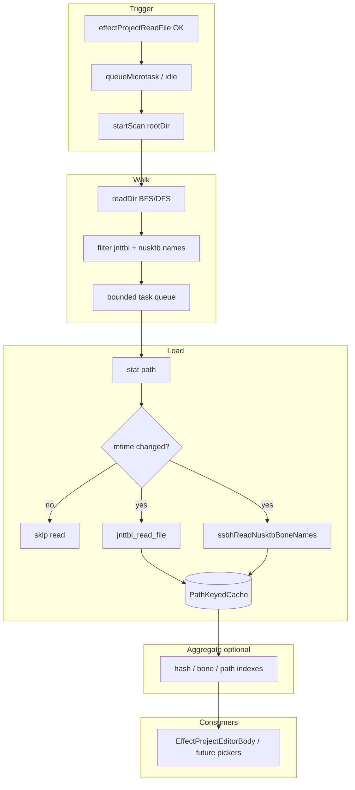

# Effect Project：目錄樹 jnttbl / nusktb 全量掃描、快取與對應資料（完整計畫 v2）

本文檔對齊 **Superpowers brainstorming** 要求：先釐清目的與邊界、再收斂設計、最後才實作。若「待你確認」區有未決項，實作前需先填滿。

---

## 1. 目標與成功標準

### 1.1 目標

- Effect Project 檔在 **載入成功**（`effectProjectReadFile` resolve 且 UI 已可編輯）之後，**非同步、不阻塞主執行緒**地：
  - 以該檔 **所在目錄為根**，**遞迴**掃描所有子資料夾；
  - 找出所有 **jnttbl** 候選檔與所有 **nusktb** 檔；
  - 將解析結果與骨頭名稱載入 **記憶體快取**；
  - 僅在 **來源檔 mtime 變更**（或快取未命中）時重新讀檔解析。
- 建立可供後續 UI / 查表使用的 **聚合資料**（多 jnttbl、多 nusktb、多對多），而非只選單一骨架檔。

### 1.2 成功標準（可驗證）

- 掃描期間 Effect Project 編輯器 **可正常操作**，不出現長時間卡死。
- 大目錄下掃描 **有並發上限**、可 **取消**（關閉 session 時停止後續 I/O）。
- 單一 jnttbl 或 nusktb 讀取失敗時，**不拖垮整次掃描**（記錄錯誤、繼續其他檔案）。
- 同一檔案路徑在 mtime 未變時 **不重複** 呼叫 `jnttbl_read_file` / `ssbhReadNusktbBoneNames`。

### 1.3 非目標（第一版可排除，需在實作前再確認）

- 即時 **fs watch** 全樹（可列為 Phase 2+）。
- 將快取寫入磁碟跨重啟（除非你再要求）。

---

## 2. Superpowers brainstorming 檢查清單（狀態）

| 步驟 | 狀態 | 說明 |
|------|------|------|
| Explore project context | 已做 | `effectProjectIoService`、`page.tsx` open session、`jnttblIoService`、Tauri `readDir`/`stat` |
| Clarifying questions | **進行中** | 見第 8 節 + Cursor **AskQuestion**（需你作答） |
| 2–3 種方案比較 | 已做 | 見第 4 節 |
| 設計分段審閱 | 待你確認 | 你確認第 3–7 節後可定稿 |
| design doc 路徑 | 可選 | 若你要對齊 superpowers 預設，可另寫 `docs/superpowers/specs/YYYY-MM-DD-effect-project-aux.md` 並 commit（非本檔替代物） |

---

## 3. 名詞與資料語意（依你先前說明）

- **nusktb**：某模型的骨架；內含 **bone index → bone name** 的序位表。
- **jnttbl**：多筆 **hash_id ↔ bone_index**（及檔頭 bone_count 等），不同檔代表不同表／不同用途切片。
- **Effect project 列**：含 **bone_index**、**model_id** 等；與「哪一個 nusktb / 哪一組 jnttbl」之間可能是 **多對多**，需 **大表／索引** 支援查詢，而不是假設全域只有一個骨架。

---

## 4. 方案比較（簡短）

| 方案 | 做法 | 優點 | 缺點 |
|------|------|------|------|
| **A（推薦）** 集中式 `AuxiliaryCacheService` 模組 + session 級訂閱 | 單例或 per-root 快取；`openEffectProject` 成功後 `queueMicrotask` 觸發掃描 | 易測、易取消、Jnttbl 獨立視窗將來可共用快取 | 需明確 session 生命週期與 root key |
| B 全塞進 `page.tsx` state | 實作快 | 檔案膨脹、難測、難共用 | 不推薦 |
| C Rust 端一次掃描回傳清單 | 減少 IPC 次數 | 需新增 Tauri command、權限與維護成本高 | 作為 Phase 2 優化候選 |

**推薦：A**，並用 **cancel token** + **async 佇列並發上限**。

---

## 5. 架構（邏輯）



---

## 6. 資料模型（具體）

### 6.1 路徑鍵

- 一律 **正規化**為絕對路徑字串（與 Tauri 回傳一致），作為 `Map` key。

### 6.2 每檔快取條目（概念）

```ts
type CachedJnttbl = {
  path: string;
  mtimeMs: number;
  result: JnttblReadResult; // 來自 jnttblReadFile
  loadError: string | null;
};

type CachedNusktb = {
  path: string;
  mtimeMs: number;
  boneNames: string[];
  loadError: string | null;
};
```

### 6.3 聚合層（「大表」）

- **必備**：`jnttblByPath: Map<string, CachedJnttbl>`、`nusktbByPath: Map<string, CachedNusktb>`。
- **建議索引**（依 UI 查詢需求二選一或並存）：
  - `hashId -> [{ jnttblPath, boneIndex, ... }]`（跨檔合併時需定義 **重複 hash 是否允許**）。
  - `boneIndex` **不**做全域唯一鍵（因不同骨架語意不同）；必須帶 **nusktbPath** 或 **model 維度**。

### 6.4 Effect 列與骨架的綁定（關鍵缺口）

- **model_id**（effect 列）如何對應到「正確的」nusktb（多檔之一）— **必須由你選定規則或提供對照表來源**，否則 UI 只能做「手動選骨架」或「顯示所有候選」。

---

## 7. 掃描與效能

- **根目錄**：`dirname(effectProjectFilePath)`。
- **遞迴**：`readDir` + 佇列；不對 symlink 循環做無限遞迴（可選深度上限或 visited set）。
- **檔名匹配**：
  - **jnttbl**：**僅 `*.jnttbl`**（見第 8.2 節）。
  - **nusktb**：`.nusktb`（與專案其他處一致）。
- **並發**：例如 `p-limit` 風格或自實作 semaphore，預設 **2～4**（可配置）。
- **讓出主執行緒**：每處理 N 個檔或每個目錄後 `await new Promise(r => setTimeout(r, 0))`。
- **取消**：`AbortController`；`closeEffectProject` / session 移除時 **abort**。

---

## 8. 待你確認（Superpowers 澄清項）

以下任一項未決會讓「bone 名稱顯示在正確模型上」無法自動完成。

### 8.1 多 nusktb / 多 jnttbl 的「大表」策略（你已口頭說明）

- **全部 nusktb 與全部 jnttbl 都載入**，不做「只選一個骨架」。
- 資料以 **path 分區** 保留；再建索引支援 **多對多** 查詢（hash / bone / 檔案維度）。
- **Effect 列上某一筆 bone_index 要顯示哪個骨架名稱**：仍依 **model_id（或檔內語意）** 與 nusktb 的對應規則；若無法從檔名自動推導，**P1** 可先做「手動選當前列所屬 nusktb」或「側欄顯示所有候選 bone 名」——**若你希望強制自動綁定，需再補一條規則**（例如 hash 對照表來源）。

### 8.2 已由你確認（AskQuestion + 本節）

1. **jnttbl 檔名規則**：**僅**將副檔名為 **`.jnttbl`** 的檔案納入（即 `* .jnttbl`；實作時以 `basename` 做 `toLowerCase().endsWith(".jnttbl")` 或等價邏輯，避免大小寫問題）。
2. **掃描失敗 UX（第一版）**：**不**用 toast 作為主通道；在 **Effect Project 編輯器內** 以 **inline badge / 狀態列** 顯示（例如：成功數、失敗數、可展開錯誤列表）。

### 8.3 仍待確認（若影響 fs 權限）

- **Tauri fs scope**：若目前僅允許單一檔案路徑，是否接受 **第一次掃描前** 用 `dialog` 請使用者選「專案根資料夾」以擴大授權？（若你現有 scope 已允許整樹，則本項可刪。）

---

## 9. 與程式碼的整合點

| 位置 | 動作 |
|------|------|
| [`page.tsx`](e:\TAURI_PROJECT\src\page\TestEditor\page.tsx) `openEffectProjectSession` | `effectProjectReadFile` 成功後觸發 `startAuxiliaryScan`（不 await） |
| 新建 `effectProjectAuxiliaryCache.ts`（或 `store/` 下） | 掃描、快取、索引、取消 |
| [`EffectProjectEditorBody.tsx`](e:\TAURI_PROJECT\src\page\TestEditor\components\ssbh-model-preview\EffectProjectEditorBody.tsx) | 透過 Context 或 props 讀取快取與掃描狀態；**第一版可只顯示計數/錯誤摘要** |
| [`EffectProjectEntryDetailPanel.tsx`](e:\TAURI_PROJECT\src\page\TestEditor\components\ssbh-model-preview\components\effect-project-editor\EffectProjectEntryDetailPanel.tsx) | 在 **綁定規則確定後**，於 `bone_index` / `model_id` 旁顯示名稱或候選 |

---

## 10. 錯誤處理矩陣

| 情況 | 行為 |
|------|------|
| `stat` 失敗 | 記錄該 path，跳過 |
| `jnttbl_read_file` throw | `loadError` 存入該條目，不中止掃描 |
| `ssbhReadNusktbBoneNames` throw | 同上 |
| 使用者關閉視窗 | abort，清空該 session 的掃描 task |

---

## 11. 測試策略（不實作細節，僅計畫）

- 單元測試：`filter` 檔名、`mtime` 比對、索引建立（純函數）。
- 整合測試（可選）：mock `readDir`/`stat`/invoke，驗證並發上限與取消。

---

## 12. 交付階段建議

| Phase | 內容 |
|-------|------|
| **P0** | 掃描 + path 快取 + mtime + 取消 + **inline badge**（成功/失敗計數與可展開錯誤，**不**以 toast 為主） |
| **P1** | 聚合索引 + Effect 編輯器內欄位對應顯示（依第 6.4 節 **model ↔ nusktb** 策略；若尚未決，可先只做查表 API） |
| **P2** | 與 Jnttbl 編輯器共用快取；可選 `watch` |

---

## 13. 實作 Todo（與 v1 對齊，可隨你回覆更新）

- [ ] 定義 jnttbl / nusktb 檔名規則與 path 正規化
- [ ] 實作遞迴列舉 + 並發上限 + cancel
- [ ] 實作 mtime 快取 + getOrLoad
- [ ] 依你選的 **model ↔ nusktb** 策略建索引或 UI
- [ ] `openEffectProjectSession` 接線與 session 關閉清理
- [ ] Tauri fs capabilities 檢查
- [ ] （可選）`docs/superpowers/specs/...-design.md` 與你書面審閱後再寫碼

---

*本檔為計畫迭代版；你補答 AskQuestion 與第 8.2 節後，應再修訂「第 6.4 節」與「Phase 邊界」。*
