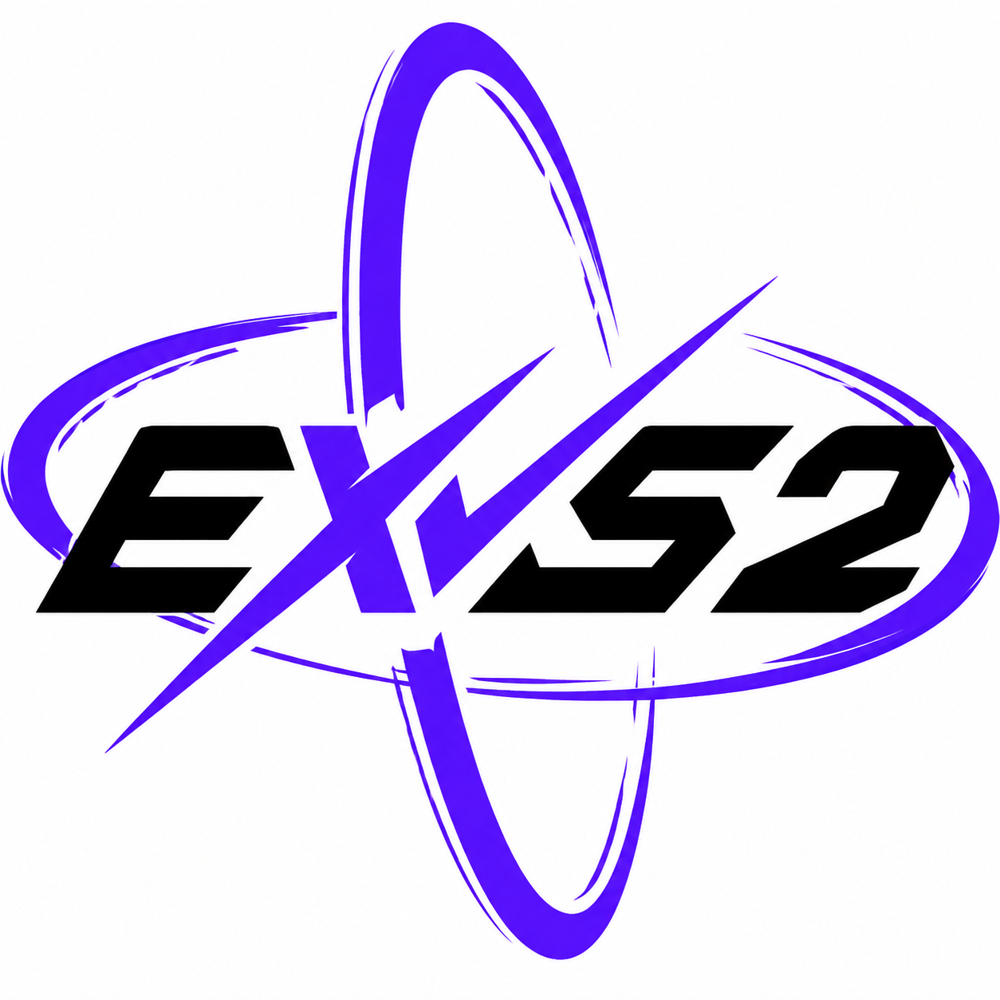

<p align="center">
  
</p>

# EXVS Mod Project

**by [kjjkjjzyayufqza](https://github.com/kjjkjjzyayufqza)**

Source-available research editor for EXVS2 **Over Boost and earlier**.
Rust + React on Tauri v2: MSC decompile/recompile, binary formats, models,
motion, pack/repack.

This is **not** OSI open source. You may not wrap it as a competing product.

| Module | Document |
| --- | --- |
| Code | [PolyForm Shield 1.0.0](LICENSE) |
| Docs | [CC BY-NC-SA 4.0](LICENSE-DOCS.md) |
| Use | [ACCEPTABLE_USE.md](ACCEPTABLE_USE.md) |

Support: https://github.com/kjjkjjzyayufqza/exvs-mod-project

Not affiliated with Bandai Namco, Sunrise, or Extreme Vs. publishers.

---

## 01 — Scope

<details>
<summary>English</summary>

Personal research tool for **Over Boost (OB)** and **earlier** Extreme Vs. 2
revisions only.

Do **not** use it to modify, reverse, dump, or target any later revision that
is still operated as a live arcade or online service. That includes
**Mobile Suit Gundam EXTREME VS.2 INFINITE BOOST**
(Japanese: 機動戦士ガンダム エクストリームバーサス2 インフィニットブースト;
aliases IB / EXVS2IB / イニブ only). The ban is the whole later-than-OB live
class, including successors.

Do **not** ship a competing product (rebrand, wrap, or substitute this editor,
paid or free). Do **not** commit or redistribute game executables, dumps, or
publisher assets. Analysis of **this** tree is allowed; implementing its unique
behavior into another product is not. Some Rust sources carry unique
AI-facing notices that point at the Agent contract; deleting or unifying
them to enable a port is also forbidden.

Full terms: [ACCEPTABLE_USE.md](ACCEPTABLE_USE.md).

</details>

<details>
<summary>中文</summary>

本项目是个人研究工具，**仅针对 Over Boost（OB）及更早**的 Extreme Vs. 2 修订。

**禁止**用于修改、逆向、dump 或针对任何仍在营运的、晚于 OB 的街机或线上修订。包括当前营运中的
**机动战士高达 EXTREME VS.2 INFINITE BOOST**
（日文官方名：機動戦士ガンダム エクストリームバーサス2 インフィニットブースト；
简称 IB / EXVS2IB / イニブ 只是别名）。禁止的是整类「晚于 OB 且仍在营运」的修订，含后继作。

**禁止**做成竞品（改名、套壳、替代本编辑器，收费或免费）。**禁止**提交或再分发游戏 exe、dump、发行资产。
分析**本仓库**可以；把独特实现搬进另一个产品不行。部分 Rust 源文件顶部有独特的 AI 门槛注释，指向 Agent 合同；为了移植而删除或统一这些注释同样禁止。

全文：[ACCEPTABLE_USE.md](ACCEPTABLE_USE.md)。

</details>

<details>
<summary>日本語</summary>

本プロジェクトは個人研究用ツールであり、対象は **Over Boost（OB）およびそれ以前**の
Extreme Vs. 2 のみです。

**OB より後で、現在も稼働中**のアーケード／オンライン版の改変・解析・ダンプ・対象化に
使ってはなりません。これには現行タイトル
**機動戦士ガンダム エクストリームバーサス2 インフィニットブースト**
（英語：Mobile Suit Gundam EXTREME VS.2 INFINITE BOOST；
通称 IB / EXVS2IB / イニブは別名にすぎません）を含みます。禁止は略称ひとつではなく、
「OB より後かつ稼働中」という区分と、その後継です。

競合製品（改名・ラップ・代替エディタ、有償・無償を問わず）の提供は禁止。
ゲームの exe、ダンプ、パブリッシャー資産の git 投入・再配布は禁止。
**本リポジトリ**の解析は可。固有実装を別製品へ移植することは不可。
一部の Rust ソース先頭にある固有の AI ゲート通知を、移植しやすくするために
削除・統一することも禁止です。

全文：[ACCEPTABLE_USE.md](ACCEPTABLE_USE.md)。

</details>

---

## 02 — Acknowledgments

None of this research stands alone. Formats, scripts, and tooling in this
tree sit on work that other people published first.

**descatal** — EXVS modding research and tools that made later Over Boost
work possible.

| Project | URL |
| --- | --- |
| descatal | https://github.com/descatal |
| BoostStudio | https://github.com/descatal/BoostStudio |

**ssbh_lib series** — SSBH read/write (`numdlb`, `numshb`, `nusktb`, `nuanmb`,
`numatb`, …) and the texture/editor stack around it. This repo vendors a fork
for EXVS2; credit belongs upstream.

| Project | URL |
| --- | --- |
| ssbh_lib / ssbh_data | https://github.com/ultimate-research/ssbh_lib |
| ScanMountGoat | https://github.com/ScanMountGoat |
| ssbh_editor | https://github.com/ScanMountGoat/ssbh_editor |
| ssbh_data_py | https://github.com/ScanMountGoat/ssbh_data_py |
| ultimate_tex | https://github.com/ScanMountGoat/ultimate_tex |
| nutexb (upstream) | https://github.com/ScanMountGoat/nutexb |
| SSBHLib (predecessor) | https://github.com/Ploaj/SSBHLib |
| This repo's ssbh_lib fork | https://github.com/kjjkjjzyayufqza/ssbh_lib |
| This repo's nutexb fork | https://github.com/kjjkjjzyayufqza/nutexb |

**jam1garner MSC series** — MSC bytecode as a documented language. EXVS2 MSC
tools here start from that Smash MSC line (`mscdec` / `msclang` / `pymsc`).

| Project | URL |
| --- | --- |
| jam1garner | https://github.com/jam1garner |
| mscdec | https://github.com/jam1garner/mscdec |
| msclang | https://github.com/jam1garner/msclang |
| pymsc | https://github.com/jam1garner/pymsc |
| msc (Rust crate) | https://github.com/jam1garner/msc-rs |

**Christian Ortiz (cortiz2894)** — the SSBH model preview's stylized (bloom +
warm light) look is inspired by his anime water / stylized WebGL components.
Thank you, Christian.

| Project | URL |
| --- | --- |
| stylized-components | https://github.com/cortiz2894/stylized-components |
| cortiz2894 | https://github.com/cortiz2894 |
| Portfolio | https://cortiz.dev |

Errors in this project are ours. Credit for the ground they stand on is not.

---

## 03 — Development

```bash
pnpm install
pnpm start        # tauri dev
pnpm test         # vitest
pnpm build        # tsc + vite build
```

Do not start a bare `pnpm dev` server; use `pnpm start` so the Tauri shell is present.

## 04 — Documentation

| File | Role |
| --- | --- |
| `AGENTS.md` | Operating guidance for coding agents |
| `CLAUDE.md` | Pointer at `AGENTS.md` for Claude-family tools |
| `ACCEPTABLE_USE.md` | Use policy (long legal notice) |
| `CONTRIBUTING.md` | How (and how not) to work in this tree |
| `CONTEXT.md` / `CONTEXT-MAP.md` | Domain terminology |
| `docs/` | Format specs and research notes |

IDE: [VS Code](https://code.visualstudio.com/) + [Tauri](https://marketplace.visualstudio.com/items?itemName=tauri-apps.tauri-vscode) + [rust-analyzer](https://marketplace.visualstudio.com/items?itemName=rust-lang.rust-analyzer)
