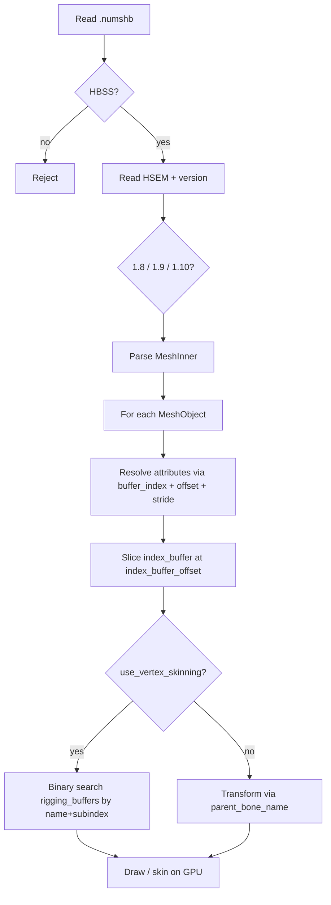

# mesh (HSEM / `.numshb`) — EXVS2 vs ssbh_lib Audit

**Session**: `ssbh-lib-ida-audit`  
**Date**: 2026-06-14  
**ssbh_lib module**: `E:/research/ssbh_lib/ssbh_lib/src/formats/mesh.rs`  
**ssbh_data module**: `E:/research/ssbh_lib/ssbh_data/src/mesh_data.rs`  
**Supported versions (ssbh_lib)**: 1.8, 1.9, 1.10 (EXVS2 ships **1.8** predominantly)

---

## Overview

`mesh` is the SSBH inner format with FourCC **`HSEM`** (on-disk bytes `48 53 45 4D`, little-endian `0x4D455348`). Files typically use extension **`.numshb`** (e.g. `model.numshb`, `c00BodyShape.numshb`).

Purpose: **model geometry** — shared vertex/index buffers, per-object attribute layout, skinning weights, bounding volumes, and render flags. Linked to `.numdlb` (modl), `.numatb` (matl), and `.nusktb` (skel) through the model bundle.

| Property | Value |
|----------|-------|
| Outer wrapper | `HBSS` (`48 42 53 53`), 0x10 alignment before inner payload |
| Inner magic | `HSEM` |
| EXVS2 version | **1.8** (measured in shipped assets and TAURI export path) |
| High-level Rust types | `ssbh_lib::formats::mesh::Mesh`, `ssbh_data::mesh_data::MeshData` |
| TAURI_PROJECT usage | FBX/DAE import (`dae_to_ssbh.rs`), collision (`numshb_collision.rs`), Scene Editor IPC |

---

## ssbh_lib Coverage

### Version dispatch

```rust
pub enum Mesh {
    V8(MeshInner<AttributeV8, SsbhArray<VertexWeightV8>>),   // 1.8
    V9(MeshInner<AttributeV9, SsbhArray<VertexWeightV8>>),   // 1.9
    V10(MeshInner<AttributeV10, SsbhByteBuffer>),            // 1.10
}
```

Registered as `Ssbh::Mesh(Versioned<mesh::Mesh>)` with `#[br(magic = b"HSEM")]`.

### Top-level `MeshInner` layout

| Field | Type | Notes |
|-------|------|-------|
| `model_name` | `SsbhString` | Often empty in EXVS2 exports |
| `bounding_info` | `BoundingInfo` | Sphere + AABB + OBB for whole model |
| `unk1` | `u32` | Always `0` in samples |
| `objects` | `SsbhArray<MeshObject<A>>` | Draw sub-meshes (name + subindex) |
| `buffer_sizes` | `SsbhArray<u32>` | **4 entries** (padded with 0) even if buffers empty |
| `polygon_index_size` | `u64` | Byte length of `index_buffer` |
| `vertex_buffers` | `SsbhArray<SsbhByteBuffer>` | Up to 4 interleaved attribute pools |
| `index_buffer` | `SsbhByteBuffer` | Shared index stream for all objects |
| `rigging_buffers` | `SsbhArray<RiggingGroup<W>>` | Skin weights keyed by object name/subindex |

`#[ssbhwrite(pad_after = 16, align_after = 8)]` on `Mesh` enum.

### `MeshObject` layout (per draw call)

| Field | Type | ssbh_lib / EXVS2 notes |
|-------|------|------------------------|
| `name` | `SsbhString` | e.g. `c00BodyShape` |
| `subindex` | `u64` | Unique per same `name`; **writer forces `0` for VS2** in `mesh_data` |
| `parent_bone_name` | `SsbhString` | Empty when `use_vertex_skinning == 1` |
| `vertex_count` | `u32` | Logical vertices in attribute buffers |
| `vertex_index_count` | `u32` | Index count (triangles × 3) |
| `unk2` | `u32` | Always `3` (triangle list) |
| `vertex_buffer0_offset` … `vertex_buffer3_offset` | `u32` | Base byte offset into shared buffers |
| `stride0` … `stride3` | `u32` | Per-buffer vertex stride |
| `index_buffer_offset` | `u32` | Start of this object's indices |
| `unk8` | `u32` | Always `4` (index component size hint) |
| `draw_element_type` | `DrawElementType` | `0` = u16 indices, `1` = u32 |
| `use_vertex_skinning` | `u32` | `1` = use `rigging_buffers` |
| `sort_bias` | `i32` | Alpha sort offset (**purpose unverified in IDA**) |
| `depth_flags` | `DepthFlags` | `disable_depth_write`, `disable_depth_test` (+ 2 pad bytes) |
| `bounding_info` | `BoundingInfo` | Per-object bounds |
| `attributes` | `SsbhArray<A>` | Attribute descriptors (version-specific) |

### Attribute descriptors by version

**v1.8 `AttributeV8`** (20 bytes + array overhead):

| Field | Type |
|-------|------|
| `usage` | `AttributeUsageV8` (`u32`) |
| `data_type` | `AttributeDataTypeV8` (`u32`, Smash-style DXGI-like constants) |
| `buffer_index` | `u32` (0–3) |
| `buffer_offset` | `u32` (within stride) |
| `subindex` | `u32` |

**v1.9 `AttributeV9`** adds `subindex: u64`, `name`, `attribute_names[]`.

**v1.10 `AttributeV10`** uses compact `AttributeDataTypeV10` enum (`0,2,4,5,7,8`) and `rigging` as raw `SsbhByteBuffer`.

### `AttributeUsageV8` — EXVS2 extensions (documented in source)

| Value | ssbh_lib name | IDA note (`vsac27_Release.exe`) |
|-------|---------------|----------------------------------|
| 0–5 | Position … ColorSet | Standard Smash semantics |
| 6 | `Unk6` | Unknown |
| 7 | `Unk7` | Unknown |
| 8 | `HalfFloat2` | Often UV-related half-float |
| 9 | `Unk9` | Unknown |
| **10** | **`ExvsColor5`** | Maps to D3D semantic **`Color5`** (`sub_14029ACB0`) |
| **11** | **`ExvsColor4`** | Maps to D3D semantic **`Color4`** (`sub_14029ACB0`) |
| **12** | **`ExvsColor12`** | **No default semantic** in `sub_14029ACB0`; often Float4 color |

`AttributeUsageV9` (v1.9/v1.10) drops usages 6–12; EXVS2 v1.8 files keep the extended enum.

### `AttributeDataTypeV8` (v1.8/v1.9 wire values)

| Enum | Value | Size |
|------|-------|------|
| Byte4 | 1024 | 4 |
| Float3 | 820 | 12 |
| Float4 | 1076 | 16 |
| HalfFloat4 | 1077 | 8 |
| Float2 | 1079 | 8 |

### `AttributeDataTypeV10` (v1.10 wire values)

| Enum | Value | Size |
|------|-------|------|
| Float3 | 0 | 12 |
| Byte4 | 2 | 4 |
| Float4 | 4 | 16 |
| HalfFloat4 | 5 | 8 |
| Float2 | 7 | 8 |
| HalfFloat2 | 8 | 4 |

### Rigging

| Version | Weight storage | Wire layout |
|---------|----------------|-------------|
| 1.8 / 1.9 | `SsbhArray<VertexWeightV8>` | `u32 vertex_index` + `f32 weight` |
| 1.10 | `SsbhByteBuffer` | **Documented** as `u16` + `f32` in `VertexWeightV10` struct comment; **writer uses `u32` + `f32`** |

`RiggingFlags`: `max_influences: u8`, `unk1: u8` (+ 6 pad bytes on write).

### ssbh_data layer

- **Read path**: `Mesh` → `MeshData` (struct-of-arrays per attribute usage).
- **Write path**: `MeshData::to_mesh_with_profile` with `MeshWriteProfile::LegacyCompatible` or `Vs2Canonical`.
- **`is_vs2`**: Controls v1.9/v1.10 attribute naming (empty `attribute_names` when true). **Does not change v1.8 attribute records.**
- **EXVS2 canonical layout** (measured, StudioSB + shipped samples): buffer0 = Position + Normal + Tangents; buffer1 = UVs + color sets; buffer2 often **zero-filled stride 32×vertex_count** in legacy writer, **omitted** in `Vs2Canonical`.

---

## IDA Analysis (EXVS2 `vsac27_Release.exe`)

**Status: blocked — MCP connection refused (2026-06-14)**

### MCP attempts

| Tool | Query | Result |
|------|-------|--------|
| `list_instances` | — | `net::ERR_CONNECTION_REFUSED` |
| `find` (string) | `numshb`, `.numshb`, `HSEM`, `MESH` | `net::ERR_CONNECTION_REFUSED` |
| `find` (immediate) | `0x4D455348` (`HSEM` LE) | `net::ERR_CONNECTION_REFUSED` |
| `analyze_function` | `sub_14029ACB0` | `net::ERR_CONNECTION_REFUSED` |

No live decompilation was retrieved. The following is **ssbh_lib-documented + hypothesis** until IDA is re-run.

### Known anchor: `sub_14029ACB0` (attribute → shader semantic)

Referenced in `mesh.rs` as the **vsac27** function that maps mesh attribute `usage` to D3D input semantics when building vertex declarations for shaders (e.g. `vsac27` shader archive).

**Documented mapping (from ssbh_lib comments, not re-verified in IDA this session):**

```
sub_14029ACB0(usage, …) -> semantic string / slot
  usage 0  -> Position*
  usage 1  -> Normal*
  usage 2  -> Binormal*
  usage 3  -> Tangent*
  usage 4  -> TEXCOORD*
  usage 5  -> COLOR*
  usage 10 -> "Color5"    (ExvsColor5)
  usage 11 -> "Color4"    (ExvsColor4)
  usage 12 -> (default / unbound)  (ExvsColor12)
```

\*Exact semantic indices and name strings need IDA decompile confirmation.

### Recommended IDA follow-up (when MCP is live)

Execute in order; record `sub_` chains with `analyze_function` → `callees` → `callgraph`:

1. **FourCC** — `find` immediate `0x4D455348` (`HSEM` LE).
2. **HBSS dispatcher** — `find_bytes` `48 42 53 53` → xref → shared SSBH router (sibling: `LDOM`, `LTAM`, `LEKS`).
3. **Extension string** — `find` `.numshb`, `numshb`, `Mesh`, `HSEM`.
4. **Attribute semantic mapper** — `analyze_function` `sub_14029ACB0`; xref callers (vertex declaration / input layout builder).
5. **Mesh load pipeline** — from HSEM case: parse `MeshInner` → map `MeshObject` → resolve `vertex_buffers` + `attributes` → upload to GPU.

**Expected chain shape (hypothesis, unverified):**

```
sub_<HBSS_loader>
  └─> sub_<FourCC_switch> (HSEM case)
        └─> sub_<Mesh_parse_v18>
              ├─> SsbhArray_read (objects, buffers, rigging)
              ├─> sub_<build_vertex_declaration>  (may call sub_14029ACB0 per attribute)
              └─> sub_<create_drawable / FeMesh*>   (engine-specific)
```

Document as `sub_<addr> -> sub_<addr> -> {field}` once confirmed.

---

## Logic Flow (inferred)



**ssbh_data read path** (`read_mesh_objects_inner`):

1. For each `MeshObject`, read indices from shared `index_buffer`.
2. Group attributes by `usage()` into `positions`, `normals`, `tangents`, etc.
3. v1.8 EXVS usages 10–12 are **remapped heuristically** (e.g. `ExvsColor5/4` → `TextureCoordinate`, `ExvsColor12` → `ColorSet`) — may lose shader semantic fidelity.

**TAURI write path** (EXVS2 export):

1. `MeshData { major: 1, minor: 8, is_vs2: true }`.
2. `write_to_file_with_profile(..., Vs2Canonical)` in `dae_to_ssbh.rs` (omit dummy buffer2).
3. Auto-split oversized meshes to stay within `u16` index range when needed (`scene-fbx-blender-diagnosis`).

---

## Field Mapping

### Confirmed top-level bounding-sphere lineage (2026-07-04)

Small sequential IDA passes now anchor the first `BoundingInfo` field for both
the v1.7 and v1.8 game parsers:

```text
sub_1402980A0
  file+0x10 -> HSEM header
  HSEM version 1.7 -> sub_14029B410
  HSEM version 1.8 -> sub_14029FD90

sub_14029FD90
  HSEM+0x10 -> temporary mesh DTO+0x28

sub_140291C30
  DTO+0x28 -> nu::Mesh+0x60

sub_140146870
  nu::Mesh+0x60,+0x64,+0x68,+0x6C
  -> EFX runtime slot+0x2A0 as (x,y,z,radius)
```

The same `HSEM+0x10 -> DTO+0x28` copy appears in the v1.7 parser
`sub_14029B410`. This matches the `ssbh_lib` wire declaration exactly:
`MeshInner.model_name` occupies `HSEM+0x08`, followed by
`MeshInner.bounding_info` at `HSEM+0x10`, whose first 16 bytes are
`BoundingSphere { center: Vector3, radius: f32 }`.

For the EXVS2 v1.8 barrier sample
`eff_051buildf_004wgfenc_001_barrier_001__maya__.numshb`, file `+0x20`
(`HSEM+0x10`) decodes to center `(-3.76357, -0.005, -0.000001)` and radius
`10.7244`. `exvs2-json --summary` independently parses the same file as
v1.8, one object, 1219 vertices, and 6720 indices.

This resolves the top-level `bounding_info.bounding_sphere` row. It does not
resolve the separate per-object `MeshObject.bounding_info` consumer.

### `MeshInner` — game vs ssbh_lib

| ssbh_lib field | Wire role | IDA symbol (pending) |
|----------------|-----------|----------------------|
| `model_name` | Optional model label | — |
| `bounding_info` | Culling / LOD | — |
| `unk1` | Reserved | — |
| `objects[]` | Draw instances | — |
| `buffer_sizes[0..3]` | Vertex buffer byte lengths | — |
| `polygon_index_size` | Index buffer length | — |
| `vertex_buffers[]` | Interleaved attribute pools | — |
| `index_buffer` | Triangle list indices | — |
| `rigging_buffers[]` | Per-object skin weights | — |

### `MeshObject` — high-risk fields for parity

| Field | ssbh_lib | EXVS2 risk |
|-------|----------|------------|
| `subindex` | Read faithfully; **write forces 0** | Non-zero subindices exist in some Smash assets; EXVS2 may always use 0 |
| `unk2` | Hardcoded `3` on write | Verify triangle strip vs list in game |
| `unk8` | Hardcoded `4` | Likely index type metadata |
| `stride2` / `vertex_buffer2_offset` | Dummy buffer2 policy | **Vs2Canonical** mirrors StudioSB (offset = buffer1, size 0) |
| `draw_element_type` | Auto u16/u32 on write | Game must match; TAURI splits meshes for u16 limit |
| `sort_bias` | Preserved on read/write | Shader sort behavior unverified |
| `RiggingFlags.unk1` | Writer always `1` | Sometimes `0` for single-bound meshes (TODO in source) |

### `AttributeV8.usage` — EXVS2 semantic mapping

| usage | ssbh_lib | ssbh_data `usage()` on read | IDA (`sub_14029ACB0`) |
|-------|----------|----------------------------|------------------------|
| 10 ExvsColor5 | Parsed | → TextureCoordinate (fallback) | → `Color5` (documented) |
| 11 ExvsColor4 | Parsed | → TextureCoordinate (fallback) | → `Color4` (documented) |
| 12 ExvsColor12 | Parsed | → ColorSet (fallback) | Unbound default (documented) |

---

## Gaps and Severity

| ID | Severity | Gap | Action |
|----|----------|-----|--------|
| G1 | **Critical** | No IDA chains — cannot confirm parser/upload path | Re-run MCP with `vsac27_Release.exe` loaded; map HSEM case + `sub_14029ACB0` callers |
| G2 | **High** | `ExvsColor5/4/12` read remapping in `mesh_data` may drop shader semantics | Preserve distinct attribute buckets or map to names matching `Color4`/`Color5`; verify against IDA + in-game materials |
| G3 | **High** | `VertexWeightV10`: struct comment says `u16` index; `create_vertex_weights_v10` writes **`u32`**; `to_weights` reads **`u32`** | Hex-compare v1.10 rigging blobs from game; align read/write with wire format |
| G4 | **Medium** | `sort_bias`, `unk2`, `unk8`, `RiggingFlags.unk1` not IDA-verified | Field trace when MCP available |
| G5 | **Medium** | Writer forces `subindex = 0` and `mesh_object_subindex = 0` for VS2 | Confirm EXVS2 never uses non-zero subindices; if it does, round-trip breaks |
| G6 | **Medium** | v1.8 `is_vs2` does not affect attribute encoding | Documented; only `MeshWriteProfile` affects buffer2 — OK if intentional |
| G7 | **Low** | Bounding volumes recalculated on export (not bit-identical) | Acceptable for modding; note for binary diff tools |
| G8 | **Low** | `AttributeUsageV8` values 6,7,9 semantics unknown | IDA `sub_14029ACB0` switch table |

### Parity assessment (ssbh_lib vs EXVS2)

| Area | Verdict |
|------|---------|
| v1.8 struct parsing | **Strong** — primary EXVS2 version; fuzz + production use |
| v1.9 / v1.10 | **Present** — less exercised in EXVS2 shipping assets |
| EXVS attribute extensions (10–12) | **Parse OK** — **semantic round-trip weak** in ssbh_data |
| Buffer2 / canonical profile | **Addressed** in fork via `Vs2Canonical` (see `ssbh-model-optimization`) |
| Index width | **Addressed** in TAURI via auto-split + lossless u16/u32 selection |
| EXVS2 binary proof (loader) | **Unknown** — pending IDA |

---

## TAURI_PROJECT integration notes

| Location | Behavior |
|----------|----------|
| `src-tauri/src/ssbh_dae/dae_to_ssbh.rs` | Mesh v1.8, `is_vs2: true`, `Vs2Canonical` profile |
| `src-tauri/src/numshb_collision.rs` | Positions + indices only |
| `docs/agent-sessions/ssbh-model-optimization/` | Buffer2 omission, float attribute layout, size measurements |
| `docs/agent-sessions/scene-fbx-blender-diagnosis/` | u16 index overflow → mesh splitter |

Dependency: `ssbh_lib` git `kjjkjjzyayufqza/ssbh_lib` branch `wmmt2` (`src-tauri/Cargo.toml`).

---

## References

- `E:/research/ssbh_lib/ssbh_lib/src/formats/mesh.rs`
- `E:/research/ssbh_lib/ssbh_data/src/mesh_data.rs`
- `E:/research/ssbh_lib/ssbh_data/src/mesh_data/mesh_attributes.rs`
- `E:/research/ssbh_lib/ssbh_lib/src/lib.rs` — `Ssbh::Mesh`, `b"HSEM"`
- `E:/TAURI_PROJECT/docs/agent-sessions/ssbh-model-optimization/process.md`
- `E:/TAURI_PROJECT/docs/agent-sessions/scene-fbx-blender-diagnosis/todo.md`
