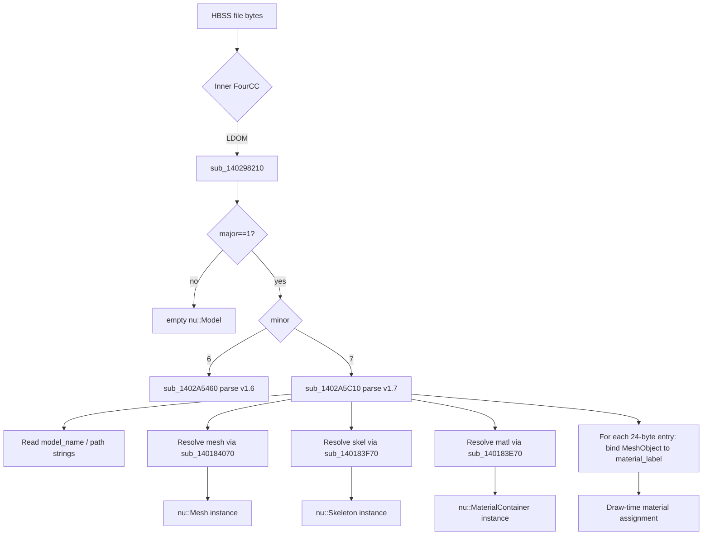

# Modl (LDOM) — ssbh_lib vs EXVS2 IDA Audit

Session: 2026-06-14  
Sources: `E:/research/ssbh_lib/ssbh_lib/src/formats/modl.rs`, `E:/research/ssbh_lib/ssbh_data/src/modl_data.rs`, IDA via `ida-pro-mcp`, `TAURI_PROJECT/src-tauri` consumers.

---

## Overview

**Modl** is the SSBH “model manifest” format. It does not contain mesh vertices, bone matrices, or shader parameters directly. Instead it records:

- Which **sidecar files** belong to the model (skeleton, mesh, material bank, optional animation).
- A table of **mesh-object → material-label** assignments used at draw time.

| Property | Value |
|----------|-------|
| Container magic | `HBSS` (16-byte aligned inner payload) |
| Inner FourCC | `LDOM` (`4C 44 4F 4D`) |
| Typical extensions | `.numdlb` (models), `.nusrcmdlb` (shader-command / effect models — same bytes) |
| ssbh_lib version | **1.7 only** (`Modl::V17`) |
| ssbh_data | `ModlData` / `ModlEntryData` with infallible round-trip |

In EXVS2 stage packs, `.numdlb` FHM2D items use `unk2 = "40000000"` and are ordered after `.numshb`, before `.jnttbl` (see `docs/checklist/repack-stage-fhm2d-checklist.md`).

---

## ssbh_lib coverage

### Type layout (`modl.rs` v1.7)

After `HBSS` + 0x10 alignment + `LDOM` + `major=1` + `minor=7`, the payload (`base = 0x18` in file) is:

| File offset | Field | Rust type | Notes |
|-------------|-------|-----------|-------|
| `+0x00` | `model_name` | `SsbhString` | Often stem or source path; stage rename uses this internally |
| `+0x08` | `skeleton_file_name` | `SsbhString` | e.g. `model.nusktb` |
| `+0x10` | `material_file_names` | `SsbhArray<SsbhString>` | rel(8) + count(8) → array of paths |
| `+0x20` | `animation_file_name` | `RelPtr64<SsbhString>` | optional; null rel = none |
| `+0x28` | `mesh_file_name` | `SsbhString8` | 8-byte-aligned CString; e.g. `model.numshb` |
| `+0x30` | `entries` | `SsbhArray<ModlEntry>` | rel(8) + count(8) → assignment table |

**`ModlEntry`** (24 bytes each — matches IDA entry stride):

| Offset | Field | Type |
|--------|-------|------|
| `+0x00` | `mesh_object_name` | `SsbhString` |
| `+0x08` | `mesh_object_subindex` | `u64` |
| `+0x10` | `material_label` | `SsbhString` |

Strings use **relative u64 offsets** from the field position (`RelPtr64` / `SsbhStringN`). `SsbhArray` stores `relative_offset` then `element_count`, then elements at the pointed location.

### `modl_data.rs`

High-level mirror with `String` / `Vec` / `Option`:

- `ModlData`: versions + all manifest paths + `entries`.
- `ModlEntryData`: `(mesh_object_name, mesh_object_subindex, material_label)`.
- Bidirectional `From` with `Modl` / `ModlEntry`; fuzz targets in `ssbh_data/fuzz/`.

### TAURI_PROJECT usage

| Location | Role |
|----------|------|
| `ssbh_preview.rs` | Loads `.numdlb` → resolves `mesh_file_name`, `skeleton_file_name`, `material_file_names` beside model root |
| `ssbh_dae/dae_to_ssbh.rs` | Builds `ModlData` from DAE conversion (entries per mesh, default `__nust__` matl path) |
| `format/fhm2d_stage.rs` | Manual parse (`parse_stage_numdlb_modl_info`) for stage folder rename; offsets match ssbh_lib v1.7 |
| Scene save / unit model pipelines | Writes `.numdlb` alongside `.numshb`, `.nusktb`, `.numatb`, `.jnttbl` |

**Important operational rule:** renaming the `.numdlb` file on disk without updating internal `model_name` and sidecar path strings breaks stage re-extract rename (documented in `scene-editor-save-test/process.md`).

---

## IDA functions

Binary: EXVS2 (active IDA instance, image base `0x140000000`).

### FourCC dispatch

| Address | Symbol | Role |
|---------|--------|------|
| `sub_140298210` | LDOM factory | Checks `*(payload)==0x4D4F444C` (`LDOM`), `major==1`; branches on **minor** |
| `sub_1402A5460` | LDOM **v1.6** parser | `minor==6` |
| `sub_1402A5C10` | LDOM **v1.7** parser | `minor==7` — matches ssbh_lib |
| `sub_1402980A0` | HSEM factory | Mesh (`0x4D455348`); same version-switch pattern (7/8/9/10) |
| `sub_140115510` | Model graph builder | Calls `sub_140298210` among other SSBH loaders; builds runtime model |

**Magic constants (LE u32 at payload+0):**

| FourCC | Immediate | Factory |
|--------|-----------|---------|
| `LDOM` | `1297040460` (`0x4D4F444C`) | `sub_140298210` |
| `HSEM` | `1296388936` (`0x4D455348`) | `sub_1402980A0` |

No direct `cmp` hits for `LEKS` / `LTAM` with the same `cmp [r8], imm32` pattern were found in this pass; skeleton/material loading is reached **indirectly** through Modl v1.7 parse + resource resolver helpers.

### Sidecar path resolution (v1.7)

Inside `sub_1402A5C10`, after constructing `nu::InstanceHandle` slots for Mesh / Skeleton / MaterialContainer:

```
sub_140183F70(&skel_handle,  ctx + 0x60)   // skeleton path / load
sub_140184070(&mesh_handle,  ctx + 0x40)   // mesh path / load
sub_140183E70(&matl_handle,  ctx + 0x80)   // material container path / load
```

| Helper | Suspected asset | ctx offset |
|--------|-----------------|------------|
| `sub_140184070` | **Mesh** (`nu::Mesh`) | `+0x40` |
| `sub_140183F70` | **Skeleton** (`nu::Skeleton`) | `+0x60` |
| `sub_140183E70` | **Material** (`nu::MaterialContainer`) | `+0x80` |

Each helper switches on handle state and either resolves a path string from the bundle context (`sub_140073BF0` / `sub_14006C710` family) or loads via `sub_14006BB50`.

**Entry table:** loop stride **24 bytes** over parsed entries (`mesh name`, `subindex`, `material label`), consistent with `ModlEntry`.

### Callers upstream

```
sub_1402EEBE0 → sub_1402EDCF0 / sub_1402EE420
              → sub_140115510
              → sub_140298210 (LDOM)
                  ├─ minor 6 → sub_1402A5460
                  └─ minor 7 → sub_1402A5C10
                        ├─ sub_140183F70  (skel)
                        ├─ sub_140184070  (mesh)
                        └─ sub_140183E70  (matl)
```

`sub_140298210` failure path installs `nu::InstancePointer<nu::Model>` vftable with null data (empty model).

---

## Logic flow



**ssbh_lib / TAURI equivalent:** `ModlData::from_file` → `resolve_modl_sidecar_path` → load `MeshData` / `SkelData` / `MatlData` separately; entries matched to `MeshObject.name` + `subindex` and `MatlEntry.material_label`.

---

## Field mapping (ssbh_lib ↔ game)

| ssbh_lib field | File offset (v1.7) | Game consumer | Notes |
|----------------|-------------------|---------------|-------|
| `model_name` | `+0x18` | Stage rename (`fhm2d_stage.rs`), internal model key | Not necessarily equal to filename stem |
| `skeleton_file_name` | `+0x20` | `sub_140183F70` @ ctx+0x60 | Path string, often relative |
| `material_file_names[]` | `+0x28` header | `sub_140183E70` @ ctx+0x80 | EXVS often 1–2 `.numatb` paths (`__maya__` / `__nust__`) |
| `animation_file_name` | `+0x38` | Not traced in this pass | Optional `RelPtr64`; ssbh_lib models as `Option<String>` |
| `mesh_file_name` | `+0x40` | `sub_140184070` @ ctx+0x40 | |
| `entries[].mesh_object_name` | entries heap | 24-byte record +0x00 | Matches `MeshObject.name` |
| `entries[].mesh_object_subindex` | entries heap +8 | 24-byte record +0x08 | `u64`; v1.6 path uses `atoi` in one branch |
| `entries[].material_label` | entries heap +0x10 | 24-byte record +0x10 | Matches `MatlEntry.material_label` |

---

## Gaps and severity

| ID | Severity | Topic | Detail |
|----|----------|-------|--------|
| M1 | **Medium** | Version coverage | Game parses **v1.6** (`sub_1402A5460`) and **v1.7**; ssbh_lib only implements **v1.7**. Legacy assets may fail to round-trip. |
| M2 | **Low** | `nusrcmdlb` | Same `LDOM` bytes as `.numdlb`; no separate Rust variant. Extension is packaging convention only — OK if bytes identical. |
| M3 | **Low** | `model_name` semantics | ssbh comment: may be source DCC path; game uses as model key. Editors must keep internal name aligned with folder rename expectations. |
| M4 | **Info** | Animation link | Field present in format; IDA v1.7 parse chain not traced to `MINA` loader in this pass. |
| M5 | **Info** | No extension strings in binary | IDA has no literal `"numdlb"` / `".nusktb"` strings; loading is FourCC-driven off archive bytes. |
| M6 | **None** | Entry layout | 24-byte stride and v1.7 header offsets agree between ssbh_lib, `fhm2d_stage` manual parser, and IDA. |

### Recommended follow-ups

1. Open a real v1.6 `.numdlb` and diff against v1.7 to see if a `Modl::V16` variant is needed.
2. In IDA, rename `sub_1402A5C10` → `nu::Model::loadFromModlV17` (or project convention) and trace `sub_140073BF0` to document path normalization vs `resolve_modl_sidecar_path`.
3. Trace `animation_file_name` field in `sub_1402A5C10` decompile tail (truncated) to `MINA` dispatch.

---

## Verification commands

```powershell
# ssbh_lib round-trip (from ssbh_lib repo)
cargo test -p ssbh_data modl_data::

# TAURI stage numdlb name extraction
cargo test -p app test_numdlb_name_from_real_file -- --nocapture
```

---

## References

- `ssbh_lib/src/formats/modl.rs`, `ssbh_data/src/modl_data.rs`
- `src-tauri/src/format/fhm2d_stage.rs` — `read_numdlb_model_name`, `parse_stage_numdlb_modl_info`
- `src-tauri/src/ssbh_preview.rs` — `load_model_preview_bundle`
- `docs/checklist/repack-stage-fhm2d-checklist.md` — FHM2D ordering for `.numdlb`
