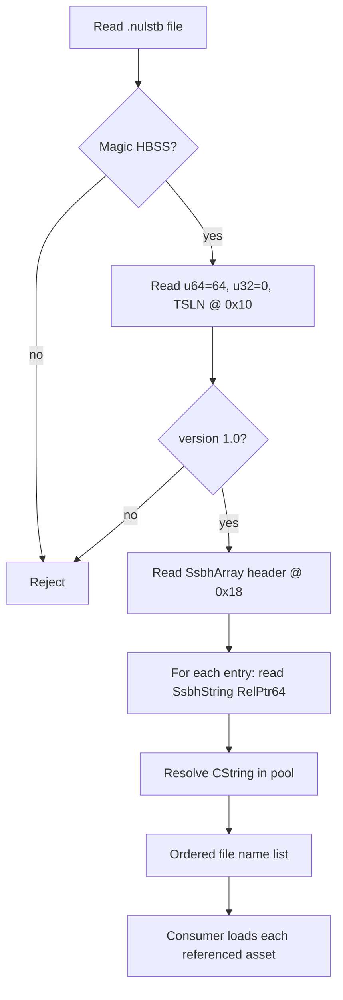

# nlst (TSLN / `.nulstb`) — EXVS2 vs ssbh_lib Audit

**Session**: `ssbh-lib-ida-audit`  
**Date**: 2026-06-14  
**Binary**: `E:\OBHK0.3_v27\vsac27_Release.exe` (IDA module `vsac27_Release.exe.i64`)  
**ssbh_lib module**: `E:/research/ssbh_lib/ssbh_lib/src/formats/nlst.rs`  
**Supported version (ssbh_lib)**: 1.0 only

---

## Overview

`nlst` is an SSBH inner format with FourCC **`TSLN`** (on-disk ASCII `54 53 4C 4E`, LE `u32` **`0x4E4C5354`** / decimal **1313624916**). Files typically use extension **`.nulstb`** (e.g. `main.nulstb`).

Purpose: a **file-name list container** — an ordered list of path/base-name strings telling the engine which companion assets to load (same wire encoding as embedded name arrays in `modl`, but as a standalone manifest).

| Property | Value |
|----------|-------|
| Outer wrapper | `HBSS` (`48 42 53 53`) |
| HBSS header tail | `u64` size field = **64** (`0x40`), then `u32` **0**, then inner FourCC |
| Inner magic | `TSLN` at file offset **0x10** |
| Version | `major=1`, `minor=0` |
| High-level Rust type | `ssbh_lib::formats::nlst::Nlst` |
| `ssbh_data` module | **None** (lib-only) |
| TAURI_PROJECT usage | **None** (no references in `src/` or `src-tauri/`) |

---

## ssbh_lib Coverage

### Source model

```rust
pub enum Nlst {
    V10 { file_names: SsbhArray<SsbhString> },
}
```

Registered in `Ssbh` enum (`lib.rs`) as `#[br(magic = b"TSLN")] Nlst(Versioned<nlst::Nlst>)`, with read/write via `ssbh_read_write_impl!(prelude::Nlst, Ssbh::Nlst, b"TSLN")`.

### On-disk layout (v1.0)

All multi-byte integers are **little-endian**. Relative offsets are measured from the **start of the offset field** (standard SSBH `RelPtr64` / `SsbhArray` model).

```
File offset   Size     Field
────────────────────────────────────────────────────────────
0x00          4        "HBSS"
0x04          8        u64 header_size = 0x40 (64)
0x0C          4        u32 reserved = 0
0x10          4        "TSLN"
0x14          2        major_version = 1
0x16          2        minor_version = 0
0x18          8        file_names.array_relative_offset (u64)
0x20          8        file_names.count (u64)
0x28          8×count  file_names.elements[i] (SsbhString header = RelPtr64 only)
…             var      string pool (CString<4> payloads, 4-byte aligned)
```

**`SsbhArray<SsbhString>` header** (starts at **0x18**):

| Field | Type | Notes |
|-------|------|-------|
| `array_relative_offset` | `u64` | Absolute seek = field_pos + offset; points to contiguous `count` string headers |
| `count` | `u64` | Number of entries; empty array may use offset **0** |

**Per-element `SsbhString`** (in the array data block):

| Field | Type | Notes |
|-------|------|-------|
| `offset` | `u64` | Relative to this field; **0** = null/empty string |

**`CString<4>`** (string payload):

| Content | Notes |
|---------|-------|
| UTF-8 + `NUL` | Read until first `0x00` |
| Padding | Storage aligned to **4 bytes**; empty string = **4 zero bytes** |

### Verified hex sample (ssbh_lib round-trip)

Generated with `ssbh_lib_json` from JSON → `.nulstb` (two entries: `stage01.numdlb`, `stage01.numatb`):

```
0000: 48 42 53 53 40 00 00 00 00 00 00 00 00 00 00 00  HBSS@............
0010: 54 53 4C 4E 01 00 00 00 10 00 00 00 00 00 00 00  TSLN............
0020: 02 00 00 00 00 00 00 00 10 00 00 00 00 00 00 00  ................
0030: 18 00 00 00 00 00 00 00 73 74 61 67 65 30 31 2E  ........stage01.
0040: 6E 75 6D 64 6C 62 00 00 73 74 61 67 65 30 31 2E  numdlb..stage01.
0050: 6E 75 6D 61 74 62 00                             numatb.
```

Interpretation:

- Array header at `0x18`: rel **`0x10`** → data at **`0x28`**; count **`2`**
- Element 0 at `0x28`: rel **`0x10`** → string at **`0x38`** (`stage01.numdlb`)
- Element 1 at `0x30`: rel **`0x18`** → string at **`0x48`** (`stage01.numatb`)

### Tooling in ssbh_lib fork

| Artifact | Role |
|----------|------|
| `ssbh_lib/fuzz/fuzz_targets/nlst.rs` | Fuzz round-trip on `Nlst` via `Versioned` |
| `ssbh_lib_json` | Maps `Ssbh::Nlst` → extension `"nulstb"` for JSON export |

### Related format (same primitives)

`modl::Modl` v1.7 embeds `material_file_names: SsbhArray<SsbhString>` with identical wire encoding. Any future IDA parser for SSBH string arrays applies to both.

---

## IDA Analysis (EXVS2 `vsac27_Release.exe`)

**Status: no dedicated `TSLN` / `.nulstb` parser located in this binary**

### MCP survey

| Tool | Query | Result |
|------|-------|--------|
| `survey_binary` | — | `vsac27_Release.exe.i64`, base `0x140000000`, ~80k functions |
| `find` (string) | `TSLN`, `NLST`, `nulstb`, `.nulstb`, `nulst` | **0 hits** |
| `find` (immediate) | `0x4E4C5354` (TSLN), `0x48425353` (HBSS) | **0 hits** |
| `find_bytes` | `54 53 4C 4E`, `48 42 53 53` | **0 hits in executable** |
| `find` (string) | sibling FourCC `LTAM`, `LDOM`, `HSEM`, `MINA`, `BPLH`, `DPRN`, `XFUN` | **Present** (e.g. `LTAM` @ `0x140288eca`) |

**Contrast — matl dispatch exists:**

```c
// sub_140288EC0 — checks LTAM (0x4D41544C) major=1, minor 5|6
if (*(_DWORD *)(a3 + 16) != 1296127052 || *(_WORD *)(a3 + 20) != 1) ...
```

```c
// sub_1402980A0 — checks HSEM (0x4D455348) major=1, minor 7|8|9|10
if (*(_DWORD *)v6 == 1296388936 && *(_WORD *)(v6 + 4) == 1) ...
```

No analogous function comparing **`0x4E4C5354`** was found. **Conclusion:** `vsac27_Release.exe` likely does **not** load `.nulstb` through the same in-process SSBH FourCC dispatch table used for `LTAM` / `HSEM` / `LDOM`. Parsing may live in another module, occur only in tooling, or the format may be unused in this EXVS2 build.

### Runtime `FileList` proc chain (related concept, not `TSLN` parser)

Separate from SSBH `TSLN`, the binary contains **script proc** strings for runtime file-list management:

| String @ `.rdata` | Role (inferred) |
|-------------------|-----------------|
| `Proc_LoadFileList` | Load / populate a file list |
| `Proc_WaitLoadFileList` | Wait for list load |
| `Proc_BuildFileList` | Build list |
| `Proc_CopyFileList` | Copy list |
| `m_FileList` | Member / field name in proc binding |

**Recovered call chain (JSON/config path, not `.nulstb` read):**

```
sub_14075E6B0          Proc_LoadFileList handler (replay / tournament paths)
  └─ sub_1405AFF00     Parse JSON fragment into key/value
  └─ sub_14075C8C0     Init std::string buffer + bind field
       └─ sub_14075CD30   Assign string; register "m_FileList" via sub_14075CAB0
            └─ sub_14075CAB0   Format / append list entries (uses sub_1407608C0, sub_140761B20)
```

Parallel entry: `sub_14075E560` → `sub_14075CE20` → same `sub_14075CD30` path (flag differs: `*a1 = 0` vs `1` in `sub_14075C8C0`).

This chain builds **runtime `std::string` lists** from proc/JSON data. It does **not** reference `TSLN`, `HBSS`, or `.nulstb` and should not be treated as proof of binary `nlst` parity.

### Recommended follow-up (IDA)

1. Search **other loaded modules** (asset loader DLLs, if any) for immediate **`0x4E4C5354`**.
2. Extract a **real game `.nulstb`** from FHM2D / loose files and round-trip with `ssbh_lib_json`.
3. If a `TSLN` handler appears elsewhere, expect the same shape as `LTAM` parsers: check FourCC @ **`buffer+16`**, version @ **`+20/+22`**, payload @ **`+24`**, then `SsbhArray` + `RelPtr64` string loop.

---

## Logic Flow



Semantic notes (ssbh_lib + Smash/Nu lineage; **not EXVS2 IDA-verified**):

- Order may matter (load sequence).
- Names are typically logical asset base names (often with extension, e.g. `model.numdlb`).
- Distinct from `modl.material_file_names` (embedded per-model) but identical wire types.

---

## Field Mapping

| ssbh_lib field | File offset (v1.0) | Wire type | IDA symbol |
|----------------|-------------------|-----------|------------|
| HBSS magic | `0x00` | `char[4]` | — |
| HBSS size field | `0x04` | `u64` (= 64) | — |
| HBSS reserved | `0x0C` | `u32` (= 0) | — |
| Inner magic | `0x10` | `char[4]` `TSLN` | — |
| `major_version` | `0x14` | `u16` | — |
| `minor_version` | `0x16` | `u16` | — |
| `file_names.array_relative_offset` | `0x18` | `u64` | — |
| `file_names.count` | `0x20` | `u64` | — |
| `file_names.elements[i]` | array block | `u64` × N | — |
| string payload | string pool | `CString<4>` | — |

---

## Gaps and Severity

| ID | Severity | Gap | Action |
|----|----------|-----|--------|
| G1 | **High** | No `TSLN` FourCC handler in `vsac27_Release.exe` | Search other modules; confirm whether EXVS2 uses `.nulstb` at all |
| G2 | **Medium** | No `ssbh_data::nlst_data` — no friendly `Vec<String>` API | Add only if TAURI needs nlst editing |
| G3 | **Medium** | No game `.nulstb` sample in repo (only ssbh_lib-generated) | Extract from stage/unit pack; validate against G1 |
| G4 | **Low** | TAURI_PROJECT does not use nlst | No change unless manifest editing is required |
| G5 | **Low** | `FileList` proc chain is runtime JSON, not `TSLN` | Do not conflate with ssbh_lib parser when tracing loads |

### Parity assessment (ssbh_lib vs EXVS2)

| Area | Verdict |
|------|---------|
| Struct definition | **Complete for v1.0** (single field, no optional tails) |
| Version coverage | **1.0 only** |
| EXVS2 binary proof | **Absent in surveyed EXE** — no `0x4E4C5354` compare found |
| Practical risk | **Low** for offline read/write via ssbh_lib if assets exist; **high uncertainty** for in-game load path until G1/G3 resolved |

---

## References

- `E:/research/ssbh_lib/ssbh_lib/src/formats/nlst.rs`
- `E:/research/ssbh_lib/ssbh_lib/src/lib.rs` — `Ssbh::Nlst`, `Versioned`, `write_ssbh_file`, `write_ssbh_header`
- `E:/research/ssbh_lib/ssbh_lib/src/arrays.rs` — `SsbhArray` read/write
- `E:/research/ssbh_lib/ssbh_lib/src/strings.rs` — `SsbhString`, `CString<N>`
- [ultimate-research/ssbh_lib nlst.rs](https://github.com/ultimate-research/ssbh_lib/blob/master/ssbh_lib/src/formats/nlst.rs)
