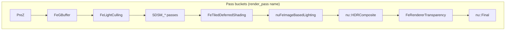

# NRPD (DPRN / `.nurpdb`) — Format Audit

Session: 2026-06-14  
Source: `E:/research/ssbh_lib/ssbh_lib/src/formats/nrpd.rs`  
Game sample: `E:/XB/解包/vs2/x64/005renderinfo/renderpipeline/1.nurpdb` (EXVS2 OB, **v1.2**)  
IDA status: **unavailable** (`ida-pro-mcp` → `ERR_CONNECTION_REFUSED`)

---

## 1. Identity

| Field | Value |
|-------|-------|
| Rust type | `Nrpd` |
| SSBH FourCC | `DPRN` (LE bytes `44 50 52 4E`) |
| Extension | `.nurpdb` |
| FHM2D `fileType` | `0x19` |
| ssbh_lib support | **1.6 only** (`Nrpd::V16`) |
| ssbh_data | none (lib-only) |
| Role | Render pipeline description: framebuffer/uniform resources, GPU state objects, ordered render passes |

Outer container: standard `HBSS` wrapper → `DPRN` + `u16` major/minor → payload.

Related formats:

- **`nufx` (`.nufxlb`)** — shader programs; each program has a `render_pass: SsbhString` naming a pass bucket (`nu::Final`, `nu::Opaque`, … in Smash; `nu::Final`, `FeGBuffer`, … in EXVS2).
- **`shdr` (`.nushdb`)** — compiled shader binaries referenced by nufx.
- **`matl` (`.numatb`)** — per-material states; NRPD holds **global** pipeline states referenced by name from passes.

---

## 2. Version gap (critical)

| Version | Observed | ssbh_lib | Notes |
|---------|----------|----------|-------|
| **1.2** | EXVS2 `renderpipeline/1.nurpdb` | **Not supported** | Parses as `DPRN` but `pre_assert(1.6)` fails |
| **1.3** | Mentioned in code TODO | Not supported | — |
| **1.6** | Smash Ultimate / ssbh_lib target | **Supported** | UTF-16 `SsbhString` throughout |

EXVS2 shipping asset header:

```
HBSS @0x00
DPRN @0x10
version 1.2 @0x18
size 32752
```

v1.2 uses **ASCII null-terminated names** in many records (verified at `0x394` `DefaultDepthStencil`, `0x6F4` `nu::Final`, etc.), not UTF-16 `SsbhString`. Layout differs from v1.6 (array headers appear to use **8-byte** rel/count pairs at `0x48+` instead of 16-byte `SsbhArray`).

**Implication for TAURI_PROJECT:** stage `.nurpdb` files from EXVS2 cannot be round-tripped with current ssbh_lib until v1.2 (or a EXVS-specific branch layout) is implemented.

Other `.nurpdb` blobs on disk (`30.nurpdb`, 32728 bytes, non-`HBSS` magic) look like **FHM2D-compressed or encrypted payloads**, not raw SSBH — decode via container first.

---

## 3. ssbh_lib v1.6 top-level layout (`Nrpd::V16`)

Sequential fields after version:

| # | Field | Type | Role (inferred) |
|---|-------|------|-----------------|
| 1 | `frame_buffers` | `SsbhArray<SsbhEnum64<FrameBuffer>>` | GPU resource declarations (RTV/SRV/DSV/UAV/cbuffers) |
| 2 | `state_containers` | `SsbhArray<SsbhEnum64<State>>` | Named sampler / rasterizer / depth / blend states |
| 3 | `render_passes` | `SsbhArray<RenderPassContainer>` | Ordered passes + command lists |
| 4 | `unk_string_list1` | `SsbhArray<StringPair>` | Plug wiring (`*_Plug` → resource) |
| 5 | `unk_string_list2` | `SsbhArray<SsbhEnum64<UnkItem2>>` | Extra resource/metadata entries |
| 6 | `unk_list` | `SsbhArray<UnkItem1>` | Named groups of string pairs |
| 7–14 | `unk_width1` … `unk8` | `u32` × 8 | See §7 |
| 15 | `unk9` | `SsbhString` | Usually empty |
| 16–17 | `unk_width2`, `unk_height2` | `u32` | Second resolution pair |
| 18 | `unk10` | `u64` | Unknown |

Known write bug (code TODO): `render_passes` relative pointer too small after serialization.

---

## 4. `FrameBuffer` enum → game concepts

`SsbhEnum64` discriminant → payload:

| ID | Rust variant | Struct | Game role (mapped) |
|----|--------------|--------|-------------------|
| `0` | `Framebuffer0` | `name`, `width`, `height`, `unk1: UnkFormat`, `unk2`, `unk3` | **Color render target** with explicit DXGI-like format. EXVS: `GBuffer_MRT0`…`MRT3`, `Fe_RTV`, light accumulation RTs. |
| `1` | `Framebuffer1` | `name`, `width`, `height`, `unk1: u64`, `unk2`, `unk3` | Alternate color target; `unk1` may pack format + flags. |
| `2` | `UniformBuffer` | `name`, `unk1`, `unk2`, `unk3: u64` (size?) | **Constant buffers**. EXVS: `nuPerShadowCBuffer`, `cbSDSM_ShadowMap`, `cbSDSM_Partitions`, `nuSceneLightInfoCBuffer`, `nuPerViewCBuffer`. |
| `3` | `Framebuffer3` | `name`, `width`, `height`, four `u32` | Extended RTV (mips/samples/flags TBD). |
| `4` | `Framebuffer4` | `name`, `width`, `height`, `unk3: u64` | Minimal RTV (no format enum). |

### Naming convention (EXVS2 `1.nurpdb`)

| Suffix | D3D11 role | Example |
|--------|------------|---------|
| `_RTV` | Render target view | `GBuffer_MRT1_RTV`, `Fe_RTV` |
| `_SRV` | Shader resource view | `GBuffer_MRT0_SRV`, `SDSM_ShadowMapSRV` |
| `_DSV` | Depth/stencil view | `DepthDSV`, `SDSM_ShadowMapDSV` |
| `_Plug` | Indirection alias (paired in `unk_string_list1` / pass cmd 0) | `GBuffer_MRT1_Plug` → `GBuffer_MRT1_RTV` |
| (no suffix) | Logical resource name | `GBuffer_MRT0`, `DepthSource` |

### `UnkFormat` (u64 enum)

Observed values in ssbh_lib: `0x100`, `0x134`, `0x144`, `0x210`, `0x214`, `0x246`, `0x321`, `0x344`, `0x400`, `0x401`, `0x405`, `0x440`.

**Not** raw `DXGI_FORMAT` indices (those top out ~191). Hypotheses:

1. **Engine texture format token** (bits may encode DXGI + sRGB + MSAA).
2. `0x400` (1024) correlates with **`ShadowMapDimensions`** string in the same file — may double as dimension hint in some records (needs IDA).

Partial DXGI adjacency (weak): `0x144` (324) is unused matl `Texture17` ID in Smash docs — likely coincidence.

---

## 5. `State` enum → game concepts

| ID | Variant | Matl equivalent | EXVS2 examples |
|----|---------|-----------------|----------------|
| `0` | `NrpdSampler` | `Sampler` + `unk13: u64` (3 or 7) | `SamplerPoint`, `CubeMapSampler`, `SDSMSampleComparisonState` |
| `1` | `NrpdRasterizerState` | `RasterizerStateV16` | `DefaultRasterizerState`, `SDSM_CreateShadowMapRasterizerState`, `NoCull` |
| `2` | `DepthState` | *(no matl counterpart)* | `DefaultDepthStencil`, `SDSM_DepthStencilState`, `ForwardPlusDepthStencilState`, `DisableDepthTestDS` |
| `3` | `NrpdBlendState` | `BlendStateV16` (partial; `unk2`/`unk4`… not `BlendOperation`) | `ShadowBlendState`, `AddBlendState`, `NoneBlendBS` |

Passes reference these by **name** via `RenderPassData` variants 14–16 (`StringPair`: plug name → state name).

`NrpdBlendState` field layout differs from `BlendStateV16`: uses raw `u32` slots where matl uses `BlendOperation` — treat as **parallel serialization**, not a direct embed.

---

## 6. `RenderPassContainer` → game render passes

```text
RenderPassContainer {
    name: SsbhString          // pass bucket: "nu::Final", "FeGBuffer", "SDSM_CreateShadowMapPass", …
    unk1: SsbhArray<RenderPassData>   // primary command list (ordered)
    unk2: SsbhArray<RenderPassData>   // secondary list (clears, viewport, pre-bind)
    unk3: SsbhEnum64<RenderPassUnkData>  // optional; variant 3 = Unk3Data (4× f32)
}
```

### EXVS2 pass buckets (from strings in `1.nurpdb`)

High-level frame graph (simplified):



Concrete pass **names** (subset): `PreZ`, `FeClearLightIndexCounter`, `FeGBuffer`, `FeLightCulling`, `SDSM_ClearZBoundsPass`, `SDSM_ReduceZBoundsFromGBufferPass`, `SDSM_ComputeLogPartitionsFromZBoundsPass`, `SDSM_ClearPartitionBoundsPass`, `SDSM_ReduceBoundsFromGBufferPass`, `SDSM_ComputeCustomPartitionsPass`, `SDSM_CreateShadowMapPass`, `SDSM_CompositeShadowMapPass`, `FeTiledDeferredShading`, `nuFeImageBasedLighting`, `nu::HDRComposite`, `CharaSpecial`, `FeRendererTransparency`, `RenderSkydome`, `nu::Final`, `nu::Debug2D`.

These align with **`nufx` `ShaderProgram*.render_pass`** — materials/shaders sort into the same bucket strings.

---

## 7. `RenderPassData` enum → GPU commands

| ID | Rust name | Payload | Game mapping |
|----|-----------|---------|--------------|
| `0` | `FramebufferRtp` | 2× string + `u64` | **Plug hook**: `Foo_Plug` → `Foo_RTV` / `Foo_SRV` |
| `1` | `PassUnk1` | 2× string | Unknown pass-local binding |
| `2` | `UnkTexture1` | 2× string + 2× `RelPtr64<u64>` | Texture/slot array (TBD) |
| `3` | `UnkLight` | 2× string + 2× `RelPtr64<Unk8Data>` | Light list hooks (`DirectionalLightsSRV`, …) |
| `8` | `Unk8` | 2× string + 2× `RelPtr64<u64>` | Generic indexed table |
| `9` | `ColorClear` | name, `Color4f`, `u64` | `ClearPlug` / RT clears |
| `10` | `DepthStencilClear` | name, `depth: f32`, `stencil: u32` | `DepthClear` |
| `12` | `Viewport` | name, `unk2`, `width`, `height`, depth min/max, `unk4` | `Viewport` command |
| `13` | `Sampler` | 2× string + ptr pair | `*SamplerPlug` → sampler state |
| `14` | `BlendState` | `StringPair` | `*BlendStatePlug` → blend state |
| `15` | `RasterizerState` | `StringPair` | `*RasterizerStatePlug` → raster state |
| `16` | `DepthStencilState` | `StringPair` | `*DepthStencilStatePlug` |
| `17` | `FramebufferRenderTarget` | `SsbhString` | Bind color RTV |
| `18` | `FramebufferDepthStencil` | `SsbhString` | Bind DSV |
| `19` | `UnkTexture2` | string + `u64` | Secondary texture bind |

**EXVS2 v1.2 empirical type bytes** (u32 before pass-local strings, not verified for v1.6):

| Type byte | Likely variant |
|-----------|----------------|
| `0x08` | `Unk8` or depth-related |
| `0x09` | `ColorClear` |
| `0x0E` (`14`) | `BlendState` / `FramebufferRenderTarget` context-dependent |
| `0x10` (`16`) | `DepthStencilState` |

### `RenderPassUnkData`

| ID | Payload |
|----|---------|
| `0` | empty (shared offset hazard — TODO in code) |
| `3` | `Unk3Data` — 2 strings + 4× `f32` (viewport/scissor rect?) |

---

## 8. Tail fields (`unk_width1` … `unk10`)

From EXVS2 file, `1920×1080` (`0x780×0x438`) appears at file offset **`0x388`**, consistent with default framebuffer dimensions.

| Field | Hypothesis | Evidence |
|-------|------------|----------|
| `unk_width1`, `unk_height1` | Primary render resolution | `1920×1080` in sample |
| `unk_width2`, `unk_height2` | Secondary target size / UI scale | Second `1920×1080` at tail |
| `unk3`–`unk5` | MSAA count, HDR enable, stereo | unknown |
| `unk6` | **Flags** (code comment) | unknown |
| `unk7`, `unk8` | Swap chain / buffer count | unknown |
| `unk9` | Empty string placeholder | ssbh_lib comment |
| `unk10` | Hash or pipeline revision | unknown |

---

## 9. `unk_string_list2` / `UnkItem2`

| ID | Struct | Purpose (inferred) |
|----|--------|-------------------|
| `0` | `UnkItem20` | 2 strings — simple alias |
| `1` | `UnkItem21` | 2 strings + `[u32;2]` |
| `2` | `UnkItem22` | 2 strings + dims + `UnkFormat` |
| `4` | `UnkItem24` | 2 strings + `[u32;6]` |

`UnkItem1`: string key + `SsbhArray<UnkItem3>` (name/value pairs) — likely **shader permutation** or **quality tier** tables.

---

## 10. ssbh_lib TODO / gap severity

| Severity | Item |
|----------|------|
| **P0** | No **v1.2** (EXVS2 shipping) reader — blocks stage nurpdb tooling |
| **P0** | `render_passes` **write** rel ptr bug |
| **P1** | `UnkFormat` not mapped to DXGI / nutexb |
| **P1** | `NrpdBlendState` vs `BlendStateV16` field mismatch |
| **P1** | `RenderPassData` 1,2,3,8,19 — pointer targets (`RelPtr64`) not typed as arrays |
| **P2** | `DepthState` semantics (4 bools in `unk2`?) |
| **P2** | `RenderPassUnkData` shared-offset / variant 0 |
| **P2** | v1.3 support (TODO comment) |
| **P3** | Public fields on many `RenderPassData*` structs (private `unk*`) |

---

## 11. IDA audit plan (not executed)

When `ida-pro-mcp` is reachable:

1. `find` string: `.nurpdb`, `DPRN`, `nu::Final`, `FeGBuffer`, `FrameBufferRenderTarget`.
2. `find_bytes`: `44 50 52 4E` (FourCC), version words `01 00 02 00` vs `01 00 06 00`.
3. Trace loader: `HBSS` read → `DPRN` dispatch → version switch (expect **`sub_*` per version**).
4. On v1.6 path: struct parsers for `FrameBuffer` type switch (`0`–`4`) — compare field order to Rust.
5. Render pass executor: xrefs on pass name strings (`SDSM_CreateShadowMapPass`) → command dispatcher switching on `RenderPassData` type id.
6. `UnkFormat` → xref to D3D11 `DXGI_FORMAT` / `CreateTexture2D` calls.

Expected game types (rename targets):

- `CNrpdFile` / `RenderPipelineDesc` — root
- `CFrameBufferDesc` — per `FrameBuffer` variant
- `CRenderPassDesc` — `RenderPassContainer`
- `CRenderPassCommand` — `RenderPassData` vtable or switch

---

## 12. Recommended next steps

1. **IDA session** — open EXVS2 executable with render pipeline loaded; rerun §11.
2. **v1.2 struct fork** — diff v1.2 `1.nurpdb` against Smash v1.6 sample; add `Nrpd::V12` before attempting writes.
3. **Golden test** — add `ssbh_test` fixture from EXVS2 `renderpipeline/1.nurpdb` (read-only) once v1.2 parses.
4. **Cross-ref nufx** — extract unique `render_pass` strings from `nufxlb` and verify 1:1 with `RenderPassContainer.name` entries.

---

## Appendix A — Sample resolution scan

```
File: renderpipeline/1.nurpdb (v1.2, 32752 bytes)
1920×1080 @ 0x388 (and tail repeats)
String count: _RTV×19, _SRV×28, _DSV×3, _Plug×18
```

## Appendix B — `StringPair` plug pattern

Typical triple in pass `unk2` (setup) list:

1. `ClearPlug` → clear metadata  
2. `nuBlendStatePlug` → `ShadowBlendState`  
3. `nuRasterizerStatePlug` → `DefaultRasterizerState`  

Then `unk1` (draw) list binds `GBuffer_MRT*_Plug` → concrete views before draw calls in `nufx` shaders for that pass bucket.
