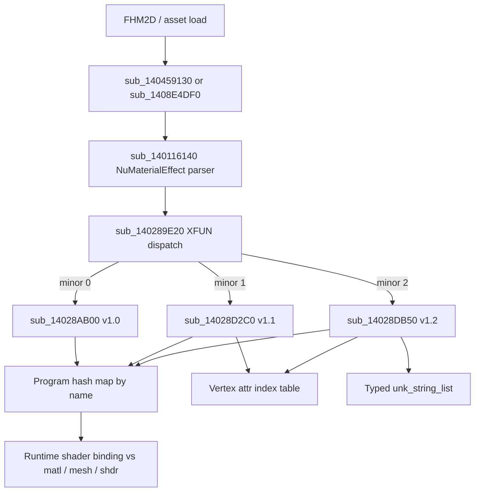

# Nufx (XFUN / `.nufxlb`) — ssbh_lib vs EXVS2 IDA Audit

Session: 2026-06-14  
Sources: `E:/research/ssbh_lib/ssbh_lib/src/formats/nufx.rs`, IDA EXVS2 binary via `ida-pro-mcp`

## Overview

**Nufx** is the shader *effects library* format: it lists named shader programs, which pipeline stages each program uses (as `.nushdb` shader entry names), required material parameters (cross-referencing `.numatb`), and (v1.1+) required mesh vertex attributes (cross-referencing `.numshb`).

| Property | Value |
|----------|-------|
| FourCC | `XFUN` (`0x4E554658` LE dword at HBSS+0x10) |
| Extension | `.nufxlb` (ssbh_lib / modding docs; **not** present as a string in EXVS2 IDA) |
| ssbh_lib versions | **1.0**, **1.1** |
| Game versions (IDA) | **1.0**, **1.1**, **1.2** (minor at HBSS+0x16) |
| ssbh_data | None (lib-only) |
| Typical asset | `nuc2effectlibrary.nufxlb` (stage packs, keep-as-is in FHM2D workflows) |

Nufx is paired at runtime with **Shdr** (`RDHS`, `.nushdb`) which holds compiled shader binaries; Nufx only stores *names* and binding requirements.

## File layout (ssbh_lib)

### HBSS wrapper

```
Offset  Size  Field
0x00    4     "HBSS"
0x04    8     u64 = 64
0x0C    4     u32 = 0
0x10    4     "XFUN"
0x14    2     major_version (u16) = 1
0x16    2     minor_version (u16) = 0 | 1
0x18    …     payload (see below)
```

IDA checks use `base+0x10` FourCC, `base+0x14` major, `base+0x16` minor — consistent with `write_ssbh_header` + `Versioned<T>` in `ssbh_lib/src/lib.rs`.

### Payload (`NufxV0` / `NufxV1`)

Both versions share the same top-level shape:

| Offset (rel.) | Type | Field |
|---------------|------|-------|
| 0x00 | `SsbhArray<ShaderProgramV*>` | `programs` |
| … | `SsbhArray<UnkItem>` | `unk_string_list` |

`SsbhArray<T>`: `u64` relative offset + `u64` count → elements at offset.

#### `ShaderProgramV0` (v1.0)

| Field | Type | Notes |
|-------|------|-------|
| `name` | `SsbhString` | Program id (often encodes pass) |
| `render_pass` | `SsbhString` | e.g. Smash `nu::Final`, `nu::Opaque`, … |
| `shaders` | `ShaderStages` | Six `SsbhString` stage slots |
| `material_parameters` | `SsbhArray<MaterialParameter>` | Required matl params |

#### `ShaderProgramV1` (v1.1)

Same as V0 plus:

| Field | Type | Notes |
|-------|------|-------|
| `vertex_attributes` | `SsbhArray<VertexAttribute>` | Required mesh attributes |

#### `ShaderStages`

Six consecutive `SsbhString` fields (4-byte aligned rel-ptr strings):

1. `vertex_shader`
2. `unk_shader1` — likely hull/domain (tessellation); often empty
3. `unk_shader2` — second tessellation stage; often empty
4. `geometry_shader`
5. `pixel_shader`
6. `compute_shader`

IDA reads all six via `sub_14028BFA0` in each version parser (six calls per program).

#### `MaterialParameter`

| Field | Type | Notes |
|-------|------|-------|
| `param_id` | `u64` | Matches `matl::ParamId` discriminants |
| (pad) | 8 bytes | `#[br(pad_after = 8)]` |
| `parameter_name` | `SsbhString8` | 8-byte aligned name, e.g. `RasterizerState0` |

#### `VertexAttribute` (v1.1 only)

| Field | Type |
|-------|------|
| `name` | `SsbhString` |
| `attribute_name` | `SsbhString` |

Game maps `attribute_name` through a 128-entry table (`off_141707BB0`, indices `Position0`…`Color7`…) via `sub_14009DE20`.

#### `UnkItem`

| Field | Type |
|-------|------|
| `name` | `SsbhString` |
| `unk1` | `SsbhArray<SsbhString>` |

Purpose unknown in ssbh_lib; game v1.2 path parses via typed variant dispatch (`sub_14028F3D0`, 20 cases).

## ssbh_lib coverage

| Area | Status |
|------|--------|
| Read / write v1.0, v1.1 | Implemented (`BinRead` + `SsbhWrite`) |
| Fuzz round-trip | `ssbh_lib/fuzz/fuzz_targets/nufx.rs` |
| `ssbh_data` high-level API | **Missing** |
| Version 1.2 | **Missing** (game has parser) |
| `unk_string_list` semantics | **Unknown** |
| `unk_shader1` / `unk_shader2` naming | Placeholder names only |
| Full `ParamId` enum parity with matl | Documented TODO in source |

## IDA — load & dispatch chains

### FourCC hit

| Search | Result |
|--------|--------|
| String `XFUN` | `0x140289e3a` (embedded in `cmp dword ptr [rdx+10h], 'XFUN'`) |
| Bytes `58 46 55 4E` | Same address (inside `sub_140289E20`) |
| String `.nufxlb` / `nufxlb` | **No hits** (loaded by asset pipeline, not extension table) |

### Version dispatcher

```
sub_140289E20  — XFUN version switch
  if *(a6+0x10) == 0x4E554658 ('XFUN') && *(u16*)(a6+0x14) == 1:
    switch *(u16*)(a6+0x16):
      case 0 → sub_14028AB00   // v1.0  ↔ ssbh Nufx::V0
      case 1 → sub_14028D2C0   // v1.1  ↔ ssbh Nufx::V1
      case 2 → sub_14028DB50   // v1.2  ↔ NOT in ssbh_lib
  else → *a2 = 0xF00FFF01 (error)
```

Caller:

```
sub_140116140  — parse XFUN blob into in-memory effect library
  └─ sub_140289E20(...)
```

### Asset integration (runtime)

```
sub_140459130  — construct VDK::DEV::ASSET::NuMaterialEffect (0x88 bytes)
  └─ sub_140116140(effect, ssbh_blob)

sub_1408E4DF0  — batch load multiple effect blobs into a list
  └─ sub_140116140(...) per element
      └─ sub_140289E20 → version parser
```

Game C++ type at load: `VDK::DEV::ASSET::NuMaterialEffect` (`vftable` at `*obj`).

Related RTTI strings (not format-specific): `AVMaterialEffectLibrary@nu@@`, `AVMaterialAttribute@nu@@` near `0x1420dd6f4`.

### v1.0 parser chain (`sub_14028AB00`)

```
sub_14028AB00
  ├─ sub_140117F60          // clear program list
  ├─ sub_14028B340          // SSBH rel-ptr → absolute offset helper
  ├─ loop programs:
  │    ├─ read name, render_pass (ImmutableString)
  │    ├─ sub_14028BFA0 ×6   // six shader stage strings
  │    ├─ sub_14028C0D0      // insert program into hash map (FNV-1a on name)
  │    │    └─ sub_14028C370 // unordered_map insert / dedup by name
  │    └─ parse material_parameters array
  └─ parse unk_string_list (lighter path than v1.2)
```

**Note:** v1.0 path does **not** call `sub_14009DE20` (vertex attribute table) or `sub_1400B7810` (per-program attribute map) — consistent with no `vertex_attributes` in `ShaderProgramV0`.

### v1.1 parser chain (`sub_14028D2C0`)

Same skeleton as v1.0, plus:

```
sub_14028D2C0
  └─ per vertex attribute:
       ├─ sub_14009DE20(attribute_name)  // strcmp → index in off_141707BB0[0..0x82]
       └─ sub_1400B7810(program_obj, index, name)  // map index → name string
```

Vertex table sample (`off_141707BB0`): `Position0`, `Position1`, …, `Normal0`, …, `Color0`, … (128 non-null entries).

### v1.2 parser chain (`sub_14028DB50`)

Nearly identical to v1.1 but:

- Uses `sub_14028E8D0` for typed cleanup (variant tag switch, 20 cases).
- Uses `sub_14028EAD0` → `sub_14028F3A0` → `sub_14028F3D0` for `unk_string_list` entries (typed serialization).

**Gap:** ssbh_lib has no `Nufx::V2` / minor 2 branch.

## Logic flow (end-to-end)



## Field mapping (game ↔ ssbh_lib)

| ssbh_lib field | IDA evidence | Confidence |
|----------------|--------------|------------|
| HBSS + XFUN header | `sub_140289E20` cmp at +0x10/+0x14/+0x16 | High |
| `programs[]` | Loop in `sub_14028AB00` / `sub_14028D2C0` over rel-ptr array | High |
| `ShaderProgram.name` | FNV-1a hash map key in `sub_14028C370` | High |
| `ShaderProgram.render_pass` | Second string read per program | High |
| `ShaderStages` ×6 | Six `sub_14028BFA0` calls per program | High |
| `material_parameters[]` | Parsed in all version parsers; `param_id` as integer key | Medium |
| `vertex_attributes[]` | Only v1.1+; `sub_14009DE20` + `sub_1400B7810` | High |
| `unk_string_list` | Parsed in v1.2 via `sub_14028F3D0` type switch | Low (structure only) |
| `MaterialParameter.param_id` | Passed as `a2` int to `sub_1400B7810` | Medium |
| `MaterialParameter.parameter_name` | String stored in map via `sub_140035080` | Medium |

### Render pass strings

ssbh_lib docs cite Smash Ultimate passes (`nu::Opaque`, `nu::Sort`, …). IDA finds many `nu::Final` strings but **no** `nu::Opaque` / `nu::Sort` / `nu::Near` / `nu::Far` in this EXVS2 build — passes may differ per title or be stored only inside `.nufxlb` assets.

### Material ↔ shader linkage

- **Nufx** declares which `ParamId` / names a program needs.
- **Matl** supplies values.
- **Shdr** supplies compiled code for the six stage name slots.
- **Mesh** must expose attributes listed in v1.1+ programs.

## Gaps & recommendations

| ID | Severity | Gap | Recommendation |
|----|----------|-----|----------------|
| G1 | **Medium** | Game supports **v1.2** (`minor=2`); ssbh_lib stops at 1.1 | Diff `sub_14028DB50` vs `sub_14028D2C0`; add `NufxV2` if shipping files use 1.2 |
| G2 | **Medium** | No `ssbh_data::nufx_data` | Add only if TAURI needs effect-library editing |
| G3 | **Low** | `unk_string_list` / `UnkItem` semantics | Trace `sub_14028F3D0` cases against sample `nuc2effectlibrary.nufxlb` |
| G4 | **Low** | `unk_shader1/2` unnamed | Rename after confirming tessellation usage in game shaders |
| G5 | **Low** | `MaterialParameter.param_id` ⊂ `matl::ParamId` | Audit enum diff when touching matl |
| G6 | **Info** | No `.nufxlb` extension in binary | Rely on asset path / FHM2D index, not extension dispatch |

## IDA commands used

```
find string: XFUN, nufxlb, EffectLibrary, nu::Final
find_bytes: 58 46 55 4E, 81 ?? 10 58 46 55 4E
analyze_function: sub_140289E20, sub_140116140, sub_14028AB00, sub_14028D2C0, sub_14028DB50
analyze_function: sub_140459130, sub_1408E4DF0, sub_14009DE20, sub_1400B7810
callgraph roots: sub_140289E20 (depth 4)
py_eval: dump off_141707BB0 vertex attribute name table
```

## Priority

- **Critical:** None for read-only stage repack (`.nufxlb` kept as-is per project checklists).
- **Medium:** v1.2 support if target EXVS2 stage files ship minor=2.
- **Low:** `unk_string_list` and render-pass catalog for EXVS2-specific naming.
