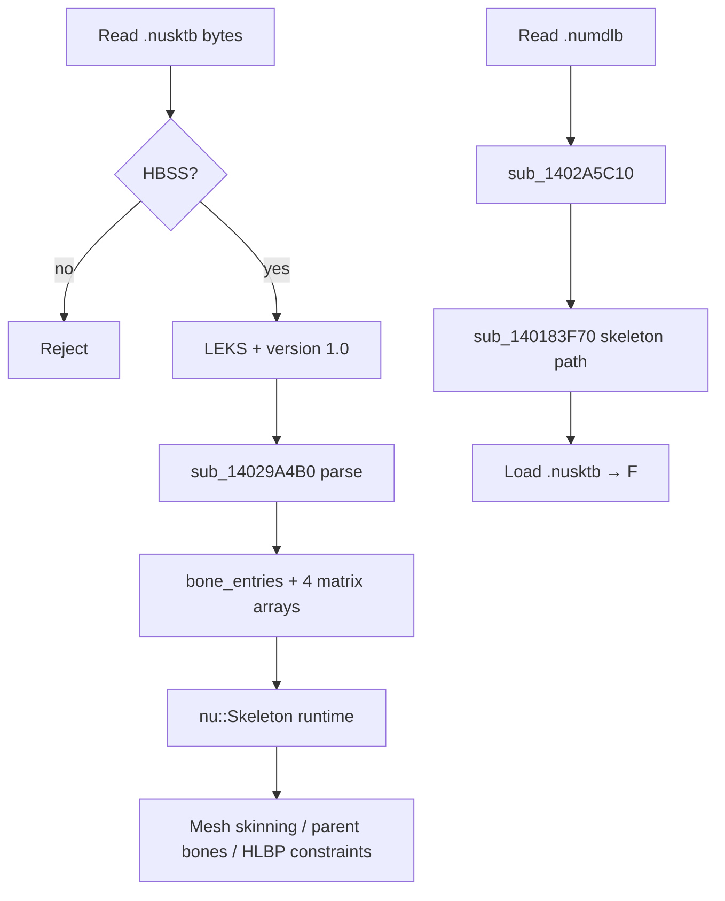

# skel (LEKS / `.nusktb`) — EXVS2 vs ssbh_lib Audit

**Session**: `ssbh-lib-ida-audit`  
**Date**: 2026-06-14  
**ssbh_lib module**: `E:/research/ssbh_lib/ssbh_lib/src/formats/skel.rs`  
**ssbh_data module**: `E:/research/ssbh_lib/ssbh_data/src/skel_data.rs`  
**Supported versions (ssbh_lib)**: **1.0 only** (`Skel::V10`)

---

## Overview

`skel` is the SSBH inner format with FourCC **`LEKS`** (on-disk bytes `4C 45 4B 53`, little-endian `0x534B454C`). Files typically use extension **`.nusktb`** (e.g. `model.nusktb`, `c00BodyShape.nusktb`).

Purpose: **skeletal hierarchy** — ordered bone list with parent indices, per-bone local transforms, precomputed world/inverse matrix arrays, and per-bone billboard flags. Linked to `.numdlb` (modl manifest), `.numshb` (mesh skinning / parent bones), `.numatb` (materials), and optionally `.nuhlpb` (helper-bone constraints). Stage packs also ship a sibling **`.jnttbl`** (joint hash table; **not** in ssbh_lib).

| Property | Value |
|----------|-------|
| Outer wrapper | `HBSS` (`48 42 53 53`), 0x10 alignment before inner payload |
| Inner magic | `LEKS` |
| EXVS2 version | **1.0** (only variant in ssbh_lib; matches shipped samples) |
| High-level Rust types | `ssbh_lib::formats::skel::Skel`, `ssbh_data::skel_data::SkelData` |
| FHM2D `fileType` | `0x0C` (TAURI `fhm2d_pack.rs`) |
| FHM2D stage `unk2` | `"10000000"` (skeleton first in model folder ordering) |
| TAURI_PROJECT usage | DAE/FBX import (`dae_to_ssbh.rs`), preview (`ssbh_preview.rs`, `meshFromSsbh.ts`), effect-project auxiliary cache (`effectProjectAuxiliaryCache.ts`) |

---

## ssbh_lib Coverage

### Container layout

```
HBSS @0x00
[pad to 0x10]
LEKS @0x10
major u16 @0x14  (=1)
minor u16 @0x16  (=0)
payload @0x18
```

Registered as `Ssbh::Skel(Versioned<skel::Skel>)` with `#[br(magic = b"LEKS")]`.

### `Skel::V10` top-level layout

After version words, five parallel `SsbhArray` headers (each: `u64 rel_offset`, `u64 count`):

| # | Field | Type | Role |
|---|-------|------|------|
| 1 | `bone_entries` | `SsbhArray<SkelBoneEntry>` | Names, hierarchy indices, flags |
| 2 | `world_transforms` | `SsbhArray<Matrix4x4>` | Cached world-space matrix per bone |
| 3 | `inv_world_transforms` | `SsbhArray<Matrix4x4>` | Inverse of world matrix |
| 4 | `transforms` | `SsbhArray<Matrix4x4>` | Local (parent-relative) matrix per bone |
| 5 | `inv_transforms` | `SsbhArray<Matrix4x4>` | Inverse of local matrix |

All five arrays are expected to have the **same element count** (one per bone). `ssbh_data` round-trip recalculates world/inverse arrays from `transforms` + hierarchy when writing.

### `SkelBoneEntry` wire layout (16 bytes fixed + heap name)

| Off | Size | Field | Type | Notes |
|-----|------|-------|------|-------|
| 0 | 8 | `name` | `SsbhString` | `RelPtr64<CString<4>>` |
| 8 | 2 | `index` | `u16` | Bone index in `bone_entries` order |
| 10 | 2 | `parent_index` | `i16` | Parent index, or **`-1`** for root |
| 12 | 1 | `flags.unk1` | `u8` | Usually `1` in samples; semantics unknown |
| 13 | 1 | `flags.billboard_type` | `u8` | See `BillboardType` enum |
| 14 | 2 | *(pad)* | — | `#[ssbhwrite(pad_after = 2)]` on `SkelEntryFlags` |

### `Matrix4x4` wire layout (64 bytes)

Column-major `Vector4` columns (`col1`…`col4`), each 16 bytes. Matches IDA `sub_140183380` which copies four `OWORD` (64 B) per matrix.

### `BillboardType` (`u8`)

| Value | ssbh_lib variant | Notes |
|-------|------------------|-------|
| 0 | `Disabled` | Default |
| 1 | `XAxisViewPointAligned` | Camera position + rotation |
| 2 | `YAxisViewPointAligned` | |
| 3 | `Unk3` | Likely same as Disabled |
| 4 | `XYAxisViewPointAligned` | |
| 6 | `YAxisViewPlaneAligned` | Camera rotation only |
| 8 | `XYAxisViewPlaneAligned` | |

### ssbh_data layer (`skel_data.rs`)

| Concept | `SkelData` / `BoneData` | Notes |
|---------|-------------------------|-------|
| Stored per bone | `name`, `transform` (local), `parent_index`, `billboard_type` | Drops `index`, `unk1`, redundant matrices |
| `parent_index` | `Option<usize>` | Negative `parent_index` in file → `None` |
| World matrix | `SkelData::calculate_world_transform` | Walks parents: `parent_local * … * bone_local` (column-major) |
| Relative matrix | `calculate_relative_transform` | `world * inv(parent_world)` |
| Write path | `TryFrom<SkelData> for Skel` | Recomputes all four matrix arrays; sets `unk1: 1` |
| Round-trip | Not bit-identical | Inverse/world floats may differ slightly (documented) |

**Hierarchy convention (confirmed by unit tests):** typical EXVS2 rigs use `Trans` → `Rot` → `Hip` → … chain; `parent_index` references **array index**, not bone `index` field (they are kept equal on write).

---

## IDA Analysis (EXVS2 `vsac27_Release.exe`)

**IDA instance**: `vsac27_Release.exe` @ `127.0.0.1:13337` (2026-06-14, connected after `select_instance`)

### FourCC discovery

| Query | Result |
|-------|--------|
| `find` string `LEKS`, `.nusktb`, `nusktb` | **0 hits** |
| `find` immediate `0x534B454C` (`LEKS` LE) in `.text` | **0 hits** |
| Full-text FourCC scan (BPLH/LTAM/HSEM/LDOM/MINA/DPRN/XFUN/RDHS/TSLN) | **LEKS absent**; siblings present at known factories |

**Interpretation:** Unlike `LDOM`/`HSEM`/`LTAM`, skeleton loading does **not** use an inline `cmp [reg], 0x534B454C` dispatcher in this EXE. Routing to the skeleton parser is **indirect** (resource type / pre-classified buffer handed to `sub_140298020`). Outer `LEKS` validation likely occurs in shared HBSS plumbing or archive layer before payload reaches the skeleton factory.

### Confirmed loader chain

```text
sub_1402EDCF0 / sub_1402EE420 / sub_1405AA150
  └─ sub_140114C10              ; attach parsed skeleton to model asset
       └─ sub_140298020         ; nu::InstancePointer<nu::Skeleton> factory
            └─ sub_14029A4B0   ; parse v1.0 payload → nu::Skeleton (560 B object)
                 ├─ sub_1400C2780   ; nu::Skeleton ctor
                 ├─ sub_14029AC70   ; write bone index + parent_index (+16/+18)
                 ├─ sub_14029ABF0   ; append u8 (billboard / flags byte)
                 └─ sub_140183380   ; copy Matrix4x4 (64 B × N)
```

**Factory wrapper (`sub_140298020`):**

- Input: `a3 + 0x10` points past HBSS inner header (same pattern as other SSBH factories).
- Output: `nu::InstancePointer<nu::Skeleton>`; empty skeleton on parse failure.

### Modl / model-bundle integration (from modl audit + this pass)

```text
sub_140115510
  └─ sub_140298210 (LDOM v1.6/v1.7)
       └─ sub_1402A5C10 (v1.7)
            ├─ sub_140183F70(ctx+0x60)  ; resolve / load skeleton sidecar
            ├─ sub_140184070(ctx+0x40)  ; mesh
            └─ sub_140183E70(ctx+0x80)  ; material

sub_140183F70 (skeleton path resolver)
  ├─ case 0: sub_1400C6400(path) → sub_140184450 → sub_14006BB50 (load bytes)
  └─ case 1: sub_140073BF0 (resolve already-loaded asset)

sub_140182AD0 / sub_140290620
  ├─ sub_140183F70(&skel_handle, skeleton_path_slot)
  ├─ sub_140184070 / sub_140183E70 (mesh / matl)
  └─ sub_140290370 (bind skel to mesh objects)
       └─ sub_140296600 (per mesh-object nu::InstanceHandle<nu::Skeleton>)
            └─ sub_140296880 / sub_1402969E0 (skinning distance / buffer setup)
```

Runtime type: **`nu::Skeleton`** (RTTI `.?AVSkeleton@nu@@` @ `0x1420de030`).

### Bone name lookup (shared with HLBP)

```text
sub_1402A6110(ssbh_string, skel_context)
  → hash / map lookup on nu::Skeleton+104
  → returns bone object pointer (+48 on hit)
```

Used heavily by `sub_1402A6BC0` (BPLH v1.1) for aim/orient constraint bone resolution. TAURI `ssbh_motion.rs` uses name strings directly instead of this map.

### Related (not LEKS): Havok skinned mesh debug

`sub_140C44370` (`hkSkinnedMeshShape.cpp`) logs `boneSet` / `numBoneSets` — Havok collision/render skinning, **not** `.nusktb` parsing.

---

## Logic Flow



**ssbh_data read path:** `Skel` → zip `bone_entries` with `transforms` only → `SkelData { bones }`.

**ssbh_data write path:** `SkelData` → compute `world_transforms` by hierarchy → write all arrays + `bone_entries` with `index = enumerate`, `parent_index = -1` for roots.

**TAURI import path (`convert_skeleton_from_dae`):**

- Uses scene bone hierarchy when present; otherwise flat sorted influence names with synthetic chain `parent_index = i-1`.
- Always sets `BillboardType::Disabled`; does not emit `.jnttbl`.

---

## Field Mapping (ssbh_lib ↔ game)

| ssbh_lib field | Wire / size | IDA consumer | Notes |
|----------------|-------------|--------------|-------|
| `bone_entries[].name` | `SsbhString` +8 | `sub_140074B00` in `sub_14029A4B0` | CString heap |
| `bone_entries[].index` | u16 +8 | `sub_14029AC70` → `+16` | Must match array order |
| `bone_entries[].parent_index` | i16 +10 | `sub_14029AC70` → `+18` | `-1` = root |
| `flags.unk1` | u8 +12 | *(not isolated)* | Writer forces `1` |
| `flags.billboard_type` | u8 +13 | `sub_14029ABF0` | Appended as byte |
| `transforms[]` | 64 B each | `sub_140183380` | Local matrix |
| `world_transforms[]` | 64 B each | `sub_140183380` | Cached world |
| `inv_world_transforms[]` | 64 B each | `sub_140183380` | Cached inverse |
| `inv_transforms[]` | 64 B each | `sub_140183380` | Cached inverse local |
| Modl `skeleton_file_name` | path string | `sub_140183F70` @ ctx+0x60 | Relative path in bundle |

### Sibling: `.jnttbl` (out of ssbh_lib scope)

| Property | Value |
|----------|-------|
| Format | Proprietary joint table (bone name hash → index) |
| FHM2D `unk2` | `"50000000"` |
| TAURI | `jnttblIoService.ts`, `effectProjectAuxiliaryCache.ts` |
| Relation to LEKS | Parallel artifact; game may use for hash-based bone lookup in effects/MSC |

---

## Gaps and Severity

| ID | Severity | Topic | Detail |
|----|----------|-------|--------|
| S1 | **Info** | No `LEKS` immediate in EXE | Parser reached via `sub_140298020`; unlike `LDOM`/`HSEM`/`LTAM`/`BPLH`/`MINA`/`DPRN` |
| S2 | **Low** | `flags.unk1` | Always written as `1` by ssbh_data; game stores byte but semantics unknown |
| S3 | **Low** | Matrix round-trip | `inv_*` / `world_*` recomputation may differ from original floats (online desync risk noted in ssbh_data docs) |
| S4 | **Medium** | TAURI DAE import | Synthetic hierarchy when bones missing; no billboard preservation; no `.jnttbl` generation |
| S5 | **Info** | Version coverage | ssbh_lib + IDA evidence only for **v1.0**; no v1.1 branch found |
| S6 | **None** | Core entry layout | 16-byte `SkelBoneEntry` header + 64-byte matrices match IDA helpers |
| S7 | **Info** | Extension strings | No `.nusktb` literal in binary; FHM2D type `0x0C` used at pack layer |

### Recommended follow-ups

1. Trace HBSS router upstream of `sub_140114C10` to locate where `LEKS` FourCC is matched (may be table-driven).
2. Hex-compare original vs `SkelData` round-trip on a real EXVS2 `.nusktb` (e.g. Mario `Trans/Rot/Hip` chain from ssbh_data tests).
3. Document `.jnttbl` hash algorithm against `sub_1402A6110` bone map (separate audit).
4. Rename IDA symbols: `sub_140298020` → skeleton factory, `sub_14029A4B0` → `nu::Skeleton::readSkelV10`.

---

## Verification Commands

```powershell
# ssbh_lib round-trip
cd E:\research\ssbh_lib
cargo test -p ssbh_data skel_data::

# JSON probe
cargo run -p ssbh_data_json -- <path>\model.nusktb <out>.json

# TAURI skeleton write (DAE pipeline)
cd E:\TAURI_PROJECT\src-tauri
cargo test -p app convert_skeleton -- --nocapture
```

---

## References

- `ssbh_lib/src/formats/skel.rs`, `ssbh_data/src/skel_data.rs`
- `docs/agent-sessions/ssbh-lib-ida-audit/modl.md` — LDOM → `sub_140183F70` skeleton resolver
- `docs/agent-sessions/ssbh-lib-ida-audit/hlpb.md` — `sub_1402A6110` bone lookup
- `src-tauri/src/ssbh_dae/dae_to_ssbh.rs` — `convert_skeleton_from_dae`
- `src-tauri/src/format/fhm2d_pack.rs` — `.nusktb` type `0x0C`
- `docs/checklist/repack-stage-fhm2d-checklist.md` — stage ordering (`nusktb` first)
