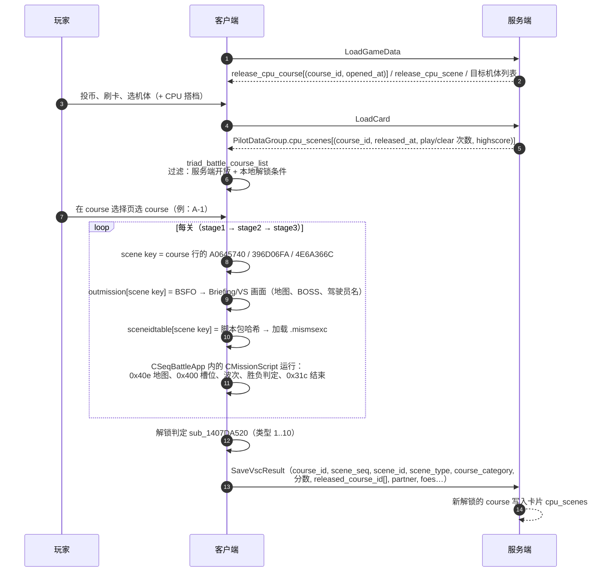
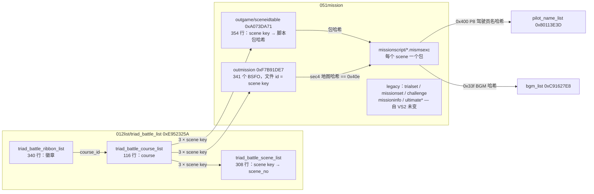
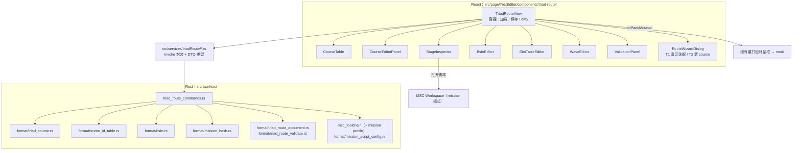

# EXVS2 OB 街机（トライアドバトル / Triad Battle）Mission 架构全解

**Date:** 2026-09-19
**Status:** 分段标注证据等级（本文以 E1/E2 为主；E3 只引用用户已有的实机笔记；本次研究**没有做任何实机测试**）
**Kind:** 数据格式 + 引擎 ABI + 自制路线改造方案
**Scope:** Over Boost（`E:\OBHK0.3_v27`，`vsac27_Release.exe`）。VS2 / `GX210JPN_27` 只作历史对照。

**Related:**

- 用户实机笔记（Notion 导出）：[Mission 1fe1ebad394d80a8a0fbcc62a3ac0220.html](./Mission%201fe1ebad394d80a8a0fbcc62a3ac0220.html)
- 集成计划：[2026-09-19-triad-mission-route-editor](../superpowers/plans/2026-09-19-triad-mission-route-editor.md)
- MSC 证据协议：[msc-evidence-grade-and-ingame-audit-protocol](../msc-research/msc-evidence-grade-and-ingame-audit-protocol.md)
- MSC 字节码格式：[msc-binary-format-spec](../msc-binary-format-spec.md)
- 机体脚本 syscall 槽位方法（mission 脚本同源）：[exvs-msc-syscall-handler-table](../exvs-msc-syscall-handler-table.md)
- FHM2D 解包 CLI：[fhm2d-extract-cli](../fhm2d-extract-cli.md)

---

## 0. 一页结论

1. **街机 = 数据驱动的 course 列表 + 每关一个 mission 脚本。** 真正决定「有哪些路线、每条路线打哪几关、怎么解锁」的是
   `012list/triad_battle_list/triad_battle_course_list.vgsht2`（包 `0xE952325A`），不是 `051mission/trialset`。
   每个 course 固定引用 **3 个 scene**（F 类只有 1 个），按列 `A0645740 → 396D06FA → 4E6A366C` 依次作为第 1/2/3 关（E2，IDA `sub_1405380A0`）。
2. **scene 是全链路的主键。** 同一个 32 位 scene key 同时是：`triad_battle_scene_list` 的行 id、`051mission/outgame/sceneidtable` 的行 id、
   course 表里的关卡引用、以及 `outmission` 包里对应 BSFO 文件的 **fhm2d 文件 id**（`Item.unk1`）。
   `sceneidtable` 把 scene key 映射到 **mission 脚本包哈希**，游戏据此加载 `0x????????.fhm2d` 里的 `.mismsexc`（E2）。
3. **哈希全部可算。** 包哈希 / scene key 都是「大写名字 + 固定前缀状态」的标准 CRC32：
   脚本包 `state=0xAA71E366`，scene key `state=0x7B60F97C`（OBHK 343 个脚本中 342 个命中，另 1 个名字未知；GX 201/201 命中，E2）。
   所以新增 scene 时可以给出与官方命名规则一致的新哈希。
4. **mission 脚本是 MSC 的第五种脚本类 `VDK::GAM::CMissionScript`**，嵌在 `CSeqBattleApp`（`+1184`）里，**只装了 `sys_0` 一个 syscall**，
   由 `sub_140DBEE10` 分发约 150 个子命令（`0x1xx`–`0x8xx`）；官方 343 个脚本实际用到其中 77 个（E2）。
   脚本能配置：地图、各队 cost、胜负条件、BGM、最多 256 个单位槽位（坐标/朝向/初始动作/等级/驾驶员名/阵营……）、
   波次刷怪（按存活数 / 时间 / 指定槽位 HP%）、复活规则、提示消息、战斗结束。
5. **`0x400`（单位槽位定义，51 个参数）里有 11 个参数 OB 根本不读**（`P9/P10/P12/P15/P18/P19/P22/P23/P24/P40/P41`），
   包括看起来像「HP%/攻击%」的 `P22/P23`（E2，handler 反汇编逐条核对）。改它们在 OB 里没有任何效果。
6. **解锁机制：** course 表的 `52751120` 列是「解锁条件类型」，客户端在每局结束时判定（`sub_1407DA520`，10 种类型）。
   OB 里除了 A/B/C-99 之外，其余 course 全部是类型 0：开放与否完全由服务端 `LoadGameData.release_cpu_course` 控制。
   **A-99 / B-99 / C-99 是类型 3、参数 2**：本局已通关计数 +1 ≥ 2 时解锁，对应「打 2 轮（每轮 3 关，共 6 关）后出现第三个大关，前 2 关普通、第 3 关 boss」（判定结构 E2，计数语义 E1，待实机）。
   解锁结果通过 `SaveVscResult.released_course_id` 上报，服务端持久化到卡片的 `cpu_scenes`。
7. **OB 真值是 `E:\OBHK0.3_v27`。** `E:\XB\GX210JPN_27` 的 051mission 417 个文件与 VS2 解包 **逐字节相同**，是更早的数据；
   OBHK 的 sceneidtable 有 354 行（GX 212）、outmission 341 个 BSFO（GX 200）、343 个脚本（GX 201），且 200 个同名脚本全部被重编译过（模板升级）。
8. **最稳的「新增路线」路径：激活休眠槽位。** OBHK 里有 27 个 triad scene（`a022–a024 / b023–b024 / c022–c024 / d015`）
   脚本包 + sceneidtable 行 + BSFO 都在，只缺 `scene_list` 行和 course 行。新增一条 course 只需改 `0xE952325A` 一个包 + 原地改写 3 个脚本与 3 个 BSFO，不引入任何新包哈希。

---

## 1. 数据来源与证据等级

| 来源 | 路径 | 用途 | 备注 |
|---|---|---|---|
| **OB 实际数据（权威）** | `E:\OBHK0.3_v27\data\x64\dplcache_release` | 全部结论的主数据 | 19119 个包；包内**无**源路径表，项目 `fhm2d_extract` 可直接解 |
| OB 早期数据 | `E:\XB\GX210JPN_27\data\x64\dplcache_release` | 对照、名字恢复 | 12020 个包；包内**带**源路径表（`c:\nufw_proj\...`），`fhm2d_extract` 目前解不了（见 §14） |
| VS2 解包 | `E:\XB\解包\vs2\x64\051mission` | 历史对照 | 与 GX 的 051mission 417 个文件逐字节相同 |
| IDA | `E:\OBHK0.3_v27\vsac27_Release.exe`（IDB 同目录） | 引擎 ABI | 与 GX 的 exe SHA-256 不同；本文所有地址都指 OBHK 这个 exe |
| 反编译脚本 | `tmp/mission-research/dec-obhk/*.c`（343 个） | 模板/用法统计 | `tools/mscdec.py` 343/343 成功 |
| 服务端协议 | 本地 POC 工程的 `game_ob_proto.proto` 与服务端实现（**不入库**） | 解锁/上报字段 | 只引用协议字段名，不引用 POC 开发过程 |
| 用户实机笔记 | `docs/mission-research/Mission …html` | E3 旁证 | 坐标/朝向/初始动作/同屏上限等 |

证据等级沿用 [MSC 证据协议](../msc-research/msc-evidence-grade-and-ingame-audit-protocol.md)：
**E0** 推测 · **E1** 单源（数据统计或单个文件读通）· **E2** 跨源（IDA native 读通，或两个独立数据源互证）· **E3** 实机 · **E3-** 实机证伪。

> OBHK 的 `mod/` 目录里有 3754 个加密覆盖（`0x????????.vgsht2`），当前实机环境的加载顺序是
> `mod-dev → mod → dplcache_release`（先加密 `.vgsht2`，后明文 `.fhm2d`）。
> 本文涉及的 mission 包在 `mod/` 里**都没有**覆盖，唯一例外是公共包 `0xCB665375`（含 `100system/mode_adjust/*`）。

---

## 2. 玩家流程 ↔ 数据流程



对应你描述的现象：

- 「投币选好机体后，CPU 模式或等待对战中都能玩」：同一套 course / scene 数据；序列类是 `CAcSecPcbCourseBattle`（RTTI `.?AVCAcSecPcbCourseBattle@SEQ@@`，vftable `0x14137D0C0`），
  「等待对战时插入 CPU 战」的调度逻辑本次没有追踪（E1）。
- 「每个轮回 3 关」：course 表每行 3 个 scene；F 类 course 只有第 1 关。
- 「打 2 次轮回后解锁第三个大关，出现在 mission 页面，前 2 关普通、最后 boss」：A-99 / B-99 / C-99（course_id 100/101/102，
  展示机体 `654001001 / 654003001 / 654002001`），解锁类型 3、参数 2。三个 `x099_003` 的 BSFO 场景类别都是 3（Boss）、
  boss 在槽位 2、脚本胜利标志 `0x2` 且目标数 1（E2：BSFO 与脚本互证）；前两关以歼灭战为主，但 `a099_002`、`b099_001` 也是「击破 1 个目标」的 Target 关。

---

## 3. 总体结构



---

## 4. 文件与包清单（OBHK）

### 4.1 与街机直接相关的包

| 包哈希 | 内容 | 说明 |
|---|---|---|
| `0xE952325A` | `012list/triad_battle_list/{triad_battle_course_list, triad_battle_scene_list, triad_battle_ribbon_list}.vgsht2` | **路线主表**。OB 期间有更新 |
| `0xA073DA71` | `051mission/outgame/sceneidtable.vgsht2` | scene key → 脚本包哈希；OB 有更新 |
| `0xF7B91DE7` | `051mission/outmission/*_out.dat`（341 个 BSFO） | 加载 / 简报画面数据；OB 有更新 |
| 343 个脚本包 | `051mission/missionscript/<name>.mismsexc` | 每个包 1 个文件；包哈希 = `CRC(0xAA71E366, NAME)` |
| `0x80113E3D` | `051mission/pilot_name_list/pilot_name_list.vgsht2` | 驾驶员名（混淆字符串），`0x400 P8` 引用；OB 有更新 |
| `0x3AE3FB89` | `051mission/difficulty_table/{inner,operator}_difficulty_table.vgsht2` | 难度倍率矩阵（32×20 浮点）与店铺难度映射（8×10）；OB 有更新 |
| `0x367CF942` | `012list/boss_list/boss_list.vgsht2` | 14 个 boss 条目（机体名、驾驶员名、字符串等）；OB 有更新 |
| `0xFF832E7F` | `041cpm/for_outgame/foroutgamecharacterparam_{playable,boss,zako}.vgsht2` | 外部画面用的角色参数（含 boss / 杂兵） |
| `0xCB665375` | 公共包：`100system/mode_adjust/{triad_adjust_*, enemy_adjust_param, …}`、`011camera/parameter/03cpubattle.vgsht2` 等 | triad 加成 / 技能 / 编辑参数；**被 `mod/0xCB665375.vgsht2` 覆盖** |
| `0xC91627E8` | `012list/bgm_list/bgm_list.vgsht2` | BGM 哈希来源 |

### 4.2 051mission 目录全貌（10 个子目录）

| 子目录 | 文件 | 性质 |
|---|---|---|
| `missionscript/` | `000triad_battle_<cat><NNN>_<MMM>[_rN].mismsexc`、`100training_mode_001`、`300standard_battle_00`、`900developloca_test_1..5` | **mission 脚本（MSC）** |
| `outmission/` | 同名 `_out.dat`（BSFO） | 简报 / VS 画面描述 |
| `outgame/` | `sceneidtable.vgsht2` | scene → 脚本包 |
| `pilot_name_list/` | `pilot_name_list.vgsht2` | 驾驶员名 |
| `difficulty_table/` | `inner_difficulty_table`、`operator_difficulty_table` | 难度 |
| `missionset/` | `missionsetidtable.vgsht1`、`scenariosetidtable.vgsht1`、`releasescenarioidtable.vgsht1`、`ultimatemissionset.vgsht2` | 遗留：剧情任务集（名字多为「ぶいがんだむ」「ミッションテスト」等占位） |
| `trialset/` | `routesetidtable`、`missionbrancsetidtable`、`trialmissionsetidtable`、`trialmissonifidtable`、`trialrouteifidtable`（均 vgsht1） | 遗留：MBON 式分支路线图（见 §11） |
| `challenge/` | `challengesetidtable.vgsht1` | 遗留 |
| `missioninfo/` | `missioninfotable.vgsht2` | 遗留 |
| `ultimatecashertable/` | `ultimatecashertable.vgsht2` | 遗留 |

**「遗留」的判断依据：** `trialset`、`missionset`（含 `ultimatemissionset`）、`challenge`、`missioninfo`、`ultimatecashertable` 这 5 个目录的文件在 GX（= VS2）与 OBHK 之间逐文件相同，OB 更新期间完全没被维护；
而街机真正在用的表（course/scene/ribbon/sceneidtable/outmission/脚本/驾驶员名/难度/boss）全都被更新过。
它们仍在启动预加载列表里（`sub_1406D8EB0`：`0xA073DA71, 0x036B9E67, 0xCB665375, 0x37AB517D, 0xC789EB4B, 0xB3C28017, 0x89EDD580, 0x11B8D5D8, 0x1A3B5671, 0x264D1CA7, 0xF7B91DE7, 0xC91627E8, 0x3AE3FB89, 0x80113E3D …`），
但 OB 是否还有消费者没有追踪（E0）。

### 4.3 命名规则

`000triad_battle_<cat><NNN>_<MMM>[_rN]`：

- `<cat>`：`a`..`f` = course 分类 A..F（course 表 `FFFF823B` = 1..6）。
- `<NNN>`：分类内 course 编号（`4D5EDF9B`），`099` = X-99 boss course。
- `<MMM>`：关卡序号 `001..003`（F 类只有 `001`）。
- `_rN`：同一关的变体脚本，由 course 表的「变体行」引用（§6.4）。

---

## 5. ID 与哈希体系

### 5.1 fhm2d 包内文件 id

fhm2d meta 的 SubFileStructure `Item` 条目（`0x19` 字节）里，`+1` 处的 4 字节 `unk1` 就是**文件 id**，`+5` 是 `file_index`。
`outmission` 包里 341 个 `Item.unk1` 全部等于对应的 scene key（341/341，E2：包 meta 与 sceneidtable 互证）。
项目 `fhm2d.rs` 把它保留为 `unk1` 十六进制字符串，重打包时原样写回。

meta 头 `+0x10` 是 SubFileStructure 的起始偏移。GX 的包在 structure 之后还跟着一张源路径字符串表（`c:\nufw_proj\vsac\mk_rom\product\exvs2\app\data\x64\...`），OBHK 的包没有。

### 5.2 CRC32「前缀状态」模型（E2）

所有这些 32 位 id 都满足：

```text
h = crc32_update(state, UPPER(name)) XOR 0xFFFFFFFF
crc32_update = 标准反射 CRC-32（poly 0xEDB88320）的逐字节更新，不做初始/结尾取反
state = 该 id 家族的固定前缀状态（相当于某个固定前缀字符串已经喂进寄存器）
```

| 家族 | state | 验证 |
|---|---|---|
| mission 脚本包哈希 | `0xAA71E366` | GX 201/201；OBHK 342/343（剩下 1 个 `0x0C739728` 名字未知） |
| scene key | `0x7B60F97C` | GX 201/201；OBHK 342/343 |
| trialset `missionbrancsetidtable` 行 id | `0xFC76F476` | 177/177（遗留表） |
| trialset `trialmissionsetidtable` 行 id / w1 | `0x348AD4A4` / `0xD5AD2161` | 154/177、120/175（遗留表） |

发现过程：同长度名字只差最后一位数字时，两个包哈希的 XOR 恰好等于 CRC-32 表项（`0x67AF23FA ^ 0xFEA67240 = T[3] = 0x990951BA`），
说明是 CRC 线性结构；前缀字符串无法还原，但前缀对输出的影响完全等价于一个固定寄存器状态，所以只要状态已知就能为新名字算出同规则的哈希。
参考实现（研究用，Python）：

```python
POLY = 0xEDB88320
TABLE = []
for i in range(256):
    c = i
    for _ in range(8):
        c = (c >> 1) ^ POLY if c & 1 else c >> 1
    TABLE.append(c)


def family_hash(state: int, name: str) -> int:
    reg = state
    for b in name.upper().encode("ascii"):
        reg = TABLE[(reg ^ b) & 0xFF] ^ (reg >> 8)
    return reg ^ 0xFFFFFFFF


assert family_hash(0xAA71E366, "000triad_battle_a001_001") == 0x67AF23FA  # script package
```

> 游戏运行时**不重新计算**这些哈希：scene key、包哈希都是写死在表里的值。自己选一个不冲突的任意 32 位值同样可用；
> 用同一套规则生成只是为了与官方命名保持一致、避免撞车（E1：结构推断，未实机）。

### 5.3 表格格式

- **vgsht2**（magic `0xCDABB8A9`）：`0x20` 头 + 列哈希（有序）+ 列描述（offset/flags/dtype）+ 行 id（有序，二分查找）+ 行数据 + 字符串池。
  dtype：1 = int32，2 = uint32，5 = float，7 = 字符串偏移（8 字节）。
  字符串经过混淆，解码/编码见 `src-tauri/src/format/obf_string.rs`。项目通用读写：`src-tauri/src/format/param_bin_format.rs`。
- **vgsht1**（magic `0xCEABB8A9`）：`0x20` 头 + 有序 id 数组 + 定长记录 + 字符串池（同样混淆）。

**行 id 必须升序**：两种表都靠二分查找取行，新增行必须插在正确位置。

---

## 6. `triad_battle_course_list`：course 表（核心）

49 行（GX）→ **116 行（OBHK）**，23 列，行宽 96。行 id（如 A-1 = `0x08C459FF`）是任意但有序的 id，代码按行 id 取行，按 `course_id` 列反查行（`sub_140538520`）。

### 6.1 列定义

| 列哈希 | 含义 | 取值 | 证据 |
|---|---|---|---|
| `1111D441` | **course_id**（服务端 / 协议里的 `course_id`） | A-1..A-15 = 1..15，B-1..B-15 = 16..30，C-1..C-15 = 31..45，D-1..D-14 = 46..59，A-16..18 = 61..63，B-16..18 = 64..66，C-16 = 67，E-1..E-14 = 80..93，A/B/C-99 = 100..102，F-1..F-14 = 200..213，A-19..21 = 250..252，B-19..22 = 256..259，C-17..21 = 262..266 | E2（列 getter `sub_140537B60` + 与协议 / 徽章表互证） |
| `C6F64EF0` | 名称（混淆字符串，如 `A-1`） | | E2 |
| `FFFF823B` | 分类 1..6 = A..F | | E1（与名称一一对应） |
| `4D5EDF9B` | 分类内编号（X-99 = 50） | | E1 |
| `C2B73C54` | 排序号（= course_id） | | E1 |
| `A0645740` / `396D06FA` / `4E6A366C` | **第 1 / 2 / 3 关的 scene key** | F 类只有第 1 关 | **E2**（`sub_1405380A0` 按此顺序取出） |
| `223655F3` | **初始开放**（1 = 一开始就可选） | OBHK：A-1..5、A-11、B-1..4、C-1..4 | **E2**（`sub_1405374D0` 收集 =1 的 course） |
| `52751120` | **解锁条件类型** 1..10（0 = 无本地条件） | OBHK：只有 X-99 = 3 | **E2**（`sub_1407DA520` switch） |
| `171C2E4F` / `8E157FF5` | **解锁条件参数** arg0 / arg1 | X-99：(2, 0)；GX 的普通 course：(前置 course_id, 0) | **E2**（`sub_140537C00` 返回这两列） |
| `40521FF4` | **变体号**（0 = 基础行；>0 = 同一 course 的变体行） | 1..7 | E1 |
| `7ABE42F2` | 金牌分数（通关高分线） | 40000..270000 | E1（与徽章表阈值一致） |
| `BB6B6FEF` | 星级（难度展示）1..5 | | E1 |
| `2D12A4C8` / `6F3B9D53` / `8135FC7F` / `F632CCE9` | course 选择页展示的 4 台机体 id | | E1 |
| `83B19F06` | 分组：A/B/C/F = 1，X-99 = 2，D / E = 3..9 | 7 个取值，疑似按星期轮换 | E0 |
| `1F5169DC` / `6856594A` | 仅 E 类：`800000000 + cost`（1500..3000） | 疑似 E 类限定机体 cost 区间（下限 / 上限） | E0 |
| `FE8837C1` | 恒为 1 | | — |

### 6.2 解锁判定（`sub_1407DA520`，E2）

每局结束时遍历 course 列表，对每个 course：

1. 取 `course_id`，要求它在「开放列表」里（服务端下发的 `release_cpu_course`，E1：结构推断）；
2. 取 `52751120` 类型和 `[171C2E4F, 8E157FF5]` 参数，按类型派发：

| 类型 | handler | 判定（已读通的两种） |
|---|---|---|
| 1 | `sub_1407D9DD0` | 本局**刚通关**的 course == arg0，且通关标志成立 → 解锁（E2） |
| 2 | `sub_1407D9F90` | 未读 |
| 3 | `sub_1407D9E50` | 本局通关，且「某通关计数 + 1 ≥ arg0」→ 解锁（判定结构 E2；计数是 `*(ctx+3416)+276`，语义 E1） |
| 4、9 | `sub_1407DA0C0` | 未读 |
| 5 | `sub_1407DA020` | 未读 |
| 6 | `sub_1407D9ED0` | 未读 |
| 7 | `sub_1407DA2C0` | 未读 |
| 8 | `sub_1407DA210` | 未读 |
| 10 | `sub_1407DA350` | 未读 |

解锁的 course 被压进 `ctx+6504` 列表，最终写入 `SaveVscResult.released_course_id`。

**版本差异：** GX 的 course 表把 A-6..A-12、B-5..B-12、C-4..C-10 设成类型 1（通关前置 course 解锁：A-6 需要 A-1、A-7 需要 A-2……）；
OBHK 把它们全部改成类型 0，改由服务端按时间（`opened_at`）开放。两个版本都保留了 X-99 = 类型 3 / 参数 2。

### 6.3 分类与编号（OBHK）

| 分类 | course | scene_no 区间 | 特点 |
|---|---|---|---|
| A (1) | A-1..A-21、A-99 | 1..45、200..208、221..229、511..513；变体 300、304..308 | A-11 默认开放；A-15 有整套 `_r1` 变体 |
| B (2) | B-1..B-22、B-99 | 46..87、209..217、239..250、521..523；变体 301、303 | B-14 / B-15 共用 scene_no 85..87（数据怪癖：scene_no 不要求唯一） |
| C (3) | C-1..C-21、C-99 | 91..135、218..220、257..271、531..533；变体 302 | |
| D (4) | D-1..D-14 | 136..177 | `83B19F06` = 3..9 |
| E (5) | E-1..E-14 | 400..441 | 额外两列 cost 限定；Briefing 对类别 4（E）显示 `2on2` |
| F (6) | F-1..F-14 | 700..713 | **单关**；金牌分 40000（F-3 90000，F-14 99999）；脚本用时间 + boss HP% 分阶段 |

完整 116 行见附录 A。

### 6.4 变体行

同一个 `course_id` 可以有多行，`40521FF4` 区分变体（OBHK 7 行）：

| course | 变体号 | 替换 |
|---|---|---|
| A-2 | 1 | 第 1 关 → `a002_001_r1` |
| A-3 | 5 | 第 3 关 → `a003_003_r1` |
| A-11 | 6 | 第 3 关 → `a011_003_r1` |
| A-15 | 7 | 3 关全部 → `a015_00x_r1` |
| B-4 | 2、4 | 第 1 关 → `b004_001_r1` / `_r2`（变体 2 同时是初始开放） |
| C-4 | 3 | 第 3 关 → `c004_003_r1` |

变体的选取条件未追踪（E0，可能是随机或事件条件）。

---

## 7. scene 相关表

### 7.1 `triad_battle_scene_list`（308 行，E2）

| 列 | 含义 |
|---|---|
| 行 id | scene key |
| `1111D441` | **scene_no**：上报服务端的 `SaveVscResult.scene_id`（数字） |
| `61DF48F7` | 自身 scene key（与行 id 相同，全表 308/308） |

**只有被 course 引用的 scene 才有 scene_list 行**：OBHK 的 308 行与 course 表引用的 308 个 scene key 集合完全相等（E2）。

### 7.2 `triad_battle_ribbon_list`（340 行）

| 列 | 含义（E1） |
|---|---|
| `1111D441` / `79DF9ABC` | 徽章 id |
| `171C2E4F` | 所属 course_id |
| `4AE794E1` | 徽章类型（1 通关 / 2 无伤 / 3 高分 / 4、7 …） |
| `8E157FF5` | 阈值（高分徽章 = 分数） |
| `062F8889` / `6DC044C5` / `B7C0BE46` | 未确认 |

徽章 id 和服务端 `cpu_ribbons`、`released_ribbon_id` 对应；新增 course 不加徽章也不影响游玩（E0，待验证）。

### 7.3 `sceneidtable`（`0xA073DA71`，354 行，E2）

- 行 id = scene key；唯一一列 `7E82C1E7` = 脚本包哈希。读取函数：`sub_1407562E0`（某个类的虚函数，vtable 引用 `0x14136D188`）。
- OBHK：343 行对应的包存在；**11 行悬空**（包不存在，名字长度推算为 20 / 16 字符，字典猜测未命中，E1）；另有 1 行存在但名字未知（key `0x20C5419E` → 包 `0x0C739728`，该脚本没有 `0x400` 槽位、cost 90000、`global8 = 1`，像是由模式注入单位的自由对战类 scene，E1）。
- 被 course 引用的 scene 共 308 个；**未被引用但包 + BSFO 俱全的 triad scene 有 27 个**（§12、附录 B）。

---

## 8. `outmission`：BSFO（简报 / VS 画面描述）

每个 scene 一个 `<name>_out.dat`，在 `0xF7B91DE7` 包里用 **scene key 作文件 id**。Briefing UI（`sub_1409D5B30` 等，flash 路径 `/BF_Briefing_mc/...`、`/BF_Boss01_mc`、`/BF_Boss02_mc`）读取它展开后的结构。

### 8.1 文件头（`0x24` 字节）

| 偏移 | 含义 | 证据 |
|---|---|---|
| `0x00` | magic `BSFO` | E2 |
| `0x04` | `0x00010000`（版本） | E1 |
| `0x08` | 展开后内存大小（= 文件大小 + `byte1(0x0C)` × 28） | E1（全量统计） |
| `0x0C` | 打包计数：byte0 = section1 记录数，byte1 = 附加块数，byte2 = section3 记录数 | E1 |
| `0x10`..`0x20` | 5 个 section 的起始偏移 | E2 |

### 8.2 各 section

| section | 长度 | 内容 | 证据 |
|---|---|---|---|
| 0 | 48（12 × int32） | `[0]=0`、`[1]=1`（己方槽位）；**`[2..4]` = boss 槽位索引**（-1 = 无；Notion 笔记把 `02` 改成 `03 03` 得到双 boss 显示）；`[5..7]` 其他敌方展示槽位；`[8..10]` = -1；`[11]` 位掩码（49/19/1/3/51…，未知） | E1 + 用户 E3 |
| 1 | 16 × N（OBHK N = 11..33，多数 33，未用条目为全 0） | `[0, unit_id, pilot_id, 0]`：画面 / 预加载用的单位与驾驶员（`10101`、`450201` 等是驾驶员 id） | E1 |
| 2 | 496 | 全部为 0（未观察到非零） | E1 |
| 3 | 16 × M（OBHK M = 4..19 = 该 scene 的槽位数） | `[unit_id, flag×4, slot, x]`：每个参战槽位一条；`slot` 与 MSC `0x400` 的槽位一一对应，`x` = 该槽位的 `P13`（GX 个别文件敌方槽位顺序不同） | E1/E2 |
| 4 | 176（44 × int32） | `[0]` **场景类别**（0 Standard / 1 Random / 2 Target / 3 Boss，Briefing `InfoClass_mc`）；`[1]` 0..4；**`[2]` 地图哈希**；**`[3]`/`[5]` 时限 180 秒**；`[4]` 有目标 = 1；`[6]=1`、`[7]=2`；`[12]` float 倍率 1.0 / 2.0；`[13]` 0/2；`[14]` 4/5；`[15]` 9；其余为 0 | 见下 |

跨源校验（OBHK 341 个 BSFO，E2）：

- `sec4[2]` 与同名脚本 `sys_0(0x40e, stage)` 完全相同：**341/341**。
- `sec4[0]` 与脚本胜利条件严格对应：类别 0 ↔ 胜利标志 `0x1`（打光敌方 cost），类别 1/2/3 ↔ 胜利标志 `0x2`（击破目标数）。
  OBHK 分布：0 = 194，1 = 119，2 = 24，3 = 3；F 类 14 个全是 2（Target），E 类 42 个全是 0。

> BSFO 只决定**画面上显示什么**；实际刷什么怪、谁是目标、何时结束全在脚本里。两者不一致游戏不会报错，只是简报与实战对不上。

---

## 9. mission 脚本（`.mismsexc`）

### 9.1 文件格式

标准 EXVS2 MSC 字节码（见 [msc-binary-format-spec](../msc-binary-format-spec.md)），但 header 与机体脚本不同：

| 偏移 | mission 脚本 | 机体脚本 / `msclang` 输出 |
|---|---|---|
| `0x08` | **`FD 02 00 00`（0x2FD）** | `0A 21 AF 16` |
| `0x1C` | 0x19 或 0x16（随文件变化） | 0x16 或 0 |

`tools/mscdec.py` 对 OBHK 343 个脚本全部反编译成功。`tools/msclang.py -i` 重编后**大小一致但不是逐字节相同**：
除了上面两个 header 字段，原版在 `func_2` 这类 `else if (… arg-- …)` 结构里多一个 `0x01` 操作码，msclang 会丢掉它，导致后续偏移整体差 1。
在做出逐字节往返之前，**不要把 msclang 重编的 mission 脚本当作已验证可用**（§14）。

### 9.2 运行时（E2）

| 项 | 地址 / 说明 |
|---|---|
| 类 | `VDK::GAM::CMissionScript`（RTTI `.?AVCMissionScript@GAM@VDK@@`），vftable `0x1415D6908` |
| 构造 | `sub_140DE78B0`：基类 `MSC::CMotionScript`（`sub_14030DDA0`，`a1[4..259]` = 256 个 syscall 槽），再挂 `CFiberExecMainLine` |
| fiber 类 | `CFiberExecMainLine` / `CFiberExecSubLineByteCode` / `CFiberExecSubLineCpp` |
| 宿主 | `anonymous namespace::CSeqBattleApp`（构造 `sub_140DB8F90`），脚本对象在 `+1184` |
| syscall 安装 | `sub_140DE7EF0(script, 0, sub_140DBEE10)` = `handler[0] = sub_140DBEE10`（`sub_140DE7EF0` 全库唯一调用点）：**只有 `sys_0`**，其它 `sys_N` 全为空 |
| 单位槽位表 | `CSeqBattleApp + 36112`，256 × 176 字节（`0x400` 写入，`0x203` 读取生成） |
| 相关字符串 | `Proc_LoadMissionScript`、`Proc_LoadMissionScript_Wait` |

### 9.3 模板结构（OBHK 版本）

官方 343 个脚本共用一个模板，差别只在**配置函数**和**阶段函数**：

```text
main()
  ├─ 初始化 global（各队 cost 默认 1000，其余清零）
  ├─ func_33()                         // setup
  │    ├─ global0 = <第一个阶段函数>
  │    ├─ func_32()                    // ★ 配置函数：地图 / cost / 胜负标志 / BGM / 全部 0x400 槽位
  │    └─ sys_0(0x40d)                 // 配置完成
  ├─ func_16()                         // 0x410 取模式覆盖值 → 0x407 设各队 cost → 0x415 → 记录有 cost 的队伍
  ├─ sys_0(0x802, <func_18 偏移>)      // 启动事件协程：0x32d/0x32e/0x330 取事件；类型 1 = 复活请求 → 再开 func_17 协程
  └─ callFunc3(func_14)                // 每帧 tick

func_14()  每帧
  if func_19():  callFunc3(func_15)    // 胜负已分：0x31c 结束战斗，之后只等 0x34f
  else:          func_25(); (*global0)()   // 处理退场 / 复活，然后执行当前阶段函数

阶段函数（例：a001_001）
  func_34: 等 0x454 == 1 → func_9 部署己方 → func_12(2), func_12(3) 第一波 → 0x453(1) 开战 → 0x33f(BGM) → global0 = func_35
  func_35: 按 global20 分段：0x40f（存活敌机数）<= 1 且延时到（func_2 秒×60 帧）→ 0x355 提示 → func_12(下一槽位)

func_12(slot) = func_10（0x302 开始出场，含子单位）+ func_11（等 0x303 完成，0x335 挂接子单位）+ 0x336(slot) 登记
```

### 9.4 global 角色表

global 编号只在同一版本模板内稳定。OBHK 模板比 GX 多了 `global14/15`，之后的编号整体后移 2：

| 角色 | GX / VS2 | OBHK |
|---|---|---|
| 当前阶段函数指针 | `global0` | `global0` |
| 各队初始 cost（队 0..5） | `global1..6` | `global1..6` |
| 有 cost 的队伍位掩码 | `global7` | `global7` |
| 为 1 时击破不扣 cost（只有未命名 scene `0x20C5419E` 设为 1：该脚本没有任何 `0x400` 槽位，单位由模式注入，cost 90000，失败标志 `0x8`） | `global8` | `global8` |
| 己方「重要单位」被击破上限 | `global10` | `global10` |
| 己方重要单位被击破数 | `global11` | `global11` |
| 胜利所需击破目标数 | `global12` | `global12` |
| 已击破目标数 | `global13` | `global13` |
| OB 新增（传给 `0x415`） | — | `global14`、`global15` |
| **胜利条件标志** | `global14` | **`global16`** |
| **失败条件标志** | `global15` | **`global17`** |
| 复活库存缓存 | `global16` | `global18` |
| **BGM 哈希** | `global17` | **`global19`** |
| 阶段计数 / 延时计时器 | `global18`、`global22` | `global20`、`global24` |

胜负标志位（`func_19..func_24`，E1：模板逻辑读通）：

| 位 | 胜利标志（OBHK `global16`） | 失败标志（OBHK `global17`） |
|---|---|---|
| `0x1` | 只剩己方还有 cost（敌方 cost 打光） | 己方 cost 打光 |
| `0x2` | 已击破目标数 ≥ `global12` | 己方重要单位被击破数 ≥ `global10` |
| `0x4` | 时间到算胜利（生存） | 时间到算失败 |
| `0x8` | `global13 > 0 && global13 >= sys_0(0x349)` —— **但 `0x349` 在 OB 分发表里没有 case，恒返回 0**，此条件实际等于「击破任意一个目标即胜」（E2） | — |

官方数据：OBHK 胜利 / 失败标志只出现 `(0x1, 0x5)` 与 `(0x2, 0x5)` 两种组合，即「歼灭战」与「击破目标战」，失败都是「cost 打光或时间到」。

### 9.5 `sys_0(0x400, …)`：单位槽位定义（51 个参数）

handler `sub_140DC45A0` 把参数写进 `CSeqBattleApp+36112 + 176*slot`。下表的 `P0` 是紧跟在 `0x400` 后的第一个参数（= Notion 笔记里的 arg2）。
「落点」是槽位结构里的字节偏移；「死参数」表示 handler 根本不读（E2，反汇编逐条核对）。

| 参数 | 落点 | 含义 | 官方取值 | 证据 |
|---|---|---|---|---|
| P0 | — | 槽位号 0..255（官方最多用到 18） | 0 = 玩家，1 = CPU 搭档，2+ = 其他 | E2 |
| P1 | `+0x01` bool | 未知 | 恒 0 | E2（写入）/ E0（语义） |
| **P2** | `+0x38` | **机体 id**（`mst_mobile_suit_id`）；模式可按槽位覆盖（`+743416` 表），玩家 / 搭档的占位 id 会被实际选择替换 | | E2 |
| **P3** | `+0x08` | **阵营**：0 己方，1 敌方（`0x402` 读取） | | E2 |
| P4 | `+0x04` bool | 未知（搭档恒 1，少数敌机 1） | | E1 |
| **P5** | `+0x05` bool | **CPU 搭档标志**：官方数据中 **只有槽位 1** 为 1（340/340） | | E1 |
| P6 | `+0x03` bool | 未知（176 个敌方槽位为 1） | | E1 |
| P7 | `+0x06` bool | 显示驾驶员名；P7=1 且 P8=0 时由模式回调按机体取默认驾驶员（写 `+0x0C`） | 搭档恒 1 | E2（逻辑）/ E1（语义） |
| **P8** | `+0x10` | **驾驶员名哈希**（`pilot_name_list` 的行 id，如 `0x40B0E111` = ミューディー） | | E2（数据互证） |
| P9 | — | **死参数** | 多为 1 | E2 |
| P10 | — | **死参数** | 0 | E2 |
| P11 | `+0x14` | 经 `dword_1415CF9F8[P11]`（< 14）映射后送入生成请求 | 恒 0 | E2 |
| P12 | — | **死参数**（数据里 99/90/80…） | | E2 |
| P13 | `+0x2C`（可被 `+743480` 覆盖） | 未知序号，与 BSFO section3 的 `x` 相同 | 0..3 | E2（互证）/ E0（语义） |
| P14 | `+0x30` | 未知（敌方多为 1） | 0/1/2/4 | E0 |
| P15 | — | **死参数** | | E2 |
| P16 | `+0x18` | 等级类 0..9（叠加加成后封顶 9） | | E2（封顶逻辑）/ E0（具体属性） |
| P17 | `+0x1C` | 等级类 0..9（同上） | | 同上 |
| P18 | — | **死参数** | | E2 |
| P19 | — | **死参数** | | E2 |
| P20 | `+0x28` / `+0x20` | < 10：写 `+0x28`；≥ 10：`+0x20 = P20`、`+0x28 = 5`。己方恒 5，敌方 0..9 与 11..23 | | E2（分支）/ E1（推测为 AI 等级 / 特殊 AI 编号） |
| P21 | `+0x24` | 等级类 0..9（叠加加成后封顶 9） | | E2 / E0 |
| P22 | — | **死参数**（数据 100/70/80…，看起来像百分比，但 OB 不读） | | E2 |
| P23 | — | **死参数**（数据 100/80/120/150…） | | E2 |
| P24 | — | **死参数** | 恒 100 | E2 |
| P25 | `+0x7C` | 未知 | 0/1/21 | E0 |
| P26 | `+0x5C` bool | 未知 | 0 | E0 |
| P27 | `+0x74` | 未知（己方恒 4） | | E1 |
| P28 | `+0x70`（度 → 弧度） | 第二套朝向 | 0/180 | E2（换算）/ E0 |
| P29 | `+0x78` | 未知 | 0 | E0 |
| P30..P32 | `+0x60` vec3 | 第二套坐标 | 0 | E2 / E0 |
| **P33** | `+0x02` bool | **使用外部逐槽坐标表**（`+743544`）代替 P34..P36 | | E2 |
| **P34..P36** | `+0x40` vec3 | **坐标 X / Y / Z** | | E2 + 用户 E3 |
| **P37** | `+0x54` | **初始动作**：0 不动，1 朝向跑，2 朝向飞，3 飞一下，4 翻身（用户笔记） | 官方 0/2 | E2 + 用户 E3 |
| **P38** | `+0x50`（度 → 弧度） | **朝向角** | 0/45/90/…/315 | E2 |
| **P39** | `+0x58` | **初始动作持续帧数** | 1/60/80… | E2 + 用户 E3 |
| P40 | — | **死参数** | | E2 |
| P41 | — | **死参数** | | E2 |
| P42 | — | ≠ 0 时启用下面 4 组附加对 | OBHK 78 次 | E2 |
| P43..P50 | `+0x90[i]` / `+0xA0[i]` | 4 组 `(哈希, 值)`，值多为 2 | | E2（落点）/ E0（语义） |

额外逻辑：槽位 > 1 且机体 id 在 `+743648` 列表里时，`+0x24/+0x18/+0x1C` 会各加一个加成值（封顶 9），`+0x34` = 加成值。
该列表疑似服务端下发的「目标 / 通缉机体」（`LoadGameData.mst_mobile_suit_id`，E1）。`sys_0(0x458, slot, v)` 可以直接写 `+0x34`。

**同屏上限：** 用户实机笔记记录「玩家 2 台 + 敌方 12 台正常机体」是稳定上限（E3，用户）；槽位数组本身是 256。

### 9.6 `sys_0` 子命令目录

分发函数 `sub_140DBEE10`。`a2[0]` = `CSeqBattleApp`，`a4[0]` = 子命令。等级说明：**E2** = handler 已读通；**E1** = handler 地址已知，语义来自官方模板的一致用法；**E0** = 仅知道存在。

#### 流程 / 协程

| 子命令 | handler | 语义 | 等级 |
|---|---|---|---|
| `0x800` | `sub_140DE7C80` | 让出一帧（`while(!cond) sys_0(0x800);` 等待惯用法） | E2 |
| `0x801` | — | 空操作 | E2 |
| `0x802` | `sub_140DE7F00` | 在字节码偏移 `a4[1]` 处启动子协程（sub line），后续参数传入 | E2 |
| `0x803` | `sub_140DE7BB0` / `sub_140DE7B90` | 结束当前子协程 | E2 |
| `0x880`..`0x882` | — | 调试标志 / 调试值 | E2 |

#### 配置（`0x4xx`）

| 子命令 | handler | 语义 | 等级 |
|---|---|---|---|
| `0x400` | `sub_140DC45A0` | 槽位定义（§9.5） | E2 |
| `0x401` / `0x402` / `0x403` | 内联 | 读槽位的机体 id / 阵营 / 已定义标志 | E2 |
| `0x406` | 内联 | 读队伍剩余 cost | E2 |
| `0x407` | `sub_140DC4500` | 设队伍 cost `(队, 新值, 旧值)` | E1 |
| `0x408` | `sub_1405D9990` | 未知 | E0 |
| `0x409` / `0x40e` | 内联 | 读 / **设地图哈希**（`+36096`）；BSFO `sec4[2]` 341/341 一致 | E2 |
| `0x40a` | `sub_140DC4BE0` | 单位是否为「重要单位」（计入胜负） | E1 |
| `0x40b` / `0x40c` | 内联 | 设 / 查 `+81468[i]` | E0 |
| `0x40d` | 内联 | 配置完成（`+1169 = 1`） | E2 |
| `0x40f` | 内联 | 读 `+81448`：存活敌机数（波次触发） | E1 |
| `0x410` | 模式虚函数 `+64` | 取模式对队伍 cost 的覆盖值（非 0 则替换脚本值） | E1 |
| `0x411` | 内联 | 时间到判定（全局时限 `+180864`、已过 `+180860`） | E2 |
| `0x414` | 内联 | 读队伍计量表 `+180956` | E1 |
| `0x415` | `sub_140DC42E0` | OB 新增：按被击破单位的 cost 档（1500/2000/2500/3000 或 750..1500）给队伍计量表加值 | E1 |
| `0x453` / `0x454` | 内联 | 设 / 读开战同步标志（`0x454 == 1` 后部署，部署完 `0x453(1)`） | E1 |
| `0x458` | 内联 | 设槽位 `+0x34` | E2 |
| `0x459` | 内联 | 已过帧数（`0x1518` = 90 秒） | E2 |
| `0x45a` | `sub_140DC4190` | 指定槽位单位的 HP%（F 类 boss 分阶段用） | E1 |
| `0x412` / `0x413` / `0x450`..`0x452` / `0x455` / `0x456` | 见分发表 | 未使用 | E0 |

#### 单位实例（`0x2xx`）

| 子命令 | handler | 语义 | 等级 |
|---|---|---|---|
| `0x203` | `sub_140DC52E0` | 按槽位定义生成单位实例，返回 handle；随后 `sub_140DC7B00` 加载机体资源与 HUD | E2 |
| `0x207` | `sub_140DC5FD0` | 移除 handle（从各列表删除） | E2 |
| `0x208` | `sub_140DC4E40` | handle 资源就绪 | E1 |
| `0x20a` | 内联 | 玩家操作的 handle（`sys_0(0x30d, sys_0(0x20a))` = 玩家队伍） | E1 |
| `0x20b` | 内联 | handle → 槽位号 | E2 |
| `0x20c` / `0x20d` | 内联 | 已生成 handle 数 / 第 i 个 | E2 |
| `0x20e` | `sub_140DC4FE0` | handle 状态（模板用于跳过） | E0 |
| `0x212` | 内联 | 槽位号 → handle | E2 |
| `0x213` / `0x214` | `sub_140DC5D90` / `sub_140DC60B0` | 复活库存模式下的敌方退场处理（`0x214`）/ 子单位相关 | E1 |

#### 战斗角色（`0x3xx`）

| 子命令 | handler | 语义 | 等级 |
|---|---|---|---|
| `0x302` / `0x303` | `sub_140DC18C0` / `sub_140DC25E0` | 开始出场（含 HUD）/ 出场完成 | E1 |
| `0x304` | `sub_140DC2C20` | 把 handle 放到出生点（含朝向计算） | E1 |
| `0x306` / `0x307` | 内联 | 场上角色数 / 第 i 个 | E2 |
| `0x308` / `0x309` | 内联 | 退场（待处理）角色数 / 第 i 个 | E1 |
| `0x30a` / `0x30b` | `sub_140DC31A0` / `sub_140DC16E0` | 执行复活 / 角色状态（`== 0x1e` 可复活） | E1 |
| `0x30c` / `0x30d` / `0x30e` | `sub_140DC1410` / `sub_140DC17D0` / `sub_140DC14F0` | 角色 cost / 队伍 / 「是否主机」标志 | E1 |
| `0x313` | `sub_140DB0770` | 复活请求协程里调用（语义未明） | E0 |
| `0x31c` | `sub_140DC0E80` | **结束战斗** `(结果 0..3, 计时标志, 队伍)` → 全局结算 `sub_1405D5470` | E2 |
| `0x320` | `sub_140DC5BD0` | 复活请求里按机体创建实例 | E0 |
| `0x324` / `0x325` | 内联 | 设 / 读角色的「允许复活」字节（`+92`） | E1 |
| `0x32d` / `0x32e` / `0x330` | 内联 | 事件队列：类型 / 负载 / 出队 | E1 |
| `0x331` | `sub_140DC1FB0` | 复活请求的 id 转换 | E0 |
| `0x333` / `0x335` / `0x353` / `0x354` | 见分发表 | 子单位（每个角色最多 2 个）查询 / 挂接 | E1 |
| `0x336` | `sub_140DC2A30` | 把槽位登记为已部署 | E1 |
| `0x338` / `0x339` | `sub_140DC1600` / `sub_140DC3C30` | 复活可用判定 / 执行扣除 | E1 |
| `0x33b` | `sub_140DC3670` | 标记角色已处理（与 `0x342` 成对） | E1 |
| `0x33f` | `sub_140DC2840` | **切 BGM** `(bgm 哈希[, 淡入 ms，默认 2000])` | E2 |
| `0x340` / `0x341` / `0x342` | `sub_140DC2750` / `sub_140DB6450` / `sub_140DC3940` | 已处理状态 / cost 条显示比例（/1000）/ 设已处理 | E1 |
| `0x349` | **无 case** | 恒返回 0 | E2 |
| `0x34e` / `0x34f` | 模式虚函数 `+96` / `+128` | 队伍判定 / 战后等待完成 | E0 |
| `0x350` / `0x351` / `0x352` | 内联 | 复活库存模式开关 / 读 / 写剩余次数（VS 画面「2回再出撃可能」） | E1 |
| `0x355` | `sub_140DC28E0` | 对某槽位的单位弹出消息 / cut-in `(槽位, 消息哈希)` | E1 |
| `0x356` | `sub_140DC2570` | 复活相关判定 | E0 |

#### 通用工具（`0x6xx`）

| 子命令 | 语义 | 等级 |
|---|---|---|
| `0x601` / `0x602` / `0x603` | 脚本私有 64 × 128 int 数组：批量写 / 加 / 读 | E2 |
| `0x604` | 清空 / 初始化列表（`sub_140DC6620`） | E1 |
| `0x605` | popcount | E2 |
| `0x606` | 最低置位的位序号 | E2 |
| `0x607` / `0x608` / `0x609` | 共享 16 × 32 int 数组：写 / 加 / 读 | E2 |
| `0x600` / `0x60a` | 模式虚函数 / `sub_140DC66B0` | E0 |

完整调用频次见附录 C。

### 9.7 脚本能配置什么（总结）

| 能力 | 手段 |
|---|---|
| 地图 | `0x40e`（地图哈希；用户笔记里有 19 个地图哈希对照） |
| 各队 cost | `global1..6` → `0x407`；模式可用 `0x410` 覆盖 |
| 胜负条件 | 胜利 / 失败标志位 + `global10`/`global12`；`0x31c` 手动结束 |
| BGM | `0x33f`，可按阶段 / HP 切换 |
| 单位 | `0x400`：机体、阵营、坐标、朝向、初始动作、驾驶员名、等级、AI、外部坐标表 |
| 出场节奏 | `func_12(slot)` 组合，按存活数（`0x40f`）、时间（`0x459`、延时计数）、HP%（`0x45a`）触发 |
| 复活 | 事件协程 + `0x324`/`0x325`/`0x338`/`0x339`/`0x350..0x352` |
| 目标 / 重要单位 | `0x40a` 判定 + `global12/13`、`global10/11` |
| 演出 | `0x355` 消息、BSFO 的 boss 标记 |
| 自定义状态 | `0x601..0x609` 数组、脚本 global |

**做不到的（或未证实的）：** 脚本不能直接改 course 结构、不能决定简报画面（那是 BSFO 的事）、不能改服务端解锁。

### 9.8 常见关卡模式（官方实例）

| 模式 | 写法 | 例 |
|---|---|---|
| 歼灭战 | 胜利 `0x1`、失败 `0x5`；分波 `0x40f <= 1` 刷下一波 | `a001_001` |
| 击破目标（boss） | 胜利 `0x2`、`global12 = 1`；boss 槽位 `0x40a` 为真 | `a001_003`、`b099_003` |
| 定时 + HP 分阶段 | `0x459 >= 0x1518`（90 秒）进下一段；`0x45a(2) >= 50` 刷援军；`0x45a(2) <= 33` 切 BGM | `f001_001` |

---

## 10. 服务端 / 协议侧

| 消息 | 字段 | 作用 |
|---|---|---|
| `LoadGameData` | `release_cpu_course[(course_id, opened_at)]` | 服务端开放的 course（本地参考实现开放 1..212 与 250..515） |
| | `release_cpu_scene[]` | scene 级开放（未观察到用法） |
| | `mst_mobile_suit_id[]` | 目标机体列表（与 `0x400` 的等级加成列表疑似同源，E1） |
| | `weekly_rank_info` | 周排行 course |
| `LoadCard.PilotDataGroup` | `cpu_scenes[(course_id, released_at, total_play_num, total_clear_num, highscore)]` | 卡片级 course 解锁 / 成绩 |
| | `cpu_ribbons[]`、`total_triad_score`、`total_triad_wanted_defeat_num`、`total_triad_scene_play_num` | 徽章与统计 |
| `SaveVscResult.PlayResultGroup` | `course_id`、`scene_seq`、`scene_id`（= scene_no）、`scene_type`、`course_category`、`course_score`、`scene_score`、`course_clear_flag`、`course_clear_time` | 每关上报 |
| | `released_course_id[]` | **客户端算出的新解锁 course** |
| | `partner`（CPU 搭档等级明细）、`foes[(机体, wanted_ms_flag, target_ms_flag, down_num)]` | 对手 / 搭档记录 |

新增 course 时，服务端必须：①把新 `course_id` 放进 `release_cpu_course`；②（可选）给 Web UI / 排行配置名字、徽章、金牌分。

---

## 11. 遗留系统（自 VS2 未变）

### 11.1 `trialset`：MBON 式分支路线图

- `routesetidtable`（256 行、30 行非空）：`[路线号, 分类 0..3, 等级 1..4, 0, 最大深度 4..8, 节点数, 分数/时间阈值…, 根节点]`。
- `missionbrancsetidtable`（177 节点）：`[节点, trialmission, 下一节点 A, 下一节点 B, 节点号, 深度, 类型, …]`。
  解出 18 条 route，每条 5..19 个节点、最深 8 层，有分支与 EX 节点。
- `trialmissionsetidtable`（177 行）、`trialmissonifidtable` / `trialrouteifidtable`（条件表：`[类型, 参数个数, "参数列表字符串"]`）。
- 节点 id 可用 CRC 模型还原为 `…NNN_MMM` 坐标（§5.2），但**与现有 scene 名对不上**，与街机的 3 关 course 结构不同。

结论：这是旧版 Trial 模式的数据，OB 街机不走它（E1：数据未维护 + 结构不匹配；消费者未追踪）。

### 11.2 其它

| 表 | 内容 | 状态 |
|---|---|---|
| `missionset/*` | 剧情任务集（名字「ぶいがんだむ」「【ガンダム大地に立つ】」「ミッションテスト」…） | 遗留 |
| `challenge/challengesetidtable` | 挑战任务集 | 遗留 |
| `missioninfo/missioninfotable` | 26 行 5 列（时间 72000/36000/10800、分数、条件） | 遗留 |
| `ultimatemissionset` / `ultimatecashertable` | 终极任务 / 兑换 | 遗留 |
| `100training_mode_001`、`300standard_battle_00`、`900developloca_test_*` | 训练 / 标准 / 开发测试脚本 | 有 sceneidtable 行，无 course 引用；训练模式走自己的原生流程 |

---

## 12. 休眠资源：可直接复用的 scene

OBHK 中「脚本包存在 + sceneidtable 行存在 + BSFO 存在，但没有 scene_list 行、也没被任何 course 引用」的 triad scene：

| 组 | scene | 按编号规律对应的 course_id |
|---|---|---|
| A-22 / A-23 / A-24 | `a022_001..003`、`a023_*`、`a024_*` | 253 / 254 / 255 |
| B-23 / B-24 | `b023_*`、`b024_*` | 260 / 261 |
| C-22 / C-23 / C-24 | `c022_*`、`c023_*`、`c024_*` | 267 / 268 / 269 |
| D-15 | `d015_001..003` | 60 |

这些 course_id 都落在本地参考服务端已经开放的范围里（250..515 / 1..212）。完整列表（含悬空行）见附录 B。

---

## 13. 如何新增一条全新路线

按风险从低到高分三级。每一级都要遵守 §13.4 的不变量，并按 §13.5 做实机验证（一次只改一个变量）。

### 13.1 T0：改写现有 scene（风险最低）

只改某个已有 course 的关卡内容：

1. 反编译目标 scene 的脚本（`mscdec`），只改配置函数与阶段函数：地图、cost、槽位、波次、BGM。
2. 同步改 BSFO：`sec4[2]` 地图哈希、`sec4[0]` 场景类别、`sec0[2..4]` boss 槽位、`sec3` 槽位表、`sec1` 预加载列表。
3. 编回脚本（需 §14 的 mission 编译配置）→ 重打包脚本包与 `0xF7B91DE7` → 放入 `data/x64/mod/`。

### 13.2 T1：激活休眠 course（推荐作为第一条自制路线）

以 **A-22（course_id 253，scene `a022_001..003`）** 为例：

| 步骤 | 文件 / 包 | 改动 |
|---|---|---|
| 1 | `0xE952325A` → `triad_battle_course_list` | 新增 1 行：`course_id=253`、名称 `A-22`（混淆字符串写进字符串池）、分类 1、分类内编号 22、`A0645740/396D06FA/4E6A366C` = 3 个 scene key、解锁类型 0、初始开放 0/1、变体 0、星级、金牌分、4 台展示机体。**行 id 取一个不冲突的新值并按升序插入** |
| 2 | 同包 → `triad_battle_scene_list` | 新增 3 行：行 id = scene key，`1111D441` = 新 scene_no（选空闲号），`61DF48F7` = scene key |
| 3 | 同包 → `triad_battle_ribbon_list`（可选） | 新增通关 / 高分 / 无伤徽章行 |
| 4 | 3 个脚本包 | 原地改写 `a022_00x.mismsexc` 内容（包哈希不变） |
| 5 | `0xF7B91DE7` | 原地改写 3 个 BSFO（文件 id 不变） |
| 6 | 服务端 | 确认 253 在 `release_cpu_course` 里；Web UI 补名称与徽章 |

不需要：新包哈希、新 sceneidtable 行、改 exe。

### 13.3 T2：全新 course + 全新 scene

需要 T1 的全部步骤，外加：

1. **起名与算哈希**：沿用官方规则 `000triad_battle_<cat><NNN>_<MMM>`，`<cat>` 必须在 `a..f` 内（Briefing 只认 `NumA..NumF`，分类 7 会被隐藏）。
   用 §5.2 的模型算出 scene key（`0x7B60F97C`）与脚本包哈希（`0xAA71E366`），并与全部 19119 个现有包、354 个 scene key 查重。
2. `0xA073DA71` → `sceneidtable`：按升序插入 3 行 `scene key → 包哈希`。
3. 3 个新脚本包：新建 `0x????????.fhm2d`（每包 1 个 `.mismsexc`），放进 `mod/`。
4. `0xF7B91DE7`：追加 3 个 BSFO，`Item.unk1 = scene key`。
5. course_id：选服务端已开放、且 course 表里没用过的号。

新增的风险点（全部 E0，必须实机验证）：

- 资源加载器能否打开 `dplcache_release` 里原本不存在的包哈希（当前实机环境通过 `mod/` 重定向；原版能否加载未验证）。
- course 选择页 UI 能否显示超出官方数量的 course（每个分类的格子数 / 滚动）。
- 解锁 / 排行 / 徽章在服务端侧的表现。

### 13.4 不变量检查清单

- [ ] vgsht1 / vgsht2 行 id 升序、无重复；course_id 无重复。
- [ ] course 行的 3 个 scene key 都存在于 sceneidtable、scene_list、outmission（F 类只需第 1 关）。
- [ ] sceneidtable 的包哈希对应的 `.fhm2d` 真实存在（dplcache 或 mod）。
- [ ] BSFO `sec4[2]` == 脚本 `0x40e` 地图哈希；`sec4[0]` 与胜利标志一致（0 ↔ `0x1`，1..3 ↔ `0x2`）。
- [ ] BSFO `sec0[2..4]` 的 boss 槽位在脚本里确实是目标单位。
- [ ] `0x400` 槽位数与同屏单位数不超过实机上限（玩家侧 2 + 敌方 12）。
- [ ] 机体 id 在角色表里存在且资源可加载；驾驶员名哈希在 `pilot_name_list` 里；BGM 哈希在 `bgm_list` 里；地图哈希有效。
- [ ] 不依赖死参数（P9/P10/P12/P15/P18/P19/P22/P23/P24/P40/P41）调数值。
- [ ] 不依赖 `sys_0(0x349)`（恒 0）。

### 13.5 实机验证矩阵（预注册 H/P/F，一次一个变量）

| # | 改动 | H | P | F |
|---|---|---|---|---|
| 1 | 仅 course 表 + scene_list 新增 A-22 行，脚本 / BSFO 不动 | 客户端从 course 表构建选择页 | course 选择页出现 A-22 且可进入，3 关为原 a022 内容 | 不显示 / 进入崩溃 / 关卡错位 |
| 2 | 改 a022_001 的 `0x40e` 地图 + BSFO `sec4[2]` | 地图由脚本决定，简报由 BSFO 决定 | 简报与实战都是新地图 | 任一处仍是旧地图 |
| 3 | 改一个敌方槽位的 P2 机体 | 槽位表生成单位 | 该位置出现新机体 | 出现旧机体或资源加载失败 |
| 4 | 改 P22 / P23 | 死参数 | 无任何变化 | 出现可见变化（→ 本文 E2 结论被证伪） |
| 5 | A-22 设 `initially_open=0`、解锁类型 1、arg0 = A-1 | 本地解锁逻辑 | 通关 A-1 后 A-22 出现 | 不解锁 |
| 6 | （T2）新包哈希的 scene | 加载器按哈希打开文件 | 正常进入新 scene | 加载失败 / 卡死 |

---

## 14. 工具链现状与缺口

| 环节 | 现状 | 缺口 |
|---|---|---|
| 解包（OBHK） | `fhm2d_extract -t list` 可解 | 输出文件名是序号，不认 BSFO 文件 id 与 scene 名 |
| 解包（GX） | **失败**：`Unsupported SubFileStructure type: 0x63` | `parse_sub_file_structure` 应以 meta `+0x10` 与 EndMark 为界，跳过尾部源路径表 |
| 打包 | `fhm2d_pack.rs` 有「小文件强制压缩块」的兼容回退（2026-06-17） | mission 脚本（3–11 KB）与 BSFO（1.4–1.6 KB）正好是小文件，需实机验证打包结果 |
| vgsht2 读写 | `param_bin_format.rs`（通用）+ `obf_string.rs` | 需要 course / scene / ribbon / sceneidtable 的语义层与升序插入 |
| vgsht1 | `raw_path_id.rs` 有专用实现 | legacy 表不需要编辑 |
| BSFO | 无 | 需要新 codec（读 / 写 / 校验） |
| MSC 反编译 | `mscdec.py` 343/343 | 需要一个 mission 语义 overlay（子命令名） |
| MSC 编译 | Rust `msc_toolchain` 已加 `ScriptProfile::Mission`（2026-09-19）：header `0x08 = 0x2FD`、`0x1C` = 文件级 `int globalN;` 声明数、首函数尾部 `0x01`、`continue` 目标 = 收尾分支首字节。343/343 的 **header + 字节码段逐字节一致** | 仍差最后一步：函数偏移表顺序。见 §14.1 |
| 哈希 | 无 | 需要 §5.2 的前缀状态生成器 + 查重 |

### 14.1 mission profile：实测规则与当前状态（2026-09-19，E1）

对 OBHK 343 个 `.mismsexc` 逐文件测量，mission 与机体脚本的差别共五处，全部已实现：

| 项 | 规则 | 覆盖 |
|---|---|---|
| header `0x08` | `0x000002FD`（机体是 `0x16AF210A`） | 343/343 |
| header `0x1C` | 文件级 `int globalN;` 声明数（**不是** max global index + 1：`300standard_battle_00` 与 `scene_20C5419E` 各多声明 2 个未引用的 global） | 343/343 |
| 操作码 `0x01` | 恒在**第一个函数**的 `END` 之前，全文件只此一处；第一个函数签名恒为 `begin(1 var, 1 arg)` | 343/343 |
| `continue`（`0x05`）目标 | 循环收尾分支指令的**首字节**，比入口 `else` 用的标签早 4 字节 | 2390/2390 处 |
| 函数偏移表顺序 | 表顺序 ≠ 函数体布局顺序；反编译按**表槽位**命名函数（`func_<slot>`），编译时按槽位写回 | 343/343 |

**结果：342/343 逐字节往返一致。**

两条只对 mission profile 生效，机体侧保持与 `msclang.py -i` 逐字节一致（`compile_0/1/2_c_matches_live_msclang_oracle` 全绿）：

- `continue` 取值：原版机体脚本里**一个 `0x05` 都没有**，而参考实现对新写的 `continue` 发出另一个值。
- 表顺序还原：机体脚本的表本来就是地址升序（134/136），参考实现一律按源码顺序写表。

**剩余 1 个：`000triad_battle_f013_001`。** 反编译 → 重编时多发一条 `else`（`0x36`），代码段长 5 字节。
这是 C 重建的通用保真度问题，与 mission header 无关。

**写回守卫（必须用）：** `msc_toolchain::mission_round_trip_status(original)`，按文件返回
`Identical` / `Diverged { offset }`。只有返回 `Identical` 的脚本才允许改完写回包；
`f013_001` 会被明确拒绝。测试：`src-tauri/tests/msc_mission_profile_test.rs`。
登记：[falsified-negatives](../msc-research/msc-falsified-negatives-registry.md) §G4。

### 14.2 关卡内容读写层（`format/mission_script_config.rs`，2026-09-19）

343 个脚本共用一个模板，只有三个函数带每关内容，编辑器只动这三个，其余逐字保留：

| 函数 | 定位方式 | 内容 |
|---|---|---|
| 配置函数 | 含 `sys_0(0x40e, map)` | 地图、各队 cost（global1..6）、胜负标志（global16/17）、目标数（global12）、可损失数（global10）、BGM（global19）、全部 `sys_0(0x400)` 槽位 |
| 开场函数 | `global0` 第一次指向的函数 | `func_12(N)` 开场部署列表 |
| 阶段函数 | 开场函数里 `global0 = func_X` 指向的 | `if (global20 == N)` 波次链，末尾是空的终止分支 |

- **51 个槽位参数原样保留**，编辑器只覆盖它读得懂的 14 个；11 个死参数与未解参数原封不动。
- 未改动的函数**逐字复制**，所以只改简报不会动脚本，只改槽位不会动波次。
- **槽位可读：340/343**（另 3 个不是 triad 关卡：`100training_mode_001`、`300standard_battle_00`、`0x20C5419E`）。
- **波次可改写：163/343**；其余脚本的阶段函数用了本版本不重写的形态（中途切 BGM `0x33f`、复活开关 `0x324`、
  `func_31` 条件、`sys_0(0x459)` 帧数门），这些脚本仍可改槽位，改波次会被明确拒绝。
- `apply_route` 写脚本前先过 `mission_round_trip_status`，不是 `Identical` 就整单拒绝，原文件留 `.bak`。

测试：`src-tauri/tests/mission_script_config_test.rs`（含「1 台自机 vs 10 台同型机」写入 → 编译 → 回读）
与 `tests/triad_route_workspace_test.rs` 的端到端用例。

---

## 15. 未解问题（按优先级）

1. **类型 3 解锁的计数语义**（`*(ctx+3416)+276`）：同一局连续通关数？累计？A/B/C-99 是否只解锁当前分类的那一个？→ E3。
2. **新包哈希能否被原版加载器打开**（不经 `mod/` 重定向）→ E3。
3. course 选择页每个分类的显示上限 → E3 / IDA（`courseselect.lm` 与其 UI 代码）。
4. `0x400` 的 P4/P6/P13/P14/P16/P17/P21/P25..P29/P43..P50 具体语义 → IDA 追踪 `sub_140DC7B00` 之后的生成请求消费者。
5. 解锁类型 2、4..10 的判定。
6. 变体行（`40521FF4`）的选取条件。
7. BSFO `sec0[11]`、`sec4[1]`、`sec4[12..15]` 的含义。
8. `83B19F06`（D/E 的 3..9）与 E 类 cost 限定列的含义。
9. 11 个悬空 sceneidtable 行与 `0x20C5419E` 的名字。
10. 旧表（trialset / missionset / challenge）在 OB 是否仍有消费者。

---

## 16. Mission Editor 开发与接入指南（接入 EXVS2 Workspace）

本节是开发手册：UI 怎么做、MSC 怎么接、怎么挂进 EXVS2 Workspace（TestEditor，路由 `/`）。
任务拆分与验收门槛见 [集成计划](../superpowers/plans/2026-09-19-triad-mission-route-editor.md)；两者冲突时以本节为准（本节是对照现有代码核实后写的）。

### 16.1 现有 Workspace 的接入点（2026-09-19 核实）

| 机制 | 位置 | 现状 | mission 需要做的 |
|---|---|---|---|
| 主视图 tab | `src/page/TestEditor/components/MainView.tsx` 的 `tabs: StageTab[]`（`{ name, value, render(props) }`） | 每个编辑器一个 tab，`render` 拿到 `folderPath / workspaceDocument / workspaceRouteRoots / onUnsavedChanges / onPackMutated / onRequestFhm2dRepack / modFolderPath` | 新增 `triad-route` tab |
| tab 分组 | `src/page/TestEditor/components/main-view/mainViewTabGroups.ts`：`MAIN_VIEW_TAB_GROUP_ORDER` / `MAIN_VIEW_TAB_GROUP_LABELS` / `MAIN_VIEW_TAB_META` | 组：pack / character / sound / stage / msc / param | 新增组 `mission`（放在 `msc` 之前） |
| Workspace 路由 | `src/services/testEditorWorkspace/defaults.ts`（`assetRoutes`：`unit.msc`→`040msc`、`list.*`→`012list`、`msc.workspace`→`040msc` …） | **没有 `051mission`** | 新增 `list.triad`（`012list`）、`mission.data`（`051mission`）、`mission.script`（`051mission`） |
| 内容目录 | `src/services/testEditorWorkspace/contentCatalog.ts`（`WORKSPACE_CONTENT_CATALOG`：`id / routeId / hashHex / relativeFilePath / defaultPackName`） | 编辑器用 `resolveWorkspaceContent(folderPath, doc, "<id>")` 定位包，没有就从 OB dplcache 初始化 | 新增 4 条（§16.4） |
| 包名显示 | `src/assets/fhm2d-name-map.generated.json`（`tools/build_fhm2d_name_mapping.py` 生成，`tools/fhm2d_name_mapping_overrides.json` 手工覆盖） | 只有 VS2 的 213 个 051mission 条目 | 补 OBHK 新增的 141 个 scene 包名（用 §5.2 模型生成，写入 overrides） |
| dirty 包 / 重打包 | 编辑器保存后调用 `onPackMutated(pack: WorkspacePackIdentity)` → `page.tsx` 的 `dirtyPacks` → 重打包对话框 → 输出到 `obModPath` | 通用 | 直接复用 |
| MSC 工具链 | **Rust 进程内**：`src-tauri/src/msc_toolchain/`（`decompile_msc` / `compile_msc` 两个 Tauri 命令；`compile/emit.rs` 写 header；`msc_roundtrip.rs` 的 `verify_msc_roundtrip_from_c` 做逐字节往返） | 不调用 Python；`emit.rs` 把 header 写死成机体版本 `0A 21 AF 16` | 加 mission profile（§16.6） |
| MSC Workspace | `components/msc-editor/*`、`utils/mscWorkspaceUtils.ts`（`MscWorkspaceMode = "unit" \| "traditional"`；unit 只认 `0/1/2.{bscex,cscex,dscex}`） | 不认 `.mismsexc` | 加 `"mission"` 模式（§16.6） |
| i18n | `src/i18n/resources/{en-US,zh-CN,ja-JP}/<namespace>.json`，组件里 `useTranslation("<namespace>")` | — | 新 namespace `test-triad-route` |

`tools/mscdec.py` / `tools/msclang.py` 仍是参考实现与命令行研究工具；App 内的编辑 / 编译 / 校验一律走 Rust `msc_toolchain`。两边行为要保持一致（Rust 端注释写明「matching `tools/mscdec.py`」）。

### 16.2 总体结构



### 16.3 格式层（Rust）

| 模块 | 职责 | 复用 |
|---|---|---|
| `format/triad_course.rs` | course / scene / ribbon 三表的类型化读写；按列哈希集合识别是哪张表（不按文件序号）；未知列原样保留；行 id 升序插入 | `param_bin_format.rs`（vgsht2 通用读写）、`obf_string.rs`（字符串池） |
| `format/scene_id_table.rs` | scene key → 脚本包哈希 | `param_bin_format.rs` |
| `format/bsfo.rs` | BSFO 读写 + 类型化访问（§8）；`h08/h0c` 按内容重算并校验；section2 原样保留 | — |
| `format/mission_hash.rs` | §5.2 的前缀状态哈希、scene 命名规则、查重 | — |
| `format/mission_script_config.rs` | 从 mission 脚本读 / 写配置函数（地图、cost、胜负标志、目标数、BGM、全部 `0x400`）与阶段函数（波次） | `msc_toolchain`（decompile / compile / AST） |
| `format/triad_route_document.rs` | 「路线工程」JSON：一个 course + 1..3 个 stage 的全部可编辑字段，作为 UI ↔ 后端的唯一 DTO | — |
| `format/triad_route_validate.rs` | §13.4 全部不变量；返回 `Vec<ValidationIssue>`，不做修复性回退 | `characterlist.rs`、`bgm_list.rs`、`stagelist.rs` 等现有 parser |
| `triad_route_commands.rs` | Tauri 命令（在 `lib.rs` 的 `generate_handler!` 注册） | — |

命令面（全部同步命令，数据量小：三表合计 < 40 KB，341 个 BSFO 合计约 0.5 MB，不需要分块 IPC）：

| 命令 | 输入 | 输出 |
|---|---|---|
| `load_triad_workspace` | 三个包目录 + 脚本包根目录 | course / scene / ribbon / sceneidtable / BSFO 摘要 + 休眠 scene 列表 |
| `load_triad_stage` | scene key | 该关的 BSFO 全字段 + 脚本配置（`mission_script_config`） |
| `validate_triad_route` | 路线工程 JSON | `ValidationIssue[]` |
| `apply_triad_route` | 路线工程 JSON + workspace 路径 | 写回三表 / sceneidtable / BSFO / 脚本；返回被修改的包列表（前端逐个 `onPackMutated`） |
| `generate_triad_scene_identity` | 分类、编号、关卡号 | 名字、scene key、包哈希、查重结果 |

写盘规则沿用现有编辑器：写前备份 `_bak`；只写 workspace 目录，不直接写 mod 目录（打包交给重打包对话框）。

### 16.4 Workspace 路由与内容目录

`defaults.ts` 新增路由（`kind: "fhm2d-pack"`）：

| routeId | prefix | 装什么 |
|---|---|---|
| `list.triad` | `012list` | `0xE952325A`（triad_battle_list） |
| `mission.data` | `051mission` | `0xA073DA71`（sceneidtable）、`0xF7B91DE7`（outmission）、`0x80113E3D`（pilot_name_list） |
| `mission.script` | `051mission` | 每个 scene 一个脚本包（343 个，按需初始化，不整批解） |

`contentCatalog.ts` 新增：

| id | routeId | hashHex | 初始化后的文件名 |
|---|---|---|---|
| `triad-battle-list` | `list.triad` | `0xE952325A` | 按列集合把 `0.bin/1.bin/2.bin` 改名为 `triad_battle_course_list.vgsht2` / `triad_battle_scene_list.vgsht2` / `triad_battle_ribbon_list.vgsht2`（与 Striker Table 的 `renameZeroBin` 流程同类） |
| `scene-id-table` | `mission.data` | `0xA073DA71` | `sceneidtable.vgsht2` |
| `outmission` | `mission.data` | `0xF7B91DE7` | 341 个 `N.bin` 按 structure.json 的 `Item.unk1` 映射成 `<scene 名>_out.dat`；名字未知的保持 `scene_<KEY>_out.dat` |
| `pilot-name-list` | `mission.data` | `0x80113E3D` | `pilot_name_list.vgsht2` |

**structure.json 里 `Item.unk1` 的字节序：** 存的是文件 id 的**小端原始字节**十六进制。
例：scene key `0x40647374` 在 `0xF7B91DE7_structure.json` 里是 `"unk1": "74736440"`。
T2 新增 BSFO 时，必须按这个格式追加 Item，否则游戏按 scene key 找不到文件。

### 16.5 UI 开发

**注册：**

1. `mainViewTabGroups.ts`：`MainViewTabGroupId` 加 `"mission"`，`MAIN_VIEW_TAB_GROUP_ORDER` 插在 `"msc"` 之前，标签 `Mission`；
   `MAIN_VIEW_TAB_META` 加 `{ value: "triad-route", name: "Triad Route Editor", shortName: "Triad", group: "mission" }`。
2. `MainView.tsx`：`tabs` 加一项，`render` 传入 `folderPath / workspaceDocument / workspaceRouteRoots / onUnsavedChanges / onPackMutated / onRequestFhm2dRepack / isActive`。
3. 若编辑状态需要在切 tab 后保留，把 `triad-route` 加进 `KEEP_MOUNTED_MAIN_VIEW_TABS` 的判定（参照 param 组）。

**组件（`src/page/TestEditor/components/triad-route/`，一个组件一个文件）：**

| 组件 | 内容 |
|---|---|
| `TriadRouteView.tsx` | 容器：`resolveWorkspaceContent` 定位 4 个包 → `load_triad_workspace`；持有路线工程草稿与 dirty 状态；保存时 `apply_triad_route` → 逐包 `onPackMutated` |
| `CourseTable.tsx` | 按 A..F 分组列出 course（course_id、名称、3 关、解锁类型、初始开放、变体、星级、金牌分）；休眠 scene 单独一栏；大列表用虚拟滚动（参照 `StrikerTableView` 的 `useVirtualizer`） |
| `CourseEditorPanel.tsx` | §6.1 可编辑列；解锁类型只开放 0 / 1（3 标「实验」，2、4..10 只读，§6.2）；展示机体用角色表下拉 |
| `StageInspector.tsx` | 一关的 BSFO 与脚本配置并排；`sec4[2]` 与 `0x40e` 不一致、`sec4[0]` 与胜利标志不一致、boss 槽位不是目标时高亮 |
| `BsfoEditor.tsx` | §8 的可编辑字段（地图、类别、时限、boss 槽位、单位列表）；未知字段只读显示原值 |
| `SlotTableEditor.tsx` | `0x400` 槽位表：机体（角色表）、驾驶员名（`pilot_name_list`）、阵营、坐标 / 朝向 / 初始动作；**死参数只读并标注「OB 不读取」**（§9.5） |
| `WaveEditor.tsx` | 波次列表：触发（存活数 ≤ N / 延时秒 / 已过帧 / 槽位 HP%）→ 部署槽位、消息、切 BGM；生成的代码只落在 §16.6 的标记区 |
| `ValidationPanel.tsx` | 显示 `validate_triad_route` 结果，错误阻止保存 |
| `RouteWizardDialog.tsx` | T1：选休眠组 → 填 course 属性 → 预览改动包 → 生成；T2：选分类 / 编号 → 生成名字与哈希（查重）→ 选模板 scene 复制脚本与 BSFO → 生成 |

**约定：** 重计算（过滤、排序、校验结果展开）用 `useTransition`；I/O 用显式 loading 状态；所有文件访问走 Tauri 命令或 `@tauri-apps/plugin-fs`；新文案全部走 i18n（`test-triad-route` 三语）；组件里不写中文字面量。

### 16.6 MSC 接入

**① Rust 工具链加 mission profile（`src-tauri/src/msc_toolchain/`）**

| 点 | 现状 | 改法 |
|---|---|---|
| header 版本 | `compile/emit.rs` 的 `MAGIC` 写死 `0A 21 AF 16` | 引入 `ScriptProfile { Unit, Mission }`；Mission 写 `FD 02 00 00` |
| `0x1C` 字段 | `if strings 非空 或 脚本数 > 10 { 0x16 } else { 0 }` | Mission 按官方 343 个脚本统计出确定性规则（观察值 0x16 / 0x19）；规则不明时报错，不猜 |
| `0x01` 操作码 | 反编译 / 编译链路会丢掉原版在 `else if (… arg-- …)` 处的 `0x01` | 反编译时把它保留成显式形式，编译时原样发出 |
| 命令 | `decompile_msc(input, output, log)` / `compile_msc(input, output)` | 加 `profile` 参数（或新增 `decompile_mission_msc` / `compile_mission_msc`）；`verify_msc_roundtrip_from_c` 同步支持 |
| profile 判定 | — | 扩展名 `.mismsexc` → Mission；源文件 header 版本 `0x2FD` → Mission；两者不一致报错 |

`tools/mscdec.py` / `tools/msclang.py` 同步加 `--profile mission`，保持「Rust 与 Python 输出一致」。

**门槛：** OBHK 343 个 mission 脚本 `decompile → compile → 逐字节比对` 全部一致（语料放在 `tmp/`，不入库）；
`src-tauri/tests/msc_toolchain_tdd_test.rs` 用手工构造的字节码覆盖 header、`0x1C`、`0x01` 三个点。
门槛没过之前，UI 里所有「生成 / 修改脚本」的入口保持禁用，只允许改表和 BSFO。

**② MSC Workspace 加 `"mission"` 模式（`utils/mscWorkspaceUtils.ts`、`components/msc-editor/*`）**

- `MscWorkspaceMode` 加 `"mission"`：标记文件 `.mismsexc`；输出 `<名字>.c` / `<名字>.txt`；任何同名 `.mismsexc` 旁的 `.c` 都可重编。
- `resolveMscWorkspaceFolderPathForSelection`：选中 `051mission` 下的脚本包目录时解析为 mission 模式。
- `MscPipelineBar`：mission 模式按「一个脚本一个 slot」显示 SRC / C / VERIFY。
- 不使用机体的 native-truth overlay；改用 §9.6 的子命令名做行尾注释（只影响可读性，不作证据）。

**③ 配置 / 波次编辑策略（`format/mission_script_config.rs`）**

- 读：反编译后定位含 `sys_0(0x40e` 的函数（配置函数）与 `global0` 指向的阶段函数，抽出结构化配置。
- 写：模板函数逐字保留，只替换配置函数和阶段函数；替换区用固定的起止注释标记（例如 `// triad-route:generated begin` / `// triad-route:generated end`），便于再次定位。之后走 mission profile 编译，再做一次「新文件 decompile → compile」自检。
- global 编号必须按**该文件自己的模板版本**解析（OBHK 与 GX 差 2，§9.4），不能写死。
- 生成的函数指针必须是符号，不能是裸偏移：改完跑 `tools/check_msc_opaque_func_ptrs.py`。

**④ MSC 规则**

- 手工或 AI 在 MSC Workspace 里改 mission 脚本时，遵守 `docs/msc-research/msc-ai-edit-block-rule.md`（`// AI decision (YYYY-MM-DD): …` / `// End, origin is …`），并跑 `tools/check_msc_ai_blocks.py`。
- 提出行为结论前按 [MSC 证据协议](../msc-research/msc-evidence-grade-and-ingame-audit-protocol.md) 预注册 H/P/F，一次只改一个变量（§13.5）。
- 路由入口：`python tools/msc_research_catalog.py --match "mission script"`（cluster `mission-script`）。

### 16.7 打包与部署

1. `apply_triad_route` 返回被修改的包；前端对每个包调用 `onPackMutated`，进入 `dirtyPacks`。
2. 用户在现有重打包对话框里打包，输出 `0x<大写十六进制>.fhm2d` 到 `obModPath`；同名 `.vgsht2` 加密覆盖由 `removeMatchingModVgsht2` 清掉。
3. 改动面：T1 = `0xE952325A` + 3 个脚本包 + `0xF7B91DE7`；T2 再加 `0xA073DA71` 与 3 个新脚本包（新包需要新建 `_structure.json`：1 个 Folder + 1 个 Item + EndMark，Item `unk1` 按 §16.4 规则写）。
4. mission 脚本（3–11 KB）和 BSFO（约 1.4 KB）都是小文件，正好落在 `fhm2d_pack.rs` 的「小文件强制压缩块」兼容回退上。第一次上线前必须做「内容不变重打包」的实机验证（§13.5 #0）。

### 16.8 测试与验收

| 层 | 测试 | 通过标准 |
|---|---|---|
| Rust 格式层 | 各模块单元测试（字节构造的夹具） | 无修改往返逐字节一致；非法输入直接报错 |
| Rust 命令 | `cargo check --lib --bins`（debug） | 零 warning |
| MSC | mission profile 往返（本地语料） | 343/343 逐字节一致 |
| 前端 | Vitest：`contentCatalog`、`mainViewTabGroups`、`mscWorkspaceUtils` 的 mission 分支、路线工程 reducer | 全绿 |
| CLI | `exvs2-json inspect` 识别三表 / sceneidtable / BSFO；`correlate --triad-route` | 对 OBHK（`tmp/`）输出完整关联 |
| 实机 | §13.5 矩阵 #0 → #1 → #2 | 用户执行并回写证据等级 |

### 16.9 实施顺序

1. 格式层 + 哈希 + 校验（只读先行）→ CLI inspect / correlate。
2. Workspace 路由、内容目录、名字映射补全；`triad-route` tab 只读版（浏览 course / scene / BSFO / 脚本配置）。
3. 表与 BSFO 的编辑 + T1 向导 → 实机 #0、#1。
4. Rust mission profile + 往返门槛 → MSC Workspace mission 模式。
5. 槽位 / 波次编辑与脚本生成 → 实机 #2..#5。
6. T2 向导（新包哈希）→ 实机 #6。

---

## 附录 A：OBHK 全部 course（116 行，由 `triad_battle_course_list` 生成）

「第 N 关」列为 `脚本名 (#scene_no)`；变体行与基础行 course_id 相同。

| course_id | 名称 | 分类 | 分类内序号 | 解锁类型(arg0,arg1) | 初始开放 | 变体 | 星级 | 金牌分 | 第1关 | 第2关 | 第3关 | 展示机体 ×4 |
|---:|---|---|---:|---|:-:|---:|---:|---:|---|---|---|---|
| 1 | A-1 | A | 1 | 0 (0,0) | ✓ | 0 | 1 | 160000 | `a001_001` (#1) | `a001_002` (#2) | `a001_003` (#3) | 1001001, 1008001, 25002001, 8001001 |
| 2 | A-2 | A | 2 | 0 (0,0) | ✓ | 0 | 1 | 160000 | `a002_001` (#4) | `a002_002` (#5) | `a002_003` (#6) | 46001001, 46002001, 12004001, 24001001 |
| 2 | A-2 | A | 2 | 0 (0,0) |  | 1 | 1 | 160000 | `a002_001_r1` (#300) | `a002_002` (#5) | `a002_003` (#6) | 46001001, 46004001, 12004001, 24001001 |
| 3 | A-3 | A | 3 | 0 (0,0) | ✓ | 0 | 1 | 190000 | `a003_001` (#7) | `a003_002` (#8) | `a003_003` (#9) | 2001001, 13001001, 3003001, 2003001 |
| 3 | A-3 | A | 3 | 0 (0,0) |  | 5 | 1 | 190000 | `a003_001` (#7) | `a003_002` (#8) | `a003_003_r1` (#304) | 2001001, 13001001, 3003001, 2003001 |
| 4 | A-4 | A | 4 | 0 (0,0) | ✓ | 0 | 1 | 230000 | `a004_001` (#10) | `a004_002` (#11) | `a004_003` (#12) | 17001001, 17002001, 31001001, 15001001 |
| 5 | A-5 | A | 5 | 0 (0,0) | ✓ | 0 | 1 | 180000 | `a005_001` (#13) | `a005_002` (#14) | `a005_003` (#15) | 10001001, 5004001, 10004001, 4001001 |
| 6 | A-6 | A | 6 | 0 (0,0) |  | 0 | 2 | 190000 | `a006_001` (#16) | `a006_002` (#17) | `a006_003` (#18) | 23001001, 2004001, 42004001, 20004001 |
| 7 | A-7 | A | 7 | 0 (0,0) |  | 0 | 2 | 210000 | `a007_001` (#19) | `a007_002` (#20) | `a007_003` (#21) | 1006001, 5013001, 23005001, 1002001 |
| 8 | A-8 | A | 8 | 0 (0,0) |  | 0 | 2 | 200000 | `a008_001` (#22) | `a008_002` (#23) | `a008_003` (#24) | 601007001, 3002001, 601007001, 25001001 |
| 9 | A-9 | A | 9 | 0 (0,0) |  | 0 | 2 | 200000 | `a009_001` (#25) | `a009_002` (#26) | `a009_003` (#27) | 15008001, 10001001, 15006001, 21004001 |
| 10 | A-10 | A | 10 | 0 (0,0) |  | 0 | 2 | 190000 | `a010_001` (#28) | `a010_002` (#29) | `a010_003` (#30) | 623001001, 15004001, 623001001, 5003001 |
| 11 | A-11 | A | 11 | 0 (0,0) | ✓ | 0 | 1 | 170000 | `a011_001` (#31) | `a011_002` (#32) | `a011_003` (#33) | 21002001, 20003001, 21012001, 49005001 |
| 11 | A-11 | A | 11 | 0 (0,0) |  | 6 | 1 | 170000 | `a011_001` (#31) | `a011_002` (#32) | `a011_003_r1` (#305) | 21002001, 20003001, 21012001, 49005001 |
| 12 | A-12 | A | 12 | 0 (0,0) |  | 0 | 3 | 190000 | `a012_001` (#34) | `a012_002` (#35) | `a012_003` (#36) | 7006001, 3004001, 5003001, 14007001 |
| 13 | A-13 | A | 13 | 0 (0,0) |  | 0 | 3 | 180000 | `a013_001` (#37) | `a013_002` (#38) | `a013_003` (#39) | 51005001, 14018001, 51002001, 18008001 |
| 14 | A-14 | A | 14 | 0 (0,0) |  | 0 | 3 | 190000 | `a014_001` (#40) | `a014_002` (#41) | `a014_003` (#42) | 2018001, 2005001, 51005001, 56003001 |
| 15 | A-15 | A | 15 | 0 (0,0) |  | 0 | 3 | 190000 | `a015_001` (#43) | `a015_002` (#44) | `a015_003` (#45) | 59001001, 53002001, 49003001, 59002001 |
| 15 | A-15 | A | 15 | 0 (0,0) |  | 7 | 3 | 190000 | `a015_001_r1` (#306) | `a015_002_r1` (#307) | `a015_003_r1` (#308) | 59001001, 59002001, 59004001, 59003001 |
| 16 | B-1 | B | 1 | 0 (0,0) | ✓ | 0 | 2 | 190000 | `b001_001` (#46) | `b001_002` (#47) | `b001_003` (#48) | 28001001, 18006001, 7002001, 28002001 |
| 17 | B-2 | B | 2 | 0 (0,0) | ✓ | 0 | 2 | 190000 | `b002_001` (#49) | `b002_002` (#50) | `b002_003` (#51) | 21003001, 20009001, 21011001, 22001001 |
| 18 | B-3 | B | 3 | 0 (0,0) | ✓ | 0 | 3 | 180000 | `b003_001` (#52) | `b003_002` (#53) | `b003_003` (#54) | 14001001, 14008001, 49001001, 33001001 |
| 19 | B-4 | B | 4 | 0 (0,0) | ✓ | 0 | 3 | 220000 | `b004_001` (#55) | `b004_002` (#56) | `b004_003` (#57) | 53002001, 51001001, 42001001, 34004001 |
| 19 | B-4 | B | 4 | 0 (0,0) | ✓ | 2 | 3 | 220000 | `b004_001_r1` (#301) | `b004_002` (#56) | `b004_003` (#57) | 53002001, 51001001, 42001001, 34004001 |
| 19 | B-4 | B | 4 | 0 (0,0) |  | 4 | 3 | 220000 | `b004_001_r2` (#303) | `b004_002` (#56) | `b004_003` (#57) | 53002001, 51001001, 42001001, 34004001 |
| 20 | B-5 | B | 5 | 0 (0,0) |  | 0 | 3 | 230000 | `b005_001` (#58) | `b005_002` (#59) | `b005_003` (#60) | 18001001, 1001001, 18005001 |
| 21 | B-6 | B | 6 | 0 (0,0) |  | 0 | 3 | 210000 | `b006_001` (#61) | `b006_002` (#62) | `b006_003` (#63) | 615001001, 603002001, 615001001, 20002001 |
| 22 | B-7 | B | 7 | 0 (0,0) |  | 0 | 3 | 220000 | `b007_001` (#64) | `b007_002` (#65) | `b007_003` (#66) | 21001001, 20005001, 14002001, 49003001 |
| 23 | B-8 | B | 8 | 0 (0,0) |  | 0 | 4 | 200000 | `b008_001` (#67) | `b008_002` (#68) | `b008_003` (#69) | 33004001, 14005001, 33008001, 22004001 |
| 24 | B-9 | B | 9 | 0 (0,0) |  | 0 | 3 | 200000 | `b009_001` (#70) | `b009_002` (#71) | `b009_003` (#72) | 55001001, 1005001, 3012001, 2013001 |
| 25 | B-10 | B | 10 | 0 (0,0) |  | 0 | 3 | 180000 | `b010_001` (#73) | `b010_002` (#74) | `b010_003` (#75) | 42006001, 42005001, 1015001, 34002001 |
| 26 | B-11 | B | 11 | 0 (0,0) |  | 0 | 4 | 220000 | `b011_001` (#76) | `b011_002` (#77) | `b011_003` (#78) | 51004001, 16002001, 51003001, 49002001 |
| 27 | B-12 | B | 12 | 0 (0,0) |  | 0 | 4 | 160000 | `b012_001` (#79) | `b012_002` (#80) | `b012_003` (#81) | 42007001, 46002001, 42003001, 28009001 |
| 28 | B-13 | B | 13 | 0 (0,0) |  | 0 | 4 | 210000 | `b013_001` (#82) | `b013_002` (#83) | `b013_003` (#84) | 651001001, 49006001, 3015001, 651001001 |
| 29 | B-14 | B | 14 | 0 (0,0) |  | 0 | 3 | 180000 | `b014_001` (#85) | `b014_002` (#86) | `b014_003` (#87) | 58001001, 22005001, 58001001, 45002001 |
| 30 | B-15 | B | 15 | 0 (0,0) |  | 0 | 4 | 200000 | `b015_001` (#85) | `b015_002` (#86) | `b015_003` (#87) | 42008001, 1007001, 33005001, 30001001 |
| 31 | C-1 | C | 1 | 0 (0,0) | ✓ | 0 | 4 | 200000 | `c001_001` (#91) | `c001_002` (#92) | `c001_003` (#93) | 16001001, 16004001, 27001001, 29002001 |
| 32 | C-2 | C | 2 | 0 (0,0) | ✓ | 0 | 4 | 240000 | `c002_001` (#94) | `c002_002` (#95) | `c002_003` (#96) | 26002001, 18003001, 17003001, 23003001 |
| 33 | C-3 | C | 3 | 0 (0,0) | ✓ | 0 | 4 | 220000 | `c003_001` (#97) | `c003_002` (#98) | `c003_003` (#99) | 46003001, 21006001, 12001001, 28001001 |
| 34 | C-4 | C | 4 | 0 (0,0) | ✓ | 0 | 5 | 210000 | `c004_001` (#100) | `c004_002` (#101) | `c004_003` (#102) | 633001001, 14003001, 633001001, 13004001 |
| 34 | C-4 | C | 4 | 0 (0,0) |  | 3 | 5 | 210000 | `c004_001` (#100) | `c004_002` (#101) | `c004_003_r1` (#302) | 633001001, 14003001, 633001001, 13004001 |
| 35 | C-5 | C | 5 | 0 (0,0) |  | 0 | 5 | 230000 | `c005_001` (#103) | `c005_002` (#104) | `c005_003` (#105) | 49003001, 15003001, 28013001, 2016001 |
| 36 | C-6 | C | 6 | 0 (0,0) |  | 0 | 5 | 200000 | `c006_001` (#106) | `c006_002` (#107) | `c006_003` (#108) | 643001001, 12002001, 643001001, 14011001 |
| 37 | C-7 | C | 7 | 0 (0,0) |  | 0 | 4 | 250000 | `c007_001` (#109) | `c007_002` (#110) | `c007_003` (#111) | 51003001, 1006001, 33001001, 10002001 |
| 38 | C-8 | C | 8 | 0 (0,0) |  | 0 | 4 | 210000 | `c008_001` (#112) | `c008_002` (#113) | `c008_003` (#114) | 14016001, 56001001, 14011001, 7004001 |
| 39 | C-9 | C | 9 | 0 (0,0) |  | 0 | 5 | 200000 | `c009_001` (#115) | `c009_002` (#116) | `c009_003` (#117) | 57001001, 23002001, 613001001, 14012001 |
| 40 | C-10 | C | 10 | 0 (0,0) |  | 0 | 5 | 210000 | `c010_001` (#118) | `c010_002` (#119) | `c010_003` (#120) | 56002001, 623001001, 49004001, 15006001 |
| 41 | C-11 | C | 11 | 0 (0,0) |  | 0 | 5 | 200000 | `c011_001` (#121) | `c011_002` (#122) | `c011_003` (#123) | 642001001, 53004001, 642001001, 26002001 |
| 42 | C-12 | C | 12 | 0 (0,0) |  | 0 | 4 | 180000 | `c012_001` (#124) | `c012_002` (#125) | `c012_003` (#126) | 14025001, 14016001, 10003001, 21005001 |
| 43 | C-13 | C | 13 | 0 (0,0) |  | 0 | 5 | 180000 | `c013_001` (#127) | `c013_002` (#128) | `c013_003` (#129) | 57002001, 21005001, 18004001, 22008001 |
| 44 | C-14 | C | 14 | 0 (0,0) |  | 0 | 5 | 180000 | `c014_001` (#130) | `c014_002` (#131) | `c014_003` (#132) | 20014001, 20002001, 14004001, 1010001 |
| 45 | C-15 | C | 15 | 0 (0,0) |  | 0 | 5 | 190000 | `c015_001` (#133) | `c015_002` (#134) | `c015_003` (#135) | 14021001, 46001001, 1001001, 34005001 |
| 46 | D-1 | D | 1 | 0 (0,0) |  | 0 | 3 | 250000 | `d001_001` (#136) | `d001_002` (#137) | `d001_003` (#138) | 10002001, 24002001, 33007001, 20003001 |
| 47 | D-2 | D | 2 | 0 (0,0) |  | 0 | 1 | 200000 | `d002_001` (#139) | `d002_002` (#140) | `d002_003` (#141) | 34005001, 14014001, 15005001, 18007001 |
| 48 | D-3 | D | 3 | 0 (0,0) |  | 0 | 2 | 200000 | `d003_001` (#142) | `d003_002` (#143) | `d003_003` (#144) | 33001001, 20001001, 33004001, 27002001 |
| 49 | D-4 | D | 4 | 0 (0,0) |  | 0 | 3 | 240000 | `d004_001` (#145) | `d004_002` (#146) | `d004_003` (#147) | 26001001, 27004001, 17001001, 1004001 |
| 50 | D-5 | D | 5 | 0 (0,0) |  | 0 | 4 | 250000 | `d005_001` (#148) | `d005_002` (#149) | `d005_003` (#150) | 13002001, 20010001, 1003001, 21007001 |
| 51 | D-6 | D | 6 | 0 (0,0) |  | 0 | 5 | 270000 | `d006_001` (#151) | `d006_002` (#152) | `d006_003` (#153) | 49004001, 2001001, 33002001, 7001001 |
| 52 | D-7 | D | 7 | 0 (0,0) |  | 0 | 2 | 190000 | `d007_001` (#154) | `d007_002` (#155) | `d007_003` (#156) | 42005001, 2003001, 21012001, 4002001 |
| 53 | D-8 | D | 8 | 0 (0,0) |  | 0 | 5 | 140000 | `d008_001` (#157) | `d008_002` (#158) | `d008_003` (#159) | 23002001, 14004001, 27001001, 25002001 |
| 54 | D-9 | D | 9 | 0 (0,0) |  | 0 | 5 | 140000 | `d009_001` (#160) | `d009_002` (#161) | `d009_003` (#162) | 1004001, 28001001, 14007001, 15005001 |
| 55 | D-10 | D | 10 | 0 (0,0) |  | 0 | 5 | 140000 | `d010_001` (#163) | `d010_002` (#164) | `d010_003` (#165) | 15009001, 28013001, 22004001, 26002001 |
| 56 | D-11 | D | 11 | 0 (0,0) |  | 0 | 5 | 140000 | `d011_001` (#166) | `d011_002` (#167) | `d011_003` (#168) | 14007001, 52001001, 13004001, 1003001 |
| 57 | D-12 | D | 12 | 0 (0,0) |  | 0 | 5 | 140000 | `d012_001` (#169) | `d012_002` (#170) | `d012_003` (#171) | 20002001, 26001001, 55001001, 28002001 |
| 58 | D-13 | D | 13 | 0 (0,0) |  | 0 | 5 | 140000 | `d013_001` (#172) | `d013_002` (#173) | `d013_003` (#174) | 17007001, 4002001, 20013001, 42003001 |
| 59 | D-14 | D | 14 | 0 (0,0) |  | 0 | 5 | 140000 | `d014_001` (#175) | `d014_002` (#176) | `d014_003` (#177) | 33007001, 57003001, 4001001, 68001001 |
| 61 | A-16 | A | 16 | 0 (0,0) |  | 0 | 3 | 190000 | `a016_001` (#200) | `a016_002` (#201) | `a016_003` (#202) | 17006001, 26001001, 21009001, 51004001 |
| 62 | A-17 | A | 17 | 0 (0,0) |  | 0 | 2 | 190000 | `a017_001` (#203) | `a017_002` (#204) | `a017_003` (#205) | 62001001, 3001001, 57001001, 14005001 |
| 63 | A-18 | A | 18 | 0 (0,0) |  | 0 | 2 | 220000 | `a018_001` (#206) | `a018_002` (#207) | `a018_003` (#208) | 57003001, 42007001, 57002001, 2006001 |
| 64 | B-16 | B | 16 | 0 (0,0) |  | 0 | 3 | 210000 | `b016_001` (#209) | `b016_002` (#210) | `b016_003` (#211) | 17007001, 33006001, 15001001, 23009001 |
| 65 | B-17 | B | 17 | 0 (0,0) |  | 0 | 4 | 180000 | `b017_001` (#212) | `b017_002` (#213) | `b017_003` (#214) | 51006001, 45003001, 49005001, 28012001 |
| 66 | B-18 | B | 18 | 0 (0,0) |  | 0 | 3 | 150000 | `b018_001` (#215) | `b018_002` (#216) | `b018_003` (#217) | 66001001, 66001001, 56002001, 31002001 |
| 67 | C-16 | C | 16 | 0 (0,0) |  | 0 | 4 | 180000 | `c016_001` (#218) | `c016_002` (#219) | `c016_003` (#220) | 16003001, 3005001, 20013001, 28014001 |
| 80 | E-1 | E | 1 | 0 (0,0) |  | 0 | 3 | 130000 | `e001_001` (#400) | `e001_002` (#401) | `e001_003` (#402) | 800002000, 800002500, 800003000, 800002500 |
| 81 | E-2 | E | 2 | 0 (0,0) |  | 0 | 5 | 130000 | `e002_001` (#403) | `e002_002` (#404) | `e002_003` (#405) | 800002000, 800003000, 800002500, 800002500 |
| 82 | E-3 | E | 3 | 0 (0,0) |  | 0 | 1 | 130000 | `e003_001` (#406) | `e003_002` (#407) | `e003_003` (#408) | 800003000, 800003000, 800001500, 800001500 |
| 83 | E-4 | E | 4 | 0 (0,0) |  | 0 | 3 | 130000 | `e004_001` (#409) | `e004_002` (#410) | `e004_003` (#411) | 800002000, 800002500, 800003000, 800002500 |
| 84 | E-5 | E | 5 | 0 (0,0) |  | 0 | 2 | 130000 | `e005_001` (#412) | `e005_002` (#413) | `e005_003` (#414) | 800001500, 800002000, 800002500, 800002000 |
| 85 | E-6 | E | 6 | 0 (0,0) |  | 0 | 5 | 130000 | `e006_001` (#415) | `e006_002` (#416) | `e006_003` (#417) | 800002500, 800002500, 800003000, 800003000 |
| 86 | E-7 | E | 7 | 0 (0,0) |  | 0 | 3 | 130000 | `e007_001` (#418) | `e007_002` (#419) | `e007_003` (#420) | 800001500, 800001500, 800002000, 800002000 |
| 87 | E-8 | E | 8 | 0 (0,0) |  | 0 | 2 | 130000 | `e008_001` (#421) | `e008_002` (#422) | `e008_003` (#423) | 800001500, 800002000, 800003000, 800001500 |
| 88 | E-9 | E | 9 | 0 (0,0) |  | 0 | 4 | 130000 | `e009_001` (#424) | `e009_002` (#425) | `e009_003` (#426) | 800002500, 800003000, 800002000, 800001500 |
| 89 | E-10 | E | 10 | 0 (0,0) |  | 0 | 1 | 130000 | `e010_001` (#427) | `e010_002` (#428) | `e010_003` (#429) | 800002000, 800002000, 800003000, 800002000 |
| 90 | E-11 | E | 11 | 0 (0,0) |  | 0 | 5 | 130000 | `e011_001` (#430) | `e011_002` (#431) | `e011_003` (#432) | 800001500, 800002500, 800003000, 800001500 |
| 91 | E-12 | E | 12 | 0 (0,0) |  | 0 | 4 | 130000 | `e012_001` (#433) | `e012_002` (#434) | `e012_003` (#435) | 800001500, 800001500, 800003000, 800003000 |
| 92 | E-13 | E | 13 | 0 (0,0) |  | 0 | 3 | 130000 | `e013_001` (#436) | `e013_002` (#437) | `e013_003` (#438) | 800002500, 800002500, 800002500, 800001500 |
| 93 | E-14 | E | 14 | 0 (0,0) |  | 0 | 4 | 130000 | `e014_001` (#439) | `e014_002` (#440) | `e014_003` (#441) | 800001500, 800003000, 800002000, 800002000 |
| 100 | A-99 | A | 50 | 3 (2,0) |  | 0 | 3 | 170000 | `a099_001` (#511) | `a099_002` (#512) | `a099_003` (#513) | 654002001 |
| 101 | B-99 | B | 50 | 3 (2,0) |  | 0 | 4 | 210000 | `b099_001` (#521) | `b099_002` (#522) | `b099_003` (#523) | 654001001 |
| 102 | C-99 | C | 50 | 3 (2,0) |  | 0 | 5 | 200000 | `c099_001` (#531) | `c099_002` (#532) | `c099_003` (#533) | 654003001 |
| 200 | F-1 | F | 1 | 0 (0,0) |  | 0 | 3 | 40000 | `f001_001` (#700) | — | — | 601007001 |
| 201 | F-2 | F | 2 | 0 (0,0) |  | 0 | 3 | 40000 | `f002_001` (#701) | — | — | 601001001 |
| 202 | F-3 | F | 3 | 0 (0,0) |  | 0 | 3 | 90000 | `f003_001` (#702) | — | — | 623001001 |
| 203 | F-4 | F | 4 | 0 (0,0) |  | 0 | 3 | 40000 | `f004_001` (#703) | — | — | 603002001 |
| 204 | F-5 | F | 5 | 0 (0,0) |  | 0 | 3 | 40000 | `f005_001` (#704) | — | — | 651001001 |
| 205 | F-6 | F | 6 | 0 (0,0) |  | 0 | 3 | 40000 | `f006_001` (#705) | — | — | 613001001 |
| 206 | F-7 | F | 7 | 0 (0,0) |  | 0 | 3 | 40000 | `f007_001` (#706) | — | — | 633001001 |
| 207 | F-8 | F | 8 | 0 (0,0) |  | 0 | 3 | 40000 | `f008_001` (#707) | — | — | 615001001 |
| 208 | F-9 | F | 9 | 0 (0,0) |  | 0 | 3 | 40000 | `f009_001` (#708) | — | — | 642001001 |
| 209 | F-10 | F | 10 | 0 (0,0) |  | 0 | 3 | 40000 | `f010_001` (#709) | — | — | 643001001 |
| 210 | F-11 | F | 11 | 0 (0,0) |  | 0 | 3 | 40000 | `f011_001` (#710) | — | — | 654003001 |
| 211 | F-12 | F | 12 | 0 (0,0) |  | 0 | 3 | 40000 | `f012_001` (#711) | — | — | 654001001 |
| 212 | F-13 | F | 13 | 0 (0,0) |  | 0 | 3 | 40000 | `f013_001` (#712) | — | — | 654002001 |
| 213 | F-14 | F | 14 | 0 (0,0) |  | 0 | 3 | 99999 | `f014_001` (#713) | — | — | 601007001 |
| 250 | A-19 | A | 19 | 0 (0,0) |  | 0 | 2 | 190000 | `a019_001` (#221) | `a019_002` (#222) | `a019_003` (#223) | 68001001, 2003001, 20011001, 21005001 |
| 251 | A-20 | A | 20 | 0 (0,0) |  | 0 | 3 | 160000 | `a020_001` (#224) | `a020_002` (#225) | `a020_003` (#226) | 5012001, 5003001, 42006001, 45005001 |
| 252 | A-21 | A | 21 | 0 (0,0) |  | 0 | 2 | 210000 | `a021_001` (#227) | `a021_002` (#228) | `a021_003` (#229) | 68002001, 45006001, 21002001, 27006001 |
| 256 | B-19 | B | 19 | 0 (0,0) |  | 0 | 4 | 180000 | `b019_001` (#239) | `b019_002` (#240) | `b019_003` (#241) | 22011001, 23005001, 45005001, 22004001 |
| 257 | B-20 | B | 20 | 0 (0,0) |  | 0 | 4 | 180000 | `b020_001` (#242) | `b020_002` (#243) | `b020_003` (#244) | 42009001, 42001001, 53003001, 20012001 |
| 258 | B-21 | B | 21 | 0 (0,0) |  | 0 | 3 | 160000 | `b021_001` (#245) | `b021_002` (#246) | `b021_003` (#247) | 14026001, 3003001, 3002001, 14014001 |
| 259 | B-22 | B | 22 | 0 (0,0) |  | 0 | 4 | 170000 | `b022_001` (#248) | `b022_002` (#249) | `b022_003` (#250) | 14020001, 23009001, 22003001, 14017001 |
| 262 | C-17 | C | 17 | 0 (0,0) |  | 0 | 5 | 200000 | `c017_001` (#257) | `c017_002` (#258) | `c017_003` (#259) | 66002001, 1006001, 7006001, 42008001 |
| 263 | C-18 | C | 18 | 0 (0,0) |  | 0 | 4 | 220000 | `c018_001` (#260) | `c018_002` (#261) | `c018_003` (#262) | 66003001, 30001001, 2002001, 28014001 |
| 264 | C-19 | C | 19 | 0 (0,0) |  | 0 | 5 | 210000 | `c019_001` (#263) | `c019_002` (#264) | `c019_003` (#265) | 28011001, 49004001, 28010001, 15008001 |
| 265 | C-20 | C | 20 | 0 (0,0) |  | 0 | 5 | 190000 | `c020_001` (#266) | `c020_002` (#267) | `c020_003` (#268) | 53005001, 18001001, 22006001, 59003001 |
| 266 | C-21 | C | 21 | 0 (0,0) |  | 0 | 5 | 210000 | `c021_001` (#269) | `c021_002` (#270) | `c021_003` (#271) | 21013001, 21008001, 1004001, 46003001 |

## 附录 B：未被任何 course 引用的 sceneidtable 行

「包存在」= OBHK `dplcache_release` 里有该包；「有 BSFO」= outmission 包里有以该 scene key 为文件 id 的文件。

| scene key | 包哈希 | 名称 | 包存在 | 有 BSFO |
|---|---|---|:-:|:-:|
| `59740E8F` | `0x6DC7F821` | `000triad_battle_a022_001` | ✓ | ✓ |
| `C07D5F35` | `0xF4CEA99B` | `000triad_battle_a022_002` | ✓ | ✓ |
| `B77A6FA3` | `0x83C9990D` | `000triad_battle_a022_003` | ✓ | ✓ |
| `6414273F` | `0x50A7D191` | `000triad_battle_a023_001` | ✓ | ✓ |
| `FD1D7685` | `0xC9AE802B` | `000triad_battle_a023_002` | ✓ | ✓ |
| `8A1A4613` | `0xBEA9B0BD` | `000triad_battle_a023_003` | ✓ | ✓ |
| `D634FB2F` | `0xE2870D81` | `000triad_battle_a024_001` | ✓ | ✓ |
| `4F3DAA95` | `0x7B8E5C3B` | `000triad_battle_a024_002` | ✓ | ✓ |
| `383A9A03` | `0x0C896CAD` | `000triad_battle_a024_003` | ✓ | ✓ |
| `EA9B20DC` | `0xDE28D672` | `000triad_battle_b023_001` | ✓ | ✓ |
| `73927166` | `0x472187C8` | `000triad_battle_b023_002` | ✓ | ✓ |
| `049541F0` | `0x3026B75E` | `000triad_battle_b023_003` | ✓ | ✓ |
| `58BBFCCC` | `0x6C080A62` | `000triad_battle_b024_001` | ✓ | ✓ |
| `C1B2AD76` | `0xF5015BD8` | `000triad_battle_b024_002` | ✓ | ✓ |
| `B6B59DE0` | `0x82066B4E` | `000triad_battle_b024_003` | ✓ | ✓ |
| `1B5109F2` | `0x2FE2FF5C` | `000triad_battle_c022_001` | ✓ | ✓ |
| `82585848` | `0xB6EBAEE6` | `000triad_battle_c022_002` | ✓ | ✓ |
| `F55F68DE` | `0xC1EC9E70` | `000triad_battle_c022_003` | ✓ | ✓ |
| `26312042` | `0x1282D6EC` | `000triad_battle_c023_001` | ✓ | ✓ |
| `BF3871F8` | `0x8B8B8756` | `000triad_battle_c023_002` | ✓ | ✓ |
| `C83F416E` | `0xFC8CB7C0` | `000triad_battle_c023_003` | ✓ | ✓ |
| `9411FC52` | `0xA0A20AFC` | `000triad_battle_c024_001` | ✓ | ✓ |
| `0D18ADE8` | `0x39AB5B46` | `000triad_battle_c024_002` | ✓ | ✓ |
| `7A1F9D7E` | `0x4EAC6BD0` | `000triad_battle_c024_003` | ✓ | ✓ |
| `2520AE55` | `0x119358FB` | `000triad_battle_d015_001` | ✓ | ✓ |
| `BC29FFEF` | `0x889A0941` | `000triad_battle_d015_002` | ✓ | ✓ |
| `CB2ECF79` | `0xFF9D39D7` | `000triad_battle_d015_003` | ✓ | ✓ |
| `589BA93A` | `0x37D39484` | `100training_mode_001` | ✓ | ✓ |
| `57C27108` | `0x7B74A7BE` | `300standard_battle_00` | ✓ | ✗ |
| `40647374` | `0x6CD2A5C2` | `900developloca_test_1` | ✓ | ✓ |
| `D96D22CE` | `0xF5DBF478` | `900developloca_test_2` | ✓ | ✓ |
| `AE6A1258` | `0x82DCC4EE` | `900developloca_test_3` | ✓ | ✓ |
| `300E87FB` | `0x1CB8514D` | `900developloca_test_4` | ✓ | ✓ |
| `4709B76D` | `0x6BBF61DB` | `900developloca_test_5` | ✓ | ✓ |
| `05B98406` | `0x6AF1B9B8` | （未知） | ✗ | ✗ |
| `20C5419E` | `0x0C739728` | （未知） | ✓ | ✗ |
| `2FD4A8C6` | `0x409C9578` | （未知） | ✗ | ✗ |
| `58D39850` | `0x379BA5EE` | （未知） | ✗ | ✗ |
| `72BEB490` | `0x1DF6892E` | （未知） | ✗ | ✗ |
| `7503329C` | `0xCB31428E` | （未知） | ✗ | ✗ |
| `9BDD11A5` | `0xF4952C1B` | （未知） | ✗ | ✗ |
| `B1B03D65` | `0xDEF800DB` | （未知） | ✗ | ✗ |
| `B6DDF97C` | `0xD995C4C2` | （未知） | ✗ | ✗ |
| `C6B70DF3` | `0xA9FF304D` | （未知） | ✗ | ✗ |
| `EBB7E52A` | `0x84FFD894` | （未知） | ✗ | ✗ |
| `ECDA2133` | `0x83921C8D` | （未知） | ✗ | ✗ |

## 附录 C：OBHK 343 个 mission 脚本的 `sys_0` 子命令使用频次

| 子命令 | 调用次数 | 出现于脚本数 |
|---|---:|---:|
| `0x203` | 1025 | 343 |
| `0x207` | 343 | 343 |
| `0x208` | 1368 | 343 |
| `0x20a` | 1711 | 343 |
| `0x20b` | 686 | 343 |
| `0x20c` | 1027 | 343 |
| `0x20d` | 1713 | 343 |
| `0x20e` | 343 | 343 |
| `0x212` | 1279 | 343 |
| `0x213` | 341 | 341 |
| `0x214` | 343 | 343 |
| `0x302` | 1025 | 343 |
| `0x303` | 1025 | 343 |
| `0x304` | 686 | 343 |
| `0x306` | 343 | 343 |
| `0x307` | 343 | 343 |
| `0x308` | 686 | 343 |
| `0x309` | 686 | 343 |
| `0x30a` | 343 | 343 |
| `0x30b` | 343 | 343 |
| `0x30c` | 686 | 343 |
| `0x30d` | 2740 | 343 |
| `0x30e` | 686 | 343 |
| `0x313` | 343 | 343 |
| `0x31c` | 343 | 343 |
| `0x320` | 343 | 343 |
| `0x324` | 254 | 131 |
| `0x325` | 343 | 343 |
| `0x32d` | 343 | 343 |
| `0x32e` | 343 | 343 |
| `0x330` | 343 | 343 |
| `0x331` | 343 | 343 |
| `0x333` | 341 | 341 |
| `0x335` | 341 | 341 |
| `0x336` | 345 | 341 |
| `0x338` | 343 | 343 |
| `0x339` | 343 | 343 |
| `0x33a` | 4 | 2 |
| `0x33b` | 2401 | 343 |
| `0x33f` | 498 | 340 |
| `0x340` | 686 | 343 |
| `0x341` | 343 | 343 |
| `0x342` | 2744 | 343 |
| `0x349` | 343 | 343 |
| `0x34e` | 1025 | 343 |
| `0x34f` | 343 | 343 |
| `0x350` | 1029 | 343 |
| `0x351` | 343 | 343 |
| `0x352` | 343 | 343 |
| `0x353` | 341 | 341 |
| `0x354` | 1023 | 341 |
| `0x355` | 316 | 185 |
| `0x356` | 343 | 343 |
| `0x400` | 2764 | 340 |
| `0x402` | 682 | 341 |
| `0x403` | 2050 | 343 |
| `0x406` | 2744 | 343 |
| `0x407` | 2401 | 343 |
| `0x40a` | 343 | 343 |
| `0x40d` | 343 | 343 |
| `0x40e` | 341 | 341 |
| `0x40f` | 912 | 271 |
| `0x410` | 2058 | 343 |
| `0x411` | 686 | 343 |
| `0x414` | 684 | 342 |
| `0x415` | 1026 | 342 |
| `0x453` | 340 | 340 |
| `0x454` | 340 | 340 |
| `0x458` | 22 | 16 |
| `0x459` | 35 | 12 |
| `0x45a` | 66 | 12 |
| `0x601` | 343 | 343 |
| `0x603` | 1372 | 343 |
| `0x604` | 343 | 343 |
| `0x800` | 3758 | 343 |
| `0x802` | 686 | 343 |
| `0x803` | 343 | 343 |

## 附录 D：复现研究用的产物（均在 gitignored 的 `tmp/` 下）

| 产物 | 路径 |
|---|---|
| OBHK mission 数据（按名字展开） | `tmp/fhm2d-extract/mission-obhk-named/`（`_inventory.json` 为 scene key / 包哈希 / 名字清单） |
| GX mission 数据（带源路径） | `tmp/fhm2d-extract/mission-ob/`、`tmp/fhm2d-extract/mission-ob-related/` |
| OBHK 脚本反编译 | `tmp/mission-research/dec-obhk/*.c` |
| GX 脚本反编译 | `tmp/mission-research/dec/*.c` |
| 子命令统计 / 槽位参数 | `tmp/mission-research/mission_stats_obhk.json`、`subcmd_usage_obhk.txt` |
| course 关联结果 | `tmp/mission-research/courses_obhk.json`、`courses_obhk.txt` |
| msclang 往返试验 | `tmp/mission-research/roundtrip/` |

研究脚本（Python，CRC 模型 / vgsht dump / BSFO 解析 / course 关联）：`tmp/mission-research/scripts/`（本地保留，不入库；集成计划 Phase 1 把其中的算法转为正式工具）。

