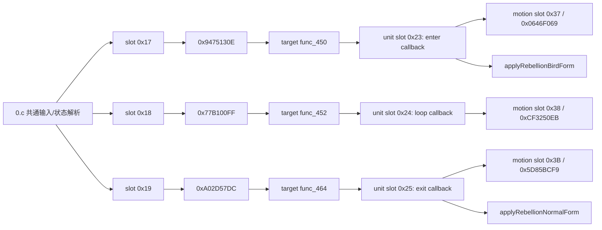
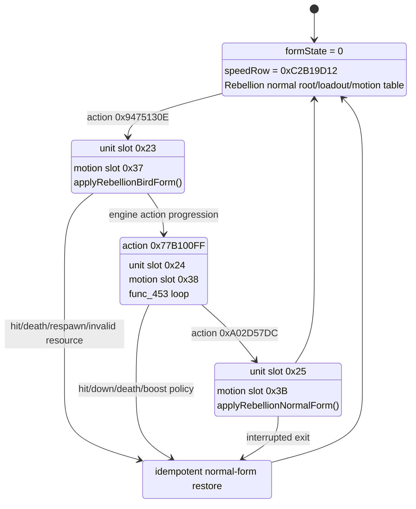

# Wing Gundam Zero Rebellion（900000004）移植 28001001 完整变形：深度执行计划

日期：2026-08-09  
版本：v3，名称优先的函数级与资源级执行规范  
状态：source 六类资源与现代结构已按规范名称定位并完成静态闭包分析；尚未修改游戏资产  
边界：本轮只做只读分析和 Markdown 规划；未解包 FHM2D、未修改游戏资产、未编译 MSC、未打包或实机测试

## 1. 最终结论

这项工作不需要把 `28001001` 的整份 MSC 或整套招式覆盖到 Rebellion。现有目标已经具备完整的共通输入骨架和飞行物理控制器，缺的是把它们接入机体专用的形态、动作和资源闭包。

已证实的最短实现路径是：

1. **目标 `0.c` 默认不改。** `0x17/0x18/0x19` 输入槽、对应 action hash 以及相关 resolver 与 `28001001` 在全局编号归一化后语义一致。
2. **目标 `2.c` 的 `func_450` 至 `func_466` 默认不复制。** 这 17 个共通控制函数与 `28001001` 在 source 全局编号 `>= 158` 减一后逐函数语义一致。
3. 在 target action registry 中把三条空 handler 接到已有控制器：
   - `0x9475130E -> func_450`：进入飞行/变形阶段；
   - `0x77B100FF -> func_452`：持续飞行阶段；
   - `0xA02D57DC -> func_464`：退出飞行阶段。
4. 新增 target 专用的进入、持续、退出 callback，分别接入 unit slot `0x23/0x24/0x25`；与 source 一样，`0x26/0x27` 保持 `0`，不能因为 `func_463` 会调用它们就擅自填 handler。
5. 在 motion table 的 `0x3`、`0x4` 两个通道各补三条：
   - slot `0x37 -> 0x0646F069`；
   - slot `0x38 -> 0xCF3250EB`；
   - slot `0x3B -> 0x5D85BCF9`。
6. 不直接复制 source `func_1077/func_1078`。要把它们拆成 `applyRebellionNormalForm` 与 `applyRebellionBirdForm` 两个 target-first 适配器，保留 Rebellion 的正常形态 root、武器、材质和普通 motion 表，只移植变形闭包。
7. Target `speedparam.bin` 必须新增 `0x09A2F239` 飞行 row。Source 是 69 字段 schema，target 是 74 字段 schema，因此不能二进制复制 source row；应先复制 target 的 `0xC2B19D12` 成新 row，再按 field hash 覆盖 69 个共有字段。
8. 普通形态继续使用 Rebellion 当前模型和资源；Bird 形态新增 source `body_tf`、`wep_brifle00a`、`wep_brifle00b`、`wep_shield00` 四组模型。独立 `wep_wing00` 属于 source 普通形态，不进入核心变形闭包。

因此，真正的核心改动面是“**3 条 action 绑定 + 3 条 callback 绑定 + 6 条 motion table 记录 + 2 个形态适配器 + 1 个 speed row + 对应多模型动作/资源**”，不是整机脚本移植。

## 2. 产品范围：什么叫“完整变形”

本计划把完成度分成两个闭包，避免把“完整变形”和“整套 28001001 招式移植”混为一谈。

### 2.1 必做闭包 A：完整变形系统

必须同时具备：

- 与 source 相同的进入、持续、退出三段 action；
- 正常形态与 Bird/飞行形态的 model、motion、speed row 成对切换；
- yaw、pitch、roll、前进速度、上下输入与快速侧向动作；
- body、wing、weapon 多模型动作同步；
- 主动退出，以及受击、倒地、死亡、复活等强制恢复；
- 重复进入退出不累积模型、effect、速度或姿态状态；
- Rebellion 普通形态的现有招式、弹体、外观和额外武器保持不变。

### 2.2 可选闭包 B：28001001 的变形形态武装

Source registry 在 `2.c:31595-31612` 另有一整组形态专用 action，包括：

- `0x476FAC14`、`0x16ED34C0`、`0x2194F05D`：形态射击组；
- `0x7E08FCC9`、`0xFAD13B35`、`0xECAFCAC1`：形态副射组；
- `0xD94D608F`、`0x9BCC30FA`、`0x27BAFEF2`、`0x31C5F871`、`0xB025EFDB`、`0xDB7F32DC`、`0x7B244454`：形态特射派生组；
- `0x8D96C52F`、`0x279F0DA4`、`0xC0B814FF`：形态特格组。

默认策略是先完成闭包 A，并让 Rebellion 的现有攻击在飞行形态下走适配后的表现；闭包 B 必须单独做 input/action、arms、bullet、effect、sound 的冲突审计。否则“移植变形”会悄然变成“覆盖 Rebellion 招式表”。

## 3. 身份、版本与资源事实

### 3.1 机体身份

| 项目 | 证据 | 结论 |
|---|---|---|
| Target | `characterid_016gundmw_001wgzero_001.bin` 字节 `04 E9 A4 35`（LE） | `900000004 / 0x35A4E904` |
| Target 普通基线 | `016gundmw_001wgzero_001` 的 character ID | `16001001`，无完整变形接线 |
| Source | `characterid_028gunwtv_001gunwtv_001.bin` 字节 `E9 42 AB 01`（LE） | `28001001 / 0x01AB42E9` |

Source 的本地反编译参考为：

```text
E:\XB\mod\040msc\028gunwtv_001gunwtv_001\0.c
E:\XB\mod\040msc\028gunwtv_001gunwtv_001\2.c
```

带 `_ad47e15a` 后缀的目录没有相同的三 action 接线，不能与主参考混用。

### 3.2 名称优先的六类资源定位

资源发现必须先使用规范名称，再用 `tools/ob_unit.json` 中的资源表 ID 做身份校验。资源表 ID 不是文件搜索键，也不能用旧 `0x<hash>_structure.json` 的缺失结果否定名称目录。

| 类型 | 规范名称搜索键 | 已定位的 source | 当前内容 |
|---|---|---|---:|
| Model | `028gunwtv_001gunwtv_001` | `E:\XB\mod\002chara\028gunwtv_001gunwtv_001` | 94 files / 8 model groups |
| Motion | `001hito_028gunwtv_001gunwtv_001` | `E:\XB\mod\003motion\001hito_028gunwtv_001gunwtv_001` | 474 NUANMB |
| Effect | `028gunwtv_001gunwtv_001` | `E:\XB\mod\006effect\028gunwtv_001gunwtv_001` | 39 files |
| MSC | `028gunwtv_001gunwtv_001` | `E:\XB\mod\040msc\028gunwtv_001gunwtv_001` | 3 MSC binaries + readable decompilation |
| Param | `028gunwtv_001gunwtv_001` | `E:\XB\mod\041cpm\028gunwtv_001gunwtv_001` | 9 package entries |
| Sound | `se_chr_028gunwtv_001gunwtv_001` | `E:\XB\解包\vs2\x64\091waveform\se\chara\028gunwtv\se_chr_028gunwtv_001gunwtv_001.nus3bank` | 1 bank |

对应的资源表 ID 仅作交叉校验：Model `0xB8030D0C`、Effect `0x435898CB`、Sound `0x7847B095`、Param `0x67939005`、MSC `0x3668AA1D`、Motion `0x96C5258F`。带 `_ad47e15a` 后缀的 MSC 仍不是本计划的主 source。

### 3.3 现代结构与完整性

五类 FHM2D 解包目录都已有同名现代结构文件：

```text
E:\XB\mod\002chara\028gunwtv_001gunwtv_001_structure.json
E:\XB\mod\003motion\001hito_028gunwtv_001gunwtv_001_structure.json
E:\XB\mod\006effect\028gunwtv_001gunwtv_001_structure.json
E:\XB\mod\040msc\028gunwtv_001gunwtv_001_structure.json
E:\XB\mod\041cpm\028gunwtv_001gunwtv_001_structure.json
```

| 包 | `Fhm2dTotalCount` | 结构事实 | 结论 |
|---|---:|---|---|
| Model | 94 | 8 个 `.numdlb/.nusktb/.numshb/.jnttbl/.nuhlpb` 模型组、18 `.numatb`、25 `.nutexb` 及控制文件 | 完整，旧“缺 85 个”结论作废 |
| Motion | 474 | `SubFileStructure` 668 项，所有 `SubFileData.fileUrl` 均落到现有文件 | 完整，包含 common 与 unit-specific motion |
| Effect | 39 | 18 `.efxbn`、5 组 effect model、1 `.nutexb` | 完整 |
| MSC | 3 | `0.bscex/1.cscex/2.dscex`；工作目录另有对应 `.c/.txt` | 完整 |
| Param | 9 | 标准九表，含 `speedparam.bin` | 完整 |
| Sound | 1 | 规范内部名 `.nus3bank` 已存在 | 完整 |

`E:\XB\解包\vs2\x64\003motion` 下的 `001hito` 142、`032gwtvtr` 8、`400stick` 102、`482gwtvwing` 57（合计 309）只是 unit-specific 分类视图；打包基准必须使用上面的 474 项现代 package，而不是把 309 当成完整包。

## 4. 已冻结的规范名 source 路径

当前不再等待用户提供解包结果，也不创建 hash 命名的中转目录。实施时直接以以下规范名目录和 sibling structure JSON 为 source：

```text
Model  E:\XB\mod\002chara\028gunwtv_001gunwtv_001
Motion E:\XB\mod\003motion\001hito_028gunwtv_001gunwtv_001
Effect E:\XB\mod\006effect\028gunwtv_001gunwtv_001
MSC    E:\XB\mod\040msc\028gunwtv_001gunwtv_001
Param  E:\XB\mod\041cpm\028gunwtv_001gunwtv_001
Sound  E:\XB\解包\vs2\x64\091waveform\se\chara\028gunwtv\se_chr_028gunwtv_001gunwtv_001.nus3bank
```

Param 的规范名原始文件位于 `E:\XB\解包\vs2\x64\041cpm`，包括 `armsparam_...`、`bulletparam_...`、`characterparam_...`、`chrsysparam_...`、`grapparam_...`、`hitgroupiddef_...`、`interactionid_...`、`speedparam_...`；`characterid_...` 与 `shell_...` 分别用于身份和 model SHL 对照。进入任何写入阶段前只需冻结这些已定位 source 的 size/SHA-256 与 target before 清单，不再需要资源准备步骤。

## 5. 证据账本

| ID | 不可变观察 | 位置 | 强度 |
|---|---|---|---|
| E-001 | Target ID 为 `900000004` | Rebellion model 包内 character ID | 高 |
| E-002 | Source ID 为 `28001001` | `041cpm\character_id\characterid_028...bin` | 高 |
| E-003 | Target motion 534 个 NUANMB 与 `16001001` 逐文件一致 | SHA-256 树对比 | 高 |
| E-004 | Target effect、sound 与 `16001001` 全部一致；Param 仅 bulletparam 不同 | SHA-256 树对比 | 高 |
| E-005 | Target model 105 文件，保留 160 body/wing core，另有 `bsaber_out/bsrifle00b_out/tbsrifle_out` | 文件树与 byte compare | 高 |
| E-006 | Target `0.c:560-562` 已注册 `0x17/0x18/0x19` 三 action hash | target `0.c` | 高 |
| E-007 | Target `2.c:29567-29569` 把三 action handler 设为 `0` | target `func_1040` | 高 |
| E-008 | Target unit slot `0x23-0x27` 均为 `0` | target `2.c:29650-29654` | 高 |
| E-009 | Source 把三 action 接到 `func_450/452/464` | source `2.c:31564-31566` | 高 |
| E-010 | Source slot `0x23/24/25` 接 `func_873/874/875`，`0x26/27` 仍为 `0` | source `2.c:31657-31661` | 高 |
| E-011 | Source motion slot `0x37/38/3B` 在通道 `0x3` 和 `0x4` 都已注册 | source `2.c:31728-31730,31778-31780` | 高 |
| E-012 | Target `func_450-466` 与 source 在 source `global>=158` 减一后全部语义一致 | 逐函数 brace 提取与 whitespace-normalized compare | 高 |
| E-013 | Target/source `0.c` 的 `func_13/14/15/35/36/37/73/77/78` 在 source `global>=51` 减一后语义一致 | 逐函数归一化 compare | 高 |
| E-014 | Source `global143` 在 `func_1077/1078` 写 `0/1`；target 只有初始化 `0` | source `2.c:31028,31077`；target `2.c:8147` | 高 |
| E-015 | Source normal/flight speed rows为 `0xC2B19D12/0x09A2F239`；target 只有前者 | `exvs2-json inspect` | 高 |
| E-016 | Source speedparam 为 69 字段、2 rows；target 为 74 字段、1 row | `exvs2-json --summary` | 高 |
| E-017 | 规范名 source model 包有 94 文件、8 组 model，全部存在；旧“缺 85 个”来自错误的 hash 路径搜索 | `028gunwtv_001gunwtv_001_structure.json` + 文件树 | 高 |
| E-018 | `0x37/0x38/0x3B` 对应的是 3 个直接 `Item`，文件分别为 `...kamaesht2neo/nro/nrr...nuanmb`，不是 action folder | source motion modern structure | 高 |
| E-019 | Source SHL 把 Bird root `0xA341F1EF` 映射到 `body_tf`；变形 child 是 `brifle00a/brifle00b/shield`，不含独立 wing | source `shell_028gunwtv_001gunwtv_001.shl` + model folder order | 高 |
| E-020 | Source `body_tf` 与 target normal body 仅 19 个同名骨；source/target wing 仅 15 个同名骨且 6 个 parent 不同 | `exvs2-json inspect --type nusktb --summary` | 高 |
| E-021 | Target motion 534 项中不存在三个 source transform Item key；可作为三个独立增量追加 | target/source modern motion structure | 高 |

## 6. 已证实的运行链



这个链路的断点全部位于 target `2.c`，不是 `0.c` 输入缺失，也不是共通飞行函数缺失。

## 7. Source 与 Target 的函数级映射

| 层 | Source 28001001 | Target 当前 | 实施决策 |
|---|---|---|---|
| action hash table | `func_1101`，三 handler 已接线 | `func_1040`，三 handler 为 `0` | 只改三行 |
| unit callback table | `func_1102`，`0x23-25 -> func_873-875` | `func_1041`，`0x23-27 -> 0` | 新建 semantic callback，接三行；`26/27` 留零 |
| motion table | `func_1103`，两通道均有 `37/38/3B` | `func_1042`，缺这六条 | 补六条 |
| enter common | `func_450/451` | `func_450/451` | 语义一致，复用 target |
| loop common | `func_452-463` | `func_452-463` | 语义一致，复用 target |
| exit common | `func_464-466` | `func_464-466` | 语义一致，复用 target |
| form switch | `func_1077/1078` | 无对应的非零 form switch | 不能照抄；拆成 target-first 适配器 |
| visual sync | `func_897` | target 同号函数有其他职责，不能覆盖 | 新建 semantic helper，只移植必要分支 |
| source callbacks | `func_873/874/875` | target 同号函数已被本机体使用 | 不按编号覆盖；按行为新建函数 |

### 7.1 `0.c` 为什么默认不改

Target 已有：

- `func_13`：`0x17 -> 0x9475130E`、`0x18 -> 0x77B100FF`、`0x19 -> 0xA02D57DC`；
- `func_14`：`0x17/0x18/0x19 -> func_35/36/37`；
- `func_35/36/37`：负责三槽 fallback/resolver；
- `func_15` 与 `func_77`：在 `global20` 的形态 flag 下返回对应 action。

这些函数与 source 语义一致。除非选定 build 的官方 `0x3668AA1D` 复核显示差异，否则 `0.c` 的允许 diff 为零。

### 7.2 共通飞行控制器职责

| Target 函数 | 已观察职责 | 关键输入/状态 |
|---|---|---|
| `func_450` | 进入飞行控制，播放 unit slot `0x23`，初始化前向速度 | speed field `0x5E8CAF43`、`global162` |
| `func_451` | 进入阶段逐帧减速/位移并等待动作结束 | `sys_46`、`global162`、`global238` |
| `func_452` | 初始化持续飞行状态，播放 unit slot `0x24` | 三个 speed field、姿态/输入状态清零 |
| `func_453` | 持续飞行主循环、速度积分、状态 flags 输出 | `global24`、`global507-509`、`sys_46` |
| `func_454` | 普通手动控制分发 | `func_455/456/458/459/463` |
| `func_455/456` | 两种输入模式下的 yaw 更新 | `global87`、`0x6F6F1BF6` |
| `func_457` | roll 目标与回正 | `0x4D4B65EA`、`0x2D28CC4B`、`0x18895A55` |
| `func_458/459` | 两种输入模式下的上下控制 | `global48/global87` |
| `func_460` | pitch 目标与回正 | `0xF3B9AD85`、`0xF8B9B46E` |
| `func_461/462` | 特定 engine flag 下的姿态/位移恢复 | `global24 & 0x20000/0x400` |
| `func_463` | 延迟后的快速侧向/转向动作 | `global93`、unit slot `0x26/0x27`、lateral impulse |
| `func_464/465/466` | 退出、恢复姿态并结束 action | unit slot `0x25`、保存的姿态值 |

### 7.3 Source/Target 全局编号对应

Source 多插入了一个 unit-specific global。共通控制器中主要对应为：

| 操作含义 | Source | Target |
|---|---:|---:|
| 当前前向速度 | `global508` | `global507` |
| 速度增量 | `global509` | `global508` |
| 速度终值 | `global510` | `global509` |
| 动作计时/快速输入冷却 | `global163` | `global162` |
| roll 姿态 | `global167` | `global166` |
| pitch 姿态 | `global168` | `global167` |
| 飞行输入子状态 | `global169` | `global168` |
| 上下输入 latch | `global170` | `global169` |
| 双击窗口 | `global606` | `global605` |

实施时不得把 source global 编号原样复制到 target。新增状态优先使用语义名；引用既有 target global 时按上表和逐函数上下文映射。

## 8. 形态状态机



`FORCED_RECOVERY` 必须幂等：无论当前处于进入、持续还是退出阶段，重复调用都只留下一个正常 body、一套正常 wing/weapon、正常 speed row 和清空后的临时 effect。

## 9. Source 形态切换的精确行为与适配规则

### 9.1 Source 正常形态 `func_1077`

Source 会同时执行：

- root model：`0x9DF0F24A`；
- `global143 = 0`；
- resource state：`sys_1(0x60008, 0x1B12AE7D)`；
- motion table `0x3`：slot `1 -> 0x14AEA40D`，slot `0x13 -> 0x3E1D8362`；
- motion table `0x4`：slot `1 -> 0xFBC136EF`，slot `0x13 -> 0xD1721180`；
- speed row：`global142 = 0xC2B19D12`；
- 多组 `sys_4F` weapon/model slot 恢复；
- wing/attachment effect 过渡与视觉刷新。

Target 不能复制这些“正常形态常量”，因为它们属于 source 外观和 source 普通招式。Target restore 必须从 Rebellion 当前初始化表中取得自己的 normal root、slot `1/0x13` motion hash、weapon slots 和 effect 状态。

### 9.2 Source Bird 形态 `func_1078`

Source 会执行：

- root model：`0xA341F1EF`；
- `global143 = 1`；
- resource state：`sys_1(0x60008, 0x6C159EEB)`；
- motion table `0x3/0x4` 的 slot `1/0x13` 全改为 `0xCF3250EB`；
- speed row：`global142 = 0x09A2F239`；
- source weapon/model slot 显隐与替换；
- `body_tf` 内置 wing 姿态，以及 rifle/shield child 变换与 effect 过渡。

Target 的 Bird adapter 保留 action hash、飞行 speed row、三条 transform motion ID，并使用已由 SHL 解析出的 `body_tf/brifle00a/brifle00b/shield` Model ID；只有 target normal restore、挂点与 effect 仍需按 Rebellion 现状适配。

### 9.3 Target-first 适配器的不变量

`applyRebellionBirdForm` 完成后：

- 只有一个 active body root；
- form state 为 `1`；
- speed row 为 `0x09A2F239`；
- flight action 所需 motion table 已启用；
- Rebellion 不适用于 Bird 形态的 normal weapon child 已隐藏；
- Bird `body_tf`（含内置 wing）与 rifle/shield child 已加载并绑定正确模型通道；
- 不改变 target character ID，不导入 source 普通招式表。

`applyRebellionNormalForm` 完成后：

- form state 为 `0`；
- speed row 恢复 `0xC2B19D12`；
- target 原 normal root、motion slot `1/0x13`、weapon slot、effect 状态全部恢复；
- Bird 专用 child、shell、effect、camera/pose 临时状态全部清理；
- 重复调用结果不变。

## 10. 三个 unit callback 的落地规格

### 10.1 Enter callback：source `func_873`

Source 行为：

- 首帧清 unit action 状态；
- 调用 Bird form switch；
- `func_351(3, 4)`；
- 播放 motion slot `0x37`；
- 动作时间到 `0x5DC` 时触发 cue `0x0FFFD166`；
- 刷新模型/武器视觉；
- 动作完成后允许 common controller 推进。

Target callback 应复制时序和 common helper 调用，但把 form switch、视觉刷新和 shell 处理换成 Rebellion adapter。

### 10.2 Loop callback：source `func_874`

Source 行为很窄：

- 首帧 `func_351(2, 4)`；
- 播放 motion slot `0x38`；
- 动作完成时继续/重播 slot `0x38`；
- 每帧执行共通 action state helper。

这是最适合直接语义移植的 callback，但仍要用新 semantic function 名，不能覆盖 target 同号函数。

### 10.3 Exit callback：source `func_875`

Source 行为：

- 首帧播放 slot `0x3B`；
- 对 rifle/shield child 执行过渡变换；
- 下一阶段恢复 common speed state；
- 动作结束时调用 normal form switch；
- 恢复普通 motion slot `0x13`；
- 清理 source visual state；
- 触发退出 cue `0x9C1B440D` 与时序 cue `0x7578E138`。

Target 必须在“动画自然结束”和“中途被打断”两条路径都调用同一个 normal-form restore。

## 11. MSC 精确修改清单

### 11.1 `0.c`

**鸟形态输入表（2026-08-14 已实机）：** 在 `func_143` 按 `global39` 分流，只改 selector，不在 `2.c` `ACTION_*` 硬拦。  
规范与 Rebellion vs TV bit 对照见  
[`docs/msc-research/wing-zero-rebellion-bird-form-0c-input-map.md`](./wing-zero-rebellion-bird-form-0c-input-map.md)。

其余默认：无。只有选定 build 的 source 复核发现以下任一项不一致，才再改：

- `func_13` 的 `0x17/18/19` hash；
- `func_14` 的 resolver；
- `func_35/36/37` fallback；
- `func_15/77` 的 form gate（与上条鸟形态文档配套时可存在）。

### 11.2 `2.c` 现有表项

在 target `func_1040`：

```c
func_241(0x9475130e, func_450);
func_241(0x77b100ff, func_452);
func_241(0xa02d57dc, func_464);
```

在 target `func_1041`：

```c
sys_1(0x10001, 0x2, 0x23, rebellion_transform_enter_callback);
sys_1(0x10001, 0x2, 0x24, rebellion_transform_loop_callback);
sys_1(0x10001, 0x2, 0x25, rebellion_transform_exit_callback);
sys_1(0x10001, 0x2, 0x26, 0);
sys_1(0x10001, 0x2, 0x27, 0);
```

在 target `func_1042` 的 `0x3` 和 `0x4` 两组各加入：

```c
sys_1(0x10001, table_id, 0x37, 0x0646f069);
sys_1(0x10001, table_id, 0x38, 0xcf3250eb);
sys_1(0x10001, table_id, 0x3b, 0x5d85bcf9);
```

### 11.3 新增函数

建议新增 semantic functions：

- `rebellion_transform_enter_callback`
- `rebellion_transform_loop_callback`
- `rebellion_transform_exit_callback`
- `apply_rebellion_bird_form`
- `apply_rebellion_normal_form`
- `sync_rebellion_transform_visuals`
- `force_restore_rebellion_normal_form`

不要把 source `func_873/874/875/897/1077/1078` 原名搬入 target；target 已有重名函数或不同全局布局。

### 11.4 MSC AI block 规则

每个新增或修改块都要成对标记，例如：

```c
// AI decision (2026-08-09): Connect the verified 28001001 flight action to the existing Rebellion common controller.
// Origin: 28001001 source 2.c action registry and target/source semantic function comparison.
func_241(0x9475130e, func_450);
// End, origin is the verified 28001001 flight action mapping.
```

新增状态必须使用语义名；旧反编译代码中的 `globalNN` 保留原名并在审计文档记录对应关系，不发明新的 `global777/var42`。

## 12. Speedparam：跨 schema 的精确合并

### 12.1 已证实结构

| 文件 | Entry 数 | 字段数 | Entry size | Entry IDs |
|---|---:|---:|---:|---|
| Source `speedparam_028...vgsht2` | 2 | 69 | 284 | `0x09A2F239`, `0xC2B19D12` |
| Target `speedparam.bin` | 1 | 74 | 304 | `0xC2B19D12` |

69 个 source gameplay 字段都能按 hash 映射到 target。Target 多出的 5 个字段是：

- `groundStepSecondaryTimer`
- `groundStepSpeedTerminal`
- `groundStepPrimaryTimer`
- `groundStepSpeedDelta`
- `groundStepSpeedInitial`

### 12.2 合并算法

1. 在 target 74-field schema 内复制 `0xC2B19D12` 为 `0x09A2F239`。
2. 从 source `0x09A2F239` 按 field hash 覆盖 69 个共有字段。
3. 5 个 target-only ground-step 字段保留 target normal row 值。
4. Target normal row `0xC2B19D12` 完全不改。
5. 生成文件后做 lossless builder round-trip，并确认仍为 74-field schema、2 entries。

`exvs2-json` 已支持 `copyParamEntry`、`setParamField` 和 `upsertParamEntry`。工作请求与输出必须放在 `tmp/exvs2-json/wing-zero-transform/`。

### 12.3 Common controller 的十个硬依赖字段

Source flight row 的精确值为：

| Field hash | Canonical field | 值 |
|---|---|---:|
| `0x5E8CAF43` | `transform_forward_speed_initial` | 300 |
| `0xFF7A9C8B` | `transform_forward_speed_delta` | -5 |
| `0x459455EA` | `transform_forward_speed_terminal` | 280 |
| `0x6F6F1BF6` | `transform_yaw_response` | 33 |
| `0x4D4B65EA` | `transform_roll_target_magnitude` | 30 |
| `0x2D28CC4B` | `transform_roll_response` | 200 |
| `0x18895A55` | `transform_roll_neutral_retention` | 93 |
| `0x9FD06227` | `transform_pitch_pose_scale` | 35 |
| `0xF3B9AD85` | `transform_pitch_response` | 32 |
| `0xF8B9B46E` | `transform_pitch_neutral_retention` | 95 |

Target 当前 normal row 的这十项全部为 `0`。如果新 row 缺失或 `global142` 没切换，最典型表现是“能进动作但不能前进/转向/俯仰”。

## 13. Motion：追加三个规范名 direct Item，不复制 action folder

### 13.1 Source 已有文件通道

规范名 modern motion package 有 474 个 NUANMB。另有 unit-specific 分类视图共 309 个：

| 通道目录 | 文件数 | 作用 |
|---|---:|---|
| `001hito` | 142 | 主体人物骨架动作 |
| `032gwtvtr` | 8 | `body_tf` 变形体专用动作 |
| `400stick` | 102 | 武器/手持物动作 |
| `482gwtvwing` | 57 | wing child model 动作 |

474 项 modern package 是完整打包基准；309 项分类视图只用于按通道查找命名文件。

### 13.2 三条已解析的 direct Item

| 阶段 | Slot | Runtime ID | structure `unk1`（LE bytes） | Source fileIndex | 规范文件名 |
|---|---:|---|---|---:|---|
| Enter | `0x37` | `0x0646F069` | `69f04606` | 16 | `032gwtvTR_028gunwtv_001gunwtv_001_body_tf_kamaesht2neo_sht_air_fr.nuanmb` |
| Loop | `0x38` | `0xCF3250EB` | `eb5032cf` | 418 | `032gwtvTR_028gunwtv_001gunwtv_001_body_tf_kamaesht2nro_sht_air_fr.nuanmb` |
| Exit | `0x3B` | `0x5D85BCF9` | `f9bc855d` | 254 | `032gwtvTR_028gunwtv_001gunwtv_001_body_tf_kamaesht2nrr_sht_air_fr.nuanmb` |

三项在 source structure 中都是 `type=Item`、`unk2=00000000`，文件都直接位于 package 的 `0\0` 下；它们不是包含 body/wing/weapon 子项的 folder。Target 534 项 structure 中三个 key 均不存在，因此实施方式是：复制这三个命名 NUANMB，作为 `0\0` 的 direct Item 追加，分配新的 file index，并只更新实际父 folder count、`SubFileData` 与 `Fhm2dTotalCount`。

Wing/weapon 的变形表现不是由这三个 motion folder 的 child channel 驱动。`func_1078` 先把 root 切到 `body_tf`，`func_897(1)` 再显式加载 rifle/shield child；Bird 翼骨已经在 `body_tf` skeleton 内。

### 13.3 Skeleton 决策树

1. Source `body_normal` 与 `body_tf` 虽然都是 78 骨，但只有 21 个同名骨，证明 `body_tf` 是独立变形骨架，不是普通 body 的可互换皮肤。
2. Source `body_tf` 与 target normal body 为 78 vs 52 骨，只共享 19 个骨名，不能把三条 NUANMB 直接播放到 target normal body。
3. Source/target 独立 wing 为 21 vs 44 骨，只共享 15 个骨名且 6 个同名骨 parent 不同；不能重定向 source wing animation 到 target wing。
4. Core Phase A 使用官方 source `body_tf` 模型、骨架与三条 NUANMB 的闭合组合，不需要 FBX 重定向，也不需要 source 独立 wing。
5. 后续如果把 `body_tf` 改成 Rebellion 外观，只替换 mesh/material，保留 source transform skeleton 与动画契约；任何自制 NUANMB 都必须遵守 ATH helper、indexed `0x4300`、完整 Transform shell 和全骨 Translate 规则。

## 14. Model 与 shell：按规范名解析后的最小 Bird 闭包

规范名目录 `E:\XB\mod\002chara\028gunwtv_001gunwtv_001\models` 含：

1. `028gunwtv_001gunwtv_001_body_normal`
2. `028gunwtv_001gunwtv_001_body_tf`
3. `028gunwtv_001gunwtv_001_wep_brifle00`
4. `028gunwtv_001gunwtv_001_wep_brifle00a`
5. `028gunwtv_001gunwtv_001_wep_brifle00b`
6. `028gunwtv_001gunwtv_001_wep_bsaber00`
7. `028gunwtv_001gunwtv_001_wep_shield00`
8. `028gunwtv_001gunwtv_001_wep_wing00`

Target 当前 model 有 9 组：normal body、五组现有武器/wing，以及 `bsaber_out`、`bsrifle00b_out`、`tbsrifle_out` 三组自定义模型。

Source SHL 与 structure JSON 的 model-group 顺序给出以下确定映射：

| Model ID | 规范 model folder | 角色 |
|---|---|---|
| `0x9DF0F24A` | `..._body_normal` | Source normal root |
| `0xA341F1EF` | `..._body_tf` | Bird root |
| `0xFF7F31BD` | `..._wep_wing00` | Source normal-form wing |
| `0x0C241692` | `..._wep_brifle00a` | Bird child |
| `0xF62B2BF1` | `..._wep_brifle00b` | Bird child |
| `0xE547B3A7` | `..._wep_brifle00` | Source normal-form rifle |
| `0xFF02AFD5` | `..._wep_shield00` | Bird/normal shared child |
| `0xC93A272D` / `0x33351A4E` | `..._wep_bsaber00` | Source normal-form saber aliases |

`func_1078` 与 `func_897` 的组合把核心 Bird model 闭包缩小为四组：`body_tf`、`wep_brifle00a`、`wep_brifle00b`、`wep_shield00`。`body_normal`、`wep_wing00`、`wep_brifle00`、`wep_bsaber00` 不进入闭包 A。

### 14.1 资源所有权

| 资源 | Owner | 默认处理 |
|---|---|---|
| Rebellion normal body | Target | 保留，禁止 source body_normal 覆盖 |
| Rebellion normal wing | Target | 保留；Bird 期间随 normal root 一起卸载，不接 source wing motion |
| `body_tf` | Source transform closure | 以 source skeleton 原样新增为 Bird root |
| Source `brifle00a/brifle00b/shield` | Source transform closure | 按 SHL Model ID 原样新增，为 `func_897` 的 Bird child |
| Source `wing00/brifle00/bsaber00` | Source normal/optional closure | 闭包 A 不加入 |
| Target `*_out` models | Target | 全部保留 |
| Target materials/textures | Target | normal form 保留；transform model 制作 Rebellion 外观版本 |
| Source character ID | Source identity | 永不进入成品 |

### 14.2 Model ID 与 child hash 解析

Source 名称到 SHL Model ID 的映射已经完成。Target 当前 normal root 是 `0xC7245E9C`，必须由 `apply_rebellion_normal_form` 恢复；Bird adapter 可以保留 source 的 `0xA341F1EF/0x0C241692/0xF62B2BF1/0xFF02AFD5`，前提是把对应四个规范名 model folder 和 SHL records 一并追加到 target。

Target 当前 structure 有 9 个 model group。若四组按末尾追加，候选 folderIndex 是 9 至 12；实施代码必须从当时的 `SubFileStructure` DFS model-group 顺序重新计算，不能硬编码。Source SHL record 的 `modelType/unk1/slotIndex` 保持不变，只改 `folderIndex`。所有 SHL、bone、jnttbl 数值匹配按 LE 进行。

## 15. Param、Effect 与 Sound 的边界

### 15.1 Param

Core transform 默认只改 target `speedparam.bin`。以下文件不因“变形”而整包替换：

- `armsparam.bin`
- `bulletparam.bin`
- `characterparam.bin`
- `grapparam.bin`
- `hitgroupiddef.bin`
- `interactionid.bin`
- `projectile_depiction_table.bin`
- `chrsysparam.csyspm`

只有启用可选闭包 B 的 source 变形武装时，才按 row 做 arms/bullet/depiction/interaction/hitgroup 迁移。Target `bulletparam.bin` 已有 Rebellion 独立改动，禁止整文件覆盖。

### 15.2 Effect

Source effect 的规范名 modern package 共 39 项，包括 18 个 `.efxbn`、5 组 effect model 和 1 张 `.nutexb`。实施时按 callback/visual adapter 实际引用选择性合并：

- enter/exit 过渡；
- wing/nozzle/vapor/line；
- Bird 推进；
- source 武装效果仅属于可选闭包 B。

Target 胸口绿色 effect 的关闭改动必须保留，最终 diff 中单独核对。

### 15.3 Sound

Source `se_chr_028gunwtv_001gunwtv_001.nus3bank` 已按内部规范名定位。先确认 `0x0FFFD166`、`0x7578E138`、`0x9C1B440D` 在 source/target bank 的解析结果：

- Target bank 已有等价 cue：MSC remap，保留 target bank；
- Target bank 缺 cue但 bank 可安全合并：只加 cue；
- Bank 无可靠合并能力：先让功能版静音或映射到 target cue，不能直接替换后丢失 Rebellion 原音效。

Sound 缺失不应阻塞形态/运动闭包验证，但最终“完整表现”验收必须补齐。

## 16. 实施阶段、产物与门槛

### Phase 0：名称与版本冻结（source 侧已完成）

产物：

- 六类规范名搜索键与实际路径；
- 五份 modern structure JSON 与 sound bank；
- source 六类资源的 size/SHA-256；
- target 六目录的 before 清单。

门槛：source 路径与结构已通过；进入写入阶段时补 target before 清单。不再混用 main、`_ad47e15a`、XB、GX 变体。

### Phase 1：source 复核与映射冻结

产物：

- chosen-build `0.c/2.c` 的三 action、三 callback、三 motion slot 截面；
- source→target function/global/resource 映射表；
- 三个 source direct motion Item 的 fileIndex、LE `unk1` 与规范文件名；
- source SHL Model ID → 规范 model folder 映射。

门槛：source 静态映射已通过；写入时按 target 当前 structure 重新分配 fileIndex/folderIndex。

### Phase 2：Phase-A movement-only 原型

只包含：

- target `2.c` 三 action 接线；
- 三个 target-specific callback；
- motion table 六条；
- 四组 Bird model/SHL 增量；
- 三个 direct motion Item；
- temporary Bird form adapter；
- speed row `0x09A2F239`；
- enter/loop/exit motion file。

暂不加入 source 武装 Param 与完整 effect/sound。

门槛：能完整进入、控制、退出；正常形态恢复；不崩溃、不残留。

### Phase 3：正式 model/shell 适配

产物：

- `body_tf` 与 rifle/shield child 的 Rebellion 外观版本；
- source hash→target shell mapping；
- compatible skeleton 证据；
- model/motion structure JSON 增量。

门槛：body/wing/weapon 同步，无双模型、挂地、破面、错误骨骼或 ATH node 污染。

### Phase 4：中断闭包

在受击、倒地、死亡、复活、觉醒、action cancel、资源异常路径调用同一幂等 normal restore。

门槛：从任意阶段强制中断后，form/model/motion/speed/effect 全部恢复。

### Phase 5：表现与可选武装闭包

产物：

- transform effect 与 cue；
- 若启用闭包 B，source transformed actions 的 row/resource dependency map；
- 冲突后的新 row/hash 与同步 MSC 引用。

门槛：不覆盖 Rebellion 原招式；每个新增武装能追到完整 Param→projectile→effect→model 链。

### Phase 6：编译与分阶段实机

MSC 使用传统 `tools/msclang.py` 最终 repack；`msclang_modern.py` 只作语义研究。修改后的 `.c` 先过 AI block checker，再做一次最窄 real-file compile/round-trip。通过后不追加无关全套测试。

## 17. 文件 diff 预算

### 17.1 预期允许修改

- `wing_gundam_zero_rebellion_msc\2.c`
- 编译生成的对应 `2.dscex`
- `wing_gundam_zero_rebellion_param\speedparam.bin`
- target motion `0\0` 与 structure JSON 中的三个 direct Item 增量
- target model 目录与 structure JSON 中的 transform-only model 增量
- 必要的 effect 增量
- sound 仅在 cue 合并方案明确后修改

### 17.2 默认不应修改

- target `0.c/0.bscex`
- target `1.c/1.cscex`
- target `bulletparam.bin`
- target character ID
- target normal body/wing core 文件
- target `bsaber_out/bsrifle00b_out/tbsrifle_out`
- target 现有材质和普通形态贴图

任何超出 allowlist 的变化都要有独立 source dependency 证据，否则撤回该变化。

## 18. 故障诊断矩阵

| 症状 | 最可能层 | 第一检查点 | 禁止的错误修法 |
|---|---|---|---|
| 输入无反应 | action registry | target 三 handler 是否仍为 `0` | 改按键或复制整份 `0.c` |
| 进入 action 但无机体动画 | unit callback/motion table | slot `0x23`、motion `0x37` 与 direct Item `69f04606` | 随便填一个 NUANMB |
| 能变形但不能前进 | speedparam | `global142=0x09A2F239`，十个 transform 字段非零 | 改 `sys_46` 常数 |
| 能前进但不能转向/俯仰 | speedparam/controller state | yaw/roll/pitch 六字段与 `global166-169` | 重写共通 controller |
| Body 变形但 wing 不动 | Bird root/skeleton | 是否确实加载 source `body_tf`，其内置 wing bones 是否随同一 NUANMB 运动 | 把 source wing motion 重定向到不兼容的 target wing |
| 变形瞬间隐形或崩溃 | model/shell | Bird root 与 child model 是否存在且 shell 可解析 | 原样写 source hash |
| 武器漂浮/挂点错误 | model/jnttbl | target bone hash LE 映射 | 用 source bone hash 猜测 |
| 退出后仍是 Bird 模型 | exit callback/restore | slot `0x25` 与幂等 normal restore | 只在主动按键退出时清理 |
| 死亡复活仍保留飞行速度 | forced recovery | death/respawn 是否恢复 normal speed row | 在复活后延迟硬清零 |
| 连续变形出现重复 wing/effect | visual adapter | 进入前是否先清上一次 child/effect | 增加更多 spawn 调用 |
| 动作骨骼扭曲 | skeleton/NUANMB | bone names/parents/rest pose 与 ATH policy | 批量重写 ATH node |
| 只有音效缺失 | sound cue | 三个 cue 的 bank 解析 | 用 source bank 覆盖 target bank |
| 普通招式退化 | diff 越界 | bulletparam/action registry/normal slots | 为了通过变形测试接受退化 |

## 19. 实机验收矩阵

| ID | 场景 | 通过标准 |
|---|---|---|
| T-01 | 出击与普通移动 | Rebellion 普通 body、wing、武器、材质、招式正常 |
| T-02 | 地面触发进入 | 只触发一次；action/hash/callback 链正确 |
| T-03 | 空中触发进入 | 与 source gate 一致；无位置跳变 |
| T-04 | Enter 动画 | `body_tf` 内置 wing 与 rifle/shield child 同步 |
| T-05 | 持续飞行 | forward、yaw、pitch、roll 与上下输入正确 |
| T-06 | 快速侧向/转向 | `func_463` 路径可用；`0x26/27` 留零不导致崩溃 |
| T-07 | 主动退出 | slot `0x3B` 完整播放，恢复 normal form |
| T-08 | Enter 中受击 | 立即或安全时点恢复 normal，无残留 |
| T-09 | Flight 中受击/倒地 | model、speed row、motion table 全恢复 |
| T-10 | Exit 中受击 | restore 幂等，不生成双 body |
| T-11 | 死亡/复活/觉醒 | form state 清零；无 Bird 资源继承 |
| T-12 | 连续变形 10 次 | 无漂移、重复 child、effect 泄漏、不可再触发 |
| T-13 | 普通招式回归 | Rebellion bulletparam 和自定义武器不退化 |
| T-14 | 胸口 effect 回归 | 现有绿色 effect 关闭行为保持 |
| T-15 | 可选 flight weapon | 若启用闭包 B，各 action/Param/effect 命中正确 |

T-01 至 T-14 全部通过才算完整变形闭包完成；T-15 只在选择可选武装闭包时成为强制项。

## 20. 回滚与交付

每个 Phase 独立保存 before/after manifest。回滚粒度必须至少达到：MSC、speedparam、motion、model、effect、sound 六层可分别恢复，不能只备份最终 FHM2D。

最终交付应包含：

- target 六包成品与对应 structure JSON；
- chosen-build 六个 source FHM2D 的 hash/size 记录；
- source→target function/global/resource mapping；
- model hash→shell record→file/channel mapping；
- speedparam 69-shared/5-target-only 合并报告；
- MSC AI block checker 结果；
- 一次定向 compile/round-trip 证据；
- T-01 至 T-14 实机记录；
- 可选闭包 B 的独立依赖报告。

## 21. 下一步执行顺序

不再等待用户解包。下一轮获得实施授权后按以下顺序执行：

1. 记录 target 六目录 before 清单；
2. 向 target model structure/SHL 追加 `body_tf`、`brifle00a`、`brifle00b`、`shield` 四个规范名 model group；
3. 向 target motion `0\0` 追加 `kamaesht2neo/nro/nrr` 三个规范名 direct Item；
4. 按 69-shared/5-target-only 规则新增 `speedparam` flight row；
5. 修改 target `2.c` 的三 action、三 callback、六条 motion table 与两个 target-first form adapter；
6. 通过最窄 compile/round-trip 后进行 T-01 至 T-14 分阶段实机验证。

当前剩余风险已经从“资源是否存在”收敛为“target structure 增量、SHL slot 共存、Rebellion 外观适配和中断恢复是否正确”。
