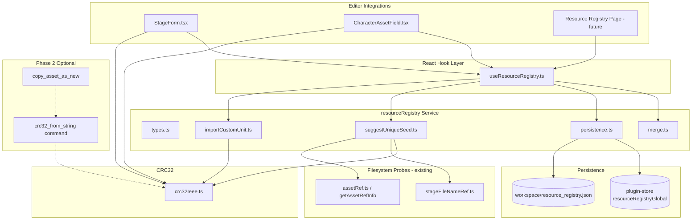

# Resource Registry — Design Specification

> **Date:** 2026-06-13  
> **Status:** Design Complete (brainstorming output; implementation not started)  
> **Scope:** Data model, persistence, CRC32 canonicalization, collision behavior, integration flow, module boundaries

---

## 1. Problem Statement / Goals

EXVS2 modding workflows store many asset references as **signed int32 CRC32 hashes** of human-readable seed strings (folder names, FHM2D file stems, workspace hash folders). Today the mapping between **custom name (seed)** and **hash** is implicit, scattered, and easy to lose:

| Pain point | Current state |
|------------|---------------|
| CRC32 duplicated in 3+ places | `CharacterAssetField.tsx`, `jnttblDebugFill.ts` (TS), `commands.rs::crc32_ieee` (Rust) |
| No persistent name↔hash database | Operators re-derive or guess seeds; `custom_unit.json` at repo root is a manual draft, **not wired into the app** |
| Stage `fileName` is opaque int32 | `StageForm.tsx` edits numeric hash directly; no seed input or collision guard |
| Copy-as-new already hashes in Rust | `copy_asset_as_new` computes CRC32 server-side; frontend preview uses a separate TS implementation |
| Collision handling inconsistent | Character copy flow blocks same-hash; jnttbl debug uses random salt; **no `seed_1` iteration for stage FHM2D** |

**Goals**

1. **Universal Resource Registry** — one schema keyed by `(category, slot)` covering stage, unit, prop, and custom asset kinds.
2. **Dual persistence** — global defaults (Tauri plugin-store) plus per-workspace JSON; workspace entries override global on merge.
3. **Canonical CRC32** — single shared TS implementation in Phase 1; optional Rust command in Phase 2 aligned with `copy_asset_as_new`.
4. **Safe hash application (Option B)** — on filesystem/MOD collision, surface conflict + suggested `seed_{i}` variants; **user must confirm** before writing hash to a param/stage field.
5. **Incremental integration** — Stage Form first, then Character ID Table six fields, then `custom_unit.json` import.

---

## 2. Non-Goals

Explicitly **out of scope** for this specification:

| Non-goal | Rationale |
|----------|-----------|
| **Detailed UI design** | User deferred wireframes/mockups. GUI section below lists **capabilities only**. |
| **CRC32 reverse search** | Separate tooling (`tools/crc32_reverse_search.py` plan exists); registry stores forward mappings only. |
| **Automatic hash overwrite on collision** | Option B requires explicit user confirmation. |
| **Replacing game binary formats** | Registry is editor-side metadata; stage list / unit tables remain authoritative for in-game values. |
| **VDK / param field-key hashes** | Those are **structure field identifiers** (e.g. `0x0D6A5CD5`), not resource path CRC32 — see §6.3. |
| **Nutexb file-content CRC32** | `nutexb_preview_file_identity` uses file-byte CRC32 for cache keys — unrelated to resource naming. |
| **Phase 1 Rust IPC for registry I/O** | Phase 1 is pure frontend JSON + plugin-store; Rust `crc32_from_string` is Phase 2 optional. |

---

## 3. Architecture Overview



**Layer responsibilities**

| Layer | Responsibility |
|-------|----------------|
| `crc32Ieee.ts` | Pure function: UTF-8 string → `{ hashU32, hashInt32, hashHex }` |
| `resourceRegistry/*` | Schema validation, merge, load/save, seed suggestion, import |
| `useResourceRegistry` | Workspace-scoped React state, optimistic updates, expose `register` / `lookup` / `resolveMerged` |
| Editors | Seed input UX, collision confirm dialog, optional `register()` after confirm |
| `configStore` | Access to plugin-store for global registry blob |

---

## 4. Data Model

### 4.1 Schema v1

```typescript
/** Top-level document written to global store and/or workspace file. */
interface ResourceRegistryDocument {
  version: 1;
  entries: ResourceRegistryEntry[];
}

interface ResourceRegistryEntry {
  /** Stable row id for UI edit/delete; not used as merge key. */
  id: string; // uuid-v4

  /** Asset domain. */
  category: ResourceRegistryCategory;
  /** Field or resource role within category. */
  slot: ResourceRegistrySlot;

  /** Optional human label (UI only; not hashed). */
  displayName?: string;

  /** Source string hashed to produce hashInt32. */
  seed: string;

  /** Signed int32 as stored in game tables (CRC32 u32 reinterpreted). */
  hashInt32: number;

  /** Canonical display form: 0x + 8 uppercase hex digits. */
  hashHex: string;

  notes?: string;
  createdAt: string; // ISO8601
  updatedAt: string; // ISO8601
}

type ResourceRegistryCategory = "stage" | "unit" | "prop" | "custom";

/**
 * Open string union extended over time.
 * Known slots listed below; validators accept any non-empty string for forward compatibility.
 */
type ResourceRegistrySlot = string;
```

### 4.2 Known `(category, slot)` pairs

| category | slot | Game / editor field | Notes |
|----------|------|---------------------|-------|
| `stage` | `fileName` | Stage list `fileName` | FHM2D stem = `hashHex` |
| `stage` | `vsSD` | Stage list `vsSD` | Loading BG (dark) |
| `stage` | `vsSL` | Stage list `vsSL` | Loading BG |
| `stage` | `vsSn` | Stage list `vsSn` | Map name image |
| `unit` | `model` | Character ID `Model` | Folder + structure JSON |
| `unit` | `effect` | `Effect` | |
| `unit` | `sound` | `Sound` | |
| `unit` | `param` | `Param` | |
| `unit` | `msc` | `Msc` | |
| `unit` | `motion` | `Motion` | |
| `prop` | *(TBD)* | Scene / placement props | Category reserved; slot vocabulary defined when prop editor integrates |
| `custom` | *(user-defined)* | Ad-hoc mappings | Free-form slot string |

### 4.3 Derived fields

`hashHex` and `hashInt32` are **always derived from `seed`** via `crc32Ieee` at write time. Persisted copies exist for fast lookup and diff-friendly JSON; on load, implementations **should recompute and warn** if stored hash disagrees with seed (treat as data corruption).

```typescript
interface Crc32Result {
  hashU32: number;   // unsigned 32-bit
  hashInt32: number; // hashU32 | 0
  hashHex: string;   // `0x${hashU32.toString(16).toUpperCase().padStart(8, "0")}`
}
```

### 4.4 Merge keys and uniqueness

**Primary merge key (global ↔ workspace):** `(category, slot, seed)`

When merging global into workspace view:

1. Start from global `entries` array.
2. Overlay workspace `entries` where `(category, slot, seed)` matches — **workspace wins** (replace entire entry, refresh `updatedAt`).
3. Append workspace-only keys.

**Secondary uniqueness constraint (within merged view):** `(category, slot, hashInt32)`

Two entries with the same `(category, slot)` must not map different seeds to the same `hashInt32`. If detected during merge or import:

- Do **not** silently drop rows.
- Mark both as `conflict: "duplicate_hash"` in validation output (see §10).
- UI/registry page shows conflict; editors use collision flow (§7) for filesystem conflicts separately.

**Lookup APIs**

| Operation | Key |
|-----------|-----|
| `lookupBySeed(category, slot, seed)` | `(category, slot, seed)` |
| `lookupByHash(category, slot, hashInt32)` | `(category, slot, hashInt32)` |
| `reverseLookup(hashInt32)` | Optional; scan all categories — may return multiple if hash reused across slots (document as ambiguous) |

---

## 5. Persistence

### 5.1 Dual layer

| Layer | Location | Key / path | Audience |
|-------|----------|------------|----------|
| **Global** | Tauri plugin-store (`settings.json`) | `resourceRegistryGlobal` | Cross-workspace defaults, personal seed library |
| **Workspace** | `{workspaceRoot}/resource_registry.json` | — | Project-specific overrides and registrations |

`workspaceRoot` is the Test Editor workspace path already used by stage/unit editors (same root passed to `getStageFileNamePaths` / `getAssetRefInfo`).

### 5.2 Global store access

Use existing `configStore.ts` patterns:

- **Read:** `getSetting<ResourceRegistryDocument>("resourceRegistryGlobal")` after `initStore()`.
- **Write:** `setSetting("resourceRegistryGlobal", document)` — persists via plugin-store `save()`.

No new Zustand fields required unless a future settings page needs live global registry editing; the hook can call `getSetting` / `setSetting` directly.

### 5.3 Workspace file I/O

- **Read/write:** `@tauri-apps/plugin-fs` (`readTextFile`, `writeTextFile`, `exists`).
- **Missing file:** Treat as `{ version: 1, entries: [] }`.
- **Invalid JSON / wrong version:** Surface error; do not mutate file. Offer reset to empty v1 in registry management UI (future).

### 5.4 Merge at runtime

```typescript
function resolveMergedRegistry(
  global: ResourceRegistryDocument,
  workspace: ResourceRegistryDocument
): ResourceRegistryDocument;
```

- Output is **read-only merged view** (not persisted as third file).
- Workspace file stores **only workspace-origin entries** (not a flattened copy of global). Optional denormalization is a non-goal.
- `useResourceRegistry(workspacePath)` holds workspace doc in memory; reloads on workspace change.

### 5.5 Export / import (capability, minimal UI)

Future registry page should support:

- Export merged or workspace-only JSON.
- Import JSON into workspace (with duplicate-key preview).
- Import global defaults into plugin-store (explicit confirm).

Not required for Phase 1–2 editor integration.

---

## 6. CRC32 Canonicalization

### 6.1 Algorithm (Phase 1 — TypeScript authoritative)

**Single module:** `src/utils/crc32Ieee.ts`

| Property | Value |
|----------|-------|
| Algorithm | IEEE CRC32 (polynomial 0xEDB88320, reflected) |
| Input encoding | UTF-8 via `TextEncoder` |
| Initial value | `0xFFFFFFFF` |
| Final XOR | `~crc` |
| Output | unsigned `hashU32`; `hashInt32 = hashU32 \| 0` |

This matches existing implementations in:

- `CharacterAssetField.tsx` (`crc32IeeeUint32`)
- `jnttblDebugFill.ts` (`crc32IeeeU32Utf8String`)
- `commands.rs` (`crc32_ieee`)

**Migration:** Replace inline CRC32 in `CharacterAssetField.tsx` and `jnttblDebugFill.ts` with imports from `crc32Ieee.ts` when touching those files (Phase 1 or opportunistically).

### 6.2 Phase 2 — optional Rust command

Add Tauri command `crc32_from_string(seed: String) -> Crc32Result` using the same `crc32_ieee(seed.as_bytes())` as `copy_asset_as_new`.

**When to call Rust vs TS**

| Use case | Implementation |
|----------|------------------|
| Preview in form, registry CRUD, collision checks | TS `crc32Ieee` (sync, no IPC) |
| Post-copy verification, cross-language golden tests | Rust command |
| `copy_asset_as_new` | Already Rust; must stay consistent with TS |

Golden test vectors (shared):

```
""                              -> hashU32 0x00000000, hashInt32 0
"test"                          -> hashU32 0xD87F7E0C, hashInt32 0xD87F7E0C | 0
"026gnbelt_003delatkai_001"     -> hashU32 0xA258A522, hashInt32 -1571248862  (matches custom_unit.json Model)
```

### 6.3 Distinction: resource CRC32 vs other hashes

| Hash kind | Example | Used for |
|-----------|---------|----------|
| **Resource path CRC32** | `fileName`, `Model`, stage FHM2D stem | This registry |
| **VDK / param field-key hash** | `0x0D6A5CD5` in param structures | Column identifiers in param binaries — **not** derived from custom seed strings |
| **JNTTBL entry hash** | `hash_id` in jnttbl editor | May use same CRC32 *algorithm* but separate domain; registry `slot` would be `custom` unless jnttbl integration is added later |
| **Nutexb file CRC32** | Preview cache identity | File content checksum |

Document this in editor tooltips where seed fields are introduced: *"Resource hash (CRC32 of seed string), not param field-key hash."*

---

## 7. Collision Detection Algorithm

Two distinct collision types:

### 7.1 Filesystem / MOD collision (editor apply flow)

Used when user types a seed and intends to set a stage/unit hash field.

**Inputs:** `seed`, `category`, `slot`, paths from settings (`obDplCachePath`, `obModPath`, `workspacePath`)

**Steps**

1. `result = crc32Ieee(seed.trim())` — reject empty seed.
2. Resolve probe paths:
   - **Stage slots** (`fileName`, `vsSD`, `vsSL`, `vsSn`): `getStageFileNamePaths(result.hashInt32, obDplCachePath, obModPath, workspacePath)` from `stageFileNameRef.ts`.
   - **Unit slots**: `getAssetRefInfo(fieldKey, result.hashInt32, ...)` from `assetRef.ts` (map slot → field key: `model` → `Model`, etc.).
3. Probe `exists()` on OB dplcache `.fhm2d`, MOD `.fhm2d`, workspace hash folder (same as `StageFileNameStatusIcons` / `CharacterAssetField`).
4. **Collision definition for Option B:** MOD path exists **or** workspace folder exists **and** user is creating a *new* asset (not editing in-place). OB-only existence may be informational (vanilla asset) — show status but do not block unless product decision changes.
5. If collision:
   - Call `suggestUniqueSeed(baseSeed, category, slot, paths, maxAttempts)` in `suggestUniqueSeed.ts`.
   - Suffix pattern: `{baseSeed}_1`, `{baseSeed}_2`, … `{baseSeed}_{maxAttempts}` (default `maxAttempts = 99`).
   - For each candidate, repeat steps 1–3 until MOD **and** workspace are clear (or cap reached).
6. Present dialog: original seed, collision locations (MOD/WS/OB), suggested seed(s).
7. **Only after user confirms** call `onFieldUpdate(field, hashInt32)` / `handleFieldChange`.
8. Optional: `register({ category, slot, seed: confirmedSeed, ... })` to workspace registry.

**No auto-apply:** Suggested seed is never written without explicit confirm (Option B).

### 7.2 Registry internal collision

When `register()` would create duplicate `(category, slot, hashInt32)` with different `seed`:

- Return `{ ok: false, reason: "duplicate_hash", existingEntryId }`.
- Do not append; user must resolve via registry management or pick a new seed.

When duplicate `(category, slot, seed)`:

- Upsert: update `updatedAt`, optional `displayName` / `notes`.

### 7.3 `suggestUniqueSeed` module contract

```typescript
interface SuggestUniqueSeedParams {
  baseSeed: string;
  category: ResourceRegistryCategory;
  slot: ResourceRegistrySlot;
  obDplCachePath: string;
  obModPath: string;
  workspacePath: string;
  maxAttempts?: number; // default 99
}

interface SuggestUniqueSeedResult {
  suggestions: Array<{
    seed: string;
    hashInt32: number;
    hashHex: string;
    modExists: boolean;
    workspaceExists: boolean;
    obExists: boolean;
  }>;
  exhausted: boolean; // true if no clear seed within maxAttempts
}
```

---

## 8. Integration Points

### 8.1 `StageForm.tsx` (Phase 2)

**Current:** `fileName`, `vsSD`, `vsSL`, `vsSn` use `DualValueProperty` numeric editor + `StageFileNameStatusIcons` for OB/MOD/WS status.

**Planned behavior (per `FILE_NAME_FIELDS`):**

1. Add optional seed text input adjacent to hash field (exact widget deferred).
2. On seed commit (blur / Apply):
   - `crc32Ieee(seed)` → preview `hashInt32` / `hashHex`.
   - Run §7.1 collision flow with `category: "stage"`, `slot: field.name`.
   - Confirm dialog on collision.
   - `handleFieldChange(fieldName, hashInt32)`.
3. Optional checkbox: "Save to workspace registry" → `register()`.
4. Reverse hint: if `hashInt32` changes manually, `lookupByHash("stage", slot, value)` shows known seed in helper text (read-only).

**Dependencies:** `obDplCachePath`, `obModPath`, `workspacePath` already passed as props.

### 8.2 `stageFileNameRef.ts`

No schema changes. Registry collision logic **calls** `getStageFileNamePaths` — do not duplicate path rules.

### 8.3 `CharacterAssetField.tsx` (Phase 3)

**Current:** Inline `crc32IeeeUint32` for copy-as-new preview; `copyAssetAsNew` invokes Rust hash.

**Planned:**

1. Import `crc32Ieee` from shared util.
2. For each of six asset types, add seed→hash apply flow with same Option B confirm as stage (map `asset.fieldKey` → `category: "unit"`, `slot` lowercase).
3. Reuse `getAssetRefInfo` existence checks already in component.
4. After successful copy-as-new, optional `register()` with confirmed seed.

### 8.4 `assetRef.ts`

`int32ToHashHex` remains the canonical hex formatter for paths. Registry `hashHex` must match `int32ToHashHex(hashInt32)`.

### 8.5 `configStore.ts`

Global registry CRUD via `getSetting` / `setSetting` with key `resourceRegistryGlobal`. No change to init flow beyond consumers calling these APIs.

### 8.6 `copy_asset_as_new` / `copyAssetAsNew.ts` (Phase 4 alignment)

After `crc32_from_string` exists, optional consistency check: TS preview hash must equal `result.new_raw_value` from copy command. Mismatch → error toast (indicates algorithm drift).

### 8.7 Future: Resource Registry management page

Capabilities only (no layout):

- Browse/filter merged registry by category, slot, seed, hash.
- Add / edit / delete workspace entries.
- View global entries (read-only or edit if settings permission).
- Import / export JSON.
- Show duplicate-hash conflicts.
- Jump to related editor row (deep link TBD).

Embedded widgets in editors: seed helper, "Add to registry", lookup tooltip — reuse `useResourceRegistry` hooks.

---

## 9. `custom_unit.json` Import

### 9.1 Source format

Repo-root `custom_unit.json` is an **array** of unit drafts (not loaded by app today). Example shape:

```json
{
  "id": 900000000,
  "name": "Delta Kai",
  "modelName": "026gnbelt_003delatkai_001",
  "Model": -1571248862,
  ...
}
```

### 9.2 Field mapping → registry entries

For each array element, emit up to **six** entries (`category: "unit"`):

| Source name field | Source hash field | slot |
|-------------------|-------------------|------|
| `modelName` | `Model` | `model` |
| `aleoName` | `Effect` | `effect` |
| `nu3bankName` | `Sound` | `sound` |
| `ammoName` | `Param` | `param` |
| `mscName` | `Msc` | `msc` |
| `animeName` | `Motion` | `motion` |

**Stage mapping (when present in future drafts):**

| Source field | slot |
|--------------|------|
| stage `fileName` seed string (if provided) | `fileName` |

If only hash is present without seed string, import row with `seed: ""` is invalid — skip with warning or require operator to fill seed manually in import preview.

### 9.3 `importCustomUnit.ts` behavior

```typescript
interface ImportCustomUnitResult {
  entries: ResourceRegistryEntry[];
  warnings: string[];
  skipped: number;
}
```

1. Parse JSON array; validate each object.
2. For each mapped pair `(seed, hash)`:
   - Recompute `crc32Ieee(seed)`; if `hashInt32 !== source hash`, emit warning (seed mismatch) but still import with **recomputed** hash from seed (seed is source of truth) OR flag row for manual review — **default: warn + use recomputed hash**, list mismatches in import summary.
3. Set `displayName` from unit `name` field when present.
4. Deduplicate by `(category, slot, seed)` within import batch.
5. Return entries for user to merge into workspace (preview confirm); do not silent-write.

### 9.4 Post-import

Operator saves to `{workspace}/resource_registry.json` via registry service `appendEntries` / merge API.

---

## 10. Error Handling

| Scenario | Behavior |
|----------|----------|
| Empty seed | Inline validation error; no CRC32 / no dialog |
| `crc32Ieee` internal error | Should not throw for normal strings; UTF-8 encoder errors surfaced as user message |
| Workspace path unset | Registry workspace layer empty; filesystem collision checks skip WS probe |
| `resource_registry.json` corrupt | Toast + log; keep in-memory empty workspace registry; offer reload |
| Global store unavailable (`store === null`) | Global layer empty; warn once in dev tools |
| `suggestUniqueSeed` exhausted (99 attempts) | Dialog: manual seed required; block apply |
| Duplicate hash in registry | `register()` returns structured error; no partial write |
| Seed/hash mismatch on load | `validateDocument()` warns per entry; optional repair pass recomputes `hashHex` / `hashInt32` |
| Import hash mismatch | Listed in `warnings`; user confirms before merge |
| IPC `crc32_from_string` failure (P2) | Fall back to TS; log discrepancy |

All user-facing errors via existing `sonner` toast patterns in editors.

---

## 11. Testing Strategy

### 11.1 Unit tests (Vitest)

| Module | Cases |
|--------|-------|
| `crc32Ieee.ts` | Golden vectors; int32 sign boundary (`0xFFFFFFFF` → -1); hex uppercase |
| `merge.ts` | Workspace overrides global on `(category, slot, seed)`; append workspace-only |
| `merge.ts` | Detect duplicate `(category, slot, hashInt32)` |
| `suggestUniqueSeed.ts` | Mock `exists()` — collision on MOD, success on `_1` |
| `importCustomUnit.ts` | Sample `custom_unit.json` fixture; warnings on hash mismatch |
| `persistence.ts` | Round-trip JSON; missing file → empty doc |

### 11.2 Integration tests

- Merged registry hook with mocked `configStore` + temp workspace dir (Tauri fs mocks if available in test harness).
- Stage seed apply flow: mock collision → confirm → `handleFieldChange` called once with expected int32.

### 11.3 Cross-language verification (Phase 2)

Rust `#[test]` + TS test share JSON fixture file of `{ seed, hashU32, hashInt32, hashHex }` pairs.

### 11.4 Manual QA checklist

- [ ] Stage `fileName` seed → hash → OB/MOD/WS icons update
- [ ] MOD collision shows suggest `seed_1` and blocks until confirm
- [ ] Workspace registry survives reload
- [ ] Global entry overridden by workspace entry same seed
- [ ] Import `custom_unit.json` produces six rows per unit
- [ ] Copy-as-new hash matches TS preview

---

## 12. Phased Rollout

### Phase 1 — Foundation

| Deliverable | Files |
|-------------|-------|
| Shared CRC32 | `src/utils/crc32Ieee.ts` |
| Types + validation | `src/services/resourceRegistry/types.ts` |
| Merge logic | `src/services/resourceRegistry/merge.ts` |
| Persistence (global + workspace) | `src/services/resourceRegistry/persistence.ts` |
| Hook skeleton | `src/hooks/useResourceRegistry.ts` |
| Unit tests | `src/utils/crc32Ieee.test.ts`, `src/services/resourceRegistry/*.test.ts` |

Refactor: point `jnttblDebugFill.ts` at shared CRC32 (optional in P1).

### Phase 2 — Stage Form integration

| Deliverable | Files |
|-------------|-------|
| `suggestUniqueSeed.ts` | New |
| Seed → hash + Option B confirm | `StageForm.tsx` (+ small helper component) |
| Workspace `register()` after confirm | via hook |

### Phase 3 — Character ID Table

| Deliverable | Files |
|-------------|-------|
| Six unit slots seed workflow | `CharacterAssetField.tsx` |
| Remove duplicate CRC32 | same file |

### Phase 4 — Import + Rust parity

| Deliverable | Files |
|-------------|-------|
| `importCustomUnit.ts` | New |
| Import UI entry point | Registry page or Test Editor menu (minimal) |
| `crc32_from_string` command | `src-tauri/src/commands.rs`, register in `lib.rs` |
| Golden cross-lang tests | `src-tauri` + TS |

---

## 13. Module Structure (target)

```
src/utils/crc32Ieee.ts
src/services/resourceRegistry/
  types.ts
  merge.ts
  persistence.ts
  suggestUniqueSeed.ts
  importCustomUnit.ts
src/hooks/useResourceRegistry.ts
```

**Public service API (sketch)**

```typescript
// persistence.ts
loadGlobalRegistry(): Promise<ResourceRegistryDocument>;
saveGlobalRegistry(doc: ResourceRegistryDocument): Promise<void>;
loadWorkspaceRegistry(workspacePath: string): Promise<ResourceRegistryDocument>;
saveWorkspaceRegistry(workspacePath: string, doc: ResourceRegistryDocument): Promise<void>;

// merge.ts
mergeRegistries(global, workspace): ResourceRegistryDocument;
validateDocument(doc: ResourceRegistryDocument): ValidationIssue[];

// useResourceRegistry.ts
resolveMerged(): ResourceRegistryDocument;
lookupBySeed(category, slot, seed): ResourceRegistryEntry | undefined;
lookupByHash(category, slot, hashInt32): ResourceRegistryEntry | undefined;
register(entry: Omit<ResourceRegistryEntry, "id" | "createdAt" | "updatedAt" | "hashInt32" | "hashHex">): Promise<RegisterResult>;
```

---

## 14. GUI Capabilities (minimal — no visual design)

| Surface | Capabilities |
|---------|--------------|
| **Standalone registry page** | CRUD workspace entries; view merged; filter; import/export; conflict list |
| **Stage form embed** | Seed input; hash preview; collision confirm; save to registry |
| **Character asset embed** | Same as stage for unit slots; integrate with copy-as-new dialog |
| **Settings (optional)** | Edit global registry defaults |

Deferred: navigation placement, table columns, dialog copy, keyboard shortcuts.

---

## 15. Open Questions

| # | Question | Default if unresolved |
|---|----------|------------------------|
| 1 | Should OB dplcache hit block new seed apply, or only MOD/WS? | **Only MOD/WS block**; OB hit shown as informational (vanilla asset reuse) |
| 2 | `prop` slot vocabulary? | Defer until Scene/VDK prop naming convention is documented |
| 3 | Store registry entries for `vsSD` / `vsSL` / `vsSn` in Phase 2 or same phase as `fileName` only? | **All `FILE_NAME_FIELDS` in Phase 2** — same code path, different `slot` |
| 4 | On hash mismatch during `custom_unit.json` import, trust seed or stored hash? | **Trust seed**; warn on mismatch |
| 5 | Global registry: edit in UI vs settings.json hand-edit? | UI on registry page Phase 4; hand-edit supported via JSON export |

---

## 16. References

| Artifact | Path |
|----------|------|
| Stage form | `src/page/TestEditor/components/stage-list/StageForm.tsx` |
| Stage path resolver | `src/page/TestEditor/components/stage-list/stageFileNameRef.ts` |
| Unit asset field | `src/page/TestEditor/components/character-id-table/CharacterAssetField.tsx` |
| Asset paths | `src/page/TestEditor/components/character-id-table/assetRef.ts` |
| Plugin store | `src/store/configStore.ts` |
| Rust CRC32 + copy | `src-tauri/src/commands.rs` (`crc32_ieee`, `copy_asset_as_new`) |
| Draft unit data | `custom_unit.json` (repo root; not wired) |
| CRC32 search tool plan | `docs/superpowers/plans/2026-04-03-crc32-reverse-search-tool.md` |

---

## Appendix A — Self-Review Checklist

- [x] Scope: universal `category` + `slot` registry (not stage-only)
- [x] Persistence: dual layer with workspace override on `(category, slot, seed)`
- [x] Collision: Option B confirm + `suggestUniqueSeed` up to 99
- [x] GUI: capabilities only; no mockups
- [x] Hybrid approach: P1 TS JSON; P2 optional Rust command
- [x] VDK field-key hash documented as out-of-scope
- [x] `custom_unit.json` mapping table included
- [x] Integration files explicitly named
- [x] No implementation code in this document
- [x] Merge key ambiguity resolved: primary `(category, slot, seed)`; secondary uniqueness on `hashInt32`
