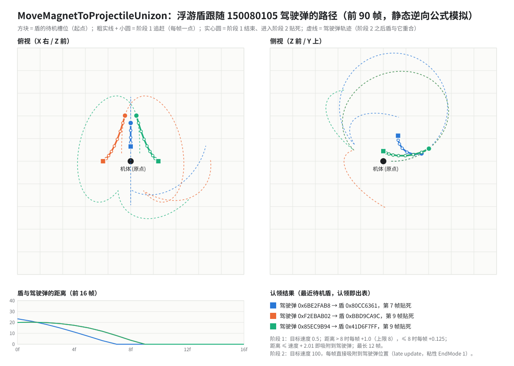

# 全装备独角兽（FAUC）浮游盾 / 浮游武装 UnitTask 系统深度分析

**Date:** 2026-09-26
**Binary:** `vsac27_Release.exe`（OB v27，`E:\OBHK0.3_v27`），image base `0x140000000`，IDA 实例 `ida-14644`
**Data（只读）:**

```text
bulletparam  E:\XB\mod\041cpm\fapt_gndmuc_008faunig_001_param\bulletparam.bin      (本文数值来源)
             E:\XB\mod\041cpm\015gndmuc_008faunig_001\bulletparam.bin              (原版，用于对照)
chrsysparam  E:\XB\mod\041cpm\fapt_gndmuc_008faunig_001_param\chrsysparam.csyspm
MSC          E:\XB\mod\040msc\015gndmuc_008faunig_001\2.c
Model / SHL  E:\XB\mod\002chara\015gndmuc_008faunig_001\ (+ _structure.json)
```

**证据分级（本文专用）**

| 级别 | 含义 |
|---|---|
| **E2** | OB v27 静态逆向（反编译 / 反汇编 / RTTI / 虚表）+ 数据文件交叉印证 |
| **E1** | 只读 MSC 源码或单一数据源推断 |
| **E0** | 推测，未取证 |
| **E3** | 实机验证 —— **本文没有任何 E3 结论** |

**Related:** [UnitTaskAutomata 总览](./unit-task-automata-deep-analysis.md) ·
[生成链路](./unit-task-automata-spawn-trace.md) ·
[CmdAction 字典](./cmdaction-research/README.md) ·
[sys_4F native](./exvs-msc-syscall-4f-native-handler.md) ·
[sys_4E notes](./exvs-msc-syscall-4e-notes.md) ·
[FAUC MSC 页](./msc-research/units/15008001-full-armor-unicorn/README.md)

---

## 0. 一页结论

| 问题 | 结论 | 级别 |
|---|---|---|
| 为什么 `0x80CC6361 / 0x41D6F7FF / 0xBBD9CA9C` 能生成上 / 左右各一面盾？ | 三行 bulletparam 的类 ID 字段 `0x0D6A5CD5` 都是 `150080102`，exe 把它分派到 `CUnitTaskAutomata_015GNDMUC_008FAUNIG_001_FunnelModel`（常驻浮游盾）。**位置不是写死在代码里的，而是每行自己的字段**：部署目标 = 机体矩阵 × (`0x3B52DAAB`, `0x4C55EA3D`, `0xDCEAF7AC`)，待机槽位 = 球坐标（距离 `0xA5364F08`、方位 `0x3C3F1EB2`、仰角 `0x4B382E24`）。三行只在这几列上不同：`0x80CC6361` 方位 0°/仰角 60°（头顶），另两行方位 ±90°/仰角 20°（两侧）。 | E2 |
| 为什么必须是"3 个不同的 hash"？ | 常驻盾以**自己的 bulletparam 行 hash** 作 key 登记进机体的 12 格常驻表；exe 还把 FAUC 的常驻清单 `[0x80CC6361, 0x41D6F7FF, 0xBBD9CA9C]` 与上限 3 **硬编码**在机体类初始化里。同一行生成两次会撞同一个表项。 | E2 |
| 150080105（近战联动环绕）是谁在动？ | `150080105` = `FunnelSankaiSelf`（VDK `FunnelSwarm` 系）。它本身是**看不见的驾驶弹**：生成时认领一面待机的常驻盾，常驻盾切到"被借用"段，用 `CCmdAction_MoveMagnetToProjectileUnizon` **磁吸跟随驾驶弹**。环绕轨迹由 exe 的 C++ step 树计算（`FunnelSwarm_RegisterSwarmOffset` / `RotateRefrect` / `MoveAheadDecel`），MSC 只负责"何时发射"。 | E2 |
| 逻辑都在 UnitTask 里吗？ | 是。行为 = 编译进 exe 的 `CCmdActionManager_*` step 树（不可通过文件修改），数值 = bulletparam 行字段（可改），触发时机 = MSC（可改）。 | E2 |
| 是随机挑一面盾吗？ | **不是随机**。选择函数 `sub_1406A56E0` 在常驻表里挑 `state==1`（待机）且**离驾驶弹生成点最近**的一面（上限 1000.0）；挑中后 `sub_1406A6400` 立刻把该表项清空，所以同一帧连续生成的 3 个驾驶弹必然拿到 3 面不同的盾。真正的随机只出现在环绕路径：`RotateRefrect` 用每个弹自己的 xorshift128 状态生成 ±63° 的随机偏转。 | E2 |
| "150080102 有 4 个、150080105 只有 3 个" | 第 4 行 `0xFD63CFCA` **只存在于 `fapt_…_param`**，原版 `015gndmuc_…` 只有 3 行；exe 清单、全部 MSC 语料都不引用它。若你让它也生成，它会以自己的 hash 登记为第 4 个待机项，3 个驾驶弹仍按"最近 + 认领即出表"挑 3 面，不会随机。 | E2 |

---

## 1. 从 MSC 到屏幕上的一面盾：完整链路

```text
MSC  sys_4F(0, slot=5, 0x80CC6361)                 ← 2.c func_1335
  │   sys_4F case 0 → sub_1405DEBD0 → sub_1405BCF00：在 arms 槽（336B entry）上扣弹药并
  │   把 (bulletHash) 排进该槽的待发射队列
  ▼
机体每帧 slot 18 → sub_140606D20                    ← 逐槽取出队列
  └─ sub_1406101B0(owner, armsSlot, bulletHash, …)   ← "发射请求构建器"
        ├─ 按 hash 找 bulletparam 行
        ├─ 读字段 0x0D6A5CD5 = 投射物类 ID（150080102）
        ├─ (*(qword_1421158A0+0x5B0A0))(owner, classId) 分配生成记录
        ├─ 记录里写入 row hash / 队伍 / 变换 / 目标
        └─ 用机体 +0x3160 的 xorshift128 派生本弹 RNG 种子（记录 +0x80）
  ▼
注册分派 sub_14097E740(core, classId)  —— 682-case switch
  └─ case 150080102 → sub_14095BF00：push 0x220 记录，+0x208 = 工厂 sub_140934BD0
  ▼
工厂 sub_140934BD0：alloc 0x3530 → sub_1406A4CF0（RadiconParentActor 基类构造）→ 写 FunnelModel vtable
  ▼
slot 79  参数块装配（写开关位 + 从 bulletparam 行读字段）
slot 2   OnInit（基类 OnInit；+417 置位时认领父对象；常驻物登记常驻表）
slot 81  CreateCmdActionManager → CCmdActionManager_…_FunnelModel
manager slot 1  Execute：搭建 step 树
  ▼
之后每帧：step 树推进（Series / Parallel / Jump），位置、朝向、骨骼、碰撞全部由 step 节点驱动
```

- class ID → 注册函数的对应关系是用 unicorn **直接模拟执行** `sub_14097E740` 得到的（见附录 C），不是猜 case 表。 **E2**
- `sub_140606D20` 遍历 336 字节 arms entry 的队列并调用 `sub_1406101B0`；同一函数也被常驻物补生成（§4.5）调用。 **E2**

---

## 2. FAUC 的 15 个投射物类（全部浮游 / 附属武装）

`UnitTask` 类名全称为 `CUnitTaskAutomata_015GNDMUC_008FAUNIG_001_<名字>`，manager 为
`CCmdActionManager_015GNDMUC_008FAUNIG_001_<名字>`。

| class ID | 类 | VDK 基类链（节选） | vtable | 行数 | 谁发射 | 作用 |
|---:|---|---|---|---:|---|---|
| 150080101 | `DetonatorBooster` | Detonator → Throw | `0x14164ED98` | 4 | MSC `func_1009` / `func_1012`（装甲排除） | 抛出的推进剂罐（模型 `0xF242DC47` = `wep_prprant00`），定时爆炸 |
| **150080102** | **`FunnelModel`** | **ResidentUnizonFloating → ResidentUnizonTukimatoiStageCollision → ResidentUnizon → Resident** | `0x14142D688` | 3（fapt 为 4） | MSC `func_1335/1336/1337` | **常驻浮游盾本体**（模型 `0x9BF5B23C` = `wep_shield00`） |
| 150080103 | `FunnelNotify` | RadiconParentActor | `0x14142D018` | 1 | MSC `func_1315`（进 NT-D） | 寿命 1000 的空壳通知体（manager = Blank + WaitForLifeTimeEnd） |
| 150080104 | `FunnelAttachChange` | Attach → AttachAbstract | `0x14142D350` | 9 | MSC `func_1349/1350/1351`（每次 3 行） | 认领常驻盾，挂到 `0x9A043915`（`wep_mty`）附近 |
| **150080105** | **`FunnelSankaiSelf`** | **FunnelSankaiBase → FunnelSwarm → FunnelMawarikomi → FunnelFly → Funnel** | `0x14142E9B8` | 3 | MSC `func_1354`（NT-D 任意格斗） | **借盾，以机体为中心散开环绕** |
| 150080106 | `FunnelSankaiTarget` | FunnelSankaiBase → FunnelSwarm → … | `0x14142ED00` | 3 | MSC `func_1358` | 同上，但环绕中心是目标 |
| 150080107 | `FunnelFly` | FunnelMawarikomi → FunnelFly → Funnel | `0x14142D9B8` | 3 | chrsysparam row 47（NT-D 格斗CS N） | 借盾，绕到目标侧后连射 5 发 |
| 150080108 | `FunnelFly_Double` | FunnelMawarikomiMultipleShot → FunnelMawarikomi → … | `0x14142DCE8` | 3 | 常驻盾部署后 `ShotBullet(0x41435BE6)` | 借盾（通常就是发射它的那面），多段射击 |
| 150080109 | `FunnelFlySword` | FunnelFlySwordPenetrate → FunnelFlySword → FunnelMawarikomi → … | `0x14142E018` | 3 | chrsysparam row 48（NT-D 格斗CS 方向） | 借盾，贯穿式冲撞 |
| 150080110 | `StickerFunnel_Close` | StickerFunnel_Base → StickerLaunchBone → Sticker | `0x14142F048` | 2 | MSC `func_1304` | 贴在机体骨骼上的盾（收合），显示 `wep_shield00` |
| 150080111 | `StickerFunnel_OpenRed` | 同上 | `0x14142F388` | 2 | MSC `func_1305` | 贴附盾（展开，红） |
| 150080112 | `StickerFunnel_OpenGreen` | 同上 | `0x14142F6C8` | 3 | MSC `func_1304` | 贴附盾（展开，绿） |
| 150080113 | `AssistHissatsuNorn` | StickerLaunchBone → Sticker | `0x14142FA08` | 1 | MSC `func_1246` | Banshee Norn 援护（贴附型） |
| 150080114 | `ThrowFunnelDead` | Throw | `0x14142E348` | 3 | MSC `func_1295`（`global988` 倒计时） | 借盾，投掷式；manager 会发编队消息 |
| 150080115 | `AssistNornShot` | SummonRushShot → SummonRush → Summon | `0x14142FD40` | 1 | chrsysparam row 46（NT-D 特射） | Banshee Norn 援护射击 |

- **"借盾"类**（参数块 `+0x1A1`（417）= 1）：104 / 105 / 106 / 107 / 108 / 109 / 114。它们都在 OnInit 里认领一面常驻盾（§4）。 **E2**（逐个反编译 slot 79）
- Notify / Sticker / Detonator / Assist 的 slot 79 及其直接基类装配器里都没有写 `+0x1A1`（基类装配器更深一层的嵌套调用未逐个检查）。 **E2**
- 所有 Funnel 系的 `GetClassId`（slot 28）返回 `977`，其他返回 `465`。 **E2**
- 107 / 109 / 115 在 MSC 里查不到 hash，它们写在 chrsysparam 动作表的 archetype 参数列里（row 46 `param0x1E`；row 47/48 `param0x20..0x22`）。 **E2**（数据）
- MSC 只在 `sys_0(0x500001) >= 3 && sys_0(0x500000, 7) == 0` 时启用 row 47/48（`func_324/325(0x1EACACC8 / 0x8B772D80)`）——**三面盾都在待机时格斗CS 才可用**。 **E1**

---

## 3. 常驻浮游盾 FunnelModel（150080102）

### 3.1 什么时候生成

NT-D 变身动作 `func_1066` 第 `0x640`（16.00）帧：

```c
sys_4E(0xf);        // 置"常驻物刷新"标志，下一帧机体 slot 60 → 上限设为 3（§4.5）
func_1335();        // sys_4F(0, 0x5, 0x80cc6361)
func_1336();        // sys_4F(0, 0x5, 0x41d6f7ff)
func_1337();        // sys_4F(0, 0x5, 0xbbd9ca9c)
sys_4E(0x3, 0x4);   // 机体 order 字 word12 bit0
```

`func_1326`（每帧）里另有兜底：`global975/976/977` 三个"待生成"标志都在时再发 `sys_4E(0xf)`。 **E1**

### 3.2 为什么是"上 / 左右"：每行字段的真实含义

下表是 FunnelModel **在 native 里实际怎么用**这些字段；第二列是 `src-tauri/src/format/bulletparam.rs` 里的通用池名（对这个类来说是错的）。

| 字段 hash | 池名（不适用） | FunnelModel 里的真实用途 | 读取位置 |
|---|---|---|---|
| `0x3B52DAAB` | rotation_angle | 部署目标 **X**（机体矩阵 X 轴分量） | manager slot 3 `sub_14101AE80` |
| `0x4C55EA3D` | acceleration_value | 部署目标 **Y** | 同上 |
| `0xDCEAF7AC` | homing_effective_distance | 部署目标 **Z** | 同上 |
| `0xD55CBB87` | aim_limit_angle | 部署耗时（帧，取整）：既是 `WaitByFrame`，也是 `MoveMagnet` 速度 = 距离 / 帧数 | 同上 |
| `0xABEDC73A` | launch_angle_horizontal | 部署朝向：机体前向 yaw + 该角度 | 同上 |
| `0xFAA5615C` | muzzle_offset_horizontal | 部署朝向：pitch | 同上 |
| `0x8DA251CA` | offset_angle_vertical | `CCmdAction_RotOffsetBoneContinuous` 的持续自转角（8°） | 同上 |
| `0xA25B8B11` | target_distance | 部署完成后、开火前的等待帧（5） | 同上 |
| `0x41435BE6` | on_expire_bullet_hash | 部署完成后 `ShotBullet` 的弹 hash（→ 150080108） | 同上 |
| `0xA5364F08` | aim_correction_angle | 待机槽位**距离**（26） | `sub_1411B0770` → `sub_1406A8D30` |
| `0x3C3F1EB2` | elevation_angle | 待机槽位**方位角**（yaw，度） | 同上 |
| `0x4B382E24` | target_height_offset | 待机槽位**仰角**（pitch，度） | 同上 |
| `0xD8F283FB` | secondary_effect_hash | 自身模型的 SHL model id：`0x9BF5B23C` = `wep_shield00` | OnInit `sub_140F631B0` |
| `0x0D6A5CD5` | projectile_id | 类 ID（150080102） | `sub_1406101B0` |

`sub_1406A8D30(dist, yaw, pitch)` 把 `(0, 0, dist)` 按欧拉角 `(x = −pitch, y = yaw)` 旋转，得到相对机体的待机偏移：

| 行 | 部署目标 (X, Y, Z) | 待机 (dist, yaw, pitch) | 待机偏移 ≈ (X, Y, Z) | 位置 |
|---|---|---|---|---|
| `0x80CC6361` | (0, 22, 8) | (26, 0°, 60°) | (0, 22.5, 13.0) | 头顶 |
| `0x41D6F7FF` | (27, 8, 15) | (26, 90°, 20°) | (24.4, 8.9, 0) | +X 侧 |
| `0xBBD9CA9C` | (−27, 8, 15) | (26, −90°, 20°) | (−24.4, 8.9, 0) | −X 侧 |
| `0xFD63CFCA`（仅 fapt） | (0, 22, 8) | (26, 0°, 80°) | (0, 25.6, 4.5) | 更高的头顶 |

- 部署朝向：`0x80CC6361` yaw +0° / pitch −30°；两侧行 yaw ±50° / pitch +30°。
- **+X 是机体左还是右**：若 EXVS2 为右手系 Y 轴向上、机体朝 +Z，则 +X 为机体左侧。未实机确认，**E0**。
- 三行其余字段（`0x6481E0F7=1`、`0x8DA251CA=8`、`0xA25B8B11=5`、`0xA5364F08=26`、`0xD55CBB87=45`、`0xEDD1C108=0x82D7298D`、`0xD8F283FB=0x9BF5B23C`）完全相同。**左右上的区别只来自上表几列**。 **E2**

### 3.3 行为树（manager `CCmdActionManager_…_FunnelModel`）

manager 继承链：`ResidingObjectUnizonFloating → ResidingObjectUnizonTukimatoiStageCollision → ResidentUnizon → RadiconParentActor → Radicon → CCmdActionManager`。
通用骨架是 `ResidentUnizon` 的 Execute（`0x1411AFD40`），FAUC 只覆写钩子：

| manager slot | 地址 | 归属 | 填什么 |
|---:|---|---|---|
| 1 | `0x1411AFD40` | ResidentUnizon | Execute：搭总骨架 |
| 3 | `0x14101AE80` | **FAUC** | 登场段（部署 + 开火） |
| 5 | `0x14101BCE0` | **FAUC** | A 段（待机）外壳 |
| 6 | `0x14101BFC0` | **FAUC** | B 段（被借用）开头：关碰撞 |
| 7 | `0x14101C050` | **FAUC** | B 段：Unizon 磁吸 + 盾展开姿态 |
| 9 | `0x1411B0260` | 基类 | TerminateSeriesEnd 之后的收尾 |
| 10 | `0x14101BF20` | **FAUC** | A 段末尾：重新开启 shell 碰撞 |

重建后的树（节点名为 RTTI 类名，数字为常量，`field(h)` 表示读本行 bulletparam 字段）：

```text
Root(Series)
├─ [slot 3 登场段]
│   Series S
│   ├─ Parallel P_deploy                                  ← 部署
│   │   ├─ MoveMagnet(speed = |target − pos| / field(0xD55CBB87))
│   │   │     target = ownerMatrix · (field(0x3B52DAAB), field(0x4C55EA3D), field(0xDCEAF7AC))
│   │   ├─ WorldRotate(yaw = ownerYaw + field(0xABEDC73A), pitch = field(0xFAA5615C))
│   │   ├─ RotOffsetBoneContinuous(0, field(0x8DA251CA)°, 0)
│   │   ├─ WaitByFrame(field(0xD55CBB87))      [EndMode 2：它结束则 Parallel 结束]
│   │   ├─ UpdateProjectileOrderFromParent(ch 4)
│   │   └─ 中断: WaitForProjectileOrder(ch 4) → Jump(L_skip)
│   ├─ GlobalEffect(0x4132659A)
│   ├─ ShieldPose(0°, 0°, 1.0, −2.0, 4f)                  ← 收合姿态（§3.4）
│   ├─ WaitByFrame(field(0xA25B8B11))
│   ├─ ShotBullet(field(0x41435BE6))                       ← 发射 150080108
│   ├─ WaitForProjectileObserveUnizon(true)               ← 等自己被借走
│   ├─ Jump(L_end)
│   ├─ L_skip: ShieldPose(…)，回到机体骨骼段（sub_14101C780）
│   └─ L_end
├─ SendMessageProjectileFormation(ch 11, bit 0)
├─ Parallel A  [slot 5 + ResidingObject 基类 sub_1411B0770]   ← A：待机
│   ├─ Series{ ShieldPose(收合), ResetProjectileOrder(ch 9, 全清), AttachedEffect_Stop,
│   │          Parallel{ SynchronizeParentTargetLockon,
│   │                    Series{ Parallel{ SynchronizedMove(槽位偏移, 2.0),
│   │                                      Series{ WaitByFrame 2, DistCheckerNearToStatusTargetMovePos(15.0) } [End 2],
│   │                                      WaitByFrame(30) [End 2] },          ← 到位或 30 帧
│   │                            slot10: SetCollisionEnableModeForShell(1),
│   │                            Parallel{ SynchronizedMove(槽位偏移, 0.8),
│   │                                      LimitDistance_FromActionStatusMoveTargetPos(15.0) } },
│   │                    AimingRotate(机体的锁定目标), RotateFrontOnTargetInvalid } }
│   └─ 中断: WaitForProjectileObserveUnizon(true) → Jump(L_borrowed)
├─ L_borrowed (Blank)
├─ Parallel B  [slot 6 + slot 7]                               ← B：被借用
│   ├─ SetCollisionEnableModeForStage(0)，SetCollisionEnableModeForShell(0)
│   ├─ Series{ Parallel{ MoveMagnetToProjectileUnizon(速度 0.5, 加速 1.0, 上限 8.0) [End 2],
│   │                    WaitByFrame(12) [End 2] },                     ← 阶段 1：追赶
│   │          MoveMagnetToProjectileUnizon(速度 100.0) [End 1] }        ← 阶段 2：每帧贴死（§5.7）
│   ├─ [+438 置位时] RotateToBoneMatrixProjectileUnizon
│   ├─ UpdateProjectileOrderFromParent(ch 9)
│   ├─ 触发: WaitForProjectileOrder(ch 9) → ShieldPose(−35°, 0°, 1.0, 1.1, 7f)   ← 展开
│   └─ 触发: Series{ WaitByFrame 4, WaitForProjectileOrderNone(ch 9, bit 17) } → AttachedEffect_Start(0x6C4CBB9C)
│   └─ Series{ WaitForProjectileObserveUnizon(false), RegisterStandbyList, Jump(A) }   ← 归还
└─ L_tail …（参数块 +436 置位时：TerminateSeriesEnd + 收尾）
```

- `MoveMagnet` 类名来自 `sub_14069C0E0` 写入的 vtable `CCmdAction_MoveMagnet`；`SynchronizedMove`、`MoveMagnetToProjectileUnizon` 都以它为基类。 **E2**
- FunnelModel 参数块常量（slot 79 `sub_140F63270`）：`+0x1B0 = 12`（B 段过渡帧）、`+0x1D0 = 15.0`、`+0x1D4 = 30`、`+0x64 = 1`。 **E2**
- 部署段之后的 `ShotBullet(→150080108)`：150080108 也是借盾类，它会把**刚刚发射它的那面盾**（距离≈0，最近）借走，于是盾会随 `FunnelFly_Double` 飞出做一次多段射击再回来。这是静态结构推论，**是否在实战中可见需实机确认（E2 结构 / E0 表现）**。机体在部署期间被打（`sys_4E(0x8)` → ch 4）会跳过这次攻击。

### 3.4 盾模型骨骼（`wep_shield00`）

FAUC 自有助手 `sub_14101BA40(pose)` 一次写 4 根骨 + 1 个复位节点：

| 步骤 | 骨骼 hash | 骨骼名 | 收合 (默认) | 展开 (ch 9 触发) |
|---|---|---|---|---|
| `CCmdAction_RotateOffsetBone` | `0x5286ED9B` | `ATH_OR_HANE00` | 0° | **−35°** |
| `CCmdAction_RotateOffsetBone` | `0x2581DD0D` | `ATH_OR_HANE01` | 0° | 0° |
| `CCmdAction_TransOffsetBone` | `0x62878968` | `ATH_OT_ITA` | 1.0 | 1.0 |
| `CCmdAction_TransOffsetBone` | `0x3271A69D` | `ATH_OT_GAT` | **−2.0** | **1.1** |
| `CCmdAction_RotateOffsetBoneContinuousReset` | — | — | 4 帧 | 7 帧 |

四个 hash 都在 `wep_shield00.jnttbl` 里，名字来自同目录 `.nusktb`。所以"展开"就是**翻开盾片 HANE00 并把光束加特林 GAT 滑出**。 **E2**

### 3.5 常驻清单与上限写在 exe 里

FAUC 机体类 `CUnitTaskCharacterCHR_015GNDMUC_008FAUNIG_001`（vtable `0x141B15260`）自有 slot：

| slot | 地址 | 内容 |
|---:|---|---|
| 61 | `0x1403DF490` | 初始化：`this+0x2EB0 = new 0xA0（常驻表）`；`sub_140638570(this+0x34E90, 表, 清单@0x141AA26E0, 3)` |
| 60 | `0x1403DFD30` | `sub_140638590(this+0x34E90, 3)`：上限 3，补生成缺失的常驻物 |
| 18 | `0x1403DF6A0` | 每帧：先 `sub_140606D20`（落地排队的弹），再处理 Norn 援护对齐 |
| 56 / 63 / 74 | — | 与本系统无关（动作 id 对 / shell 引用 / 骨骼组） |

`0x141AA26E0` 处的清单：`0x80CC6361, 0x41D6F7FF, 0xBBD9CA9C`（后跟 `0xFFFFFFFF`）。
515 变体 `CUnitTaskCharacterCHR_515GNDMUC_008FAUNIG_001` 的 slot 60/61/63 都是空函数——**不建常驻表**。 **E2**

---

## 4. 常驻表：借盾的核心机制

### 4.1 结构（机体 `+0x2EB0` 指向，0xA0 字节，构造 `sub_140363BC0`）

```text
+0x00  entry[12] { u32 id; u32 state; }      id = 常驻物状态块 +0x10 的值（MSC 直接生成时即行 hash）
+0x60  u32 limit                              sub_140638590 写入（FAUC = 3）
+0x6C  u32 configuredIds[12]                  sub_140638570 写入（FAUC 清单）
+0x9C  u32 configuredCount                    FAUC = 3
```

state 取值（由读写点反推）：

| state | 含义 | 写入者 |
|---:|---|---|
| 0（且 id=0） | 空 / 已被认领 | `sub_1406A6400`（认领时清零整项）、`sys_4E(0x10)` 清表 |
| 1 | 待机、可借 | 常驻物 OnInit `sub_140DE3600`；归还消息 `0x20000019` |
| 2 | 已退役 / 缺席 | `sub_140638590`（清单内但超上限、未生成）；`sub_1406386B0`（超上限时强制回收） |
| 3 | 排队重生 | `sub_1406386B0` / `sub_1406A6400` 在配额允许时把一个 2 升为 3 |

表操作：`sub_140627870(table, id, state)` 更新或插入；`sub_140627820(table, id)` 查找；`sub_1406277F0(table)` 统计 id≠0 的项数；`sub_1406277D0` 整表清零。 **E2**

### 4.2 登记与归还

- **登记**：常驻物 OnInit（`sub_140DE3600`，经 FunnelModel OnInit `sub_140F631B0 → sub_140DE3670`）把自己以 `state=1` 写入父机体的表。**不查清单**，任何常驻物都会登记。 **E2**
- **归还**：B 段末尾 `CCmdAction_RegisterStandbyList`（start `0x140696250` → `sub_1406A6320`）向机体发消息 `0x20000019 {id}`；机体每帧 `sub_1406084A0 → sub_140638470` 处理该消息，执行 `sub_140627870(table, id, 1)`。 **E2**

### 4.3 认领（这就是"用哪一面盾"的答案）

借盾类的 OnInit 走 `sub_1406A5BA0`：

```text
if (param[+0x1A1]) {                               // +417 = "有父对象"
    owner = sub_14066E6B0(this)                    // 顶层机体
    entry = vtbl[95](this, owner->residentTable)   // sub_1406A56E0：挑选
    this->claimedId(+0x3520) = entry->id           // ★ entry 为空时这里是空指针解引用
}
vtbl[99](this)                                     // sub_1406A5B20 → sub_1406A6400：认领
```

挑选 `sub_1406A56E0`：

```text
best = −1; bestDist = 1000.0; fallback = −1
for i in 0..11:
    if entry[i].id == 0: continue
    if entry[i].state == 2 and fallback < 0: fallback = i
    if entry[i].state == 1:
        d = | this.pos(+0x4C0) − child(owner, entry[i].id).pos(+0x4C0) |
        if d <= bestDist: bestDist = d; best = i
return best ≥ 0 ? &entry[best] : (fallback ≥ 0 ? &entry[fallback] : null)
```

认领 `sub_1406A6400`：若选中项 `state==1`，把该项 `id/state` 清零（出表），再把第一个 `state==2` 的项升为 3（允许补一个）。 **E2**

**结论**：
1. **不随机**——最近的待机盾优先，距离相等时取下标较大的（`<=` 比较）。
2. **同一帧不会重复**——认领即出表。
3. `func_1354` 按 `0x6BE2FAB8`（水平偏移 0）→ `0xF2EBAB02`（−8）→ `0x85EC9B94`（+8）顺序发射。三面盾静止在槽位时，第一个拿头顶那面，后两个各拿**与自己生成偏移同侧**的那面。盾在移动中时以当时的实际距离为准。
4. 如果场上有 4 面待机盾，3 个驾驶弹拿走离各自生成点最近的 3 面，剩下那面继续待机。

### 4.4 被借用的判定：`WaitForProjectileObserveUnizon`

条件 slot 5 `sub_1406A4730`：`(slot16(this) != 0) == expected`。
slot 16 `sub_1406A4090` → `sub_14060AB90 → sub_14060A870(owner, myId)`：遍历机体的子弹对象，找类型位 `0x100` 且 `+0x3520(claimedId) == myId` 的对象。**找到 = 我正被某个驾驶弹借用。** 驾驶弹一消失，条件翻转，盾就归还。 **E2**

### 4.5 维护与补生成

- `sys_4E(0xF)`：把机体 status `+0x36E` 置 1；机体更新 `sub_1406380A0` 看到后调用一次 slot 60 并清零。FAUC slot 60 = `sub_140638590(mgr, 3)`：设上限 3；清单里的 id 如果对象不存在也不在表里——下标 < 上限就直接 `sub_1406101B0` 生成，否则记为 state 2。
- `sys_4E(0x10)`：清掉 `+0x36E` 标志、整表清零，并置 order word5 bit0（及 latch5）。FAUC MSC 未使用。
- 维护 `sub_14060B870 → sub_140638540 → sub_1406386B0`（调用方推断为机体每帧更新；脏标志 `mgr+0x10` 由每帧的 `sub_140638510` 置位）：把配额内的 2 升为 3；state 3 的清单 id 立即重生；清单内 state 1 的数量超过上限时，多出来的调用对象 vtbl[+0xB8] 回收并记为 2。
- **只有清单里的 id 会被自动重生 / 限额**。清单外的常驻物（例如 fapt 的第 4 行）只会自己登记，不会被补生成，也不受上限约束。 **E2**

### 4.6 MSC 能看到的两个查询

| MSC | native | 含义 |
|---|---|---|
| `sys_0(0x500001)` | `sub_1406277F0(ctx+0x2A50)`（= 机体 `+0x2EB0` 常驻表） | 表中 id≠0 的项数。被借走的项已清零，所以 `>= 3` = 三面盾都在待机 |
| `sys_0(0x500000, n)` / `sys_4E(0xC, n)` | 读 `S+0x240 + 4n`（S = 机体 `+0x2E58`） | 某组计数；FAUC 用 n = 1/3/4/5/6/7 做门控。写入方未追到（E1） |

`ctx` 是脚本侧看到的对象指针，等于 `UnitTask + 0x460`（由 `sys_4E(0xF)` 写 `ctx+0x29B8→+0x36E`、机体读 `this+0x2E18→+0x36E` 两处同址反推）。 **E2**

---

## 5. 近战联动环绕：150080105 `FunnelSankaiSelf`

### 5.1 触发（MSC，E1）

```c
func_1353() { global985 = 0x2; }                  // 被大量格斗动作调用（第三形态任意格斗）
func_1354() {                                     // 每帧 tick 里调用
    if (sys_0(0x500001) >= 0x3 && sys_0(0x500000, 0x7) == 0)
        if (global985 == 0x2) {
            sys_4F(0, 0x5, 0x6be2fab8);           // 水平偏移 0
            sys_4F(0, 0x5, 0xf2ebab02);           // −8
            sys_4F(0, 0x5, 0x85ec9b94);           // +8
            global986 = 0x1;
        }
    if (global985 >= 0x1) global985--;
}
func_1355() {                                     // 近战链结束
    if (global985 == 0 && global986 == 0x1 && global987 == 0) { sys_4E(0x3, 0x2); global986 = 0; }
}
```

`sys_0(0x500001) >= 3` 这道门**不是可选的**：借盾类在 OnInit 里无条件解引用挑选结果，表里没有可借项会返回空指针（§4.3 ★）。**E2（静态）**

### 5.2 参数：谁读了哪一列

参数块装配 slot 79 `sub_140F63AF0` → `sub_140F639A0`（FunnelSankai 通用）：

| 参数块 | 来源字段 | 150080105 值 | 用途 |
|---|---|---|---|
| `+0x1A1` | 常量 1 | — | 认领常驻盾 |
| `+0x1B4` | 常量 1 | — | 末尾 TerminateSeriesEnd |
| `+0x210` | `0xDCEAF7AC` | 4.0 | `FunnelSwarm_MoveAheadDecel` 速度 |
| `+0x214` | `0xABEDC73A` | 3° → rad | 转向 |
| `+0x21C` | `0xFAA5615C` | 32.0 | `DistCheckerNearToTargetOffset` 判定距离 |
| `+0x220` | `0x8DA251CA` | 12.0 | 第一个环绕点的半径 |
| `+0x224 / +0x228 / +0x1B7` | Self 版强制 0 | — | 关掉：前置段、击杀目标即结束、目标被杀即返回 |

其他行字段：寿命 `0x32ACABFB = 1200` 帧；生成偏移 `0x55C77696 = 0 / +8 / −8`，`0x9C9D876E = 7`。unit 类还有 slot 100–103 四个 getter（`0x140F63890 / 0x140F63910 / 0x140F638D0 / 0x140F63960`）按需重读上面四个字段。 **E2**

### 5.3 行为树

FunnelFly 系共用一个**模板方法** Execute（`0x140DFB7D0`）：

```text
Root
├─ 发射段 Series：SetCollisionResolveType(0)，slot3，[+0x1B7: WaitForTargetKilled→Return]，
│                SetCollisionResolveType(param)，[field 0xD462A33B ≠ 0: PlaySE]，slot4
├─ 接近段 Series：slot5，slot6
├─ [+0x1B8] 攻击循环：Parallel(slot16) 中断→Return；slot17；Jump(接近段)
├─ Return
├─ 返回段 Series：slot8，Parallel(slot9)，slot10，[field 0xA36593AD ≠ 0: PlaySE_OnParentVisible]
└─ [+0x1B4] TerminateSeriesEnd …
```

Sankai 覆写的钩子：

| slot | 地址 | 内容 |
|---:|---|---|
| 5 | `0x14101D6F0` | **FAUC**：`SendMessageProjectileFormation(ch 9, bit 17)`，然后调用 Swarm 接近段 `sub_1411AC4C0` |
| 9 | `0x14101D680` | **FAUC**：返回段 → `sub_14101C780`（磁吸回机体 `0x82D7298D` 骨骼） |
| 24 | Self `0x14101D660` / Base `0x1411ABFF0` | **环绕中心**：Self = 机体（`owner+0x528` 句柄）；Base/Target = 目标 |
| 25 | `0x14101D7B0` | **FAUC**：`CCmdAction_Return` |
| 28 | `0x1411ACB40` | Swarm 环绕循环 |
| 29 | `0x1411AD060` | Swarm 移动：`FunnelSwarm_MoveAheadDecel(speed=+0x210)` ∥ `FunnelSwarm_AimingRotateDynamicOffset(center)` |

**`150080105` 与 `150080106` 的唯一区别就是 slot 24 返回的中心**（加上各自 bulletparam 行的数值）。 **E2**

Swarm 接近段 `sub_1411AC4C0` 与环绕循环 `sub_1411ACB40`：

```text
接近段 Series（slot 5 先放一个 SendMessageProjectileFormation(9, 17)）
├─ [+0x224] Parallel(slot 26)                       ← Self 版关闭
├─ [+0x226] Blank 标签（登记在对象 +0x3550）
├─ [+0x227] SetCollisionEnableModeForStage(0)
├─ Parallel P_swarm
│   ├─ slot 28 环绕循环（见下）
│   ├─ 终止条件 A：UpdateProjectileOrderFromParent(ch 8) + WaitForProjectileOrder(ch 8, bit 3) [End 2]
│   └─ 终止条件 B（sub_1411AC1A0）：Series{ Parallel{ WaitForLifeTimeEnd(1200) [End 2],
│                                                      [+0x228] WaitForTargetKilled [End 2] },
│                                            +0x225 ? SetProjectileOrder(ch 8, bit 3) : Return }
├─ [+0x227] SetCollisionEnableModeForStage(1)
├─ RestartUpdateHomingTarget
└─ Parallel{ UpdateProjectileOrderFromParent(ch 8), slot 25 = Return（FAUC）, UpdateRotate,
             WaitByFrame(field 0x3C3F1EB2 = 0) [End 2], 终止条件 B 同上 }

环绕循环 slot 28
Series
├─ FunnelSwarm_RegisterSwarmOffset(center, radius = +0x220 = 12)
├─ L_loop (Blank)
└─ Parallel
    ├─ Series{ DistCheckerNearToTargetOffset(center, dist = +0x21C = 32, offset = (0, +0x218, 0)),
    │          FunnelSwarm_RegisterSwarmOffset(center, radius = 8.0 硬编码),
    │          FunnelSwarm_RotateRefrect(center),
    │          WaitByFrame(5),
    │          Jump(L_loop) }
    └─ slot 29：FunnelSwarm_MoveAheadDecel(speed = +0x210) ∥ FunnelSwarm_AimingRotateDynamicOffset(center)
```

### 5.4 环绕数学

**`FunnelSwarm_RegisterSwarmOffset`**（start `0x1411AE2F0`）：

```text
// this.pos = 对象 +0x4C0；center.pos = 中心句柄解析出的记录 +0xC0
dir     = normalize(this.pos − center.pos)
v       = dir · (−radius)          // 目标点在中心的"对侧"
v.y     = max(v.y, 2.0)            // 不低于中心附近的高度
offset  = normalize(v) · radius
this.swarmOffset(+0x3540) = offset
this.actionStatus.targetMovePos = center.pos + offset
```

**`FunnelSwarm_RotateRefrect`**（start `0x1411AE460`）：只在自己正**朝中心**飞行时生效（代码用 `−前向`，常量 `0x141B4FA80 = (−1,−1,−1,−1)`）。把前向按球面外法线做镜面反射（`f − 2(f·n)n`：法向分量翻成朝外、切向分量保留），再用本弹自己的 xorshift128 状态（对象 `+0x3160..+0x316C`）生成 3 个 [−1.0995574, 1.0995574] rad（**±63°**）的欧拉角去扰动；最多试 5 次，要求结果朝外，然后以速率 π **立即**写入朝向。 **E2**

合起来的效果：每个驾驶弹大约每 5 帧重新选一个"半径 8、在机体另一侧、不贴地"的点，一边减速前进一边转向那个点，飞出去时再被随机偏转——就是三面盾在身边穿梭的"蜂群式"环绕。**运动完全由 exe 计算**，每帧跟随机体移动（中心按句柄每帧重取位置）。随机种子来自 `sub_1406101B0` 生成时从机体 RNG 派生的值，对局内是确定性的。

### 5.5 你看到的盾是怎么动的

驾驶弹本身没有模型：150080105 行的 `0x68CD7942`（depiction）为 0，`0xD8F283FB` 也为 0。看到的是被借走的 FunnelModel：B 段用 `MoveMagnetToProjectileUnizon` 追到驾驶弹身上并贴住（slot 22 同样以 `sub_1406A4090` 找到驾驶弹）。B 段期间关闭 stage / shell 碰撞。逐帧算法与路径图见 §5.7。 **E2**

### 5.6 结束与归还

- 驾驶弹寿命 1200 帧，接近段在寿命到、或 order ch 8 bit 3 到达时结束，随后 `Return` / 返回段飞回机体并消失；驾驶弹一消失，盾的 `ObserveUnizon(false)` 成立 → `RegisterStandbyList` → 表项回到 state 1 → A 段飞回槽位。 **E2**
- MSC 在近战链结束时发 `sys_4E(0x3, 0x2)`（机体 order word10 bit0）。在本次能确定通道常数的全部 338 个 order 节点里，**没有找到 FAUC 类监听 word10**（只有两个非 FAUC 类）。所以"近战结束立刻收回"的具体路径**未闭合**，见 §10。

### 5.7 `MoveMagnetToProjectileUnizon` 的移动路径



上图按下面的逆向公式逐帧模拟（机体静止在原点、朝 +Z；随机种子固定）。它是**示意**：驾驶弹的生成高度、`param+0x218` 的高度偏移、对象之间的更新先后都取了假设值，但每条公式都来自 OB v27 反编译。 **E2（公式）/ E0（具体数值轨迹）**

**这个 step 怎么被驱动**

| 事实 | 依据 |
|---|---|
| slot 12（普通 update）是空函数，真正的逻辑在 slot 13；slot 9 返回 true 表示"要 late update" | vtable `0x14162E330` |
| Parallel 的 late update 会调用 slot 13（`0x1406A24B0`）；Series 在自身结束且 EndMode = 1 时继续 late-update 最后一个子节点（`0x14068A830`） | 组节点反编译 |
| 所以阶段 2（EndMode 1）吸附到驾驶弹后**每帧继续执行**，不是吸一下就停 | 同上 |

**每帧 slot 13（`sub_1406AC4D0`）**

```text
1. carry 模式（handle +0x84 有效时把目标的位移直接加到自己身上）—— Unizon 版 +0x84 = 0，不启用
2. target = 驾驶弹位置（slot 18 → slot 22 → 驾驶弹对象 +0x4C0）
   + 旋转后的偏移 +0x70（Unizon 版为 0，所以目标就是驾驶弹本身）
   → 写入 action status +0x10
3. MoveMagnet 基类 update（sub_1406AAF20）：
   dist = |pos − target|
   if 已到达:  若 +0x50 且 dist > 5 → 取消到达，重新追
   elif dist > cap(+0x3C) 且 speed > 目标速度×0.8:  进入"远距"分支
   远距分支：若本帧速度没变 → speed = min(speed + accel(+0x38), cap)
   近距分支：speed = min(speed + 目标速度×0.25, max(目标速度, cap))
   speed = max(speed, 0.1)
   step = speed × 时间倍率(ctx+0x154)
   if step + margin(+0x24) + 0.01 ≤ dist:  沿直线朝 target 走 min(step, dist)
   else:                                  直接放到 target（+0x28 默认 1）并标记到达
4. 卡住检测 / 300 帧超时（sub_1406AC540）只在 +0x50 = 0 时生效 —— Unizon 版 +0x50 = 1，关闭
```

**FunnelModel B 段给的两组参数**（`sub_1411B0270`，第一组经 `sub_1406AE800(accel, cap)` 设置）

| | 目标速度 `+0x2C` | 加速 `+0x38` | 上限 / 远距阈值 `+0x3C` | 余量 `+0x24` | 结束 |
|---|---|---|---|---|---|
| 阶段 1 | 0.5 | 1.0 | 8.0 | 2.0 | 到达，或与 `WaitByFrame(12)` 并行时满 12 帧（EndMode 2） |
| 阶段 2 | 100.0 | 0 | 0 | 0 | 不结束（EndMode 1，粘性） |

**所以路径长这样**

1. **起点是待机槽位**（图中方块）。
2. **阶段 1 = 加速直线追击**：离驾驶弹超过 8 时，速度 0.5 → 1.5 → 2.5 …… 每帧 +1，最高 8；进入 8 以内后每帧只加 0.125。每帧都重新瞄准驾驶弹**当前**位置，所以驾驶弹在动时，这段是一条弯向驾驶弹的追逐曲线（图中粗实线，每个小圆是一帧）。只要剩余距离 ≤ 当前速度 + 2.01，就直接吸附过去。
3. **阶段 2 = 贴死**：速度 100、余量 0，每帧直接把盾放到驾驶弹的位置。从此盾的轨迹就是驾驶弹的轨迹（图中虚线）。模拟里三面盾分别在第 7、9、9 帧贴上。
4. **驾驶弹的轨迹**：速度 4.0 单位/帧，每帧最多转 3°（离目标点超过 11 时 4.8°）；每约 5 帧在机体 32 单位以内时换一个"对侧、半径 8"的目标点，且若正朝机体飞，就立即镜面反弹并随机偏转 ±63°。转向慢而速度快，所以它会冲出去、绕一个大弧再飞回、在机体附近被弹开——呈花瓣状的穿梭，模拟里最远约 96 单位。
5. **结束**：驾驶弹消失后，盾的 `ObserveUnizon(false)` 成立，登记回待机表，A 段用 `SynchronizedMove` 飞回槽位（这一段不在图中）。

**与之前说法的更正**：§3.3 早先把 0.5 / 100.0 写成"磁吸系数"。它们是 `MoveMagnet` 速度控制器的**目标速度**。 **E2**

---

## 6. 其他 FAUC 浮游武装速览

| 类 | 关键点 | 级别 |
|---|---|---|
| 107 `FunnelFly` | 攻击钩子 slot 14 `0x14101C490`：`PlayLoopSE(0xE6C07927)`，循环 N 次（N = `0xDCEAF7AC` = 5）`ShotBullet(0x41435BE6 → 0x72BA9394)`，间隔 `0xABEDC73A` = 3 帧，最后一发后 `StopLoopSE`。slot 12 `0x14101C3D0` 加 `StopLoopSE`。参数块 `+0x1A1 = 1`、`+0x1A3 = 1`。 | E2 |
| 108 `FunnelFly_Double` | 自有 Execute `0x140FFD600`（MultipleShot），参数块额外 `+0x98 = 1`。 | E2（结构）|
| 109 `FunnelFlySword` | slot 14 `0x14101D510`：`PlaySE(0x78A4EC84)` 后接 VDK `SwordPenetrate` 冲刺段 `sub_1411A6460`。 | E2 |
| 104 `FunnelAttachChange` | 参数块 `+0x1A1 = 1`，`+0x198 = 9`，挂接目标由 slot 100/101 提供；行字段 `0xEDD1C108 = 0x9A043915`（`wep_mty`）。 | E2 |
| 114 `ThrowFunnelDead` | `+0x1A1 = 1`，`+0x68` 按位或 `0x50`；manager 构造 `SendMessageProjectileFormation`。 | E2 |
| 110–112 `StickerFunnel_*` | StickerLaunchBone：把 `wep_shield00` 贴在不可见的 `wep_toumei` 模型（`0xAC13AB97 / 0x561C96F4 / 0xB1A4BBF3`）上，三种开合状态由 `func_1304 / func_1305` 按形态切换。 | E2（数据）/ E1（MSC） |
| 103 `FunnelNotify` | 参数块只写 `+0x198 = 11`，树 = Blank + WaitForLifeTimeEnd(1000)。 | E2 |

---

## 7. MSC ↔ 浮游炮的通信：order 总线与消息

### 7.1 order 总线

每个 UnitTask（机体和子弹都有）在 `ctx+0x29F8`（= 对象 `+0x2E58`）有一块 status：

```text
+0x000  u64 word[16]          bitset<40> "指令字"
+0x080  u64 latch[16]         写 bit0 时同步置位
+0x100  formation[16] (16B)   机体专用：编队消息登记表 {classId, moveType, ch, bit}
+0x200  u32 formationCount[16]
+0x240  u32 counter[...]      sys_0(0x500000,n) / sys_4E(0xC,n) 读取
```

`sys_4E`（handler `sub_1406840C0`）写机体的指令字：

| MSC | 写入 |
|---|---|
| `sys_4E(0x0)` | word0 bit0，latch0，另有 `+0x2A30` 标志 |
| `sys_4E(0x3, n[, k])` | word `9 + (n−1)`（n=2..7 → 10..15，其余 → 9）的 bit k（k ∈ {0,1,2}） |
| `sys_4E(0x4[, k])` | word3 bit k |
| `sys_4E(0x5, a, b)` | a=0/1/2/3 → word8 bit 3/4/6/6+b；a=8/9/0xA/0xB → word3 bit 3/4/5/6+b；a=0x11 → word10 bit 8 |
| `sys_4E(0x5, 其他)` | word9 bit 7 |
| `sys_4E(0x6[, k])` / `(0x7[, k])` / `(0x8[, k])` | word6 / word7 / **word4** bit k |
| `sys_4E(0xF)` / `(0x10)` | 常驻物刷新 / 清表（§4.5） |

所有子命令在 bit = 0 时同时置位对应的 latch 字。

子弹侧的节点：

| 节点 | 行为 |
|---|---|
| `UpdateProjectileOrderFromParent(ch)` | 每帧把**机体** word[ch] OR 进自己的 word[ch]（`0x140696190`） |
| `WaitForProjectileOrder(ch, bits…)` | 自己 word[ch] 满足条件即完成 |
| `WaitForProjectileOrderNone(ch, bits…)` | 相应位全部消失才完成 |
| `ResetProjectileOrder(ch, bit / −16)` | 清一位 / 整个字（`0x1406963D0`） |
| `SetProjectileOrder(ch, bit)` | 给自己置位 |

FAUC 实际用到的通道：

| 通道 | 谁置位 | 谁在听 | 效果 |
|---|---|---|---|
| word4 | `sys_4E(0x8)`（受击反应 `func_812…925`，共 32 处） | FunnelModel 部署段 | 跳过部署后的攻击 |
| word9 | `sys_4E(0x3, 0/1)`；Sankai 的编队消息 (9, 17) | FunnelModel B 段 | 展开姿态 / 附着特效 |
| word8 bit3 | `sys_4E(0x5, 0)`；自身寿命结束 `SetProjectileOrder(8,3)` | Swarm 接近段 | 结束环绕 |
| word10 | `sys_4E(0x3, 0x2)`（`func_1355`） | 未找到 FAUC 监听者 | — |

### 7.2 消息

| 消息 id | 发送者 | 接收处理 | 作用 |
|---|---|---|---|
| `0x20000019` | `RegisterStandbyList`（`sub_1406A6320`） | 机体 `sub_140638470` | 常驻表项置 1（归还） |
| `0x2000000C` | `SendMessageProjectileFormation`（`sub_1406A5E10`） | 机体 `sub_14066C1A0 → sub_1406266F0` | 按 (发送者类 ID, moveType) 记入编队表 `S+0x100`，计数 +1 |

编队表到 word 位的转发路径未单独追到（E1）。

---

## 8. 抽象：EXVS2 的 UnitTask 是怎么运行的（给自制用）

### 8.1 分层模型

```text
┌ MSC（可改）────────────────────────────────────────────────┐
│ 何时发射：sys_4F(0,slot,rowHash)   何时下令：sys_4E(...)   │
│ 门控：sys_0(0x500001) 常驻可用数 / sys_0(0x500000,n)        │
└──────────────┬───────────────────────────────────────────┘
               ▼
┌ bulletparam 行（可改）─────────────────────────────────────┐
│ 0x0D6A5CD5 = 类 ID → 决定用哪个 C++ 类                     │
│ 其余字段 = 这个类自己定义的参数（同一列在不同类里意义不同）│
└──────────────┬───────────────────────────────────────────┘
               ▼
┌ UnitTask 类（exe，只能 patch）──────────────────────────────┐
│ 注册 switch → 工厂 → vtable                                │
│ slot 79 参数块装配 | slot 2 OnInit | slot 95/99 认领父对象 │
│ slot 81 → CCmdActionManager_*                              │
└──────────────┬───────────────────────────────────────────┘
               ▼
┌ CCmdActionManager（exe）────────────────────────────────────┐
│ Execute = 模板方法：按固定段落搭树，段落内容由虚函数钩子提供│
└──────────────┬───────────────────────────────────────────┘
               ▼
┌ step 树（exe）──────────────────────────────────────────────┐
│ Series / Parallel / Jump / Blank 标签 + 各种 CCmdAction_*   │
│ 每帧推进；跨对象通信只靠 order 总线、消息、常驻表           │
└───────────────────────────────────────────────────────────┘
```

### 8.2 UnitTask 对象关键偏移（OB v27）

对象基址记为 `O`，脚本 / step 看到的上下文 `ctx = O + 0x460`。

| 偏移 | ctx 偏移 | 内容 |
|---|---|---|
| `O+0x0490/04A0/04B0/04C0` | `+0x30/+0x40/+0x50/+0x60` | 世界矩阵行（X/Y/Z 轴、平移）；`+0x4C0` 即当前位置，挑盾距离、Swarm 选点都用它 |
| `O+0x0528` | — | 顶层所属机体的句柄：消息目标；Self 版环绕中心取机体的这一项 |
| `O+0x0530` | — | 部署偏移所用原点（机体） |
| `O+0x2E18` | `+0x29B8` | 机体 status：`+0x36E` 常驻刷新标志 |
| `O+0x2E20` | `+0x29C0` | 子弹 status：`+0x10` 自身 id、`+0x14` 查找 id、`+0x38` 行参数指针对、`+0xA0` 优先级 |
| `O+0x2E30` | `+0x29D0` | 链接结构（`+8` = 自身对象；顶层机体由它解析） |
| `O+0x2E58` | `+0x29F8` | order 总线（§7.1） |
| `O+0x2E60` | `+0x2A00` | action status：`+0x10` 目标移动点 |
| `O+0x2EB0` | `+0x2A50` | **机体**：常驻表指针 |
| `O+0x3160..316C` | — | xorshift128 状态 |
| `O+0x34A0` | — | 参数块指针（slot 78 分配，slot 79 填写） |
| `O+0x3520` | — | 认领到的父对象（常驻物）id |
| `O+0x3540` | — | Swarm 动态偏移 |
| `O+0x34E90` | — | **机体**：常驻管理器（`+8` = 表指针，`+0x10` 维护脏标志） |

### 8.3 参数块中与本系统相关的位

| 偏移 | 含义 |
|---|---|
| `+0x1A1`（417） | 1 = OnInit 认领父对象（借盾） |
| `+0x1A3`（419） | 1 = OnInit 把子弹 status `+0x30` 字节清 0（FunnelFly 置位，语义未定） |
| `+0x1B0`（432） | FunnelModel：B 段过渡帧 12 |
| `+0x1B4`（436） | 1 = 树尾追加 TerminateSeriesEnd |
| `+0x1B7/1B8`（439/440） | Funnel：目标被杀即返回 / 攻击循环 |
| `+0x1D0/1D4`（464/468） | FunnelModel：A 段距离 15.0 / 等待 30 |
| `+0x210..0x228`（528..552） | Funnel / Swarm 参数（§5.2） |

### 8.4 step 树原语

| 原语 | 实现 | 说明 |
|---|---|---|
| `CCmdActionGroup_Series` | 0x118 字节，子节点数在 `+0xF0` | 当前子节点完成才推进 |
| `CCmdActionGroup_Parallel` | `sub_14068DAF0`，0x80 字节，`CCmdActionArray<10>` | 最多 10 个子节点，同时推进 |
| EndMode（节点 `+0x1C`） | 1 / 2 | 2 = 该子节点完成即结束所在 Parallel（WaitByFrame / WaitForLifeTimeEnd 常用）；1 = 粘性，完成后组仍每帧继续 update / late update 它（`0x1406A2440`、`0x14068A830`） |
| `CCmdAction_Jump(label, series)` | — | 跳到某 Series 里的 Blank 标签 |
| 中断 | `sub_1406A1F40(par, ctx, cond, {label, series})` | 往 Parallel 加 `Series{cond, Jump}` |
| 触发 | `sub_1406A1E60(par, ctx, cond, act)` | 往 Parallel 加 `Series{cond, act}` |
| 等指令 | `sub_1406A2150(par, ctx, ch, bit, mode)` | `UpdateProjectileOrderFromParent(ch)` + `WaitForProjectileOrder(ch, bit)`（EndMode 2） |
| 读参数 | `sub_1405B2980(store+2904, &out, row+0x38, &hash)` | 所有 bulletparam 字段都这样按 hash 读 |

### 8.5 自制指南：能改什么、不能改什么

**只改数据（bulletparam）就能做到**

- 调盾的槽位：改 FunnelModel 行的 `0xA5364F08 / 0x3C3F1EB2 / 0x4B382E24`（待机）与 `0x3B52DAAB / 0x4C55EA3D / 0xDCEAF7AC`（部署）。
- 调环绕：改 150080105/106 行的 `0x8DA251CA`（首点半径）、`0xDCEAF7AC`（速度）、`0xFAA5615C`（近距）、`0x32ACABFB`（寿命）。循环里的半径 8.0 和 5 帧间隔是**硬编码**，改不了。
- 换盾的攻击弹：改 FunnelModel 行的 `0x41435BE6`。
- 换模型：改 `0xD8F283FB`（必须是本机 SHL 里存在的 model id）。

**要改 MSC**

- 何时生成 / 何时借盾；借盾前必须先用 `sys_0(0x500001) >= N` 门控 N 个借盾弹。

**只能改 exe（或 hook）**

- 新的行为树、环绕算法、挑盾规则。
- 某机体的常驻清单与上限（FAUC 硬编码在 `0x141AA26E0` 与 slot 60 的常量 3）。

**已知的崩溃风险（静态推断，E2）**

1. 借盾类（`+0x1A1 = 1`）在表里没有 state 1/2 项时，OnInit 会解引用空指针。
2. 机体没有常驻表（只有像 FAUC 这样 slot 61 显式分配的机体才有）时：借盾类的挑选、常驻物的自登记（`sub_140DE3600 → sub_140627870(null, …)`）都会访问空指针。**不要把 150080102 / 105 直接移植到别的机体上。**
3. 表 key 是常驻物 id：同一行生成两面盾会写同一个表项。要多一面盾，就要像 fapt 那样新增一行不同 hash 的 bulletparam 行，而且它不会被自动补生成。

**可用的 hook 点（便于在 POC 里做运行时观测）**

| 地址 | 观测什么 |
|---|---|
| `sub_1406A56E0` | 每次挑盾：候选表、距离、结果 |
| `sub_1406A6400` | 认领：哪个驾驶弹拿走了哪个 id |
| `sub_140627870` | 常驻表所有状态变化 |
| `sub_140638470` | 归还消息 `0x20000019` |
| `sub_1406386B0` | 维护 / 补生成 / 超限回收 |
| `sub_1411AE2F0` / `sub_1411AE460` | Swarm 选点 / 随机偏转 |
| `sub_1406101B0` | 每一发弹的生成（row hash、类 ID、槽位） |
| `sub_1406840C0` | `sys_4E` 全部子命令 |

---

## 9. 对旧文档的更正

| 旧说法 | 正确说法 | 出处 |
|---|---|---|
| 字段 `0x0D6A5CD5` = hit effect hash / 分派键 | = **投射物类 ID**（`bulletparam.rs` 已改名 `projectile_id`） | `unit-task-automata-deep-analysis.md` §3.1、`unit-task-automata-spawn-trace.md` §3 |
| `sub_14066D730` = HitEffectDispatch | = 在子对象树里按类 ID 找对象（最小 `+0xA0` 优先） | `unit-task-automata-spawn-trace.md` §3 |
| `1261973028 = 0x4B3C50A4`、`1010769586 = 0x3C3F2AB2`、`-1523167480 = 0xA5419B98` | 正确十六进制分别是 `0x4B382E24`、`0x3C3F1EB2`、`0xA5364F08` | `unit-task-automata-deep-analysis.md` §3.1 |
| 上面三个字段 = rotation X/Y/Z | Throw 系里是旋转；在 FunnelModel 里分别是**仰角 / 方位角 / 距离** | 同上 |
| `1280698941 = 0x4C5C363D` boomerang_lifetime | 正确十六进制 `0x4C55EA3D`；FunnelModel 里是部署 Y、Funnel 基类 slot 69 里是角度 | 同上 |

bulletparam 池名只是跨全表统计出来的猜测。对 FAUC 这几个类，真实含义以本文 §3.2 / §5.2 / §6 为准。

**编辑器里的显示（2026-09-26）**：规范键名**不改**（JSON 往返、弹道模拟器、其他约 800 个类都依赖它们）。改为按行的 `projectileId`（类 ID）叠加类专属含义：

- 数据表：`src/lib/gameAlgorithms/bulletClassFieldRoles.ts`（FunnelModel 13 列、FunnelSankaiSelf / Target 各 4 列、FunnelFly 3 列）。
- Param Editor（`TypedParamDataPanel`）：命中这些类的行，字段标签显示真实用途（如 `Deploy offset X`），原 JSON 键作为徽标保留，悬停显示读取它的函数；字段搜索也能搜用途名。
- Bullet 编辑器 / Info 面板（`buildBulletGroups`）：这些列移到最前面的 "Class Roles" 分组。
- `bulletparam.rs` 池注释加了 `[C:类ID=用途]` 标签，并更正了"exe 里没有 hash 立即数"这条错误说明。

---

## 10. 未闭合项与实机验证建议

| # | 问题 | 当前状态 | 建议的探针 |
|---|---|---|---|
| 1 | 近战结束 `sys_4E(0x3, 0x2)` → word10 由谁消费 | 未找到 FAUC 监听者 | hook `sub_1406840C0` 与 150080105 的析构，记录 word10 置位帧与驾驶弹消失帧 |
| 2 | +X 是机体左还是右，+Z 是前还是后 | E0 | 把 `0x41D6F7FF` 行 `0x3C3F1EB2` 改成 0（与头顶同方位），看是哪一面移到头顶 |
| 3 | NT-D 部署后是否真的每面盾各打一次 150080108 | 结构 E2 / 表现 E0 | hook `sub_1406101B0`，NT-D 变身后过滤类 ID 150080108 |
| 4 | `sys_0(0x500000, n)` 计数的写入方 | E1 | hook `sub_1406915E0` 的 `0x500000` 分支并在 `S+0x240` 下写断点 |
| 5 | 子弹 status `+0x10` 与 `+0x14` 两个 id 的区别 | E2 旁证：对 MSC 直接生成的常驻盾两者均为行 hash | hook `sub_140DE3600` 打印两者 |
| 6 | `GlobalEffect(0x4132659A)` 是特效 hash 还是浮点参数 | E0 | 对照 FAUC effect 清单 |

按项目协议，每次实机只改一个变量，并先写 H / P / F。

---

## 11. 常驻盾为什么不挡子弹，以及怎样让它挡

### 11.1 挡弹靠的是"护盾交互体"，不是碰撞体

每个弹体在构造时都会建好一组交互组件（`sub_140674970`），其中 `+0x34C8` 是护盾交互体 `VDK::GAM::CAutomataServiceBarrier`（构造 `sub_14068BBC0`，大小 0x110）。盾上看到的"碰撞体积"来自 `SetCollisionEnableModeForShell` 等别的组件，跟挡弹无关。 **E2**

弹体初始化（`sub_140675240`）时，会调用 UnitTask 虚表 **`+0x2B0`（slot 86）**，由它填一份护盾描述，然后交给 `sub_14068C3B0` 去配置：

| 描述偏移 | 含义 | 默认值（`sub_14066F8B0`） |
|---|---|---|
| `+0x00` | 护盾类型；`-1` 表示没有护盾 | `-1` |
| `+0x04` / `+0x08` | 球网格的列数 / 行数 | 1 / 1 |
| `+0x0C` / `+0x10` | 网格宽 / 高；1×1 时就是球半径 | 5.0 / 5.0 |
| `+0x20` / `+0x30` | 局部偏移 / 旋转 | 0 |

只要类型不是 `-1`，护盾就会在弹体第一次 update 时自动打开（`sub_14068BD10` 里的 pending 标志 `+201`），不需要任何 step。`CCmdAction_SetInteractEnableModeBarrier`（vtable `0x14160C760`，执行函数 `sub_1406A3CF0`）只负责之后的开关；它的前提同样是类型不为 `-1`。 **E2**

弹体被护盾挡住时，会回调 UnitTask 虚表 **`+0x258`（slot 75）**。默认实现是空函数，也就是护盾永久有效、没有任何反应。 **E2**

### 11.2 FAUC 的情况

| 类 | vtable | slot 86（护盾描述） | slot 75（被挡回调） |
|---|---|---|---|
| FAUC `FunnelModel`（150080102） | `0x14142D688` | `0x140674F00` = 默认，**不开护盾** | 空 |
| シャンブロ `615…_FunnelResident` | `0x1414DAC48` | `0x140F93B90`：读取行字段 `0x8DA251CA`，大于 0 就生成类型 1、1×1、半径等于该值的护盾 | 空 |
| シャンブロ `615…_FunnelReflect` | `0x1414DA920` | `0x140F93A70`：同上，但读取 `0xD55CBB87` | `0x140F938F0`：发射反射弹，护盾关 5 帧，挡满 3 次后永久关闭 |
| ヘカテー `BitBarrierFly` | `0x14148CDA8` | `0x140E0C800` | `0x140E0C390` |

扫描 OB 的全部 UnitTask 虚表，只有约 50 个类重写了 slot 86（投掷盾、防御阵形 assist、反射器、BitBarrier、シャンブロ的浮游体等），其余 1320 个类都用默认实现。**FAUC 的盾属于默认那一类，所以不挡子弹。** 这是编译进 exe 的虚函数，改 bulletparam 或 MSC 都无法打开它。 **E2**

### 11.3 实现方案

**方案 A（推荐）：改 exe 虚表的 8 个字节，数据文件不动。**

把 FunnelModel 的 slot 86 指向シャンブロ `FunnelResident` 的实现：

| 位置 | 原值 | 新值 |
|---|---|---|
| VA `0x14142D938`（文件偏移 `0x142CB38`，属于 `.rdata`） | `00 4F 67 40 01 00 00 00`（`0x140674F00`） | `90 3B F9 40 01 00 00 00`（`0x140F93B90`） |

- 改完后，护盾半径 = 行字段 `0x8DA251CA`。FAUC 三行这一列都是 8，而这一列同时也是 `RotOffsetBoneContinuous` 的自转角（8°/帧）。所以半径和自转绑在一起：改一个，另一个跟着变。
- `0x140F93B90` 只读 `this+11808` 的参数行，这一层是所有 Automata 弹体共有的，FunnelModel 可以安全调用。
- 这个虚表只属于 150080102，只影响 FAUC 的三面常驻盾。待机、借盾（150080105/106）和挂身（150080104）期间护盾都会跟着盾一起移动；只有弹体死亡时（`sub_140674200`）才会关闭。
- **不要**把 slot 75 指向 `FunnelReflect` 的 `0x140F938F0`。它会写 `this+13616..13624`，而 FunnelModel 的对象只分配了 0x3530（= 13616）字节，写到了对象外面。

**方案 B（只改数据，但会丢掉原有行为）：** 把盾的行换成带护盾的类（例如シャンブロ的 FunnelResident）。这样一来，FunnelModel 的待机槽认领、借盾吸附等行为全部失效。不推荐。

**待实机确认（H / P / F）：**
- H：打上方案 A 后，敌方射击弹打到盾球（半径 8）会被吸收。
- P：敌方 BR 瞄准 FAUC，弹道穿过待机盾，看子弹是否在盾的位置消失。
- F：子弹仍然穿过，说明还需要满足攻击方 interactionid 的 block_level 条件，或护盾类型 1 另有过滤（见 `docs/hitbox-research/03-hit-effect-taxonomy.md` 的 barrier 条目）。

---

## 附录 A：地址总表（OB v27）

| 地址 | 名称 / 作用 |
|---|---|
| `0x14097E740` | 类 ID → 注册函数 switch |
| `0x14095BF00` / `0x140934BD0` | FunnelModel 注册 / 工厂 |
| `0x14095C040` / `0x140934C90` | FunnelSankaiSelf 注册 / 工厂 |
| `0x1406101B0` | 发射请求构建器 |
| `0x140606D20` | 机体每帧落地排队的弹 |
| `0x1406A5BA0` | RadiconParentActor OnInit（认领入口） |
| `0x1406A56E0` | slot 95：挑最近待机项 |
| `0x1406A6400` | slot 99：认领（出表） |
| `0x140DE3600` | 常驻物 OnInit：自登记 state 1 |
| `0x140627870 / 0x140627820 / 0x1406277F0 / 0x1406277D0` | 常驻表 set / find / count / clear |
| `0x140638570 / 0x140638590 / 0x1406386B0 / 0x140638470` | 常驻管理器 init / limit+补生成 / 每帧维护 / 归还消息 |
| `0x1403DF490 / 0x1403DFD30` | FAUC 机体 slot 61 / 60 |
| `0x141AA26E0` | FAUC 常驻清单 |
| `0x1411AFD40` | ResidentUnizon Execute |
| `0x14101AE80 / 0x14101BCE0 / 0x14101BFC0 / 0x14101C050` | FunnelModel manager slot 3 / 5 / 6 / 7 |
| `0x1411B0770 / 0x1411B0270` | ResidingObject 待机段 / Unizon 被借段 |
| `0x14101BA40` | FAUC 盾骨骼姿态助手 |
| `0x140DFB7D0` | FunnelFly 系 Execute（模板方法） |
| `0x1411AC4C0 / 0x1411ACB40 / 0x1411AD060` | Swarm 接近段 / 环绕循环 / 移动 |
| `0x1411AE2F0 / 0x1411AE460` | RegisterSwarmOffset / RotateRefrect |
| `0x14101D6F0 / 0x14101D660 / 0x1411ABFF0` | Sankai slot 5 / Self 中心 / Base 中心 |
| `0x140F639A0 / 0x140F63AF0` | Sankai 参数装配 / Self 覆写 |
| `0x1406A4730 / 0x1406A4090` | ObserveUnizon 条件 / 被借判定 |
| `0x140696250 / 0x1406A6320` | RegisterStandbyList / 发 `0x20000019` |
| `0x1406840C0` | `sys_4E` handler |
| `0x1406915E0` | `sys_0` handler（`0x500000` / `0x500001` 分支） |

## 附录 B：关键 bulletparam 行（fapt 版）

```text
150080102 FunnelModel          0x41D6F7FF   0x80CC6361   0xBBD9CA9C   0xFD63CFCA(仅fapt)
  0x3B52DAAB (部署X)                  27.0          0.0        -27.0          0.0
  0x4C55EA3D (部署Y)                   8.0         22.0          8.0         22.0
  0xDCEAF7AC (部署Z)                  15.0          8.0         15.0          8.0
  0xABEDC73A (部署yaw)                50.0          0.0        -50.0          0.0
  0xFAA5615C (部署pitch)              30.0        -30.0         30.0        -30.0
  0xA5364F08 (待机距离)               26.0         26.0         26.0         26.0
  0x3C3F1EB2 (待机方位)               90.0          0.0        -90.0          0.0
  0x4B382E24 (待机仰角)               20.0         60.0         20.0         80.0
  0xD55CBB87 (部署帧)                 45.0         45.0         45.0         45.0
  0x41435BE6 (攻击弹)           0x22C4591F   0x20A593B7   0xD8CB647C   0x20A593B7
  0xD8F283FB (模型)             0x9BF5B23C   (wep_shield00，四行相同)

150080105 FunnelSankaiSelf     0x6BE2FAB8   0x85EC9B94   0xF2EBAB02
  0x55C77696 (生成水平偏移)            0.0          8.0         -8.0
  0x9C9D876E (生成前向偏移)            7.0          7.0          7.0
  0xDCEAF7AC (速度)                    4.0          4.0          4.0
  0xABEDC73A (转向°)                   3.0          3.0          3.0
  0xFAA5615C (近距判定)               32.0         32.0         32.0
  0x8DA251CA (首点半径)               12.0         12.0         12.0
  0x32ACABFB (寿命)                   1200         1200         1200

150080106 FunnelSankaiTarget   与 105 相同，速度 5.0，生成偏移 +8 / −8 / 0
```

原版 `015gndmuc_008faunig_001\bulletparam.bin` 与 fapt 版在 FAUC 15 个类上**只差 `0xFD63CFCA` 这一行**。

## 附录 C：方法（可复现）

1. **RTTI / 虚表**：复用 `tools/extract_cmdaction_dictionary.py` 的 `Image` / `read_type_descriptors` / `read_vtables`，按类名过滤并比对父类虚表，得出每个类自己覆写的槽位。
2. **类 ID → 类**：先扫 `.text` 里对各 vtable 的 RIP 相对引用找到工厂，再找引用工厂的注册函数；然后用 unicorn 模拟执行 `sub_14097E740(core, classId)`，记录第一次跳出函数范围时的 RIP（即 case 目标）。150080101–150080115 全部落到预期的注册函数，150080116 以后进入 default。
3. **字段**：`exvs2-json inspect` 导出 bulletparam，按文件 fieldSpecs 顺序映射回字段 hash；逐个反编译各类 slot 79 / manager 钩子，记录它们按 hash 读了哪些列。
4. **模型**：解析 `shell_*.shl` 的 0x20 字节记录，`folder_index` 按 `_structure.json` 的 SubFileStructure 树序解析（不能按 SubFileData 的首次出现顺序，会错位）；骨骼 hash 用 `exvs2-json` 解析 `.jnttbl` + `.nusktb`。
5. **MSC**：只读 `2.c`，按 hash 反查所在函数；chrsysparam 用 `exvs2-json inspect --type chrsysparam --msc-dir`。

所有中间产物在 `tmp/exvs2-json/fauc-funnel/`（不提交）。
