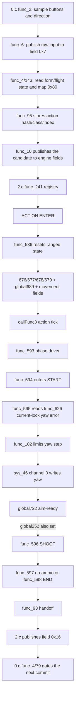

# Rebellion 飞行副射锁敌逻辑对比报告

> 分析日期：2026-08-31  
> 范围：当前 Rebellion `0.c/2.c` 与 PMX-000 メッサーラ飞行副射 `0.c/2.c`  
> 方法：只读静态逆向；未编译、未 repack、未实机运行  
> 证据等级：当前源码结构 E1；新 8 月 31 日侧转副射的玩家行为仍需 E3

## 结论先行

1. 这里的“锁敌”不是切换锁定目标。两边 action 都没有在这条链里调用 `func_121` 或写目标索引；它们读取引擎当前 lock 的角度误差，再让机体朝向收敛。`LOCK_SWITCH` 只是反编译 action 名，不能据此断言会换锁。
2. 真正的共享锁朝向实现位于老式 ranged driver 的 `func_594 -> func_595 -> func_626 -> sys_46(0, step)`，不在各自的 676/677 子函数里。`global689` 决定初始收敛窗口，`global722` 是“允许 START 交给 SHOOT”的 ready gate。
3. 当前 Rebellion 飞行副射（所有方向；右走 R，其余默认 L）只在 START 使用这套锁朝向：`global689=0x6`，START 自身是 8 个逻辑帧。进入 SHOOT 后驱动切到 `func_596`，源码中不再调用 `func_626`，第二、第三发没有脚本侧重新锁朝向。
4. メッサーラ飞行副射也不是 SHOOT 全程活锁。它同样只靠 `func_595` 在 START 对当前 lock；之后每帧的 `func_167(0x1004000)` 持续重发飞行状态，使其成为“保持飞行/跟杆的移动副射”，不是足止跟踪射击。
5. Rebellion 新侧转副射不是完整的 Messala port，而是混合体：共享 `func_593/595` 锁朝向骨架 + Hambrabi 横向 push/三连发 + Rebellion 鸟 loop/退出策略。它既没有 Messala START 的 `func_351(0,0x4)`，也没有 Messala tick 的 `func_167(0x1004000)`，所以不能从源码直接宣称实机手感等价。
6. `0x7e08fcc9 SUB_SHOT_FLIGHT` 仍注册但已从当前鸟 `0x80` selector 断开。先前 neutral 走该 stub 的实机结果是掉落、武器栏恢复、进入空弹段；这正是 `0.c` 选错 hash/class 影响行为的直接 E3 证据。
7. `0.c` 确实控制关键的一半，但不是 per-frame 锁朝向算法：它采集/发布方向输入、按 form/flight 状态选 action、提交 hash/class/index、限制 action handoff，并在受击回退时决定回飞行 loop 还是站立。真正的 `current-lock yaw -> sys_46(0,step)` 在 `2.c func_595/626`。

## Scope 与证据

- Scope：[scope.md](../scope.md)
- Timeline：[timeline.md](../timeline.md)
- E-001：[当前文件身份](../evidence/E-001.md)
- E-002：[共享函数无差异比较](../evidence/E-002.md)
- E-003：[两套 action family](../evidence/E-003.md)
- E-004：[0.c 输入、提交与 fallback 所有权](../evidence/E-004.md)

当前 Rebellion `2.c`（22:17:07）：

- MD5 `C3ED8E5DC73149D1C9783D9BE17831B1`
- SHA256 `A51FDFAF0DF822641A98A8F75C0FE9471D9D339DC959DF7FAF19F3186F4C8208`

当前 Rebellion `0.c`（22:09:27）：

- MD5 `0D409EFAEC950128E75284761FE40AB7`
- SHA256 `ED9960FE55B7FC789652EA4520CF1931166C9FB87FAE9638AD0F8A6FAFD8837B`

当前 Messala `2.c`：

- MD5 `BFECB301F7674EF09BFDE805E1118F57`
- SHA256 `C827FFDD761450344414355F33F6763CA143D9D09201D7DC456AB9F3037CD1A3`
- 与既有 Messala owner note 的 2026-08-28 身份完全一致。

## 完整调用链



### 输入和注册

Rebellion 鸟形态 `0x80` 会先按方向拆分：

| 输入 | Hash | Action | form 政策 |
|---|---:|---|---|
| 左 | `0x5346534c` | `SUB_SHOT_FLIGHT_ROLL_L` | 保持鸟形态 |
| 右 | `0x53465352` | `SUB_SHOT_FLIGHT_ROLL_R` | 保持鸟形态 |
| N / 前 / 后 / neutral | `0x5346534c` | `SUB_SHOT_FLIGHT_ROLL_L` | 保持鸟形态，默认 +0x2328 侧 |

`0x7e08fcc9` 仍保留注册，但当前 bird `0x80` 已不可达。Messala 的飞行门是 `global20 & 0x4000`；门内所有 `0x80` 都提交 `0x9a74bce6 ACTION_AB_SUB_LOCK_SWITCH`，没有方向拆 action。

## `0.c` 到底控制了什么

### 直接控制 1：输入采样与方向快照

`0.c func_2` 每帧把输入采成 `global2`：`0x4/0x8/0x10/0x20` 是四个方向位；没有方向时补 neutral `0x2`。`global4 = ~previous & current` 是新按下边沿，`global6` 是松开边沿。

随后 `func_6` 写：

```text
sys_1(0x10000, 0, 0x7, global2)
```

`2.c` 再从同一 field `0x7` 读到 `global87`。普通飞行控制器 `func_455/456` 会读 `global87 & 0x3c` 写航向；因此 `0.c` 是飞行输入的上游。但是 shared ranged lock 的 `func_595` 本身不读 `global87`，而是读 `func_626()` 的 current-lock yaw。

这意味着 `0.c` 的方向输入可以和飞行 analog 间接竞争航向，却不是目标 yaw 的计算者。旧 `SPECIAL_SHOT_FLIGHT` 的 D14/D15 实机反证也表明，单独中和 `0.c field 0x7` 与 `2.c global87` 并不能消除全部朝向瞬态；这个结论不能直接升格为新侧转副射 E3，但足以否定“所有锁敌都在 0.c 输入位”这一解释。

### 直接控制 2：form/flight 门与 action 选择

`func_4` 每帧从 `2.c` 的 shared fields 读：

```text
global20 = field 0x6   // movement/action state bits
global39 = field 0x17  // Rebellion form id
global33 = field 0x16  // action handoff/commit gate
```

两机最大的 selector 差异是：

| | Rebellion | Messala |
|---|---|---|
| 飞行表入口 | `global39 != 0`（鸟 form） | `global20 & 0x4000`（live flight state） |
| 0x80 | 右为 R，其余为 L；selector metadata `(0,0x1,0)` | 统一 `0x9a74bce6`；metadata `(0x1,0x1,0x7)` |
| 对 movement bit 的依赖 | selector 内不要求 `0x4000` | 必须有 `0x4000` |

所以 Rebellion 的 form 与 movement 是可分离的：只要 `global39==2` 仍在，哪怕 flight bit 已丢，`0.c` 仍可能走鸟武装表。Messala 不会；它必须仍处于 `0x4000` flight state。这也是 Rebellion 必须在 `2.c func_41` 做 FORCED_RECOVERY/假鸟态清理的原因。

更关键的是 `func_95` 后三参并非可随 hash 一起照抄。第一版 roll 仍用 untransform/ground sub 的 `(0x1,0x1,0x7)`；当前源码注释记录的 E3 是：neutral 进 stub 后掉落、武器栏恢复，并且空弹段仍运行。Rebellion 当前改成 `(0,0x1,0)`，与本机 bird main/CS/flight special 的 selector class 对齐。Messala 的 `(0x1,0x1,0x7)` 对 Messala 自己成立，不代表对 Rebellion 的 native hook 表也成立。

在 Rebellion 中，旧 class 会走 `2.c func_15 -> func_882` 这类 normal/special hook；`func_882` 默认会 FORCED_RECOVERY + `func_884()` 重建地面武装。当前代码同时用两层防护：`0.c` 改 selector metadata，`2.c func_882` 也 allowlist 两个 roll hash。这里正是 `0.c` 对“为什么掉形态/武器栏恢复”有直接控制的部分。

### 直接控制 3：action candidate 的提交

`func_143` 只负责挑 hash；`func_95` 把四个字段写入候选：

```text
global25 = action hash
global23 = selector arg1
global24 = action class/mask
global26 = selector index
```

`func_79` 调用注册在 `sys_0(0x10001,0,0x1)` 的 `func_143`，再把候选转入 `global51/52/61/62/43`。`func_10` 最终发布给 engine。Rebellion 与 Messala 的 `func_4-10`、`func_79`、`func_95` 当前文本完全一致；不同的是 `func_143` 选择内容。

因此 `0.c` 决定“哪招被提交、用什么 selector metadata”，但 action 进了 `2.c` 后，676/677 与 yaw step 不由 `0.c` 驱动。

### 直接控制 4：2.c→0.c handoff 窗口

这是一条双向链，不应漏掉：

```text
2.c ACTION global698
  -> func_594: global213 = global698
  -> func_598/func_93: global65 = global213 * 0x64
  -> 2.c func_41 publishes field 0x16
  -> 0.c func_4 reads global33 = field 0x16
  -> 0.c func_79 delays/limits the next candidate commit
```

`2.c func_39` 每 tick 用 `func_274()` 把 `global65` 递减到 0。Rebellion roll 用 `global698=0x14`，因此给 `0.c` 一个 20-tick handoff gate；Messala 用 `global698=0`，没有这段 gate，转而依赖连续 `func_167` 与真实 recovery motion 保持飞行所有权。

`global698` 所以是跨 `2.c→0.c` 的提交/退出参数，不是锁敌速度。

### 直接控制 5：受击/默认回退

`func_14` 把 slot `0x1`（`0x4cdc9902`）的 resolver 注册为 `func_15`。

- Rebellion `func_15`：高优先级回退发生且 `global39 != 0` 时，直接返回 standing slot `0x2`，随后 `2.c` FORCED_RECOVERY 清 form。
- Messala `func_15`：没有这个 form override；`global20 & 0x4000` 时返回 flight loop slot `0x18`。

所以受击后“继续飞还是回站立”有明确的 `0.c` 所有权。自然 679 handoff 则走 ranged driver / engine resolver，不应把 `func_15` 当作每次 action 正常结束都会调用的函数。

### `0.c` 没有控制的部分

在当前 flight-sub 路径内，`0.c` 没有：

- 写 `sys_46(0, yaw)`；
- 在 `func_143` 中读取 `func_626` 等目标 yaw；
- 调用明确的换锁函数或改写 target index；
- 在 SHOOT 三次 677 之间重新计算目标朝向。

`0.c func_97` 虽然能读取 `sys_0(0x70002)` 与目标相对角，但当前文件没有调用点，且不在 flight-sub selector 链上。`0.c func_121` 只是本文件的方向位谓词，不能和 `2.c func_121` 混为同一语义；MSC 函数编号是逐文件局部的。

## 锁朝向状态机

### START 初始化

`func_594` 做四件与锁朝向直接相关的事：

1. `global184 = 1`，进入 START。
2. `global715 = global689 * 0x64`，建立初始收敛预算。
3. `func_71(global676)`，启动本 action 的 START body。
4. 同一拍调用 `func_595()`。

### 每帧对当前 lock 收敛

`func_595` 的源码路径是：

```text
global265 = func_626()
global499 = func_627()

if global722 == 0:
    yaw_step = func_102(global265, global715, 0)
    sys_46(0, yaw_step)
    global265 -= yaw_step
    global715 -= func_274()
    if global715 <= 0:
        global722 = 1
        sys_46(0, remaining_yaw)
else:
    yaw_step = func_102(global265, 5, 1)
    sys_46(0, yaw_step)

if global252 && global722:
    enter SHOOT or no-ammo
```

`func_626` 读取 `sys_0(0x40000,0x5)`。`func_586` 把 `global73` 清零，而两套副射都不再改它，所以本次不会走 `+180°`、`±90°` 或双目标平均分支。结构上它只是当前 lock 的 yaw 误差。

`func_627` 计算另一轴的差值，但当前 `func_595` 只把 `func_626` 的结果写入 `sys_46(0,...)`；不能把 `func_627` 当作本 action 已实现俯仰追踪的证据。

### START 为什么不会过早进 SHOOT

阶段推进不是只看 motion/timer 的 `global252`，而是看：

```text
global252 && global722
```

因此 START body 表示“动作准备好了”，`global722` 表示“初始朝向窗口完成了”。两者同时成立才进入 677/678。

## Rebellion 左右侧转副射

### ENTER 参数

| 状态 | 当前值 | 对锁意义 |
|---|---:|---|
| `global689` | `0x6` | 初始 yaw 收敛约 6 个逻辑 tick |
| START timer | `0x8 * 0x64` | START 至少持续 8 个逻辑 tick |
| `global722` | 由 `func_595` 写 | START→SHOOT 的 aim-ready gate |
| `global683` | `3` | SHOOT body 重进三次；不是三次重新锁敌 |
| tick | `func_593()` | 没有 Messala 的每帧 `func_167` |
| `global698` | `0x14` | 退出/提交窗口，不是瞄准速度 |
| `global678` | `sub_shot_flight_roll_end` | 空弹直接走 END；避免 null phase hang |

源码顺序意味着：前约 6 tick 是初始收敛，剩余 START tick 走 `global722==1` 的细调分支；8-tick START 完成后才进入第一发。

### SHOOT 和 END

- 每次 SHOOT ENTER 写一次横向 push `sys_46(0x1,0x2,±0x2328,0,0xb4)`。
- `global683=3` 让 `func_596` 重进 677 三次。
- `func_596` 不调用 `func_595` 或 `func_626`，所以源码里没有第二/第三发重新读取目标 yaw 的路径。
- END 只做清理和 8-tick timer，之后写 `global252=1`、`global212=0x14`。

这只证明“MSC action 自己不再写目标 yaw”。是否仍被引擎并行的飞行 analog 改向属于 L2/L3，当前新 action 没有实机证据，不能从缺少调用直接宣布“实机一定锁死朝向”。

## Messala 飞行副射

### 相同点

- 同一套 `func_586/593/594/595/596/597/598`。
- 同一套 `func_626/627` 当前-lock 角度读取。
- `global689` 仍负责 START 初始收敛。
- SHOOT/END 没有显式的逐帧 `func_626 -> sys_46(0)` 活锁。

### 差异点

| 维度 | Rebellion 左右侧转副射 | Messala 飞行副射 |
|---|---|---|
| selector | 右为 R，其余为 L；`(0,0x1,0)` | 飞行 `0x80` 统一 `0x9a74bce6`；`(0x1,0x1,0x7)` |
| 初始 aim 窗口 | `global689=6` | `global689=10` |
| START 结束条件 | 8-tick 脚本 timer | motion `0xc8fd1afb` 到 `0x76c` |
| START analog profile | 没有 `func_351` | ENTER 调 `func_351(0,0x4)` |
| tick | `func_593()` | `func_593(); func_167(0x1004000);` |
| 连射 | 3 次 677 | 1 次 677，内部多弹体/时间点 |
| 空弹 | 678 直接复用 END | 独立 678 `func_973` |
| 运动 | 脚本横向 push | Messala motion + TRS + 连续飞行 owner |
| handoff | `global698/global212=0x14` | `global698=0` + 连续 flight owner + real recovery clip |
| 资源 | Rebellion loop / 自己弹体 | Messala 专用 motion/TRS/projectile |

最关键的不是 `global689` 数字，而是所有权顺序：

```text
Rebellion roll: func_593
Messala:         func_593 -> func_167(0x1004000)
```

Messala 的 `func_167` 在 ranged driver 之后重新发布飞行状态。既有 2026-08-30 实机反证已证明，把这条 literal tick 搬到 Rebellion 会让 START/SHOOT/END 跟杆移动与转向，不能把它当成“持续锁敌”或“足止”的来源。

## 与旧 `SPECIAL_SHOT_FLIGHT` 的边界

当前 Rebellion `SPECIAL_SHOT_FLIGHT` 才是旧 Messala-port 研究对象：它使用 `global689=0xa`、START `func_351(0,0x4)`、tick `func_593 -> func_167`。负面登记 D9-D18 / I1 / I6-I8 都属于这条 gerobi 链。

新 `SUB_SHOT_FLIGHT_ROLL_L/R` 只复用了共享 driver，不应把旧 gerobi 的足止、clamp、START/SHOOT/679 结论整包套上。可复用的是：

- `func_595` 是 START aim owner；
- `global689` 决定初始窗口；
- `global252 && global722` 才能过 START；
- `func_167` 放在 tick 尾会重新开放飞行所有权竞争。

不可直接复用的是 gerobi 的 translation clamp、SE/FX、679 hold 和 profile restore。

## 生命周期审计

| Phase | Rebellion 左右侧转副射 | Messala 飞行副射 | 证据状态 |
|---|---|---|---|
| ENTER | 方向 hash；`func_586`；6-tick aim；8-tick START | `0x9a74bce6`；10-tick aim；motion START；profile 0 | E1 |
| ACTIVE | 3 次 lateral push + 3 发；无脚本侧 SHOOT 活锁 | 持续 `func_167`；motion/TRS 多弹体；无脚本侧 SHOOT 活锁 | E1 |
| EXIT | 8-tick cleanup，`global212=0x14`；预期回 flight resolver | real recovery motion；连续 flight owner | Rebellion 行为 E0，Messala 结构 E1 |
| INTERRUPT | 新 hash 在 `func_41` keep-form allowlist；下一动作若非 allowlist则 FORCED_RECOVERY | Messala 保留本机 transform policy | E1；玩家行为待 E3 |
| RESPAWN / REINIT | `roll_side/push/shot_count` 每次 ENTER 重写；`last_side` 只在 START 更新、无显式 respawn reset | 本 action 无同名 target latch | E1；`last_side` 是否跨复活可见为开放项 |

## 状态所有权

| 状态 | Writer | Reader | Rebellion 政策 | Messala 政策 |
|---|---|---|---|---|
| 当前锁定目标 | engine | `func_626/627` 的 `sys_0` | 只读，不换锁 | 只读，不换锁 |
| START yaw | `func_595 -> sys_46(0,step)` | movement engine | 6-tick + 细调至第 8 tick | 10-tick + motion wait期间细调 |
| aim ready | `global722` | `func_595` phase gate | 必须和 `global252` 同时成立 | 同左 |
| phase | `global184` | `func_593` | 0/1/2/3/4 | 同左 |
| flight form | `global143` / `func_41` | `0.c` selector | 两个 roll hash allowlist | Messala 自己的 form policy |
| flight state | `global24` / `func_167` | native analog | action 内不重发，继承进入前状态 | 每 tick 重发 `0x1004000` |
| roll direction | action ENTER | START/SHOOT | 每次覆盖 | n/a |
| previous roll side | START | next START | 有意跨 action 保留；无 respawn reset | n/a |

## Findings

### F-001 — `LOCK_SWITCH` 不等于切换目标

- severity: n/a_re
- status: validated（source structure）
- evidence_ids: [E-002, E-003]
- confidence: high
- location: Messala `ACTION_AB_SUB_LOCK_SWITCH` / shared `func_595/626`
- finding: action family 内没有显式换锁调用；它只读取当前 lock 的角度误差并转机体。

### F-002 — 锁朝向只属于 START driver

- severity: n/a_re
- status: validated（E1 source structure）；玩家观感未验证
- evidence_ids: [E-002, E-003]
- confidence: high for source, low for new-action runtime
- location: `func_594-596`
- finding: `func_595` 在 START 读取目标 yaw；SHOOT 的 `func_596` 不读取。因此三连发不是三次重新锁敌。

### F-003 — Rebellion 新侧转副射不是 Messala-equivalent

- severity: n/a_re
- status: validated（source comparison）
- evidence_ids: [E-002, E-003]
- confidence: high
- location: Rebellion `SUB_SHOT_FLIGHT_ROLL_*`; Messala `ACTION_AB_SUB_LOCK_SWITCH`
- finding: 两者只共享 driver/aim 算法；profile、per-tick flight owner、motion、TRS、burst、handoff 全部不同。

### F-004 — 新 action 的 runtime 锁朝向仍是开放门槛

- severity: n/a_re
- status: candidate
- evidence_ids: [E-003]
- confidence: medium
- location: Rebellion `sub_shot_flight_roll_tick/start/shoot/end`
- finding: 源码只证明 START 有 lock-yaw writer。profile 2/native analog 是否覆盖它、SHOOT 是否仍被引擎转向、自然 EXIT 是否稳定回 flight，都需要 E3。

### F-005 — `0.c` 控制入口、输入竞争和退出，不控制 lock-yaw 算法

- severity: n/a_re
- status: validated（source structure）
- evidence_ids: [E-002, E-004]
- confidence: high
- location: Rebellion/Messala `0.c func_2/4/6/10/15/79/95/143`
- finding: `0.c` 负责 form/flight gate、direction-to-hash、candidate metadata、field-0x7 input publication、field-0x16 handoff gate 与 hit fallback；`2.c func_595/626` 才负责当前 lock 的 yaw 收敛。

### F-006 — selector metadata 是本次 form teardown 的直接控制点

- severity: n/a_re
- status: old build E3-; current correction E1 pending
- evidence_ids: [E-003, E-004]
- confidence: high for old failure attribution, medium for current runtime
- location: Rebellion `0.c func_143` and `2.c func_15/func_882`
- finding: `(0x1,0x1,0x7)` 把新 hash 放进目标机的 normal sub/special hook 语境；当前 `(0,0x1,0)` 改为 bird ranged class，并由 `func_882` allowlist 作第二道保护。Messala metadata 不可直接移植。

### F-007 — 当前 ammo 注释与发射 writer 不一致

- severity: n/a_re
- status: candidate
- evidence_ids: [E-003]
- confidence: high for source mismatch, unknown runtime impact
- location: Rebellion `sub_shot_flight_roll_shoot`
- finding: 注释说首次发射使用真实 slot 1、后两次使用 skip-ammo slot 5，但当前 if/else 两边都向 slot 5 发射。`0.c` 也不做 ammo gate；driver 只检查 slot 1 是否有弹，源码中看不到本 action 扣 slot 1 的 writer。是否表现为不消耗弹药需 E3。

## Path

### P-001 — flight sub input 到锁朝向与退出

- path_type: callflow
- start: bird/flight `0x80` input
- goal: target-facing START, burst execution, native handoff
- steps:
  1. `0.c func_2/6` 采样方向并发布 field 0x7 — evidence: E-004 — finding: F-005
  2. `0.c func_4/143` 按 form/flight 状态选择方向 hash — evidence: E-003,E-004 — finding: F-003,F-005
  3. `func_95/79/10` 把 hash/class/index 提交 engine — evidence: E-004 — finding: F-005
  4. `2.c func_241` 进入 action，`func_586` 设置 quartet / aim 参数 — evidence: E-003 — finding: F-002
  5. `func_593 -> func_594 -> func_595 -> func_626 -> sys_46(0,step)` — evidence: E-002 — finding: F-001/F-002
  6. `global252 && global722` 转入 `func_596` — evidence: E-002 — finding: F-002
  7. 三次 677 后进入 679；`func_598 -> func_93 -> field 0x16 -> 0.c func_79` 交回 resolver — evidence: E-003,E-004 — finding: F-004,F-005
- residual_risks: native analog concurrency and new-action runtime are not observable from X.c alone.

## 最小实机 H/P/F

```text
H  Rebellion 当前全方向飞行副射只在 START 对当前 lock 收敛；SHOOT 三发保持
   START 结束时的朝向，不会逐发重取目标 yaw；自然 EXIT 回飞行 loop。
P  背对敌人出招会在首发前转向；首发后切锁/目标横移不改变第 2/3 发朝向；
   收招后仍保持鸟形态并可立即推杆飞行。
F  任一成立即推翻 H：
   (1) 持杆在首发前就压过目标朝向；
   (2) 第 2/3 发继续追随移动目标或切锁；
   (3) 收招进入 air idle / 普通形态 / 不能飞；
   (4) 中断后仍残留鸟形态或侧转状态。
```

建议一次录像覆盖五组输入：背对目标无杆、背对目标全程持横、SHOOT 中切锁、START/SHOOT/END 各受击一次、连续使用两次核对 slot 1 是否扣弹。当前 selector 修正版尚无 E3，静态报告不把以上预测写成已确认玩家行为。
